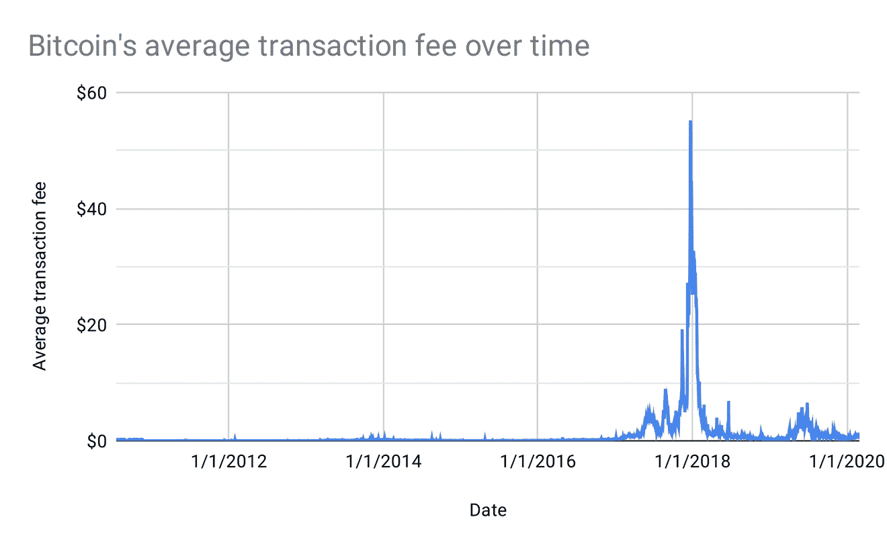
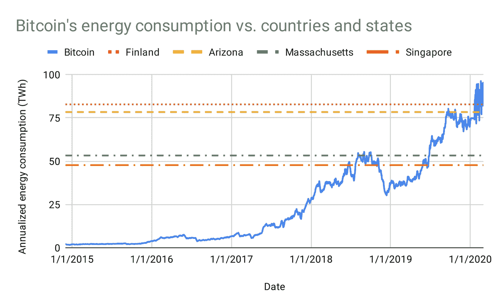
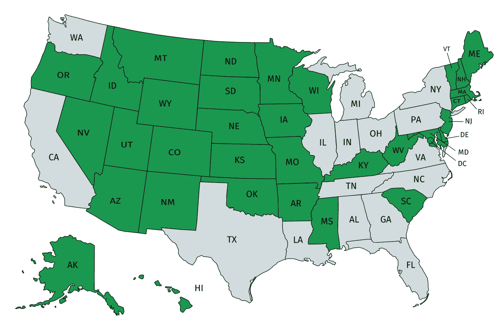
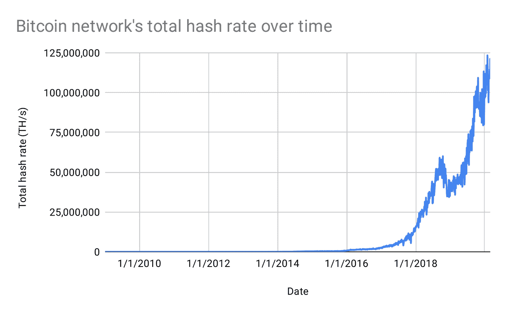
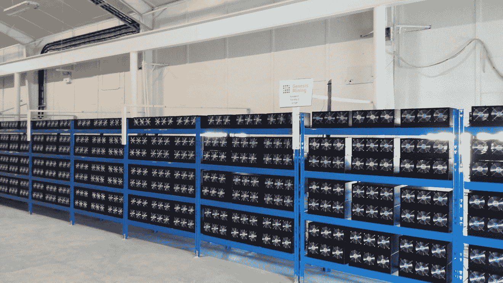
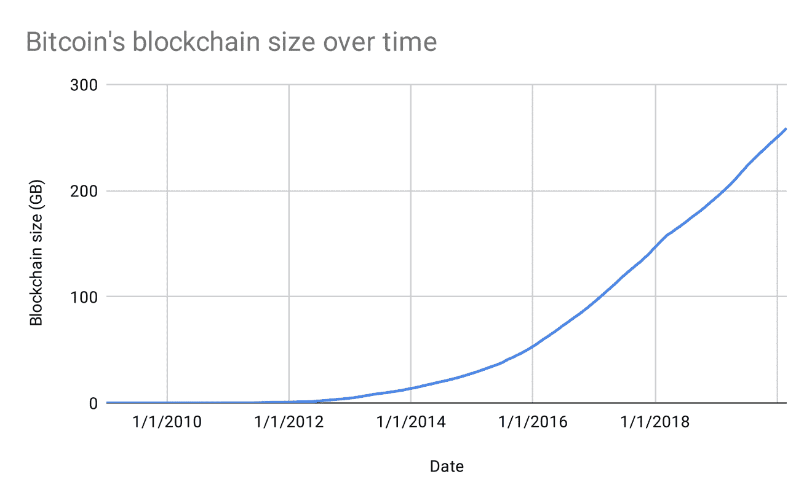
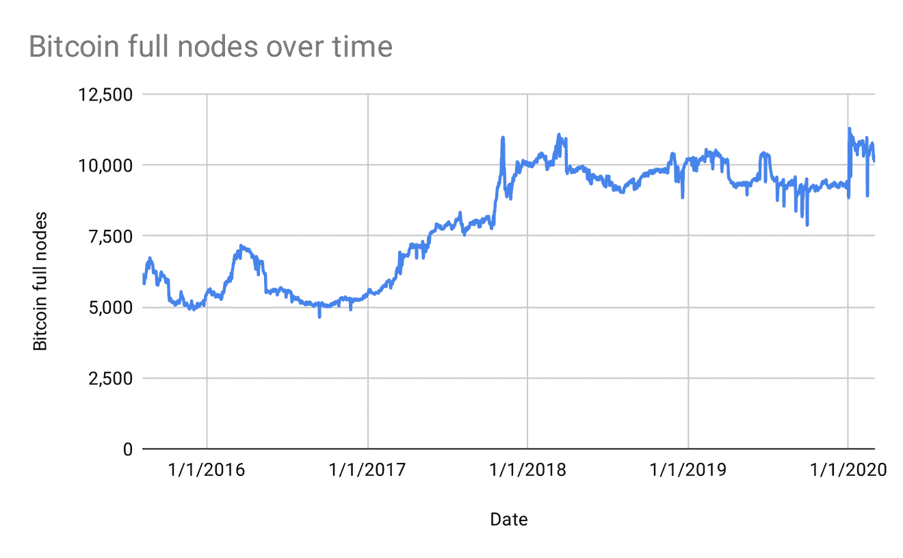
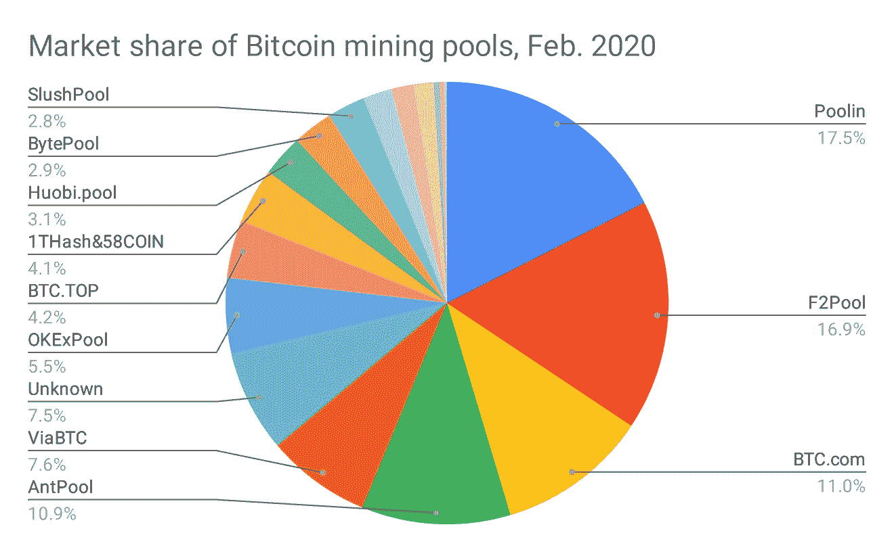

 

# 三、比特币的失误

比特币是一项令人兴奋的新技术。对于我们的基金会工作，我们正在做数字货币，以帮助穷人获得银行服务。我们不专门使用比特币有两个原因。一个是，穷人不应该拥有一种相对于他们本国货币来说上下浮动很大的货币。第二，如果在你付钱的人身上犯了错误，那么你需要能够逆转它，这样匿名就不起作用了。

——比尔·盖茨，比尔和梅林达·盖茨基金会联合主席[【200】](part0040.xhtml#a4KU)

 

在他的白皮书中，Satoshi 描述了一种优雅的、数学上合理的货币，它真正让你无需银行就能进行支付。但在此后的几年里，比特币发现实践比理论难得多，我们已经看到，人们对这种货币做出的许多乌托邦式的预测都没有完全实现。

缩放问题

正如我们在上一章看到的，比特币既可以是一种支付方式，也可以是一种投资工具，但它主要是变成了后者。让这一点变得特别有趣的是，Satoshi 打算让比特币成为完全相反的东西。[【201】](part0040.xhtml#a772)[【w】](part0040.xhtml#a773)

2008 年，当 Satoshi 在一个以密码学为重点的邮件列表上宣布比特币时，他的公告邮件的第一句话是:

我一直在开发一个新的电子现金系统，它是完全点对点的，没有可信的第三方。[【202】](part0040.xhtml#a69S)

他没有将比特币视为另类投资；他认为这是一个支付系统。整个要点是“允许在线支付直接从一方发送到另一方，而无需通过金融机构。”[【203】](part0040.xhtml#a6AW)

Satoshi 特别指出小额支付是比特币的一个关键用例。在另一个邮件列表中，他说:

与现有支付方式相比，比特币更适用于小额交易。小到足以包括你可能称之为微支付范围的顶端。[【204】](part0040.xhtml#a4FB)

Satoshi 没有具体说明具体的金额，但考虑到小额支付通常被认为是几美元或更少，[【205】](part0040.xhtml#a6FY)让我们假设他指的是几美分和几美元之间的金额

费用和延误

那么，比特币是不是一种有效的方式，比如给别人汇一美元？

我们已经讨论过比特币价格的波动性——它可能会在一周内下跌[【206】](part0040.xhtml#a70G)或上涨[【207】](part0040.xhtml#a70H)20%——使其成为支付或获得支付的风险资产。但是还有更多要考虑的。

最需要考虑的是费用。记住，矿商对一个区块的每笔交易都要收费。每个交易都指定了它愿意支付的费用，然后进入所有未确认交易的内存池。矿工可以选择他们放入下一个区块的交易；你可以想象他们会选择给他们提供最高费用的交易。

这意味着，当有更多交易争夺一个区块中的一个位置时，交易发送者必须提供更高的费用才能胜出。(这就像 Ubers 和 Lyfts 在需求高峰期，比如新年过后，价格会高得多。)

请注意，费用并不取决于你寄了多少钱。你发送的数量不会影响交易的大小(以字节为单位)， [[209]](part0040.xhtml#a799) 矿工们希望最大化他们在一个块中可以容纳的交易数量，所以他们不在乎你的交易中有什么，只要你支付得好。

无论如何，在 Satoshi 和 Hanyecz 的时代，平均费用只是一美分的零头，但现在比特币的价格已经上涨，人们对比特币的兴趣也越来越大，费用往往在 50 至 1 美元之间徘徊。这并不可怕，尤其是如果你想转移几千美元的话。但如果你想给朋友汇一美元，就像 Satoshi 设想的那样，你肯定不想支付那么高的费用，尤其是当像 Venmo 这样的应用程序让你免费汇款的时候。

交易危机

当出现大量拥堵时，费用方面更大的问题就来了:当人们进行交易的速度远远超过矿商将交易分成区块的速度时(记住，区块只能每 10 分钟进行一次)，需求的增加将推高平均费用。

以 2017 年 12 月为例。这个月标志着比特币长达一年的涨势达到顶点:比特币的价格从 2017 年 1 月的不到 1000 美元飙升至 2017 年 12 月的超过 19，000 美元。但本月，试图买卖比特币的人达到了前所未有的数量，这导致平均费用飙升——一度超过 55 美元。[【211】](part0040.xhtml#a6D6)

比特币的交易费用通常不到 1 美元，但在需求旺盛的时候会飙升——平均费用一度超过 55 美元。数据来源:Bitinfocharts.com[【212】](part0040.xhtml#a5H5)

大量交易的另一个影响是令人难以忍受的漫长等待时间。在 2017 年 12 月 7 日的某一时刻，该池充满了超过 20 万笔未确认的交易。[【213】](part0040.xhtml#a5BX)但由于比特币每小时只能处理几千笔交易(在撰写本文时为每小时 12000 至 15000 笔[【214】](part0040.xhtml#a5BY))，这个池在很长一段时间内保持拥堵。大约在这个时候，交易得到确认并放到区块链上平均需要 16 个小时。[【215】](part0040.xhtml#a5BZ)想象一下在柜台等 16 个小时等你的信用卡通过。

简而言之，比特币在这段兴趣高峰期挣扎，当时涨势的顶点导致了极度的延迟和费用。一个有足够动力、着眼于数千美元利润的比特币投资者可能会忽略 55 美元的费用和 16 个小时的等待时间，但试图购买咖啡的人会发现这是不可原谅的。

不幸的是，这个问题并没有消失。很难获得交易等待时间的数据，但费用飙升已经成为比特币反弹的一个常见特征。当比特币在 2019 年夏天蓬勃发展时，在几个月低于 4000 美元后，比特币在 2019 年 7 月短暂超过 12，000 美元，费用有所下降，但仍大幅上涨。从 2019 年 5 月到 7 月初，该费用定期超过 2 美元，一度超过 6 美元。[【216】](part0040.xhtml#a440)

基本问题

即使在最好的情况下，比特币也不太适合小额支付。著名的早期比特币开发者迈克·赫恩(Mike Hearn)估计，比特币每秒只能处理约 3 笔交易(缩写为 TPS)；最新数据显示，这个数字约为每秒 3.5 至 4 笔交易。[【218】](part0040.xhtml#a600)

同时，Visa 可以处理更多的交易。很难确定一个准确的数字——摩根士丹利表示，Visa 和万事达卡加起来每秒可以处理 5000 笔交易，[【219】](part0040.xhtml#a54V)Visa 曾经吹嘘它每秒可以处理 11000 笔交易，[【220】](part0040.xhtml#a54W)一份白皮书估计 Visa 每秒最多可以处理 45000 笔交易，[【221】](part0040.xhtml#a54X)无论真实数字如何，Visa 都远远超过比特币的带宽。

此外，尽管信用卡交易在几秒钟内完成，但比特币交易平均需要 10 分钟才能完成，即使你提供巨额费用，因为区块平均每隔 10 分钟被开采一次。[【x】](part0040.xhtml#a495)接受比特币的商家实际上被建议在交易通过后再等 6 个区块被挖矿，以最大限度降低欺诈风险。[【222】](part0040.xhtml#a496)(请记住，拥有足够计算能力的攻击者可以制作一个新链，并试图超越主链。希望是，一旦主链开采了六个区块，攻击者的链将会落后。)因此，即使在最好的情况下，比特币交易的平均处理时间也可能长达一小时！

总之，虽然比特币确实避免了通过中间人进行支付，但它的成本很高:它的支付效率非常低，尤其是小额支付，Satoshi 希望比特币能够成为这种支付的理想选择。

可扩展的未来？

也就是说，在试图解决比特币无法处理大量支付，或者比特币圈子里所谓的规模问题方面，已经取得了一些进展。

比特币试图解决规模问题的基础是 SegWit，这是对比特币协议(关于比特币如何创建、存储和消费的规则)[【223】](part0040.xhtml#a4GE)的一个可选升级，比特币用户、矿工和交易所可以改用它。[【224】](part0040.xhtml#a4GF)

SegWit 于 2017 年 9 月正式激活，它将每个交易的某些元数据(包括证明谁发送了交易的签名)移动到块的新部分，从而在块的主体中为交易释放更多空间。[【225】](part0040.xhtml#a6HV)

这使得更多的交易可以放入一个块中，从而增加了比特币每秒的总交易量。(SegWit 这个名字是“隔离证人”的缩写带有签名的元数据被称为“见证”，它与主事务数据“分离”。[【226】](part0040.xhtml#a5YJ)

另一个众所周知的潜在解决方案被称为闪电网络，旨在“在区块链以外”进行大多数交易，以避免在区块链进行交易的费用和延迟。每一对人都在一个数字便签簿上记录他们的支付情况；他们只是偶尔“结算”一下他们的余额。[【227】](part0040.xhtml#a5C8)

想象一下，如果你和一个朋友一起去度假。闪电式的方法是在电子表格中记录你们中的一方为另一方支付的所有时间，并在旅行结束时一次性付款“结算”，而不是在每顿饭、酒店预订、火车票等结束后偿还对方。

罪犯最喜欢的货币

在其存在的最初几年，比特币通常与神秘的电子罪犯联系在一起；人们知道它是毒枭和黑客使用的神秘货币。说实话，它名副其实。

丝绸之路

建立在比特币基础上的最著名的犯罪企业是丝绸之路，它是非法者的亚马逊。从 2011 年到 2013 年，[【228】](part0040.xhtml#a60V)[【229】](part0040.xhtml#a60W)丝绸之路贩卖从毒品到假护照的各种东西，在短暂的存在期间转移了超过 12 亿美元的违禁品。[【230】](part0040.xhtml#a60X)(为了丝绸之路的功劳，有些物品被禁了。该网站的创始人是一位名叫罗斯·乌布里希特的美国程序员，用他的话说，他只允许导致“无受害者犯罪”的商品。这意味着暗杀、窃取信用卡号码和儿童色情——直接伤害他人的事情——被禁止。[【231】](part0040.xhtml#a60Y))

正如你所想象的，走私的买家和卖家不想通过信用卡支付留下书面记录。他们转向仍然年轻的比特币作为该网站的主要支付方式。[【232】](part0040.xhtml#a6BS)比特币提供的相对匿名性无疑挫败了执法部门追查该网站犯罪活动的努力。

派对没有永远持续下去。2013 年，美国联邦调查局(FBI)特工在旧金山的一家图书馆追踪到了被世人称为恐怖海盗罗伯茨的乌布里切特，当时他正在笔记本电脑上登录丝绸之路。[【233】](part0040.xhtml#a45Y)在戏剧性地逮捕了乌布里切特之后，当局查封了运行丝绸之路的服务器，永久关闭了该网站。[【234】](part0040.xhtml#a45Z)[【z】](part0040.xhtml#a460)

更黑暗的市场

但是丝绸之路还不是最糟糕的。一个名为克苏鲁的网站让你雇佣杀手，提供由退伍军人和雇佣兵组成的“有组织犯罪集团”的服务。[【235】](part0040.xhtml#a77C)[【aa】](part0040.xhtml#a77D)

而且，自丝绸之路以来，就有专门出售偷来的信用卡号码的论坛和网上商店，这种做法被称为梳理。安全研究员布莱恩·克雷布斯(Brian Krebs)公布了一个著名的“卡”店之旅，该店名为 McDumpals，其标志是罗纳德·麦克唐纳(Ronald McDonald)用枪指着观众。[【237】](part0040.xhtml#a466)

所有这些犯罪集团的首选货币？比特币。正如克苏鲁所说，比特币的优势在于“我们不了解你，你也不了解你”，所以“我们不能送你进监狱，你也不能送我们进监狱。”互联网的阴暗面真的很可怕。)

黑客

热爱比特币的不只是不法商家；黑客们也喜欢匿名货币。

黑客使用比特币最明显的例子是勒索软件，这是一种恶意软件或计算机病毒，它会感染计算机，加密所有文件，并威胁要扔掉密钥，除非用户向特定地址发送比特币“赎金”。换句话说，要么付清欠款，要么和你的文件说再见。

向 WannaCry 勒索软件的受害者展示的屏幕，该软件瘫痪了从医院[【240】](part0040.xhtml#a677)到汽车制造商的各种组织。[【241】](part0040.xhtml#a678)黑客索要 300 美元比特币来解密用户文件。来源:维基媒体[【242】](part0040.xhtml#a679)

勒索病毒是在 2017 年感染全球 Windows 电脑的 WannaCry 株勒索病毒出现后爆发的新闻。不出所料，黑客们要求用比特币支付来掩盖他们的踪迹。

然而讽刺的是，比特币对他们来说并不是一个很好的选择。截至 2017 年 5 月，WannaCry 黑客尽管感染了 20 万台电脑，即 40 台电脑，但仅获得了约 5 万美元的赎金。这一微弱的收获在很大程度上是由于许多受害者对技术不够了解，不知道在哪里购买比特币，如何获得比特币，以及如何将比特币转移给黑客。[【244】](part0040.xhtml#a5MG)(最有可能成为勒索软件受害者的人可能是最不懂技术的人；为什么黑客们期望他们能够应对比特币这个令人困惑的世界？)

更重要的是，记者发现了 WannaCry 攻击背后一些主谋的比特币地址，普通公众(更不用说执法部门)可以眼睁睁地看着钱流入。(石英观察到地址

12t 9 ydpgwuez 9 nym GW 519 p7aa 8 is Jr 6 SMW

拿到了 38 笔赎金。)[【245】](part0040.xhtml#a4E5)

因为所有进出这些地址的资金转移都可以被公开看到，黑客们想要使用他们的不义之财会更加困难。事实上，记者们注意到，2017 年 8 月，超过 14 万美元的比特币从黑客的钱包中被转移。[【246】](part0040.xhtml#a5AY)

最后，有迹象表明，即使对于那些想要成为黑客的人来说，比特币也太不稳定了。他们先向受害者索要 300 美元，然后索要 600 美元的比特币。[【248】](part0040.xhtml#a5JC)注意，他们要求的不是比特币，而是受害者必须兑换成比特币的美元金额。

自由保护区

这个故事有一个有趣的结论:比特币不是网络罪犯使用的第一种数字货币。尚不清楚哪一种是第一种，但在比特币之前，最著名的此类货币是 Liberty Reserve，这是一家鲜为人知的非法支付处理器，于 2006 年至 2013 年在哥斯达黎加运营。[【250】](part0040.xhtml#a723)

自由储备比比特币既神秘又简单。用户将与马来西亚、尼日利亚或越南等国的中间人合作，将钱存入哥斯达黎加的自由储备银行账户。用户可以自由地将钱转移给其他 Liberty Reserve 用户。然后，用户可以与其他货币兑换商合作，从他们的自由储备账户中提款。[【251】](part0040.xhtml#a50C)

哥斯达黎加对 Liberty Reserve 几乎没有财务监督，使用中间人确保 Liberty Reserve 不知道谁在真正操作银行账户，因此 Liberty Reserve 基本上是一种匿名的洗钱和支付非法商品的方式，同时避开了当局的监视。没人会知道你把钱花在了什么地方，没人会知道你在和谁交易，也没人会知道你的利润来自哪里。

正如你所料，自由储备是一个打击毒品贩子，信用卡窃贼，黑客，和所有其他常见的嫌疑人。[【254】](part0040.xhtml#a4HG)

撇开明显的犯罪不谈，自由保护区对我们来说是一个有趣的案例研究。与比特币不同，它是高度集中的，使用不合法的通讯渠道来避免审查。与比特币不同，它显然是一种支付方式，而不是价值储存手段:每一“LR 美元”只值一美元，所以你持有它不会获得任何利润。这表明，一种货币的实际机制并没有那么重要；只要相对匿名，犯罪分子就会滥用。

这很不幸，因为有些人会从匿名货币中合法获益。想象一下，一个独裁政权中的持不同政见者不希望自己的数字支付被追踪。但如果罪犯是匿名货币的头号客户，你不得不怀疑这是否值得。

不完全匿名

到目前为止，我们称比特币为“基本匿名”是有原因的:它不是匿名的。诚然，你的名字不会直接与你的比特币交易联系在一起，但你的比特币地址会，如果你的对手有足够的动机，你的身份可以与你的地址联系在一起。那就是比特币是化名的，你的化名比你想象的更容易被破解。

为了说明这一点，重温我们的老朋友罗斯·乌布里希特是有益的，他拥有丝绸之路。

在联邦调查局特工在旧金山逮捕了乌布里切特之后，乌布里切特的律师声称他是被陷害的，并不是真正的可怕的海盗罗伯茨，丝绸之路的神秘所有者。因此，联邦调查局回到了乌布里切特被扣押的笔记本电脑，并在他的硬盘上找到了他的比特币钱包的地址。他们已经知道丝绸之路钱包的地址，网站收费所得的钱就存放在那里。[【256】](part0040.xhtml#a4T0)

代理商所要做的就是在比特币区块链上查找丝绸之路地址和乌布里切特地址之间的交易，瞧:他们发现丝绸之路和乌布里切特之间有超过 3700 笔交易，总共转移了超过 70 万个比特币。[【257】](part0040.xhtml#a6DZ)毫无疑问，乌尔布利特就是可怕的海盗罗伯茨。[【bb】](part0040.xhtml#a6E0)

大多数人不会为 Ulbricht 的命运流泪，但关键点仍然是:比特币区块链的显著透明度使比特币远没有其支持者所说的那么匿名。

Mt. Gox 黑客

比特币以其安全性而自豪，这在很大程度上是正确的。一台超级计算机需要数百万年才能破解比特币用于挖掘和地址生成的单向哈希函数，[【258】](part0040.xhtml#a5TY)这使得有人几乎不可能欺骗挖掘算法或猜测你的私钥。此外，由于工作证明系统，在 51%的攻击之外伪造过去的交易几乎是不可能的。[【259】](part0040.xhtml#a5TZ)

但比特币安全性承诺的一个不足之处是，它和其他任何技术一样容易出现人为错误。这种短缺最著名的例子是 Mt. Gox 的垮台，它曾经是世界上首屈一指的比特币交易所。[【260】](part0040.xhtml#a4ZK)

Mt. Gox 于 2010 年在东京成立，允许世界各地的人们将政府发行的货币(即法定货币)如美元和日元兑换成比特币，反之亦然。(Mt. Gox 实际上是在 2009 年作为一个交换游戏《魔法:聚会》中卡片的交易所而诞生的。“Mt. Gox”这个名字来源于《魔法:聚会在线交流》。该网站很快转向比特币。[【262】](part0040.xhtml#a5A0))mt . Gox 增长迅速，到 2013 年，全球超过 70%的比特币交易通过该平台进行。[【263】](part0040.xhtml#a5A1)

Mt. Gox 遭受了一些黑客攻击，并与美国国土安全部发生了摩擦，但总体而言，直到 2014 年初，业务一直在蓬勃发展。[【264】](part0040.xhtml#a57H)

2014 年 2 月的一天，Mt. Gox 突然停止了从该交易所的所有提款，阻止交易者清算他们 Mt. Gox 钱包中的任何比特币并取出法定货币。几周后，Mt. Gox 关闭了网站上的所有交易。[【266】](part0040.xhtml#a69U)就在那之后几天，Mt. Gox 申请破产。[【267】](part0040.xhtml#a69V)八十五万个比特币，[【268】](part0040.xhtml#a69W)当时价值 4.5 亿美元[【269】](part0040.xhtml#a69X)而在写的时候价值超过 80 亿美元，[【270】](part0040.xhtml#a69Y)消失得无影无踪。

在不到一个月的时间里，戈克斯山从高耸的山峰变成了闷烧的火山口。它被称为“区块链的雷曼兄弟”[【271】](part0040.xhtml#a6YV)发生了什么？

盗窃案

事实证明，Mt. Gox 的麻烦早在 2011 年就开始了，而大多数用户并不知道。Mt. Gox 将用户的账户余额存储在特定的钱包中——钱包只是私钥和地址对的一个术语。2011 年，一名攻击者——要么是黑客，要么是流氓员工——从 Mt. Gox 的服务器上复制了一个名为“wallet.dat”的文件；这个文件包含了 Mt. Gox 钱包的私人钥匙。[【272】](part0040.xhtml#a43B)

在接下来的几年里，攻击者现在有了 Mt. Gox 的私钥，慢慢地掏空了钱包里的比特币。Mt. Gox 完全不知道失窃的事。事实上，它认为攻击者从 Mt. Gox 的钱包中抽取资金只是客户将钱存入他们的账户。[【273】](part0040.xhtml#a497)奇怪的是，Mt. Gox 甚至向其他客户存入了 40，000 个比特币，显然认为他们的存款与这个小偷的“存款”有关[【274】](part0040.xhtml#a498)

目前还不清楚小偷到底从 Mt. Gox 偷了多少货币。850，000 枚货币中的 200，000 枚后来被找到，但是大约 600，000 枚仍然下落不明。一些人认为，Mt. Gox 从一开始就没有持有那么多货币，并篡改了账目，以使 Mt. Gox 的财务状况看起来比实际情况要好。[【275】](part0040.xhtml#a72X)

安全专家最终确定了一个名叫亚历山大·威尼克的俄罗斯人是被盗资金被转移到的钱包的主人。威尼克是一家可疑的竞争对手比特币交易所 BTC e 的所有者；大约 30 万枚被盗货币已经在 BTC e 网上出售

当巨额盗窃的消息见诸报端时，比特币世界陷入恐慌，比特币价格暴跌 20%。一些人甚至担心这将是“比特币的末日”[【279】](part0040.xhtml#a5FC)

教训

盗窃显然不是比特币的终结，但它确实揭示了比特币——尽管技术复杂——无法防范劣质的安全措施。比特币钱包的安全性取决于它的私钥，如果有人得到了私钥，钱就是他们的了——如果他们偷走了它，这几乎是不可逆转的。[【抄送】](part0040.xhtml#a5DT)

Mt. Gox 确实因其低劣的安全措施和不专业的商业运作而臭名昭著。[【280】](part0040.xhtml#a6U0)它在向客户推出代码之前没有测试新代码，这意味着客户很容易遇到破坏他们账户的 bug。它没有保留源代码的备份，这意味着没有办法回滚错误的代码更改。它只让一个人批准代码更改，这个人就是 Mt. Gox 的 CEO 马克·卡佩斯(Mark Karpeles)。[【281】](part0040.xhtml#a6U1)

更糟糕的是，卡普莱斯很少关注业务的细节，他更愿意把自己的时间和数百万美元花在一个名为比特币咖啡馆的宠物项目上，在东京的一家商店里，你可以用比特币购买饮料。卡普莱斯在批准代码方面很松懈；即使是关键的安全修补程序也需要数周时间才能获得批准和推出。[【282】](part0040.xhtml#a6ND)

但是 Mt. Gox 不可原谅的失误是在共享服务器上存储未加密的私钥。私钥在存储之前通常会被加密；在访问私钥之前，您需要输入一个特殊的解密密钥，否则私钥看起来就像乱码一样。如果 Mt. Gox 加密了 wallet.dat 文件，攻击者就无法提取私钥。但是通过保持文件不加密——或者明文[【284】](part0040.xhtml#a70U)——mt . Gox 为自己设置了这种攻击。

所有这些都表明，像 Mt. Gox 这样的加密机构并不一定比普通机构更安全。任何安全措施差的人都可能被黑，不管是区块链还是区块链。

替代方案

也就是说，比特币社区已经发现了避免此类黑客攻击再次发生的技术。最著名的这种技术被称为冷存储，它将私人密钥存储在远离联网计算机的地方，从而确保网络窃贼无法窃取。

冷藏有两种常见形式。第一种是纸钱包，私人钥匙和地址印在一张纸上，保存在安全的地方。[【286】](part0040.xhtml#a5C9)和把银行密码写在便利贴上放在书房里没太大区别:用起来不方便，容易放错地方，但保证了网络上没有黑客可以染指。

一个纸质钱包的例子。最左边的代码是地址，最右边的代码是私钥。可扫描的二维码省去了你输入完整的私人密钥和地址的痛苦。来源:BitcoinPaperWallet[【287】](part0040.xhtml#a6NV)

冷存储的另一种形式是存储你的私钥的 u 盘，叫做硬件钱包。它是安全的，因为你的私钥存在 u 盘里，永远不会离开；交易是用私钥签名的，所以你可以在你的(联网的)电脑看不到你的私钥的情况下汇款。[【288】](part0040.xhtml#a6ME)

更重要的是，一些硬件钱包让你按下一个物理按钮来批准汇款，[【289】](part0040.xhtml#a6G5)从而使攻击者无法拿走你的钱，除非他们能拿到你的硬件钱包。拥有一个实体项目来补充数字登录的策略在技术领域已经变得相当普遍；如果您曾经使用过双因素身份验证，比如用手机批准登录，那么您就使用过这种方法。

五金钱包。你的私钥保存在这个小设备上，它通过 USB 端口插入你的电脑。您需要使用物理按钮来批准交易。来源:维基媒体[【290】](part0040.xhtml#a5A6)

冷藏背后有些自相矛盾的理论是，将敏感的东西离线存储实际上更安全，因为存储在联网计算机上的任何东西都可以被动机足够强的黑客找到。冷藏肯定会帮助 Mt. Gox，因为黑客必须亲自闯入 Mt. Gox 总部(或抢劫首席执行官)来偷钱，而不是在安全的距离内悄悄地把钱吸走。

不过，冷藏使用起来还是有点不方便。出于这个原因，专家们说，最好的方法是将长期储蓄冷藏起来，并将日常开支的钱存放在一台普通的联网电脑中，这就是所谓的热储存。[【292】](part0040.xhtml#a4RW)

采矿和气候变化

《卫报》的亚历克斯·赫恩(Alex Hern)很好地总结了比特币的工作证明挖掘算法:“比特币挖掘是一种通过每秒进行无意义的算术千万亿次来浪费尽可能多的电力的竞争。”[【293】](part0040.xhtml#a623)

采矿的浪费确实达到了一个目的——防止比特币被篡改——但 Hern 仍然认为这是浪费，而且竞争日益激烈。矿工们陷入了无休止的军备竞赛。你成功开采一个区块的机会与你控制的总哈希功率的百分比成正比，所以如果其他矿工建造了更强大的采矿计算机(在采矿俚语中称为钻机[【294】](part0040.xhtml#a4CG))，你必须自己建造更强大的钻机才能跟上。

这场军备竞赛进展得惊人地快。在 2011 年初，一个每秒能产生 1 万亿次散列的采矿设备可以让你每天赚 2 万美元；同样的钻机在 2015 年初每天只能赚 4 美元，在 2020 年初每天只能赚 10 美元。[【295】](part0040.xhtml#a4RA)(这些钻井平台需要大量的电力，而电力是要花钱的，所以很有可能在 2020 年初你就已经在亏本运营了。)

因为更强大的设备——每秒可以产生更多哈希的设备——需要更多能源，比特币的能源使用正在稳步增加，这一趋势似乎不会很快放缓。剑桥大学估计，比特币的年能耗从 2017 年的约 6 太瓦时(大致相当于卢森堡的年耗电量)飙升至 2020 年的 80 太瓦时以上(大致相当于芬兰的年耗电量)。[【296】](part0040.xhtml#a6F2)

比特币现在每年消耗的能源比许多国家和美国各州都多。数据来源:剑桥大学[【297】](part0040.xhtml#a64N)和美国能源信息署[【298】](part0040.xhtml#a64P)

这个 80 太瓦时的数字超过了中情局数据库中 219 个国家中的 185 个，包括瑞士、希腊、以色列、新加坡、葡萄牙、秘鲁和新西兰。这比美国 34 个州(加上 DC)一年的用电量还要多。[【300】](part0040.xhtml#a5UR)[【DD】](part0040.xhtml#a5US)

根据一项估计，验证一笔比特币交易所需的挖掘工作使用的电力足以供一个普通美国家庭使用 22 天，产生的碳足迹相当于超过 75 万笔 Visa 交易(相当于 300 公斤二氧化碳)，并产生两个高尔夫球大小的电子垃圾。[【301】](part0040.xhtml#a5C2)[【ee】](part0040.xhtml#a5C3)

比特币采矿每年消耗的能源比所有深色阴影的州都多。数据来源:美国能源信息署[【302】](part0040.xhtml#a4RH)。用 Mapchart.net 制作的地图。[【303】](part0040.xhtml#a4RJ)

可以说，在人类需要减少能源使用以避免气候变化的最恶劣影响的时候，比特币正在使用快速增长的能源，而在我们需要减少碳足迹的时候，比特币正在产生大量的碳。

令人振奋的是，根据一份报告，80%的比特币开采使用可再生能源，[【305】](part0040.xhtml#a6YK)。但是，使用任何形式的过度能源都令人担忧。

孤独矿工的神话

比特币的早期真的很像 19 世纪 40 年代和 50 年代淘金热时期的加州。任何一个拥有强大的自制电脑，甚至是坚固的笔记本电脑的爱好者，都可以通过挖掘比特币每天赚几十或几百美元。根据我们的估计，即使是在 2013 年，用一台普通的 MacBook 挖矿每天也能赚 5-10 美元。[【307】](part0040.xhtml#a3YB)[【308】](part0040.xhtml#a3YC)[【ff】](part0040.xhtml#a3YD)同学们甚至到处踢用学校电脑挖矿的主意。[【309】](part0040.xhtml#a3YE)

很少有人通过比特币采矿赚得盆满钵满(早期投资者往往做得更好)，但这仍然是容易赚到的钱。这是比特币的一个关键卖点:由于许多小型独立矿商的竞争，没有人能够积聚足够的力量来超越主链，从而利用我们之前讨论的 51%攻击伪造交易[【311】](part0040.xhtml#a4F6)。自给自足的“小企业”所有者在没有政府或大公司帮助的情况下赚钱的想法符合比特币的自由主义精神。[【312】](part0040.xhtml#a4F7)

但是那个神话——一个单独的矿工，手里拿着笔记本电脑或自制钻机，一夜暴富——早已烟消云散。

军备竞赛

最根本的问题是，比特币挖矿已经变得竞争异常激烈。你可以挖掘的块的数量与你控制的世界总哈希能力的分数成正比，所以你赚更多钱的关键是建造比你的竞争对手更强大的计算机。既然每个人都这么想，每个人都会制造更强大的计算机——但这只会让每个人回到他们以前的竞争地位。[【313】](part0040.xhtml#a5U2)

事实上，比特币网络(整个矿工生态系统的术语)的总哈希能力随着时间的推移而飙升:

比特币网络的总哈希速率(也称为总哈希功率)，即所有矿工的哈希速率之和。这几年爆炸式增长是因为大家的。数据来源:Blockchain.com[【314】](part0040.xhtml#a65G)

有趣的是，在比特币的早期，Satoshi 敦促矿工遵守一项“君子协定”，不要使用功能极其强大的计算机来采矿，[【315】](part0040.xhtml#a44U)表明他一定知道军备竞赛的潜在破坏性。很明显，这个协议没有持续多久；对矿工来说，叛逃和赚取大笔金钱的可能性肯定太诱人了。

巨额投资

由于网络的总哈希能力如此之高，一个矿工需要自己掌握大量的哈希能力，才能赢得开采一个区块的竞争机会。

笔记本电脑已经不够好到可以挖矿了；一台 MacBook 比我们之前提到的 2000 美元的采矿设备要慢 50000 倍[【316】](part0040.xhtml#a6VJ)。[【317】](part0040.xhtml#a6VK)在这个过程中，你也会烧坏你的笔记本电脑。[【318】](part0040.xhtml#a6VM)

因此，实际上，如今成为独立矿工的唯一方法是投资数千美元购买一台 ASIC 驱动的采矿计算机，也就是众所周知的采矿钻机。问题是，即使有 2000 美元的钻机，开采一个区块平均也需要 38 年。[【319】](part0040.xhtml#a4NJ)[【gg】](part0040.xhtml#a4NK)

实际开采一个区块你会赚到一大笔赎金——在我写[【320】](part0040.xhtml#a7B8)的时候，区块奖励是 12.5 个比特币，超过 11 万美元——但是，在你得到一个区块之前，你将花费几十年等待一台除了我之外什么也不会做的机器。哦，那台昂贵的电脑每年会增加你 2000 美元的电费。[【322】](part0040.xhtml#a7BA)

另一个问题是，随着军备竞赛的继续，你必须不断升级你的设备以保持竞争力:

随着军备竞赛的继续，任何采矿钻机的盈利能力都会随着时间的推移而急剧下降；你将需要不断获得更强大的钻机赚取体面的收入。数据来源:Bitinfocharts.com[【323】](part0040.xhtml#a6M5)

简而言之，个体矿工没有机会从比特币采矿中赚钱，除非他们持续不断地在专门的设备上投入大量资金。按照这种速度，他们最好还是从交易所购买比特币，然后抱最好的希望。

采矿池

解决奖金随意性的一个快速方法是加入一个矿池，或者加入一个矿工俱乐部，分享他们的权力并分享他们开采的任何区块的收益。[【324】](part0040.xhtml#a69C)一个足够大的池会定期开采区块，因此你将获得与你贡献给池的计算能力成比例的固定收入。[【325】](part0040.xhtml#a69D)

矿池不会增加你的预期收益；从长远来看，你实际上是赔钱的，因为资金池会收取所有采矿奖励的 1-3%的费用。但是它确实平滑了你的收入，这是有帮助的；大多数人宁愿每年挣 100 美元，也不愿每年有 1%的机会赢得 10，000 美元。

云挖掘

矿池仍然需要你有自己的硬件，前期成本很高。对于散工矿工来说，一个更新的选择是云采矿:你只需从专业人员那里租赁采矿设备，并从你租赁的设备开采的任何区块中收取一部分利润。运行云设备的公司负责购买、维护和升级计算机。[【327】](part0040.xhtml#a54T)

这确实很像云计算，你从亚马逊网络服务(AWS)或微软 Azure 等专业服务中租用存储空间和计算能力，而不是试图自己运行服务器。[【328】](part0040.xhtml#a4PU)(如果你想知道，AWS 不赞成客户使用租用的服务器挖掘比特币。[【329】](part0040.xhtml#a4PV))

除了进入门槛较低之外，这种方法还可以节省很多成本。首先，云开采非常有效，因为它受益于规模经济。云采矿不是建立一堆小型钻机，而是倾向于建立巨大的采矿场，由数十或数百个 ASIC 驱动的采矿钻机一起采矿的巨大系统。[【331】](part0040.xhtml#a4YX)这使他们能够平衡冷却、安全和存储方面的高额固定成本。

一个比特币采矿场，充满了数百个 ASIC 供电的采矿钻机，整天除了采矿什么也不做。来源:维基媒体[【332】](part0040.xhtml#a4XN)

云采矿还可以让你将采矿外包到世界上更有利的地方。采矿中最大的成本来自电力；[【333】](part0040.xhtml#a4TJ)不幸的是，对于矿工来说，比特币爱好者聚集的高科技中心往往也是电费最高的地方。[【334】](part0040.xhtml#a4TK)保持消耗能源的采矿设备冷却是另一个重大挑战。最后，拥有强大的互联网是必不可少的，因为你的钻机离线的每一秒都是你没有挖掘的一秒。[【335】](part0040.xhtml#a4TM)

因此，拥有廉价电力、寒冷天气和高速互联网(大致按重要性递减顺序排列)的地方非常适合采矿。[【336】](part0040.xhtml#a47D)中国拥有极其廉价的煤电[【337】](part0040.xhtml#a47E)和不断增长的互联网接入，这使其成为最受欢迎的挖矿地点:据估计，80%的比特币都是在中国开采的。[【338】](part0040.xhtml#a47F)

较冷的北部地区也很受云开采的欢迎:冰岛因为其丰富(而且便宜！地热能源，魁北克丰富的水力发电资源(比北美其他地区便宜两到三倍)，俄罗斯廉价的核能和水力发电资源。[【340】](part0040.xhtml#a6WP)云矿工在魁北克开始用这么多电，事实上，该省在 2018 年暂时停止向矿工售电，因为他们需要为实际的魁北克居民节省一些电力。[【341】](part0040.xhtml#a6WR)

冰岛的一个地热发电厂，从地下热点发电。比特币矿工喜欢在冰岛采矿，因为地热发电便宜又丰富。来源:维基媒体[【342】](part0040.xhtml#a6W3)

云开采最大的缺点是，许多提供这些服务的公司都是欺诈性的:他们卖给你长期订阅，运营几个月，然后停止运营并运行。其他云采矿业务，其中许多是用假地址匿名注册的，为推荐新客户提供可疑的高额“佣金”;知名的比特币开发者加文·安德森(Gavin Andresen)追踪这些黑幕生意，他认为“许多将被证明是庞氏骗局。”[【344】](part0040.xhtml#a6AY)

另一个问题来自简单的经济学。因为几乎没有准入门槛——任何人都可以点击注册云矿——人们会不断加入，直到云矿的所有利润都被吸走。如果云开采再次变得有利可图，更多的人会加入，直到竞争变得如此激烈，以至于对所有人都无利可图。(这是一个完全竞争市场的典型例子:在这些市场中，没有进入壁垒，从长远来看没有利润。在撰写本文时，如果你找到一家电费低廉的云开采公司，你仍能勉强盈利，但我们不知道这种情况会持续多久。

鹤嘴锄理论

即使有了采矿池和云采矿这样的工具，比特币采矿对小型个体采矿者来说也不再是一项非常有利可图的风险投资。或许从比特币挖矿中赚钱的最佳方式是借鉴最初淘金热时期的企业家。

在离萨克拉门托不远的萨特磨坊发现黄金后，淘金热席卷了加利福尼亚。来自美国和世界各地的年轻人涌入该州，希望一夜暴富。但是对这些有抱负的矿工来说，希望不大:条件艰苦，随着竞争的加剧，收入稳步下降，设备非常昂贵(新靴子的价格相当于今天的 2500 美元)。[【hh】](part0040.xhtml#a4HD)

1848 年黄金的发现引发了加州淘金热。来源:加州公园和娱乐部[【350】](part0040.xhtml#a6N4)

不，淘金热中真正赚钱的是向矿工出售商品。[【351】](part0040.xhtml#a5N2)来自纽约州的商人萨缪尔·布兰南在萨特的磨坊[【352】](part0040.xhtml#a5N3)开了一家杂货店，通过向矿工出售手推车、帐篷，是的，还有鹤嘴锄，他很快变得富有起来。他在旧金山的街道上跑来跑去，挥舞着一瓶金粉，刺激需求，这导致更多的人涌向金矿。不久，布兰南成了加州最富有的人。[【355】](part0040.xhtml#a5N7)

比布兰南更出名的是一位名叫李维·施特劳斯的德国移民，他靠向矿工出售服装和布料发家致富。(他著名的蓝色牛仔裤直到 19 世纪 70 年代才被发明出来，远在淘金热之后。)[【356】](part0040.xhtml#a3YX)

如今的硅谷与淘金热时期的加州并无太大不同，这里的企业家们已经将这一教训铭记于心。流行的鹤嘴锄理论认为，通过参与最新的技术热潮很难致富——但向那些人出售设备非常有利可图。虽然你不太可能幸运地找到黄金，但可以肯定的是，很多人会试图利用这股热潮赚钱，他们非常渴望购买设备。[【357】](part0040.xhtml#a6MU)

同样的道理也适用于比特币。虽然矿工没有获得多少实际利润，但矿业狂热正在推高 GPU 的价格，[【358】](part0040.xhtml#a6PZ)GPU 是一种计算机芯片，通常用于为视频游戏和 3D 动画电影渲染计算机图形，生成科学模型，以及执行其他计算量大的繁重任务。[【359】](part0040.xhtml#a6R0)GPU 通常被用作更便宜但效率更低的 ASICs 版本，因此它们在试图赚点外快的低预算矿工或游戏玩家中很受欢迎。随着比特币和其他加密货币的矿工抢购他们的芯片，美国 GPU 制造商 AMD 和 Nvidia 的股价飙升。[【361】](part0040.xhtml#a6R2)[【jj】](part0040.xhtml#a6R3)据估计，2017 年矿工购买了 300 万个 GPU，总额超过 7.5 亿美元。[【362】](part0040.xhtml#a6R4)

其他公司从 ASICs 中获得了惊人的财富。最著名的是中国人比特大陆，他开始销售他们的 Antminer 系列 ASIC 驱动的采矿钻机。比特大陆现在控制着 70-80%的比特币挖矿硬件市场。比特大陆的现金变得如此充裕，以至于它开始拓展业务，经营云矿业公司和矿池。它的两个最大的矿池，安特普尔和 BTC.com，曾经拥有世界上几乎一半的矿业力量。[【365】](part0040.xhtml#a4ZZ)

因此，如果你是一个希望从比特币热潮中获利的小企业家，你的最佳策略可能不是弄脏你的手去采矿——你可能很想卖数字镐。

集中

关于比特大陆非凡力量的最后一个故事可能与你有关，也可能与 Satoshi 有关，不管他是谁，也不管他在哪里。[【kk】](part0040.xhtml#a57S)

这是因为比特币的创立原则，以及围绕这种货币兴起的加密自由主义社区的核心理念，是去中心化。它的理念是个人应该完全控制自己的资金，不受政府(以及大公司)的任何干涉。任何政府或银行都不应该能够控制比特币的走向；货币应该摧毁现有的权力结构，而不是强化它们。[【367】](part0040.xhtml#a547)

但近年来，比特币世界越来越倾向于集中化。一些主要参与者正在吞噬比特币的部分重要基础设施，个人(尤其是不富裕的人)越来越难对比特币的未来拥有发言权。

几个节点

比特币的区块链是巨大的:在写这篇文章的时候，它超过了 250 GB，每年大约有 50 GB。[【368】](part0040.xhtml#a42R)这使得它太大了，无法在许多笔记本电脑上安装，[【369】](part0040.xhtml#a42S)即使在可以安装这么大的东西的笔记本电脑上，这也是对空间的巨大使用，这些空间可能会用于照片、文档、游戏和其他文件，这些文件可能比数百万次旧交易更有价值。更不用说，你的手机存储这么多数据会更加困难。

随着越来越多的交易完成，比特币的区块链规模稳步膨胀。数据来源:Blockchain.com[【370】](part0040.xhtml#a61H)

出于这个原因，大多数比特币用户不会在他们的设备上存储整个区块链。相反，他们只在自己的设备上存储区块链的部分副本，这使他们成为所谓的轻量级节点。他们依赖其他人来运行完整的节点或存储整个区块链的计算机，以验证交易并确保他们在区块链上拥有最新的块。[【371】](part0040.xhtml#a6EA)代价是拥有轻量级节点的人不能 100%确定他们得到的所有交易都是合法的；他们必须信任完整节点的所有者。

问题在于，没有人会因为维护完整节点而获得报酬，然而完整节点对于比特币的运行至关重要，因为它们是唯一存储官方区块链的节点。专家表示，缺乏财务激励和维持完整节点的难度越来越大，意味着普通比特币持有者将不再维持完整节点。相反，它将落在一些从比特币中大量获利的大公司身上——矿池、比特大陆这样的 ASIC 制造商、云矿业公司等——来运行完整的节点。[【372】](part0040.xhtml#a692)

很难确切知道是谁在运营这些节点，但已经很清楚的是，尽管人们对比特币的兴趣越来越大，但节点的数量却停滞不前。在撰写本文时，比特币完整节点的数量在过去两年中一直保持在 10，000 左右。[【373】](part0040.xhtml#a5VU)

自 2018 年以来，比特币完整节点(存储完整区块链的计算机)的总数已经持平。数据来源:CoinDance[【374】](part0040.xhtml#a6RP)

如果这些专家是对的，一些强大的实体将确实控制区块链的未来——以及货币的未来。

相同的软件

比特币令人不安的集中化的第二个例子是在完整节点上运行的软件，称为比特币客户端或实现。在撰写本文时，97.5%的完整节点运行比特币核心客户端软件，即 10，605 个节点中的 10，341 个。第二名的客户端 Bitcore 只运行在 111 个节点上。[【375】](part0040.xhtml#a50G)

它并不总是这样；其他客户过去常常反抗。2015 年，比特币 XT 在超过 1000 个完整节点上运行，占当时所有完整节点的 15%以上。比特币经典在 2016 年的高峰期运行在超过 2000 个完整节点上，占所有完整节点的 30%以上。但在撰写本文时，只有 2 个节点运行比特币 XT，3 个节点运行比特币 Classic。自 2018 年初比特币无限崩溃以来，比特币核心一直没有任何严重的竞争。[【376】](part0040.xhtml#a6V2)

比特币客户端软件市场过去竞争相当激烈，但比特币核心早就击败了竞争对手。数据来源:CoinDance[【377】](part0040.xhtml#a4C1)

查看图表，你会注意到，比特币无限崩溃后，比特币核心满节点数持平。很难由此推断出因果关系，但比特币核心一击败上一个对手就停止扩张，这很麻烦。这就是你通常对垄断企业的期望。

单个软件的优势不一定是一件坏事。但是，令人不安的是，比特币核心背后的团队主要由一家名为 Blockstream 的区块链公司资助。[【378】](part0040.xhtml#a4MY)更令人不安的是，Blockstream 雇佣了大量核心的比特币核心团队。[【379】](part0040.xhtml#a4MZ)

虽然比特币核心表示，它拥有一个庞大而繁荣的程序员社区，但据 The Verge 报道，比特币核心的代码如此复杂，出错的危险如此之大，以至于只有少数程序员能够真正理解整个系统并实施改变。[【381】](part0040.xhtml#a79G)

这应该让任何去中心化的支持者感到担忧:比特币的核心软件主要由一小群人拥有和维护，他们受雇于一家公司，并由一家公司提供资金。块流引起利益冲突和用户敌意变更的可能性很高。

少数矿池

正如我们之前提到的，独立采矿不是一种非常可持续的赚钱方式。因此，矿池是最常见的——事实上也是默认的——采矿方式也就不足为奇了。新手矿工被引向矿池；独自采矿甚至不被视为一种选择。[【382】](part0040.xhtml#a79Y)

然而，令人惊讶的是，权力集中在少数人手中。顶级池总是争夺位置，并且池总是出现或倒闭，但一般来说，我们发现前 15 个池开采了所有比特币块的大约 95%。[【383】](part0040.xhtml#a5WV)而且，一般来说，前 5 大资金池控制了所有比特币开采的 60-75%。[【384】](part0040.xhtml#a5WW)[【385】](part0040.xhtml#a5WX)[【386】](part0040.xhtml#a5WY)[【387】](part0040.xhtml#a5WZ)

在撰写本文时，排名前 4 位的挖掘池控制了 56%的哈希功率，这意味着他们挖掘了 56%的块。数据来源:Blockchain.com[【388】](part0040.xhtml#a6PW)

在某些情况下，一些池变得如此强大，以至于它们控制了整个比特币网络的大部分或几乎大部分散列能力。2014 年，现已解散的 pool GHash.io 控制了所有 hash power 的 55%，[【389】](part0040.xhtml#a4RZ)和比特大陆的 pool(BTC.com 和蚂蚁池)曾拥有所有 hash power 的 42%。[【390】](part0040.xhtml#a4S0)

这些案件之所以引起关注，不仅仅是因为垄断的常见问题，还因为 51%的攻击威胁。请记住，任何控制一半以上哈希权力的个人或实体都可能比其他人的总和开采得多，这将让他们创建新的最长的链，这反过来将让他们重写历史并窃取资金。个人永远不可能希望达到这样的权力，但正如加什和比特大陆的故事所显示的那样，矿池可以相当容易地达到这一点。

现在，比特大陆从未达到神奇的 51%(或者更确切地说，每秒 50% + 1 哈希)基准，但 GHash 有几天超过了它。为了安抚社区的紧张情绪，GHash 的首席信息官发誓永远不会发起 51%的攻击，并承诺今后将 GHash 的市场份额限制在 40%。[【393】](part0040.xhtml#a5PD)

那一次，比特币躲过了一劫，但自那以后，比特币的创造者们一直对比特币的未来感到恐惧。

中国控制

集中化的另一个令人惊讶的壮举是，大多数顶级人才都在中国；在撰写本文时，中国资金池控制了比特币网络 80%以上的散列率，因此开采了全球 80%的比特币，这一数字与历史估计相符。[【395】](part0040.xhtml#a52D)

大部分顶级泳池都是中国的:Poolin，F2Pool，BTC.com，AntPool，ViaBTC，BTC。TOP，1Thash & 58COIN，[【396】](part0040.xhtml#a6RV)OKExPool，[【397】](part0040.xhtml#a6RW)byte pool，[【398】](part0040.xhtml#a6RX)和 WAYI.CN。其他国家的资金池几乎无人问津。[【399】](part0040.xhtml#a6RY)数据来源:Blockchain.com[【400】](part0040.xhtml#a6RZ)

在本文撰写之时，最大的非中国资金池是新加坡的[【401】](part0040.xhtml#a5V4)huobi . pool，它控制着比特币 3%的散列值。[【402】](part0040.xhtml#a5V5)(该集团的控股公司火币成立于中国，至今仍与中国保持着密切联系。毫无疑问，最大的非中国矿池是捷克的 SlushPool，[【403】](part0040.xhtml#a5V6)，它仅控制了比特币 2.8%的散列功率。[【404】](part0040.xhtml#a5V7))

我们不要忘记中国公司比特大陆拥有 70-80%的比特币挖矿硬件市场。[【405】](part0040.xhtml#a73F)

这里的问题是，中国政府喜欢对其顶级科技公司实施控制。[【406】](part0040.xhtml#a5EK)这意味着中国政府可以轻易地审查或干预比特币网络，限制开采，或以其他方式损害比特币生态系统，[【407】](part0040.xhtml#a5EM)这是它威胁要反复做的事情。[【408】](part0040.xhtml#a5EN)

一个强大的中央政府和少数大公司可以控制比特币的未来。这不是聪所设想的世界。