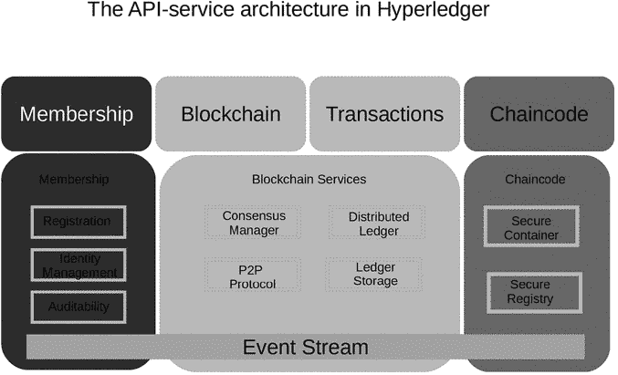
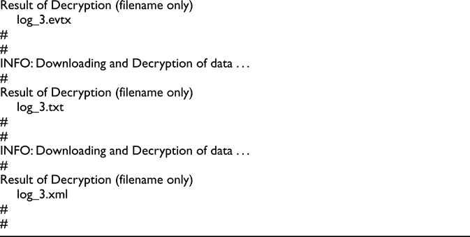
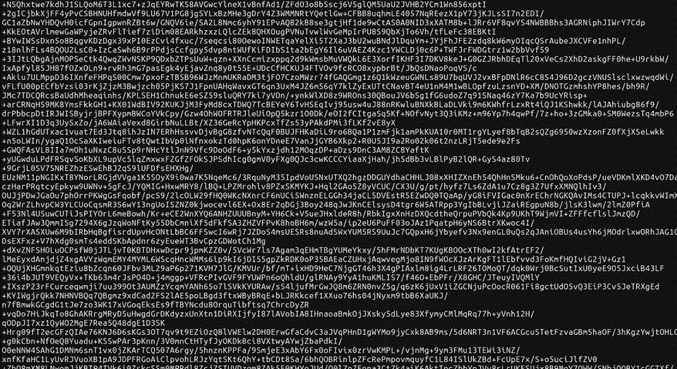
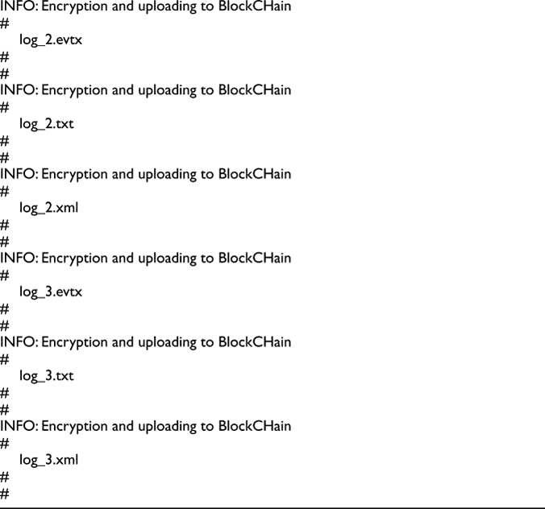

# 十四、使用 Fabric Hyperledger 区块链技术管理 CRM

达里奥·普利吉杜、罗伯·托内利和米歇尔·马切西

## 介绍

吸引人的区块链新技术提供的可能性不仅涉及金融应用，而且由于支持智能合约和 dApp 开发的新一代区块链的出现，目前可以跨越到目前为止为软件系统保留的所有应用。

直到几年前，区块链一词还只与比特币(Bit-coin)联系在一起，这是一种加密货币分散系统，由研究人员中本聪(中本聪，比特币白皮书)建立，他提供了在互联网上区块链地址所有者之间进行虚拟货币交换的方案和软件([https://github.com/bitcoin/bitcoin](https://github.com))，利用了通过数字密码术获得的最新成果，如数字签名和散列法。

即使该项目的最初目的是发明一种不受中央机构控制的不可信的现金系统，并向互联网用户提供这种系统，但最终结果是一种新的软件技术，能够更普遍地管理和交换网络上的信息，并能够提供信息管理所需的透明性、不变性、匿名性、完整性和其他受欢迎的特征。

从那时起，区块链技术迅速发展和改进，现在有不同的区块链品牌和解决方案用于最不同的目的。主要的改进当然是在区块链环境中运行本地计算机程序的可能性，即所谓的智能合约，这是部署在区块链上的软件代码片段，通过图灵完成的虚拟机运行，使用区块链相关的指令集，因此允许由普通计算机执行任何类型的计算。典型的众所周知的例子是以太坊和 Hyperledger 区块链系统(以太坊白皮书；Hyperledger 白皮书)。前者运行在未经许可的公共区块链上(即使可以建立私人区块链)，支持加密货币以太和开发智能合约的编程语言 Solidity，是继比特币之后第二大最受欢迎的区块链。后者运行在一个被许可的私有区块链上，该被明确地设想为支持商业组织管理他们自己的业务逻辑，提供决定期望的区块链设置的选项，并运行用各种编程语言编写的“链码”(相当于智能合约)，大多数是用 GO([https://golang.org/](https://golang.org))编写的。

这一新的场景为开发分散式软件应用程序提供了可能性，这些应用程序利用了区块链固有的透明性、不变性、匿名性和信息完整性等特性，这些特性之前已经有过报道。然而，区块链技术不仅仅是好消息；主要是因为它仍然处于年轻阶段，在不同的研究领域，如软件工程，有各种各样的缺点正在接受调查(奥图，德斯特法尼斯，斯威夫特和马切西，2016；奥图、德斯特法尼斯、卡萨布和马切西，2015；奥图、德斯特法尼斯、亚当斯、穆尔吉亚、马切西、托内利，2015；奥图、德斯特法尼斯、卡萨布、参赞、马切西和托内利，2015 年；曼蒂拉、亚当斯、德斯特法尼斯、格拉济奥廷和奥图，2016；Ortu，Destefanis，Counsell，Swift，Tonelli 和马切西，2016)，社交网络和开发者的态度(Ortu，Murgia，Destefanis，Tourani，Tonelli，马切西和 Adams，2016；德斯特法尼斯、奥图、参赞、斯威夫特、托内利、马切西，2017；德斯特法尼斯、奥图、考斯特、斯威夫特、斯蒂芬、米歇尔、托内利，2016；德斯特法尼斯、托内利、孔卡斯和马切西，2012 年)，以及微图案(孔卡斯、德斯特法尼斯、马切西、奥图和托内利，2013 年)。

在 Tonelli、Pinna、Baralla 和 Ibba (2018)中，提出了一种通过基于区块链以太坊中部署的智能合约的架构来实施微服务的方法。该架构有两个层次。第一层为软件应用程序提供 ABI(以太坊应用程序二进制接口)和嵌入 ABI 的用户接口。第二层由区块链中运行的智能合约集组成。在该模型中，每个微服务都是通过原子智能合约来实现的。各层之间的通信通过 Web3 以太坊库 3 的远程过程调用进行，其中包括区块链事务的执行。

在 Lenarduzzi，Tonelli，马切西和 Lunesu (2018)中，Scrum/看板敏捷软件项目的管理是通过区块链应用程序的方式设计的。产品所有者证明结果正确性的职责被委托给一个或多个部署在以太坊区块链上的智能合约，并以 Solidity 编写。在该模型中，与客户达成的协议允许智能合约自动实现支付，并根据结果引入惩罚或拨款。产品所有者的职责和工作因此可以被减轻，允许资源分配到更有利可图和更有生产力的任务。

在马切西、奥图、托内利、德斯特法尼斯、布拉恰利和希龙斯(2018 年)的研究中，对奇偶校验公司生产的用于在区块链以太坊的区块链地址和账户之间持有和交换以太的数字钱包进行了研究，调查了特定智能合约功能可能出现的问题。该论文分析了一个案例研究，其中在智能合约库中发现的一个漏洞，以及可能“不安全”的编程，允许对钱包应用程序奇偶校验进行攻击，导致 2017 年 11 月冻结了约 50 万只乙醚(约 1.5 亿美元)。

在布拉加诺洛、罗查、登克和迪卡斯(2018)中，一个应用程序 SmartInspect 允许根据其源代码检查已知的合约，重点是交互性和分布性的调试属性。这种反射方法允许用户查看给定源代码的任何合约实例的内容，而无需重新部署或开发任何专用代码来解码内存表示。

在 Sousa、Bessani 和 Vukolic (2018)中，在 BFT 智能状态机复制/共识库之上为 Hyperledger 实施了拜占庭容错(BFT)订购服务，并针对广域部署进行了优化。结果显示，订购服务每秒钟可以处理多达一万笔交易，并且在半秒钟内在区块链中不可撤销地写下一笔交易，即使同行分散在不同的大洲。

在 Hulea、Rosu、Miron 和 Astilean (2018)中，提出了一种使用分布式总账技术的医药冷链管理解决方案。提出了一个基于 Hyperledger 锯齿分布式分类帐框架的应用程序框架，用于在药品分销阶段向所有利益相关方提供信息的装运跟踪。该解决方案包括一个自定义事务系列和一个传感器网关，用于从温度跟踪设备自动收集数据。

在 Kinkelin，Hauner，Niedermayer 和 Carle (2018)中，提出了一种拜占庭容错配置管理系统(CMS ),该系统提供对管理员的控制，限制他们的权利，并实施关注点的分离。配置管理流程要求对关键配置进行多方授权，以防止个别恶意管理员执行不需要的操作，并且在 Hyperledger Fabric 上受支持。

在这一章中，我们将重点关注区块链技术在 CRM(客户关系管理)系统中的应用，该系统将商业和研究结合在一起。我们讨论实现管理基础设施的模型，该管理基础设施在设计上是安全的，并且能够通过适当的配置来支持业务组织的需求和过程。该模型通过块链技术在应用级采用软件产品的去中心化。后端基于开源平台 Hyperledger，以支持企业对企业和企业对客户的交易，前端通过区块链协议提供的加密技术对业务信息进行本地保护，以减少攻击面。

## 客户关系管理系统

客户关系管理是业务和企业通过分析方法获取和使用大量数据以提高绩效的需求的答案(Barton，2012)。事实证明，这种方法可以扩展到所有市场，大量数据的注入，以及它们所携带的信息和分析评估，有助于提高平均约 5-6%的生产力和盈利能力。数据收集过程需要三个步骤:结合外部和内部信息，检测绩效预测模型，以及创建和使用信息学工具来处理信息和改变内部能力。目标之一是将客户细分为不同的级别，以便企业能够根据客户所属的细分市场更好地确定报价目标。目的是与客户建立长期关系，通过采取一对一的营销策略，相互信任产生附加值(Greenberg，2009)。

从客户或中央(国家或国际)担保单位的角度来看，企业和商业团体获取的数据可能是一种真正的社会风险，特别是在数据保护未被授权或未被正确考虑的情况下，尤其是在当今，客户数据是在可从网络访问的分散结构中收集和维护的，如 web 服务器的云存储库。因此，最近的法律法规对任何暴露的商业企业的 CRM 强加了“设计隐私”的方法，如在 GDPR(一般数据保护法规)。对隐私规范的日益关注推动了厂商创造用于授予安全性和隐私的新产品，但是由于服务和应用已经被设计和工作，所以作为附加的东西被引入作为应用和网络其余部分之间的中间层，例如防火墙、入侵检测系统、入侵预防系统、web 应用防火墙、下一代防火墙以及最终的人工智能。

相比之下，人们更希望拥有一个在设计上安全的 CRM，它打破了传统 CRM 的体系结构，并将其基础设施建立在一个固有地实现安全性、隐私性、透明性和数据完整性的体系结构上，并支持对不同层次级别的访问和策略权限的定制——总之，一个能够以传统 CRM 的灵活性和有效性管理数据访问、存储和交换，同时固有地管理安全性和完整性问题的系统，如区块链技术。

作为一个解决方案，我们提出了一个基于 Hyperledger Fabric 的 CRM 模型，其中架构的定制是本地的；访问权限和控制以及事务控制是通过设计实现的；数据的安全性、隐私性、不变性和完整性是区块链技术与生俱来的。我们的方法利用了依赖于公开连接到互联网的基础设施的信任，而是依赖于基于 Hyperledger 结构的加密，以便利用其许可和私有区块链的特征。

## 超级账本项目

hyperledger([www.hyperledger.org](http://www.hyperledger.org))是一个开源项目，由 Linux 基金会于 2015 年创立，用于支持基于区块链技术的分布式分类账的协作开发，旨在改善分布式分类账中不同部门之间的协作，特别关注支持全球分销领域技术和金融企业商业交易的性能和可靠性。该项目通过一个由特定模块组成的框架，根据具体情况，包括并支持开放和独立的标准和协议。在这些模块中，有用于管理共识和存储的区块链、用于身份管理和访问控制的服务以及智能合约。IT 行业的许多大品牌都支持该项目，如思科、IBM、英特尔、日立、富士通、SAP 等。

## 超分类帐结构

在众多平台中，Fabric 是一个开源的区块链框架，最初由 IBM 开发，名为 IBM Open Block-chain (OBC)。Fabric 背后的想法是支持模块化结构，其中可以配置不同的区块链节点以扮演不同的角色，并支持智能合约代码的执行，在 Fabric 术语中称为 chaincode。该架构允许用户配置哪个共识算法运行区块链和成员资格服务，以便每个参与者可以扮演不同的角色并拥有不同的特权。

一种结构超级分类帐网络包括:

*   节点是执行链码的对等点，有权访问分类账、批准交易并与应用程序交互；
*   排序节点，其检查网络一致性并将批准的事务分配给网络节点；和
*   MSP(成员资格服务提供商)，作为认证机构来实现，并管理用于认证成员身份和角色的证书。

Fabric 的目的是使用分布式账本技术(DLT)作为服务集成项目。智能合约链码支持多种语言，包括 Go、Java、Javascript、nodejs 也就是说，它不提供专有的或特定的编程语言，开发者可以使用他们喜欢的或最习惯的编程语言。如前所述，它提供了组织私有和许可的区块链网络的可能性。商业组织的优势在于访问不是匿名的，并且可以被限制。此外，可以定义策略，以便不同的用户可以拥有不同的访问权限。MSP 提供了用于管理参与者身份的基础设施，并且假定每个成员已经被预先授权并且其身份是众所周知的，则为了保证网络安全性和参与者的诚实性，可以随意取消工作证明或类似的协议。

Hyperledger Fabric 可以针对不同的需求和口味进行个性化，并允许创建专用于管理子区块链网络的参与者子集的渠道，其自身的交易对网络的其余部分隐藏，并且独立于整体交易流量，这是并发业务或具有不同层级的企业的理想情况。通道的概念也可以扩展到只有两个参与者([https://ibm.ent.box.com/v/BlockFiles](https://ibm.ent.box.com))。

结构分布式分类帐有两个组件，世界状态和事务日志。每个节点都有它所属的每个网络的分类帐的副本。第一个组成部分是世界状态，说明某一特定时刻的分类账状态，而交易日志则记录导致当前状态的所有交易，即说明年表。

## 链码

Fabric 中的智能合约由块链外部的应用程序在必须与之交互时调用。在大多数情况下，chaincode 只与世界状态交互，而不与事务日志交互。链码可以用不同的高级编程语言实现，比如 Java、JavaS-script 和 GO。它们执行代码并向区块链发出请求。通过专用信道，可以创建只属于网络子集的交易。属于一个通道的所有数据对其他人都是不可见的。此功能实现了对隐私问题的简单且安全的管理。此处显示了一个 GO chaincode 示例，用于对分类帐执行查询。

`func (s *SmartContract) queryUser(APIstub shim.ChaincodeS-tubInterface, args []string) sc.Response {
  if len(args)!= 1 {
   return shim.Error(“Incorrect number of arguments. Expect ing UserID”)
  }
  UserBytes, err:= APIstub.GetState(args[0])
  if err!= nil {
   return shim.Error(err.Error())
  }
  return shim.Success(UserBytes)
}` 

所有交易都需要以正确的顺序附在分类账上，即使是由属于不同渠道的链码管理。这是通过协商一致算法的不同可能选择来管理的，如 SOLO 和 Kafka([https://git hub . com/hyper ledger/fabric/tree/master/order/consensus/SOLO](https://github.com)和[https://git hub . com/hyper ledger/fabric/tree/master/order/consensus/Kafka](https://github.com))算法，或简化拜占庭容错，以便更好地考虑网络参与者之间的关系。

图 14.1Hyperledger 的 V2.0.0 架构(来自 hyper ledger 白皮书)

Hyperledger 织物白皮书规定了织物的主要特征(体系结构参见[图 14.1](Ch14.xhtml#fig14_1) )。这些是:

*   可扩展性:向网络中动态添加新节点的可能性。链码的执行是分开的，并且可以添加节点来分配流量。
*   事务:是确定性的，在一个定义的和恒定的时间内执行，独立于执行实体。
*   身份:Hyperledger Fabric 提供了一个用于控制资源访问的公钥基础设施。公钥基础设施模块可以与预先存在的解决方案集成，例如 LDAP 或 AOUTH2。
*   审核:结构中包含了执行审核的可能性，管理事件和日志允许基于当前网络配置进行各种检查。
*   高级查询:Fabric 允许用户查询当前的区块链状态，在部署业务网络期间定义查询并将其加载到区块链。用户可以使用 API 调用它们。数据通过对应于区块链提交的键值对的事务记录分发。
*   政策服务:用于管理和控制政策，如背书、共识、团体等。
*   Blockchain 服务:通过对等通信协议管理分布式分类帐。只有在处理和验证交易的节点之间达成共识，才能更新分类账中的数据。节点计算每个块后数据集的哈希。
*   一致性服务:这是一个根据选择的算法接收和执行事务的模块，并与链码接口以检查事务的正确性。
*   链码:这是为管理交易而执行的软件。链码在验证节点内的安全容器(框)中执行，负责处理事务请求，并根据业务逻辑验证它们的有效性。
*   通道:创建一个虚拟数据分区，只允许在参与通道的网络部分访问信息和事务。

## 模型

为了通过设计确保 CRM 管理业务和企业服务的安全性，我们设计并实现了一种架构，其中使用 Hyperledger Fabric 实现了网络不同部分之间的交互、服务以及隐私和安全问题和策略。

事实上，每个公开连接到互联网的应用程序或软件系统都暴露在黑客和攻击者的面前。客户关系管理系统保存着成千上万人的个人和私人数据和信息，这些数据和信息对企业有着巨大的价值。近年来在入侵和黑客攻击此类数据上花费的努力和资源不仅构成了一个利润丰厚的行业，而且还可以(并且已经)被用来破坏和影响人们的信仰、社会方面和关系，例如在数据被用来影响各国选举的情况下。但是，将我们的注意力放在业务和企业的 CRM 安全上，安全解决方案的项目必须采用“零信任系统”方法，并且不得依赖于连接到互联网的公共基础设施，例如托管提供商、连接解决方案、服务器、网络设备以及通常与终端内运行的一切不同的东西，如 PC、移动和物联网设备。零信任架构还通过利用微分段和基于用户、数据和位置的精细边界实施，解决了进入网络内部的威胁，而不是像传统安全模式那样只关注边界上的安全问题。

必须采用“深度防御”原则，即使用多个保护层来保护系统免受外部攻击。特别是，在分析 web 技术时，我们有两个相互作用的系统:数据库和 web 应用程序。数据库管理数据的存储和交互，而 web 应用程序管理用户和数据之间的交互逻辑。外部用户不能直接与数据库交互，也不能将请求转发给 web 应用程序。因此，后者是第一目标，因为他们暴露于连接到公共网络的信息学攻击。如果网络应用程序没有得到适当的保护或安全漏洞被利用，就有可能窃取数据或改变数据完整性。

在关系数据库中，可以使用安全特性来创建具有不同特权和权限的概要文件，但是开发能够在各种不同的上下文中使用不同概要文件的 web 应用程序是困难和昂贵的。传统的应用程序属于客户端-服务器架构，它依赖并信任承载应用程序的基础设施。这些通常不加密数据，服务器攻击可以完全访问数据库。因此，“应用服务器端”黑客可以提供对数据库的完全访问。当然，数据库可以加密，但是加密和解密通常发生在数据库内部，不涉及与应用程序的交互。因此，希望直接对客户端进行加密。此外，如果 web 框架被不可信环境中的节点网络所取代，在不可信环境中，所有交易都是在得到授权用户批准的情况下执行的，并且所有操作都是在节点一致同意的情况下执行的，那么外部攻击者将更难接触到所有敏感数据。

该解决方案可以通过 Hyperledger Fabric 实现，其中 chaincode 可以管理与数据库的交互，并根据选定的共识机制执行交易。在这种架构中，连接到互联网的 web 应用程序被区块链所取代。图形界面和用户交互被委托给端点应用程序，其中在客户端端对端启用加密。在用户的请求被 ACL(访问控制列表)确认并被 chaincode 验证之后，用户通过通道与 Fabric 后端交互，这是与分类帐交互的唯一方式。

### 处理交易

交易按照七个步骤进行处理。在第一步中，应用程序发送一个请求到一个签署对等点。然后，签署策略指定签署请求所需的节点数量。节点执行链代码来部署请求，并模拟对分布式分类帐的读/写操作。在第三阶段，认可对等体向应用提供与区块链交互的请求，该请求由节点签名。然后，应用程序将交易和数字签名发送到订购服务。订购服务创建一个事务块，并将其交付给提交对等方。它们接收交易批次，最后，对于接收块中的每个交易，验证背书策略并检查是否存在潜在的冲突交易。如果两项检查都得到确认，则会将冻结插入到分布式分类帐中，并更新区块链状态。

由于只有数字签名和读/写操作在网络内部广播，因此性能和可伸缩性得到了优化。在具有不同任务的不同节点之间共享链代码执行允许服务被优化，即使在存在过载和大量事务的情况下。角色的分离允许网络的动态增长，使得对等体可以被动态地插入。

### 模型架构

应用程序和数据库服务器的基础设施可以被建立在 Hyperledger 结构上的业务网络所取代。数据在客户端被加密并存储在一个私有的区块链中。这被用作中间层，一个中间件，它使客户机能够在组织内部和外部进行通信。内部通信通过特定的 ACL 策略实现。与存储在分布式分类帐中的数据的每次交互都是通过仅由授权用户调用的链码进行的。在数据被接受之前，对数据的每个操作都由部署在区块链上的不可逆的智能合约进行验证。这确保了自动化和安全性，因为客户端和数据库之间的交互是在只包含有效操作的访问控制列表的基础上执行的，从而减少了外部攻击的可能性。

我们的第一个目标是实现一个独立工作的原型，其中数据流发生在软件产品内部，但能够与预先存在的外部系统连接和集成。因此，我们开发了命令行模式和图形用户界面的客户端。一个工作示例显示了通过两个非交互式进程同步两个文件夹，以及在与整个信息系统交互的图形管理系统中检查数据。该系统可以处理文本，无论它是否被加密，以及是否已经由作者之一在“Eablock”和“CLab”处进行了阐述。

在[表 14.1](Ch14.xhtml#table14_1) 中报告的示例中，客户端在包含“.日志”文件。每个文件的内容和名称都被加密并插入到区块链中。之后，可以在图形平台内检查数据([图 14.2](Ch14.xhtml#fig14_2) )。

该平台显示加载到区块链中的文件内容列表，这些文件内容是使用用户凭据恢复的，在客户端内部对其进行解密并向用户公开。

如果攻击者进入某些节点，加密的数据将无法被理解或解释。我们能够将加密的内容存储为 JSON 文件。[图 14.3](Ch14.xhtml#fig14_3) 显示了根据该标准存储的部分文件内容。

表 14.1 当在 Fabric 框架提供的数据结构内部迭代，同时加密并保存每个元素时，客户端提供的消息截图。

图 14.2Eablock 客户端向最终用户公开区块链解密内容的截图。

由于我们还加密了文件名，对于攻击者来说，窃取特定文件变得更加复杂。之后，可以使用对称方案从区块链恢复数据。

[表 14.2](Ch14.xhtml#table14_2) 显示了客户端在 Fabric 框架提供的数据结构内迭代并解密和保存每个元素的屏幕。

图 14.3 客户端在 Fabric 框架提供的数据结构内部迭代时提供的消息截图，同时加密并保存每个元素。

表 14.2 客户端在 Fabric 框架提供的数据结构内迭代时提供的消息截图，同时解密并保存每个元素。

## 结论

在这一章中，我们报告了在“安全设计”方法中使用 Hyperledger Fabric 管理 CRM 的分析。信息安全是 CRM 必须解决的主要目标，以保护客户数据不被未授权方访问。区块链技术的使用本身支持加密匿名化和去中心化，允许 CRM 建立在零信任系统支持上，其中不需要对托管软件组件的基础设施的任何信任。这允许在用户控制下在客户端应用程序中加密数据。这些数据只有授权用户才能获得和访问，其他人无法理解。本机数字签名允许精确识别发件人，发件人不能与任何动作分离。通过加密和哈希函数，区块链上的数据完整性得到了天然的保证，从而可以防止任何不诚实的数据篡改。加密数据保存在基于区块链的后端。我们用一个许可的区块链来实现这个方案，该区块链需要对网络参与者进行预防性验证。我们使用 Hyperledger 的“Fabric ”,这是一个为企业创建区块链的项目。Hyperledger 的权限结构降低了安全问题的风险，只允许授权部分之间的交易。通过 Fabric，chaincode 可以管理与数据库的交互，并且根据选定的共识机制执行事务。在这种架构中，连接到互联网的 web 应用程序被区块链所取代。图形界面和用户交互被委托给端点应用程序，其中在客户端端对端启用加密。在用户的请求被 ACL 确认并被 chaincode 验证之后，用户通过通道与结构后端交互，这是与分类帐交互的唯一方式。内部通信通过特定的 ACL 策略实现。与存储在分布式分类帐中的数据的每次交互都是通过仅由授权用户调用的链码进行的。在被接受之前，对数据的每个操作都由部署在区块链上的不可逆转的智能合约进行验证。这确保了自动化和安全性，因为客户端和数据库之间的交互是在只包含有效操作的 ACL(访问控制列表)的基础上执行的，从而减少了外部攻击的机会。我们实现了一个独立工作的原型，其中数据流发生在软件产品内部，但能够与预先存在的外部系统连接和集成，我们开发了命令行模式和图形用户界面的客户端。通过这个原型，我们展示了如何依靠 Fabric Hyperledger 实际实现 CRM“安全设计”的概念。我们的研究将现有的 CRM 研究推向一种区块链方法，利用这种新技术的最相关的特性。

## 感谢

作者非常感谢卡利亚里大学的污染实验室(C-Lab ),该实验室部分主持了这项工作并支持了 Eablock 项目。

## 文献学

多米尼克·巴顿(2012)。《让高级分析发挥作用》，哈佛商业评论。

布拉加诺洛，圣地亚哥，罗查，恩里克，登克，马库斯和迪卡斯，夏羽(2018)。“SmartInspect: Solidity 智能合约检查员”，2018 面向区块链的软件工程国际研讨会(IWBOSE)，意大利坎波巴索，第 9–18 页。国际标准书号:978-1-5386-5987-8。

孔卡斯、朱利奥、德斯特法尼斯、朱塞佩、马切西、米歇尔、奥图、马尔科和托内利、罗伯托(2013)。“敏捷软件中的微观模式”，敏捷软件开发国际会议，第 210–222 页。

德斯泰法尼斯、朱塞佩、奥图、马尔科、参赞、史蒂夫、斯威夫特、斯蒂芬、马切西、米歇尔和托内利、罗伯托(2016)。"软件开发:礼貌很重要吗？"，PeerJ 计算机科学，第 2 卷，第 73 页。

德斯特法尼斯、朱塞佩、奥图、马尔科、参赞、史蒂夫、斯威夫特、斯蒂芬、托内利、罗伯托和马切西、米歇尔(2017)。“论软件开发情感度量的随机性和季节性”，《应用计算研讨会论文集》，第 1266-1271 页。

Destefanis，Giuseppe，Tonelli，Roberto，Concas，Giulio 和马切西，Michele (2012)。“大型 Java 系统中反微模式对易错性影响的分析”，第 27 届 ACM 应用计算年会论文集，第 1251–1253 页。

以太坊白皮书:[https://github.com/ethereum/wiki/wiki/White-Paper](https://github.com)

格林伯格，P. (2009 年)。“光速下的客户关系管理”，在社会客户关系管理策略、工具和吸引客户的技巧中。第四版。麦格劳·希尔，第 30 页。

Hulea，M.E .，Rosu，o .，Miron，r .和 Astilean A. (2018 年)。《医药冷链管理:基于分布式账本的平台》(会议论文)，第 21 届 IEEE 自动化、质量和测试、机器人国际会议，AQTR 2018，2018 年 7 月 3 日，第 1–6 页，克卢日-纳波卡；罗马尼亚；2018 年 5 月 24 日至 2018 年 5 月 26 日；类别号 CFP 18 aqt-PRT；代码 137740。

Hyperledger 织物白皮书:【www.hyperledger.org/resources/publications#white-papers 

Hyperledger 白皮书:【www.hyperledger.org/resources/publications#white-papers 

金克林，h .，豪纳，V.E .，尼德迈尔，H.E .和卡尔，G. (2018)。“使用分布式分类帐的网络设备的可信配置管理”(会议论文)，IEEE/IFIP 网络运营与管理研讨会:网络世界中的认知管理，NOMS 2018，2018 年 7 月 6 日，第 1–5 页，台北；2018 年 4 月 23 日至 2018 年 4 月 27 日；类别号 CFP 18 nom-ART；代码 137784。

莱纳杜齐、瓦伦蒂娜、托内利、罗伯托、马切西、米歇尔和卢内苏、玛利亚·伊拉利亚(2018)。“敏捷方法论的区块链应用”，第 19 届软件工程和极限编程敏捷流程国际会议。XP 程序。

曼蒂拉、米卡、亚当斯、布拉姆、德斯特法尼斯、朱塞佩、格拉齐奥丁、丹尼尔和奥图、马尔科(2016)。"挖掘效价、唤醒和支配:检测倦怠和生产力的可能性？"，第 13 届国际矿业软件库会议录，第 247-258 页。

马切西、米凯莱、奥图、马尔科、托内利、罗伯托、德斯特法尼斯、朱塞佩、布拉恰利、安德烈亚和赫龙斯、罗伯特(2018)。“智能合约漏洞:呼吁区块链软件工程？”，面向区块链的软件工程国际研讨会(IWBOSE)，第 19–24 页。doi:10.1109/iw bose . 38668386867

中本聪，《比特币:一个点对点的电子现金系统》，比特币白皮书。

奥图、马尔科、德斯特法尼斯、朱塞佩、亚当斯、布拉姆、穆尔吉亚、亚历山德罗、马切西、米歇尔和托内利、罗伯托(2015)。“JIRA 存储库数据集:理解软件开发的社会方面”，第 11 届软件工程预测模型和数据分析国际会议论文集，第 1 页。

奥图、马尔科、德斯特法尼斯、朱塞佩、参赞、史蒂夫、斯威夫特、斯蒂芬、托内利、罗伯托和马切西、米歇尔(2016)。“纵火犯还是消防员？敏捷软件开发中的情感因素”。

Ortu、Marco、Destefanis、Giuseppe、Kassab、Mohamad、Counsell、Steve、马切西、Michele 和 Tonelli、Roberto (2015)。“您介意解决这个问题吗？使用敏捷板开发的软件中礼貌和吸引力的实证分析”，软件工程中的敏捷过程和极限编程，第 122–140 页。

奥图、马尔科、德斯特法尼斯、朱塞佩、卡萨布、穆罕默德和马切西、米歇尔(2015 年)。“测量和理解 JIRA 开发者社区的有效性”，第六届软件度量新兴趋势国际研讨会会议录，第 3-10 页。

奥图、马尔科、德斯特法尼斯、朱塞佩、斯威夫特、斯蒂芬和马切西、米歇尔(2016)。“测量传统和移动开源软件的高优先级和低优先级缺陷”，第 7 届软件度量新兴趋势国际研讨会会议录，第 1–7 页。

奥图、马尔科、穆尔吉亚、亚历山德罗、德斯特法尼斯、朱塞佩、图拉尼、帕拉斯托、托内利、罗伯托、马切西、米歇尔和亚当斯、布拉姆(2016)。《JIRA 软件开发者的感性一面》，2016 IEEE/ACM 第 13 届挖掘软件仓库工作会议(MSR)，第 480–483 页。

Sousa，j .，Bessani，a .和 Vukolic，M. (2018 年)。“Hyperledger Fabric 区块链平台的拜占庭容错订购服务”(会议论文)，第 48 届 IEEE/IFIP 可靠系统和网络国际会议论文集，DSN 2018，2018 年 7 月 19 日，文章编号 8416470，第 51-58 页，卢森堡；2018 年 6 月 25 日至 2018 年 6 月 28 日；类别号 E6445 代码 138141。

托内利、罗伯托、平纳、安德里亚、巴拉拉、加维纳和伊巴，新美乐股份公司(2018)。“以太坊智能合约作为面向区块链的微服务”，微服务国际研讨会:敏捷与 DevOps 体验(MADE18)。