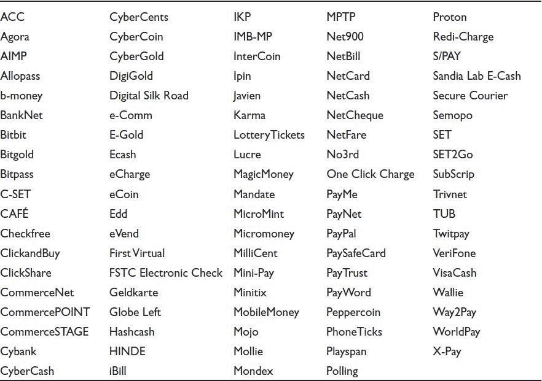

# 零二、引言

漫长的比特币之路

**J 艾雷米·克拉克**

通往比特币的道路上布满了失败尝试的尸体。我整理了一份大约 100 种加密支付系统的清单，包括基于电子现金和信用卡的技术，它们在某些方面都很著名([表 0.1](part0005.html#tab0_1) )。一些是被广泛引用的学术建议，而另一些是被部署和测试的实际系统。在这份名单上的所有名字中，你可能只认识一个——PayPal。PayPal 幸存下来仅仅是因为它很快放弃了在手持设备上加密支付的最初想法！

从这段历史中可以学到很多东西。比特币中的思想从何而来？为什么有些技术存活下来，而许多技术却消亡了？复杂的技术创新成功商业化需要什么？如果没有别的，这个故事会让你体会到，我们终于有了一个真正的、在互联网上运行的支付机制，这是多么了不起。

**传统财务安排**

如果你想象一个没有政府或货币的世界，一个仍然可以用来获取商品的系统就是物物交换。假设爱丽丝想要一个工具，鲍勃想要药。如果他们中的每一个碰巧都有另一个人需要的东西，那么他们可以交换，都满足自己的需要。

但是假设爱丽丝有食物，她愿意用食物换工具，而鲍勃有工具，却不需要食物。他想换成药。爱丽丝和鲍勃不能互相交换，但如果有第三个人，卡罗尔，她愿意用药物交换食物，那么就有可能安排三方交换，每个人都得到他们需要的东西。

当然，缺点是协调性——将一群需求和愿望一致的人安排在同一时间同一地点。出现了两种解决协调的系统:信用和现金。历史学家、人类学家和经济学家争论两者中哪一个先发展起来，但这对我们的目的来说无关紧要。

表 0.1。著名的电子支付系统和建议



在一个基于信用的系统中，Alice 和 Bob 可以在上面的例子中互相交易。Bob 会把工具给 Alice，Bob 得到了欠他的一个人情。换句话说，爱丽丝有一笔债务，她需要在未来某个时候与鲍勃结清。爱丽丝的物质需求现在得到了满足，但她有一笔债务想取消，所以这是她的新“想要”如果以后爱丽丝遇到卡罗尔，爱丽丝可以用她的食物换卡罗尔的药，然后拿着药回去找鲍勃，取消债务。

相反，在基于现金的系统中，Alice 会从 Bob 那里购买工具。后来，她可能会把她的食物卖给卡罗尔，卡罗尔又可以把她的药卖给鲍勃，这样循环往复。这些交易可以按任何顺序进行，前提是每笔交易中的买家手头都有现金。当然，最后就好像没有钱转手一样。

两种体系都没有明显的优势。一个基于现金的系统需要一些初始的现金分配来启动，没有现金分配就不能进行交易。基于信用的系统不需要自举，但缺点是任何欠债的人都在承担一些风险。另一个人有可能永远无法还清债务。

现金还能让我们精确知道某样东西值多少钱。如果你在以物易物，很难说是工具比药物更值钱，还是药物比食物更值钱。现金让我们用数字来谈论价值。这就是我们今天使用混合系统的原因——即使当我们使用信贷时，我们也是以清偿债务所需的现金量来衡量债务的。

这些想法在很多情况下都会出现，尤其是在用户交易某种虚拟商品的在线系统中。例如，点对点文件共享网络必须处理白吃白喝的问题，即用户依次下载文件而不共享。虽然交换文件可能行得通，但还有协调的问题:找到一个完美的人，他正好有你想要的文件，也正好想要你有的文件。在 MojoNation 等项目和 Karma 等学术提案中，用户会获得一些虚拟现金的初始分配，他们必须花费这些现金来接收文件，并在向另一个用户发送文件副本时获得这些现金。一个节点网络(集中用于 MojoNation，分散用于 Karma)跟踪用户的余额，MojoNation 探索实现内部货币和传统货币之间的兑换服务。虽然 MojoNation 没有存在足够长的时间来实现这样的交换，但它成为了今天使用的一些协议的思想祖先:BitTorrent 和 Tahoe-LAFS。

**网上信用卡的麻烦**

信用和现金是基本概念，我们可以将众多的电子支付方式分为两类。比特币显然在“现金”堆里，但我们先来看看另一个。

信用卡交易是当今网络上使用的主要支付方式。如果你曾经在亚马逊这样的在线卖家那里买过东西，你就知道这种安排是怎么回事了。你输入你的信用卡信息，把它发送给亚马逊，然后亚马逊获取这些信用卡信息并与一个金融系统对话，这个金融系统包括加工商、银行、信用卡公司和其他中介机构。

相比之下，如果你使用类似 PayPal 的东西，你看到的是一个中介架构。一家公司位于您和卖方之间，因此您将您的信用卡详细信息发送给该中介，该中介批准交易并通知卖方。中介将在每天结束时与卖方结算余额。

您从这种架构中获得的好处是，您不必向卖家提供您的信用卡详细信息，这可能会带来安全风险。你甚至可以不告诉卖家你的身份，这样也可以保护你的隐私。不利的一面是，你失去了与卖家直接互动的简单性。你和卖家可能都需要在同一个中介机构有一个账户。

今天，当我们在网上购物时，大多数人都乐于透露自己的信用卡信息，或者至少我们已经勉强接受了这一点。我们也习惯了公司收集我们网上购物和浏览活动的数据。但在 20 世纪 90 年代，网络是新生事物，协议级加密标准刚刚出现，这些担忧让消费者深感不确定和犹豫。特别是，通过不安全的渠道把你的信用卡信息交给不知名的在线供应商被认为是疯狂的。这种环境引起了人们对中介架构的极大兴趣。

一家名为 FirstVirtual 的公司是早期的支付中介，成立于 1994 年。顺便提一下，他们是第一批建立纯虚拟办公室的公司之一，员工遍布全国，通过互联网交流——因此得名。

FirstVirtual 提出的系统有点像 PayPal 目前的系统，但比它早了许多年。作为一个用户，你可以注册并提供你的信用卡信息。如果你想从卖家那里买东西，卖家会联系 FirstVirtual，告知你付款的细节，FirstVirtual 会和你确认这些细节，如果你同意，你的信用卡就会被扣款。但是有两个细节很有意思。首先，所有这些交流都是通过电子邮件进行的；当年，网络浏览器刚刚开始普遍支持像 HTTPS 这样的加密协议，支付协议的多方性质增加了其他复杂性。(其他中介采用的方法是将信息编码到 URL 中，或者在 HTTP 之上使用定制的加密协议。)其次，顾客有 90 天的时间对收费提出异议，而商家只有在这 3 个月后才能收到钱！使用当今的系统，商家确实可以立即得到付款，但仍然存在客户提交退款或对信用卡账单提出异议的风险。如果发生这种情况，商家将不得不把付款退还给信用卡公司。

在 20 世纪 90 年代中期，开发了一种与中介体系结构相竞争的方法，我们称之为 SET 体系结构。SET 还避免了客户向商家发送信用卡信息的需要，但是它还避免了用户必须向中介注册。在 SET 中，当你准备购物时，你的浏览器会将你的交易细节视图传递给你电脑上的购物应用程序。该应用程序将它与您的信用卡信息一起加密，加密方式是只有中间人可以解密，其他人(包括卖家)都不能。用这种方式加密你的数据后，你可以把它发送给卖家，知道它是安全的。卖家盲目地将加密数据转发给中介，同时附上他们自己对交易细节的看法。中介解密你的数据，只有当你的观点和卖家的观点一致时，才批准交易。

SET 是由 Visa 和 MasterCard 以及当时的许多技术巨头开发的标准:Netscape、IBM、微软、Verisign 和 RSA。这是一个综合规范，统一了几个现有的提案。

一家实施 SET 的公司是 CyberCash。从很多方面来看，这都是一家有趣的公司。除了信用卡支付处理，他们还有一种叫做网络币的数字现金产品。这是一个小额支付系统——用于小额支付，比如支付几美分阅读在线报纸文章。这意味着你的赛博币账户可能永远不会超过 10 美元。然而，有趣的是，他们能够为每个账户获得高达 10 万美元的美国政府(FDIC)保险。

还有更多。在赛博卡运作的时候，美国政府对密码技术的出口有一个误导性的限制，现在这个限制被放弃了，密码技术被认为是一种武器。这意味着包含有意义加密的软件不能提供给其他国家的用户下载。然而，CyberCash 能够从国务院获得他们软件的特别豁免。政府的论点是，从赛博现金的软件中提取加密技术比从头开始写密码更难。

最后，CyberCash 是为数不多的受 Y2K 问题影响的公司之一，它的支付处理软件向一些客户重复收费。他们后来于 2001 年破产。他们的知识产权被 Verisign 收购，然后 Verisign 将它卖给了 PayPal，也就是现在的 PayPal。

为什么没有设置工作？最根本的问题与证书有关。证书是将加密身份(即公钥)与真实身份安全关联的一种方式。这是网站需要从 Verisign 等公司获得的信息，这些公司被称为“认证机构”，在您的浏览器中被识别为安全的(通常由锁图标表示)。CyberCash 和 SET 将安全性置于可用性之上，决定不仅他们系统中的处理器和商家必须获得证书，而且所有用户也必须获得一个证书。获得证书就像纳税一样愉快，所以这个系统是一场灾难。几十年来，主流用户对任何需要最终用户证书的系统都坚决地集体说“不”，这样的提议现在已经被降级为学术论文。比特币通过完全避开现实生活中的身份，巧妙地避开了这个棘手的问题。在比特币中，公钥本身就是用户的身份，正如第一章中所讨论的。

在 20 世纪 90 年代中期，当 SET 被标准化时，万维网联盟也在考虑金融支付的标准化。他们想通过扩展 HTTP 协议来实现，这样用户就不需要额外的交易软件——他们可以直接使用浏览器。事实上，该联盟对如何扩展协议有一个非常笼统的提议，他们的一个用例是处理支付。这从未发生——整个扩展框架从未在任何浏览器中部署过。近 20 年后的 2015 年，该财团宣布，它希望再次尝试，比特币将成为这一次标准化的一部分。然而，鉴于过去所有的失败，我不会屏住呼吸。

**从信用卡到(加密)现金**

现在让我们转向现金。我之前比较了现金和信贷，并指出现金系统需要自举，但好处是它避免了买家拖欠债务的可能性。现金有两个额外的优势。首先是更好的匿名性。因为你的信用卡是以你的名义发行的，所以银行可以追踪你所有的消费。但是当你用现金支付时，银行并不介入，对方也不需要知道你是谁。其次，现金可以实现线下交易，无需打电话给第三方来获得交易批准。也许卖家后来会利用银行等第三方来存放现金，但这就没那么麻烦了。

比特币并没有提供这两种属性，但它足够接近有用。比特币不像现金一样匿名。你不需要使用你的真实身份来支付比特币，但如果你不小心，你的交易可能会被聪明的算法基于交易的公共账本捆绑在一起，然后进一步与你的身份联系起来。[第 6 章](part0012.html#BE6O0-ea268daff50b4c55a00d858ef79f4a6c)讲述比特币匿名背后混乱却迷人的细节。

比特币也不是完全离线的。好消息是它不需要一个中央服务器，而是依赖于一个点对点的网络，就像互联网本身一样具有弹性。[第 3 章](part0009.html#8IL20-ea268daff50b4c55a00d858ef79f4a6c)讲述了类似“绿色地址”和微支付的技巧，这些技巧允许在某些情况下或在某些假设下进行离线支付。

将加密技术应用于现金的最早想法来自于 1983 年的 David Chaum。通过物理类比来考虑这个概念。比方说，我开始分发一张纸条，上面写着:"这张钞票的持有者可以通过向我出示这张钞票来兑换一美元"，并附上我的签名。如果人们相信我会遵守诺言，认为我的签名是不可伪造的，他们可以像传钞票一样传这些纸。事实上，纸币本身是从商业银行发行的本票开始的。只是在相当近的历史上，政府才介入集中货币供应，并从法律上要求银行赎回票据。

我可以用数字签名以电子方式做同样的事情，但这遇到了令人讨厌的“双重支出”问题——如果你收到一份代表一单位虚拟现金的数据，你可以将它复制两份(或更多)并传递给不同的人。为了坚持这个类比，让我们稍微延伸一下，假设人们可以制作完美的副本，而我们没有办法区分副本和原件。这个世界能解决双重支出吗？

这里有一个可能的解决方案:我在发出的每张钞票上都贴上了独特的序列号。当你从别人那里收到这样的纸条时，你会检查我的签名，但你也会打电话给我，问我有那个序列号的纸条是否已经被花掉了。希望我会说不，在这种情况下，你接受了笔记。我会把序列号记录在我的分类账里，如果你想花掉那张纸币，那就没用了，因为收款人会打电话给我，我会告诉他们那张纸币已经被花掉了。相反，你需要做的是定期把你收到的所有纸币带给我，我会给你发行同样数量的新纸币，上面有新的序列号。

这个管用。这在现实生活中很麻烦，但在数字上很简单，只要我设置了一个服务器来进行序列号的签名和记录。唯一的问题是，这不再是真正的现金，因为它不是匿名的——当我向你发出一张纸条时，我可以记录序列号和你的身份，当别人后来赎回它时，我可以做同样的事情。这意味着我可以跟踪你花钱的所有地方。

这就是乔姆的创新之处。他想出了既能保持系统匿名又能防止重复支出的方法，他发明了以下程序的数字等价物:当我给你发行一张新钞票时，*你*选择序列号。你把它写在纸上，但是把它盖住，这样我就看不见了。然后我就签了，还是看不到序列号。这在密码学中被称为“盲签名”。选择一个长的、随机的序列号以确保它最有可能是唯一的，这是符合您的利益的。我不用担心你会挑一个已经挑好的序列号——你这样做只会搬起石头砸自己的脚，最后得到一张花不完的纸条。

这是第一个严肃的数字现金提案。它可以工作，但是它仍然需要一个由中央机构(比如银行)运行的服务器，并且每个人都要信任这个实体。而且，每一笔交易都需要这个服务器的参与才能完成。如果服务器暂时停机，支付就会陷入停顿。几年后的 1988 年，Chaum 与另外两位密码学家 Amos Fiat 和 Moni Naor 合作，提出了*离线*电子现金。乍一看，这似乎是不可能的:如果你试图在两家不同的商店消费相同的数字纸币或硬币，除非他们都连接到同一个支付网络或中央实体，否则他们怎么可能停止这种双重消费？

聪明的想法是，不要再担心防止重复消费，而是在事后，当商家重新连接到银行服务器时，专注于检测重复消费。毕竟，这种方法就是为什么你可以在飞机上使用你的信用卡，即使天空中没有网络连接。当航空公司能够重新连接到网络时，交易处理就发生了。如果你的卡被拒绝，你将欠航空公司(或你的银行)钱。仔细想想，相当多的传统金融都是基于检测错误或损失，然后试图追回资金或惩罚肇事者的想法。如果你给某人开了一张个人支票，他们不能保证钱真的在你的账户上，但是如果支票被退票，他们可以找你算账。可以想象，如果离线电子现金系统被广泛采用，法律体系将会把重复消费视为犯罪。

Chaum，Fiat 和 Naor 发现重复消费的想法是一个复杂的密码舞蹈。在很高的层面上，它实现了这一点:发给你的每一枚数字硬币都编码了你的身份，但以这样一种方式，除了你之外，没有人——甚至是银行——能够解码它。每次你花你的硬币，接收者会要求你解码一个随机的编码子集，他们会记录下来。这种解码不足以让他们确定你的身份。但是，如果你花了一枚硬币，最终两个接收者都会去银行兑换他们的纸币，当他们这样做时，银行可以将两条信息放在一起，以压倒性的高概率完全解码你的身份。

你可能会想，在这个体系中，是否有人可以把你框定为双重支出者。假设你和我一起花了一枚硬币，然后我转身试着加倍花它(不需要向银行赎回并得到一枚新的编码了我身份的硬币)。这是行不通的——新的接收者会要求我解码一个随机子集，这个子集几乎肯定不会与你为我解码的子集相同，所以我将无法遵从他们的解码请求。

多年来，许多密码学家研究了这种结构，并以各种方式对其进行了改进。在 Chaum-Fiat-Naor 方案中，如果一枚硬币价值 100 美元，而你想买只值 75 美元的东西，比方说，没有办法把这枚硬币分成 75 美元和 25 美元的硬币。你所能做的就是回到银行，兑现 100 美元的硬币，并要求一个 75 美元的硬币和一个 25 美元的硬币。但是 1991 年由 Tatsuaki Okamoto 和 Kazuo Ohta 发表的一篇论文使用 Merkle 树创建了一个系统，允许你细分你的硬币。Merkle 树也会出现在比特币中，我们将在第一章中见到它们。Chaum-Fiat-Naor 方案在效率方面也有很大的改进空间。特别是，所谓的“零知识证明”在这个方案中的应用(最著名的是 20 世纪 90 年代的 Stefan Brands，以及 2005 年的 Jan Camenisch、Susan Hohenberger 和 Anna Lysyanskaya)非常有成效——零知识证明也被应用于比特币，如第 6 章中所讨论的。

但是回到乔姆:他把他的想法商业化了。他在 1989 年成立了一家名为“DigiCash”的公司，这可能是最早试图解决在线支付问题的公司。他们比其他公司领先大约 5 年，比如刚刚讨论过的 FirstVirtual 和 CyberCash。DigiCash 系统中的实际现金被称为“ecash”，他们还有另一个系统，被称为“cyberbucks”。一些银行实际上已经实施了——一些在美国，至少有一家在芬兰。这是在 20 世纪 90 年代，远在比特币之前，这可能会让一些比特币爱好者感到惊讶，他们认为银行是恐惧科技、反创新的庞然大物。

Ecash 是基于 Chaum 的协议。客户是匿名的，所以银行无法追踪前者是如何花钱的。但是 ecash 的商家并不是匿名的。他们一收到硬币就必须归还，这样银行就知道他们在什么时候赚了多少钱等等。

当你想汇款时，你可以点击收款人提供的链接，将你带到 DigiCash 网站。这将打开一个反向网络连接回到你的电脑。这意味着您的计算机必须能够接受传入的连接并充当服务器。你必须有自己的 IP 地址，你的互联网服务提供商必须允许外来连接。如果连接成功，ecash 软件将在您的计算机上启动，您就可以批准交易并汇款。

Chaum 取得了几项关于 DigiCash 技术的专利，特别是关于它使用的盲签名方案。他的行动是有争议的，它阻止了其他人开发使用相同协议的电子现金系统。但是一群在所谓的“密码朋克”邮件列表上闲逛的密码学家想要一个替代方案。Cypherpunks 是中本聪后来向世界宣布比特币的邮件列表的前身，这不是巧合。赛博朋克运动和比特币的根源将在第七章中讨论。

cypherpunk 密码学家实现了一个名为 MagicMoney 的 ecash 版本。它确实侵犯了专利，但被宣传为仅用于实验。这是一款好玩的软件。界面都是基于文本的。你可以通过电子邮件发送交易。您只需将交易复制并粘贴到您的电子邮件中，然后发送给另一个用户。希望你能使用端到端的电子邮件加密软件，比如 PGP，来保护传输中的交易。

然后是 Lucre，这是本·劳里的一个提议，得到了许多其他人的支持。Lucre 试图用一个不受专利限制的替代方案取代 ecash 中的盲签名方案，系统的其余部分基本相同。

伊恩·戈德堡(Ian Goldberg)提出的另一项建议试图解决无法将硬币分开找零的问题。他的想法是，如果商家有一些硬币，商家可以把硬币退给你，这样，如果你没有零钱，你可能会多付一些钱，然后你会得到一些硬币。但是请注意，这种做法引入了匿名问题。正如我们前面看到的，在 ecash 中，发件人是匿名的，但商家不是。当商家寄回现金时，从技术上讲，他们是汇款人，所以他们是匿名的。但是你，作为一个必须把这些现金还给银行的人，不是匿名的。没有办法在不破坏试图购买商品的用户的匿名性的情况下设计这个系统。因此，戈德堡想出了一个建议，使用不同类型的硬币，允许这些交易发生，允许你找回零钱，并仍然保持你的匿名性。

DigiCash 为什么会失败？主要问题是很难说服银行和商人采用它。由于当时接受 ecash 的商家不多，用户也不想要。更糟糕的是，它不支持用户对用户的交易，或者至少不是很好。它实际上是以用户对商家的交易为中心的。因此，如果商家不参与，就没有其他方法来激发人们对这个系统的兴趣。所以最终，DigiCash 输了，信用卡公司赢了。

顺便提一下，比特币允许用户对商家和用户对用户的交易。事实上，该协议没有独立于用户概念的商家概念。对用户对用户交易的支持可能是比特币成功的原因之一。从一开始，你的比特币就有了用武之地:将它们发送给其他用户，同时社区试图争取对比特币的支持，并让商家接受它。

在公司的晚年，DigiCash 还试验了防篡改硬件，试图防止重复支出，而不仅仅是检测它。在这个系统中，你会得到一个通常被称为“钱包”或某种卡的小硬件设备。这个设备会记录你的余额，当你花钱时余额会减少，当你往卡里装更多的钱时余额会增加。该设备的要点是，应该没有办法以物理或数字方式篡改其计数器。因此，如果计数器达到零，那么这张卡就不能花钱，直到它被重新加载。

许多其他公司拥有基于防篡改硬件的电子现金系统。DigiCash 后来与一家总部位于欧洲的公司 Café合作。基于这个想法的另一家公司叫做 Mondex，后来被万事达收购。Visa 也有自己的变体 VisaCash。

在 Mondex 中，用户有一张智能卡和一个“钱包单元”，可以在其中任何一个里面装现金。要进行用户对用户支付，赠送者首先将他们的卡放入钱包，然后将卡上的钱转移到钱包上。然后收款人会把他们的卡放在钱包里，你会把钱转移到第二张卡上。这是一种交换数字现金的方式，而且是匿名的。

Mondex 在一些社区测试了他们的技术。有一个社区恰好是离我长大的地方很近的城市:安大略省的圭尔夫。你可能已经猜到它并没有真正流行起来。Mondex 卡的一个主要问题是，它们就像现金一样——如果你丢了或被偷了，钱就没了。更糟糕的是，如果卡出现故障——如果读卡器不读取它——就不可能确定卡上是否有余额。在这些情况下，Mondex 通常会吃掉成本。他们会认为卡里有钱，并补偿用户损失的钱。当然，这可能会让公司损失一大笔钱。

此外，钱包又慢又笨重。用信用卡或现金支付要快得多。零售商讨厌有几个支付终端；他们只想要一个信用卡。所有这些因素共同导致了 Mondex 的破产。

然而，这些卡是智能卡，这意味着它们上面有小型微控制器，这种技术已经被证明是成功的。今天在许多国家，包括我居住的加拿大，每一张信用卡和每一张借记卡现在都有智能卡技术。不过，它有不同的用途。它不是用来防止重复消费的——这个问题不会出现，因为这项技术不是基于现金的。银行，而不是你的卡，记录你的余额或可用信用。相反，芯片用于身份验证，即证明您知道与您的帐户相关的 PIN。但在这项技术被银行业广泛采用之前，Mondex 就已经在使用它了。

**凭空造钱**

在数字现金系统中，如果你有一个价值 100 美元的数字现金对象，是什么让它实际上价值 100 美元？答案很简单:要获得价值 100 美元的电子现金，你必须从你的银行账户中取出 100 美元，交给给你发行电子现金的银行。但是，许多不同的提案描述了如何做到这一点，不同的公司做得不同。一个牵强的可能性是:如果某个特定国家的政府真的授权服务来铸造数字货币，凭空创造新的现金会怎么样？这是 NetCash 背后的想法，尽管它从未超出提案阶段。e-Gold 使用的另一种系统是将一堆黄金放入金库，并根据黄金的价值发行数字现金。另一家名为 Digigold 的公司并非完全由黄金支持，而是有部分储备。

所有这些想法最终都将数字现金的价值与美元或商品挂钩。如果美元的价值上升或下降，你持有的数字货币的价值也会随之变化。一种完全不同的可能性是允许数字货币成为自己的货币，独立于任何其他货币发行和估价。

要创造一种有可能获得实际价值的自由浮动的数字货币，你需要拥有某种设计上稀缺的东西。事实上，稀缺也是黄金或钻石被用作货币后盾的原因。在数字领域，实现稀缺性的一种方式是设计系统，使铸造货币需要解决一个需要一段时间才能破解的计算问题(或“难题”)。在第五章的[中讨论的比特币“挖掘”实现了这个想法。](part0011.html#AFM60-ea268daff50b4c55a00d858ef79f4a6c)

计算难题的解决方案可能是具有某种价值的数字对象，这一基本想法相当古老。早在 1992 年，它就由密码学家辛西娅·德沃克和莫尼·诺尔首次提出，作为减少电子邮件垃圾的潜在解决方案。如果每次你发邮件时，你的电脑都要解决一个需要几秒钟才能解决的难题，那会怎么样？为了执行这一要求，如果你没有将解答附在计算难题上，收件人的电子邮件程序会直接忽略你的邮件。对于普通用户来说，发送电子邮件不会有太大的障碍，因为你不会经常发送电子邮件。但是，如果你是一个垃圾邮件发送者，你试图一次发送数千或数百万封电子邮件，解决这些计算难题可能会变得令人望而却步。1997 年，亚当在一份名为 Hashcash 的提案中独立发现了一个类似的想法。

这些计算难题需要有一些具体的性质，以成为一个有用的垃圾邮件威慑。首先，它应该是不可能的垃圾邮件发送者解决一个难题，并附上他发送的每一封电子邮件的解决方案。要做到这一点，谜题应该针对电子邮件:它应该取决于发件人和收件人，电子邮件的内容，以及大约发送的时间。第二，接收者应该能够容易地检查谜题的解决方案，而不必重复解决谜题的过程。第三，每个谜题都应该完全独立于其他谜题，也就是说，解开一个谜题不会减少解开其他任何谜题的时间。最后，由于硬件会随着时间的推移而改进，而且解决任何给定的计算难题都会变得更快、更便宜，所以接受者应该能够调整他们接受的难题解决方案的难度。这些特性可以通过使用加密散列函数设计谜题来实现——参见[第 1 章](part0007.html#6LJU0-ea268daff50b4c55a00d858ef79f4a6c)。

比特币的计算复杂度与 Hashcash 基本相同，只是略有改进。比特币的作用要远远超过 Hashcash 毕竟，要解释比特币需要一整本书！之所以提到比特币，是因为 Hashcash 的发明者亚当·巴克曾经说过:“比特币是在 Hashcash 的基础上加上了通胀控制的。”我觉得这样做有点过分了。这有点像在说:“特斯拉只是一个车轮上的电池。”

和密码学中的任何好点子一样，计算谜题有许多变体，它们的目的都是获得略微不同的性质。其中一个提议来自罗恩·瑞文斯特和阿迪·萨莫尔，RSA 密码系统中的“R”和“S”。注意，在 Hashcash 中，根据设计，解开一些谜题的成本只是各个成本的总和。但这与政府造币的成本结构不同。想想防伪技术在纸币上是怎么运作的，购买所有设备、打造防伪功能等初始成本都很高。但一旦政府做到了这一切，它的成本就会下降，打印一张或一百张钞票的成本差异很小。换句话说，铸币有巨大的固定成本，但边际成本低。Rivest 和 Shamir 想设计一些模拟这些特性的计算谜题，所以铸造第一枚硬币在计算上有很大的难度，但后续铸造要便宜得多。他们的提议也使用了散列函数，但方式不同。我们不会深入讨论他们解决方案的细节，但他们试图解决的问题在很高的层面上很有意思。

为什么 Hashcash 从来没有流行起来，达到防止垃圾邮件的目的呢？也许垃圾邮件只是不够大的问题，以解决。对大多数人来说，垃圾邮件是一种令人讨厌的东西，但他们并不想把他们的计算周期花在打击上。我们现在有一些垃圾邮件过滤器，它们在阻止垃圾邮件进入我们的收件箱方面非常有效。也有可能 Hashcash 无法真正阻止垃圾邮件发送者。特别是，如今大多数垃圾邮件发送者都使用僵尸网络(垃圾邮件发送者使用恶意软件控制的其他人的大型计算机组)发送垃圾邮件。他们或许也可以用这些计算机来收获 Hashcash。尽管如此，使用计算谜题来限制资源访问的想法仍然是一个活跃的想法。你可以在一些替代网络协议的建议中看到这一点，比如 MinimaLT。

**把一切都记在账上**

比特币的另一个关键组成部分是“区块链”，这是一个安全记录所有比特币交易的分类账。区块链背后的想法仍然是相当古老的，可以追溯到哈伯和斯托内塔从 1991 年开始的一系列论文。他们的提议是一种为数字文档安全加盖时间戳的方法，而不是一种数字货币方案。时间戳的目标是给出一个文档何时出现的大概概念。更重要的是，时间戳准确地传达了这些文档的创建顺序:如果一个文档先于另一个文档出现，则时间戳将反映这一点。security 属性要求事后不能更改文档的时间戳。

在 Haber 和 Stornetta 的方案中，有一个时间戳服务，客户端将文档发送到时间戳。当服务器接收到一个文档时，它将该文档与当前时间以及指向前一个文档的链接或指针一起进行签名，并发布一个带有这些信息的“证书”([图 0.1](part0005.html#fig0_1) )。正在讨论的指针是一种特殊类型的指针，它链接到一段数据，而不是链接到一个位置。然后，如果有问题的数据发生变化，指针会自动失效。[第 1 章](part0007.html#6LJU0-ea268daff50b4c55a00d858ef79f4a6c)讨论了如何使用散列函数创建这样的指针。


图 0.1。链接时间戳。为了创建一个文档的证书，时间戳服务器包含一个指向前一个文档的证书和当前时间的散列指针，并对这三个数据元素一起签名。

该协议实现的是每个文档的证书确保前一个文档内容的完整性。事实上，您可以递归地应用这个参数:每个证书本质上修复了文档和证书直到那时的整个历史。如果我们假设系统中的每个客户端至少跟踪几个证书——他们自己的文档的证书，以及之前和之后的文档的证书——那么参与者可以共同确保历史不会在事后被更改。特别是，文档的相对顺序得以保留。

后来的一篇论文提出了一个提高效率的方法:我们可以将文档收集成块，然后将块链接成一个链，而不是单独链接文档。在每个块中，文档将再次链接在一起，但以树形结构而不是线性结构。这种结构减少了验证特定文档出现在系统历史中的特定点所需的检查量。这个混合方案如图[图 0.2](part0005.html#fig0_2) 所示。

这种数据结构形成了比特币区块链的骨架，正如第三章中所讨论的。比特币以一种微妙但重要的方式对其进行了提炼:一种类似 Hashcash 的协议被用来延迟新块添加到链中的速度。这一修改对比特币的安全模式有着深远而有利的影响。不再需要可信服务器；相反，事件是由一组不可信的节点记录的，这些节点称为“矿工”每个矿工都跟踪区块，而不是必须依赖普通用户来做。任何人都可以通过解决计算难题来创建区块，从而成为矿工。比特币还消除了对签名的需求，仅依靠哈希指针来保证数据结构的完整性。最后，实际的时间戳在比特币中并不重要，该系统的目的是以一种防篡改的方式记录交易的相对顺序。事实上，比特币区块并不是按照固定的时间表创建的。该系统确保平均每 10 分钟创建一个新块，但连续块之间的时间差异很大。


图 0.2。高效的链接时间戳。箭头表示散列指针，垂直虚线表示时间间隔。

本质上，比特币结合了使用计算谜题来监管新货币单位的创造的想法和安全时间戳来记录交易账本并防止重复支出的想法。有更早的，不太复杂的，结合了这两个想法的建议。第一种叫做 b-money，由戴伟在 1998 年提出。在 b-money 中，任何人都可以使用类似 Hashcash 的系统创造货币。它有一个点对点的网络，有点像比特币。每个节点维护一个分类账，但它不是像比特币区块链那样的全球分类账。每个节点都有自己的分类账，记录它认为每个人的余额。

Nick Szabo 提出的另一个类似的提议叫做 Bitgold。Szabo 说他早在 1998 年就有了 Bitgold 的想法，但直到 2005 年才开始写博客。我提到这一点的原因是，纳撒尼尔·波普(Nathaniel Popper)推广了一个小阴谋论，他是《纽约时报》的记者，写了一本关于比特币历史的非常好的书。Popper 指出，在 Satoshi 发布比特币白皮书后，这篇博文的时间戳被更改了，因此比特币的提案看起来像是在比特币发布约两个月后写的。波普尔相信，像许多其他观察家一样，萨伯可能是聪，尽管萨伯否认这一点。Popper 引用时间戳的变化作为 Szabo/Satoshi 试图通过掩盖他发明了比特币前身的事实来掩盖这种联系的证据(即，通过让它看起来像比特币之前没有比特币)。

这种解释的问题是，如果你真的读过博客文章的内容，Szabo 清楚地知道他在 1998 年有过这个想法，而且他没有试图改变那些日期。因此，一个更合理的解释是，在比特币普及了类似的想法后，他只是将这篇文章放到了自己博客的顶部，以确保人们了解他之前的提议。

比特币与 b 币和比特币有几个重要区别。首先，在后两个提议中，计算难题被直接用于铸造货币。任何人都可以解决一个难题，而解决方案本身就是一个货币单位。在比特币中，谜题解答本身并不构成货币。他们被用来保护区块链，只是间接导致铸币。其次，b-money 和 Bitgold 依赖于时间戳服务，这些服务在货币的创建或转移上签字。正如我们所见，比特币不需要可信的时间戳，只是试图保持区块和交易的相对顺序。

最后，在 b-money 和 Bitgold 中，如果服务器或节点之间出现关于分类账的分歧，没有明确的解决方法。让多数人决定似乎隐含在两位作者的著作中。但是由于任何人都可以建立一个节点——或者上百个节点，隐藏在不同的身份后面——这些机制不是很安全，除非一个集中的看门人控制进入网络。相比之下，在比特币中，攻击者要想改变历史，就必须以比其他参与者加起来还要快的速度解决计算难题。这不仅更安全，它允许我们量化系统的安全性。

B-money 和 Bitgold 是非正式的提议——b-money 是邮件列表上的帖子，Bitgold 是一系列博客帖子。两者都没有实现，甚至都没有直接实现。与比特币白皮书不同的是，没有提供比特币或 b 货币的完整规范或任何代码。这些提议掩盖了可能解决也可能解决不了的问题。首先，正如我们已经提到的，如何解决关于分类账的分歧。另一个问题是确定铸造一个货币单位的计算难题应该有多难。由于对于固定的计算能力，硬件往往会随着时间的推移而变得非常便宜，比特币加入了一种定期自动调整谜题难度的机制。B-money 和 Bitgold 不包括这样的机制，这可能会导致问题，因为如果创造新的硬币变得非常容易，硬币可能会失去价值。

**关于聪的暗示**

你可能知道中本聪是比特币创造者采用的笔名。虽然他的身份仍然是一个谜，但在比特币的早期，他进行了广泛的交流。让我们利用这些交流来稍微挖掘一下一些问题，比如他什么时候开始研究比特币，他在多大程度上受到了我们之前看到的想法的影响，以及他的动机是什么。

Satoshi 说，他在 2007 年 5 月左右开始编写比特币代码。我会相信他的话；他匿名的事实并不是认为他会在这种事情上撒谎的理由。他在 2008 年 8 月注册了域名[bitcoin.org](http://bitcoin.org)。那时，他开始给一些他认为可能对这个提议感兴趣的人发私人邮件。不久之后，在 2008 年 10 月，他公开发布了描述该协议的白皮书，不久之后，他也发布了比特币的初始代码。然后他逗留了大约 2 年，在此期间，他在论坛上发布了许多信息，通过电子邮件与许多人通信，并回应人们的关注。在编程方面，他提交了代码补丁。他与其他开发人员一起维护源代码，解决出现的问题。到了 2010 年 12 月，别人慢慢接手了项目的维护，他就不再和他们交流了。

我一直称中本聪为“他”，但我没有特别的理由相信聪是男人而不是女人。我只是用男性代词，因为 Satoshi 是一个男性的名字。我也一直把他称为一个单独的个体。有一种理论认为中本聪可能是个体的集合。我不买这个理论——我认为 Satoshi 很可能只是一个人。如果我们看看 Satoshi 笔名下进行的所有在线互动，如果我们想想 Satoshi 花了两年时间回复电子邮件和修补代码，很难想象这种努力可能是多人共享用户帐户和密码，以相似的风格和相似的声音回应，并确保它们不会相互矛盾的结果。这似乎是一个更简单的解释，至少 Satoshi 的这部分活动是由一个人完成的。

此外，从他的著作和补丁中可以明显看出，这个人了解比特币的全部代码基础和所有设计方面。因此，有理由假设原始代码库和白皮书都是由同一个人编写的。最后，有可能 Satoshi 在最初的设计中得到了帮助。然而，在比特币发布后，Satoshi 很快将他从其他贡献者那里获得的任何帮助归功于他。如果他得到了别人的帮助，他就不会误导我们说他自己发明了什么东西。

Satoshi 对 ecash 的历史了解多少？为了更好地理解这一点，我们可以从他在白皮书中引用的内容以及比特币网站早期版本上的参考资料开始。在白皮书中，他引用了一些关于基础密码学和概率论的论文。他还引用了我之前提到的时间戳工作，很自然地认为区块链的设计是基于这些参考，因为相似之处是如此明显。他还引用了 Hashcash 提案，其计算难题类似于比特币中使用的难题。他提到了 b-money。后来，他在网站上添加了 Bitgold 和 Hal Finney 重用计算难题解决方案的参考资料。

但如果我们看看早期与中本聪通信的人公开的电子邮件往来，我们会发现 b-money 的提议实际上是在事后添加的，是在亚当·贝克的建议下添加的。然后，聪给 b-money 的创始人发了电子邮件，显然，是戴告诉了他比特币的事情。所以这些提议可能不是最初设计的灵感。他后来与哈尔·芬尼通信很多，这是一个相当合理的解释，为什么他引用芬尼的工作，至少在网站上。

根据这些信息，似乎有可能在创造比特币时，Hashcash 和时间戳是 ecash 历史上 Satoshi 知道或认为相关的唯一事物。然而，在他了解了 b-money 和 Bitgold 之后，他似乎意识到了它们的相关性。2010 年年中，维基百科关于比特币的文章被维基百科的编辑标记为删除，因为他们认为这不值得注意。因此，Satoshi 和其他人就如何撰写文章以使维基百科接受它进行了一些讨论。为此，Satoshi 对比特币提出了这样的描述:“比特币是戴伟 1998 年关于密码朋克的 b-money 提案和尼克·萨伯的比特币黄金提案的一种实现。”因此，到目前为止，Satoshi 确实认为将比特币定位为这两个想法的延伸或这两个先前系统的实现是对其工作原理的一个很好的解释。

但是其他的提议呢——我们看到的 Chaumian 电子现金计划和信用卡提议呢？Satoshi 在设计比特币的时候知道这些历史吗？很难说。他没有给出任何了解这段历史的迹象，但很可能他没有提及这段历史，因为它与比特币无关。比特币使用一种完全不同的去中心化模式，因此没有令人信服的理由去纠结于失败的旧中心化系统。

Satoshi 自己在比特币论坛的一篇帖子中顺便提到了 Chaumian ecash，从而表明了这一点。在谈到另一个名为[opencoin.org](http://opencoin.org)的提案时，他注意到他们似乎在“谈论旧的乔米安中央造币厂的东西，但可能只是因为那是唯一可用的东西。也许他们会对新的方向感兴趣。许多人自动地认为电子货币是一个失败的事业，因为自 20 世纪 90 年代以来，所有的公司都失败了。我希望这是显而易见的，只是这些系统的中央控制性质注定了他们。我认为这是我们第一次尝试一个分散的、不基于信任的系统。”这很好地表明了 Satoshi 对早期提案的看法，特别是他认为比特币与他们有何不同。比特币的去中心化确实是一个决定性的特征，它与我们所看到的几乎所有东西都有所不同。

另一个有趣的引用来自 Satoshi，暗示他可能不是一个学者。大多数学术研究人员在建立系统之前，会思考想法并立即写下来。Satoshi 说他采取了一种相反的方法:“我实际上是反过来研究比特币的。在我说服自己可以解决所有问题之前，我必须写完所有的代码，然后我写了论文。我想我可以比写详细的规范更快地发布代码。”

由于围绕着 Satoshi 的有点神秘，值得一提的是，他像其他人一样犯了错误，并不是一个完美的未来先知。最初的比特币代码中存在 bug 和有问题的设计选择。例如，向 IP 地址发送比特币的功能从未流行起来，现在回想起来，这是个坏主意。当他描述比特币有什么用途时，他的设想主要是在互联网上使用比特币。当然，这个用例是比特币的核心，但不是唯一的。例如，他并没有提出走进咖啡店，用比特币为你的咖啡买单的愿景。

为什么 Satoshi 保持匿名？有很多可能的原因。首先，这可能只是为了好玩。许多人匿名写小说，一些涂鸦艺术家，如班克斯，保持匿名。事实上，在 Satoshi 当时参与的社区 cypherpunk 社区和密码学邮件列表——人们匿名发帖是司空见惯的事情。

或者对法律的担忧可能影响了 Satoshi 的选择。两家美国公司 Liberty Reserve 和 e-Gold 因洗钱而陷入法律纠纷。2006 年，自由储备组织的创始人之一逃离了美国，担心他会因洗钱指控被起诉。相比之下，e-Gold 的创始人留在了美国，其中一人实际上被起诉并最终认罪。这一认罪是在 Satoshi 建立比特币网站并开始向人们发送电子邮件介绍他的提议之前登记的。也就是说，许多人发明了电子现金系统，没有人害怕法律影响或选择保持匿名。所以法律问题可能是也可能不是原因。

还值得一提的是，ecash 的某些方面获得了专利，由于这些专利，cypherpunk 运动的成员对实现 ecash 系统感到担忧。事实上，cypherpunks 邮件列表中的一个帖子提议一组匿名编码人员实现 ecash，这样如果有人起诉，他们就无法找到编码人员。虽然很难认为比特币会违反 ecash 的专利，但鉴于其设计的不同，也许 Satoshi 非常谨慎。或者他只是受到了来自 cypherpunk 社区的匿名程序员的启发。

最后一个经常被引用的原因是个人安全。我们知道，Satoshi 从他早期的挖掘中获得了大量的比特币，由于比特币的成功，这些硬币现在价值不菲。我觉得这个理由说得通。毕竟，选择匿名不是你一次做出的决定，而是你持续不断地做的事情。也就是说，这可能不是聪最初的原因。Satoshi 第一次使用中本聪这个名字时，他甚至还没有发布比特币的白皮书或代码库，很难想象他会想到比特币会如此成功。事实上，在早期历史的许多时候，Satoshi 对比特币的前景持乐观但谨慎的态度。他似乎已经明白，以前的许多努力都失败了，比特币也可能会失败。

**结束语**

如果你考虑到所有尝试比特币却失败的风险投资，你会发现比特币的成功是相当了不起的。比特币有几项值得注意的创新，包括区块链和支持用户对用户交易的去中心化模型。它为用户提供了一个实用但不完美的匿名级别([第 6 章](part0012.html#BE6O0-ea268daff50b4c55a00d858ef79f4a6c)详细介绍了比特币的匿名)。从某种意义上说，它比 DigiCash 的强大匿名性弱，但从另一种意义上说，它更强。这是因为在 DigiCash 中，只有汇款人保持匿名，而不是商家。比特币赋予了发送者和接收者(无论是用户还是商家)同等程度的匿名性。

让我从我们之前观察过的系统的角度总结一下从比特币中可以学到的一些经验。首先是不要放弃一个问题。仅仅因为人们 20 年来未能开发出数字现金，并不意味着现有的系统不会起作用。第二是愿意妥协。如果你想要完美的匿名或者完美的去中心化，你可能需要降低你设计中的其他方面。回想起来，比特币似乎做出了正确的妥协。它稍微降低了匿名性，并要求参与者在线并连接到对等网络，这被证明是用户可以接受的。

最后一课是通过数字获得成功。比特币能够建立一个由热情的用户和愿意为开源技术做出贡献的开发者组成的社区。这种方法明显不同于以前对数字现金的尝试，数字现金通常由公司开发，该技术的唯一倡导者是公司本身的员工。比特币目前的成功在很大程度上归功于活跃的支持社区，他们推动了这项技术，让人们使用它，并说服商家采用它。

*杰瑞米·克拉克
协和大学*

**延伸阅读**

这种对数字现金方案的可理解的概述集中在实际问题上:

```
P. Wayner. *Digital Cash: Commerce on the Net*, second edition. Waltham, MA: Morgan Kaufmann, 1997.
```

电子现金系统([第 1 章](part0007.html#6LJU0-ea268daff50b4c55a00d858ef79f4a6c))和小额支付([第 7 章](part0013.html#CCNA0-ea268daff50b4c55a00d858ef79f4a6c))的密码学概述如下:

```
B. Rosenberg, ed. *Handbook of Financial Cryptography and Security*. Boca Raton, FL: CRC Press, 2011.
```

虽然这不是 Chaum 最早的关于电子现金的论文，但可以说是最具创新性的，它形成了许多其他论文使用的模板:

```
D. Chaum, A. Fiat, and M. Naor. “Untraceable Electronic Cash.” In *CRYPTO 88: Proceedings of the 8th Annual International Cryptology Conference on Advances in Cryptology*. London: Springer Verlag, 1990.
```

许多论文使用现代密码技术提高了 Chaum-Fiat-Naor 的效率，但可以说最重要的是:

```
J. Camenisch, S. Hohenberger, and A. Lysyanskaya. “Compact E-cash: Theory and Applications of Cryptographic Techniques,” 2005.
```

有关金融行业和提案(包括 Mondex)的一些实际安全观察结果，请参见:

```
R. Anderson. *Security Engineering*, second edition. Hoboken, NJ: Wiley, 2008.
```

Chaum 的 ecash 提案的实施概述如下:

```
B. Schoenmakers. “Security Aspects of the Ecash Payment System.” In *State of the Art in Applied Cryptography*. New York: Springer, 1997.
```

中本聪在《比特币白皮书》中引用的两篇论文对比特币的设计至关重要:

```
A. Back. “Hashcash—A Denial of Service Counter-Measure,” 2002\. Available at hashcash.org/papers/hashcash.pdf.
```

```
S. Haber and W. S. Stornetta. “Secure Names for Bitstrings.” CCS, 1997.
```


**比特币和加密货币技术**