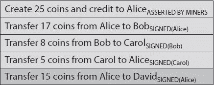
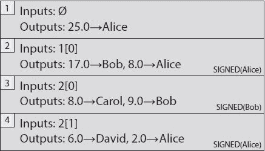
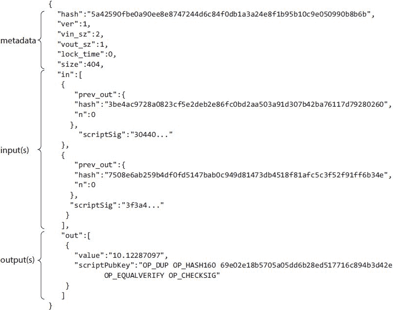
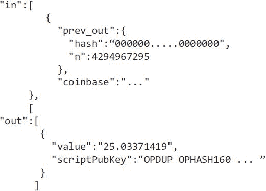
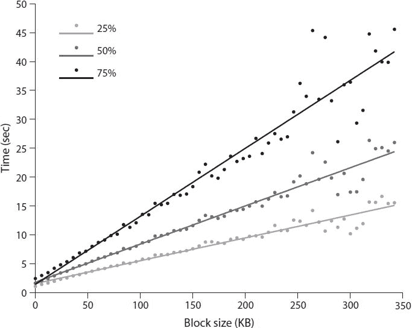
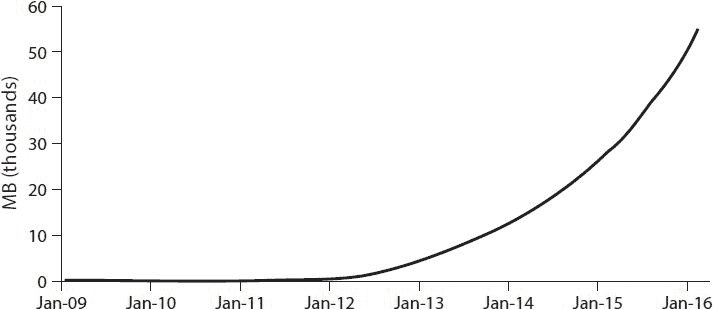

# 三、比特币的机制

这一章是关于比特币的机制。尽管前两章的讨论相对笼统，但我们现在要深入细节。我们将着眼于真实的数据结构、真实的脚本，并以精确的方式学习比特币的细节和语言，以建立本书剩余部分的讨论。这一章很有挑战性，因为它是面向细节的，我们涵盖了很多领域。你将了解比特币的特性和古怪之处。

回顾一下我们在第二章中离开的地方，比特币共识机制给了我们一个只附加的分类账，一个我们只能写入的数据结构。一旦数据写入其中，它将永远存在。分散式协议建立了关于分类账价值的共识，矿工使用该协议并验证交易。该协议和矿工一起确保交易形式良好，所涉及的比特币尚未被花掉，并且分类账和网络可以像货币一样运作。与此同时，我们假设存在一种货币来激励这些矿工。在这一章中，我们将详细探讨这种货币是如何被设计来激励矿工的，正是他们让整个过程得以实现。

**3.1。比特币交易**

让我们从交易开始，比特币的基本组成部分。我们暂时使用一个分类账的简化模型。让我们假设单独的交易被一次一个地添加到分类账中，而不是块。

我们怎样才能在这样一个分类账的基础上建立一种货币呢？你可能想到的第一个模型，实际上是许多人对比特币工作方式的心理模型，是一个基于账户的系统。您可以添加一些交易，创造新的硬币，并将其贷记给某人。然后你可以转移硬币。交易类似于“将 17 枚硬币从爱丽丝那里转移给鲍勃”，并且由爱丽丝签名。这是分类账中关于交易的所有信息。在[图 3.1](part0009.html#fig3_1) 中，Alice 在第一次交易中收到 25 个硬币，然后在第二次交易中向 Bob 转账 17 个硬币后，她的账户中还剩 8 个比特币。

这种方式的缺点是，任何想要确定交易是否有效的人都必须跟踪这些账户余额。再看一下[图 3.1](part0009.html#fig3_1) 。爱丽丝有她想转给大卫的 15 个硬币吗？为了弄清楚这一点，您必须及时跟踪影响 Alice 的每一笔交易，以确定当她试图向 David 转账 15 个硬币时，她的净余额是否大于 15 个硬币。当然，我们可以使用一些在每次交易后跟踪 Alice 的余额的数据结构来提高效率。但是除了账本本身之外，这还需要很多额外的管理工作。



图 3.1。基于账户的分类账。

由于这些缺点，比特币不使用基于账户的模型。相反，比特币使用一个只是记录交易的分类账，类似于[第 1.5 节](part0007.html#sec1_5)中的 Scroogecoin。

事务指定了一些输入和一些输出(回想一下 Scroogecoin 中的 PayCoins)。您可以将输入视为正在消费的硬币(在之前的交易中创建)，将输出视为正在创建的硬币。对于铸造新货币的交易，没有消耗硬币(回想一下 Scroogecoin 中的 CreateCoins)。每个交易都有一个唯一的标识符。输出的索引从 0 开始，因此我们将第一个输出称为“输出 0”

现在让我们来看一下[图 3.2](part0009.html#fig3_2) 。交易 1 没有输入，因为这个交易正在创造新的硬币，它有 25 个硬币输出给爱丽丝。此外，由于这是一个创造新硬币的交易，所以不需要签名。现在假设爱丽丝想把这些硬币中的一些寄给鲍勃。为此，她创建了一个新的事务，在我们的示例中是事务 2。在交易中，她必须明确指出这些硬币是从哪里来的。在这里，她指的是事务 1 的输出 0(实际上是事务 1 的唯一输出)，它给爱丽丝分配了 25 个比特币。她还必须在事务中指定输出地址。在这个例子中，Alice 指定了两个输出，Bob 17 个硬币，Alice 8 个硬币。当然，交易的全部内容都由 Alice 签名，这样我们就知道 Alice 实际上授权了它。

*更改地址*。为什么在这个例子中爱丽丝必须给自己寄钱？就像 Scroogecoin 中的硬币是不可变的一样，在比特币中，要么一个交易输出的全部，要么没有，必须被另一个交易消耗。Alice 只想付给 Bob 17 个比特币，但是她拥有的输出值 25 个比特币。所以她需要创建一个新的输出，其中 8 个比特币被送回给自己。这个地址可能与拥有 25 枚比特币的不同，但必须是她的。这叫做*改变地址*。



图 3.2。基于交易的分类账。这是比特币使用的账本类型。

*高效验证*。当一个新的交易被添加到分类账中时，检查它是否有效有多容易？在这个例子中，我们需要查找 Alice 引用的交易输出，确保它的值为 25 个比特币，并且还没有被花掉。查找事务输出很容易，因为我们使用的是散列指针。为了确保它没有被花掉，我们需要扫描被引用的事务和最新块之间的区块链。我们不需要一直回到区块链的起点，也不需要保存任何额外的数据结构(尽管，正如我们将看到的，额外的数据结构会加快速度)。

*整合资金*。与 Scroogecoin 一样，由于事务可以有许多输入和输出，因此拆分和合并值很容易。例如，假设鲍勃在两次不同的交易中收到了钱——一次 17 个比特币，另一次 2 个。Bob 可能希望以后有一个可用的交易输出，这样他就可以花掉他控制的所有 19 个比特币。这很简单——他使用两个输入和一个输出创建了一个事务，输出地址是他自己的地址。这样他就可以合并这两笔交易。

*联合支付*。同样，联合支付也很容易做到。假设卡罗尔和鲍勃都想付钱给大卫。他们可以创建一个有两个输入和一个输出的事务，但是这两个输入归两个不同的人所有。与前一个示例的唯一区别是，由于这里声明的前一个事务的两个输出来自不同的地址，所以该事务需要两个单独的签名—一个由 Carol 签名，另一个由 Bob 签名。

*交易语法*。从概念上讲，这就是比特币交易的全部内容。现在让我们看看它在比特币中是如何被低水平地表现出来的。最终，网络上发送的每个数据结构都是一串位。[图 3.3](part0009.html#fig3_3) 中显示的是低级的，但这被进一步编译成不可读的紧凑二进制格式。

正如您在[图 3.3](part0009.html#fig3_3) 中看到的，一个事务由三部分组成:一些元数据、一系列输入和一系列输出:



图 3.3。真实比特币交易的内容。

*元数据*。存在一些内务管理信息—事务的大小、输入的数量和输出的数量。提供整个事务的散列，作为事务的唯一 ID。这就是允许我们使用散列指针来引用事务的原因。并且提供了一个 lock_time 字段，我们稍后将回到这个字段。

*输入*。事务输入形成一个数组，每个输入具有相同的形式。一个输入指定了一个先前的事务，所以它包含了那个事务的散列，这个散列充当了指向它的散列指针。该输入还包含正在申请的前一个事务的输出的索引。然后有一个签名。请记住，我们必须签名，以表明我们实际上有能力要求那些以前的事务输出。

*输出*。输出也是一个数组。每个输出只有两个字段。它们每个都有一个值，所有输出值的总和必须小于或等于所有输入值的总和。如果输出值之和小于输入值之和，差额就是交易费，由发布该交易的矿商支付。

然后有一个有趣的行，看起来像我们想要的收件人地址。每个输出都应该被发送到一个特定的公钥，事实上，在那个字段中有些东西看起来像是一个公钥的散列。但是还有其他看起来像一组命令的信息。事实上，这个字段是一个脚本，我们接下来将讨论脚本。

**3.2。比特币脚本**

每个事务输出不仅仅指定一个公钥。它实际上指定了一个脚本。什么是脚本，我们为什么要使用它们？在本节中，我们将学习比特币脚本语言，并开始理解为什么使用脚本而不是简单地分配公钥。

比特币中最常见的交易类型是通过用正确的密钥签名来赎回之前的交易输出。在这种情况下，我们希望事务输出指定，“这可以通过来自地址 x 的所有者的签名来兑现。”回想一下，地址是公钥的散列。所以仅仅指定地址 X 并不能告诉我们什么是公钥，也不能给我们一个检查签名的方法！因此，事务输出必须声明:“这可以通过散列到 X 的公钥以及该公钥所有者的签名来赎回。”正如我们将看到的，这正是比特币中最常见的脚本类型所指定的([图 3.4](part0009.html#fig3_4) )。

但是这个脚本会发生什么呢？谁在运行它，这个指令序列是如何执行上述语句的？秘密在于输入也包含脚本而不是签名。为了确认一个事务正确地赎回了以前的事务输出，我们将新事务的输入脚本和以前事务的输出脚本结合起来。我们只是将它们连接起来，结果脚本必须成功运行，事务才能有效。这两个脚本是 *scriptPubKey* 和 *scriptSig* ，因为在最简单的情况下，输出脚本只指定一个公钥(或者公钥哈希到的地址)，输入脚本指定一个带有该公钥的签名。组合后的脚本可以在[图 3.5](part0009.html#fig3_5) 中看到。

比特币脚本语言

该脚本语言是专门为比特币构建的，只是被称为“脚本”或“比特币脚本语言”它与名为“Forth”的语言有许多相似之处，Forth 是一种古老、简单、基于堆栈的编程语言。但是你不需要理解 Forth 来理解比特币脚本。Script 的主要设计目标是简单紧凑，同时具有对加密操作的本地支持。因此，举例来说，有特殊用途的指令来计算散列函数，并计算和验证签名。


图 3.4。示例 Pay-to-PubkeyHash 脚本，比特币中最常见的输出脚本类型。


图 3.5。结合 scriptPubKey 和 scriptSig。为了检查事务是否正确地赎回了输出，我们通过将被引用的输出事务的 scriptPubKey(底部)附加到赎回事务的 scriptSig(顶部)来创建一个组合脚本。请注意<pubkeyhash>包含一个“？."我们使用这个符号来表示我们将在以后进行检查，以确认它是否等于赎回脚本中提供的公钥的散列。</pubkeyhash>

脚本语言是基于堆栈的。这意味着每条指令都以线性方式执行一次。特别是比特币脚本语言中没有循环。因此，脚本中的指令数量为我们提供了一个上限，它可以运行多长时间，可以使用多少内存。这种语言不是图灵完备的，这意味着它不具备计算任意强大函数的能力。这是故意的——矿工必须运行这些脚本，这些脚本是由网络中的任意参与者提交的。他们不应该有权力提交一个可能有无限循环的脚本。

当执行比特币脚本时，只有两种可能的结果。它要么成功执行，没有错误，在这种情况下，事务是有效的。或者，如果脚本执行过程中出现任何错误，整个交易都将无效，并且不会被区块链接受。

比特币脚本语言非常小。只有 256 条指令的空间，因为每条指令都用一个字节表示。在这 256 人中，15 人目前已被禁用，75 人被保留。保留的指令代码还没有被赋予任何特定的含义，但可能用于以后添加的指令。

许多基本指令是你在任何编程语言中都会想到的。有基本的算术、基本的逻辑(例如，“if”和“then”语句)、抛出错误、不抛出错误和提前返回。最后，还有加密指令，包括哈希函数、签名验证指令，以及一个特殊而重要的指令，名为 CHECKMULTISIG ，让您用一个指令检查多个签名。[表 3.1](part0009.html#tab3_1) 列出了比特币脚本语言中一些最常见的指令。

CHECKMULTISIG 指令需要指定 *n 个*公钥和一个阈值参数 *t* 。为了成功执行该指令，这些公钥中的 *n* 个 *t* 的至少 *t* 个签名必须存在并且有效。我们将在[第 3.3 节](part0009.html#sec3_3)中展示一些多重签名使用的例子，但是很明显这是一个非常强大的原语。我们可以用它来简洁地表达这样一个概念，即 *n* 个指定实体中的 *t* 个实体必须签名才能使交易有效。

表 3.1。常见脚本指令及其功能

| 名字 | 功能 |
| OP_DUP | 复制栈顶项目。 |
| OP_HASH160 | 哈希两次:第一次使用 SHA-256，然后是另一个名为 RIPEMD-160 的哈希函数。 |
| OP _ equal 验证 | 如果输入相等，则返回 true。如果不相等，则返回 false 并将事务标记为无效。 |
| OP_CHECKSIG | 使用当前事务哈希的输入公钥检查输入签名是否有效。 |
| OP_CHECKMULTISIG | 检查事务上的 *t* 签名是否是来自指定公钥的 *t* 的有效签名。 |

顺便说一下，多重签名实现中有一个 bug。 CHECKMULTISIG 指令从堆栈中弹出一个额外的数据值并忽略它。这只是比特币语言的一个怪癖，人们必须通过在堆栈上放置一个额外的虚拟变量来处理它。正如我们在[第 3.6 节](part0009.html#sec3_6)中所讨论的，错误存在于最初的实现中，修复它的成本远远高于它所造成的损害。在这一点上，这个缺陷被认为是比特币的一个特征，因为它不会消失。

执行脚本

要在基于堆栈的编程语言中执行脚本，我们需要的只是一个堆栈，我们可以将数据推入堆栈或从中取出数据。我们不需要任何其他的内存或变量。这就是语言计算如此简单的原因。指令有两种类型:数据指令和操作码。当数据指令出现在脚本中时，该数据被简单地推到堆栈的顶部。相反，操作码执行一些功能，通常在栈顶作为输入数据。

现在我们来看看[图 3.5](part0009.html#fig3_5) 中的比特币脚本是如何执行的。参见[图 3.6](part0009.html#fig3_6) ，图中显示了每条指令后堆栈的状态。该脚本中的前两条指令是数据指令—签名和用于验证该签名的公钥—在赎回交易的交易输入的 scriptSig 组件中指定。如前所述，数据指令被压入堆栈。脚本的其余部分是在被引用事务的事务输出的 scriptPubKey 组件中指定的。

首先，我们有一个重复的指令，OP_DUP，所以我们只是把一个公钥的副本推到堆栈的顶部。下一条指令是 OP_HASH160，它告诉我们弹出栈顶值，计算它的加密散列，并将结果推送到栈顶。当这条指令执行完毕时，我们已经用它的散列替换了栈顶的公钥。


图 3.6。比特币脚本的执行。在底部，我们显示了脚本中的指令。数据指令用尖括号表示，而操作码以“OP_”开始。在顶部，我们显示了在其下列出的指令执行之后的堆栈。

接下来，我们再将数据推送到堆栈上。回想一下，该数据是由引用事务的发送方指定的。它是发送者指定的公钥的散列；必须使用相应的私钥来生成签名以兑换这些硬币。此时，堆栈顶部有两个值:公钥散列(由发送者指定)和接收者在尝试认领硬币时使用的公钥散列。

此时，EQUALVERIFY 命令执行，它检查堆栈顶部的两个值是否相等。如果不是，就会抛出一个错误，脚本停止执行。但是在我们的例子中，我们假设它们是相等的。也就是说，硬币的接收者使用了正确的公钥。该指令将使用堆栈顶部的两个数据项，现在堆栈包含两个项目—签名和公钥。

我们已经检查了这个公钥实际上是被引用的事务指定的公钥，现在我们必须检查签名是否有效。这是一个很好的例子，说明比特币脚本语言是如何在考虑加密的情况下构建的。尽管就逻辑而言，它是一种相当简单的语言，但它有一些非常强大的指令，比如 OP_CHECKSIG。这条指令既从堆栈中弹出这两个值，又进行完整的签名验证。

但这是什么的标志呢？签名函数的输入是什么？事实证明，在比特币中，你只能签署一件东西——一整笔交易。因此，CHECKSIG 指令从堆栈中弹出两个值(公钥和签名),并使用该公钥验证签名对于整个事务是否有效。现在我们已经执行了脚本中的每一条指令，没有任何东西留在堆栈上。如果没有发生错误，这个脚本的输出将只是 true，表明事务是有效的。

实践中使用了什么

理论上，脚本让我们指定，在某种意义上，任意的条件，必须满足消费硬币。但截至 2015 年，这种灵活性并没有得到很好的利用。如果我们看看比特币历史上实际使用的脚本，几乎所有脚本都与我们示例中使用的脚本相同。这个脚本只指定了一个公钥，并要求该公钥的签名来支付硬币。

还使用了其他一些指令。MULTISIG 用得很少，它是一种特殊类型的脚本，我们很快会讨论它。但是除此之外，使用的脚本没有太多的多样性。这是因为默认情况下，比特币节点有一个标准脚本的白名单，它们拒绝接受不在名单上的脚本。这并不意味着那些脚本根本不能用；这只会让它们更难使用。事实上，这种区别是一个微妙的点，我们在讨论比特币对等网络时会回到这一点。

燃烧证明

刻录证明是一个永远无法挽回的剧本。将硬币发送到燃烧证明脚本中，表明它们已经被销毁，因为它们不可能被花掉。burn proof 的一个用途是通过强迫人们销毁比特币来获得新系统中的硬币，从而引导比特币的替代品。我们将在第 10 章中详细讨论这种用法。burn 的证明实现起来非常简单:OP_RETURN 操作码一旦到达就会抛出一个错误。无论您在 OP_RETURN 之前输入什么值，该指令最终都会被执行，在这种情况下，该脚本将返回 false。

因为抛出了错误，所以不会处理 OP_RETURN 之后的脚本中的数据。因此，这是用户将任意数据放入脚本，进而放入区块链的机会。如果出于某种原因，你想写自己的名字，或者你想打上时间戳，证明你在特定时间知道一些数据，你可以创建一个低价值的比特币交易。你可以销毁非常少量的货币，但随后你可以将任何你想要的东西写入区块链，这些东西应该在比特币系统的生命周期内保留。

付费脚本哈希

比特币脚本工作方式的一个后果是，硬币的发送者必须准确指定脚本。但这有时可能是一种非常奇怪的做事方式。例如，假设你正在网上购物，你准备订购一些东西并准备付款。你询问你的硬币应该被送到的地址。现在假设你订购的公司使用多重地址。然后，由于花硬币的人必须说明这一点，零售商对你说，“哦，好吧，我们现在正在做一些花哨的东西。我们用的是 MULTISIG。将硬币发送到一些复杂的脚本中。”你可能会说，“我不知道怎么做。那太复杂了。作为消费者，我只想寄到一个简单的地址。”

比特币对这个问题有一个聪明的解决方案，它不仅适用于多重签名地址，还适用于任何控制何时可以花费硬币的复杂条件。接收者可以告诉发送者“将你的硬币发送到这个公钥的散列中”，而不是告诉发送者“将你的硬币发送到这个*脚本*的散列中”。强加的条件是，要兑换这些硬币，必须显示具有给定散列的脚本，并进一步提供将使脚本评估为真的数据。”发送方通过使用 Pay-to-Script-Hash (P2SH)事务类型来实现这一点，该事务类型具有上述语义。

具体来说，P2SH 脚本只是对栈顶值进行散列，检查它是否与提供的散列值匹配，然后执行第二步特殊的验证:栈顶数据值被重新解释为一系列指令，并作为脚本第二次执行，栈的其余部分作为输入。

获得对 P2SH 的支持相当复杂，因为它不是比特币最初设计规范的一部分。是事后加的。这可能是比特币最初规范后添加的最显著的功能。它解决了几个重要的问题。它消除了发送方复杂响应的需要，因为接收方只需指定发送方向其汇款的哈希值。在我们上面的例子中，Alice 不需要担心 Bob 正在使用 MULTISIG 她只是发送到 Bob 的 P2SH 地址，Bob 有责任在他要兑换硬币时指定花式脚本。

P2SH 也有很好的效率增益。矿工必须跟踪尚未兑现的输出脚本集，使用 P2SH 输出，输出脚本现在要小得多，因为它们只指定了一个散列。所有的复杂性都推给了输入脚本。

**3.3。比特币脚本的应用**

现在，您已经了解了比特币脚本的工作原理，让我们来看看使用这种脚本语言可以实现的一些强大的应用程序。事实证明，我们可以做许多巧妙的事情来证明使用脚本语言的复杂性，而不仅仅是指定公钥。

托管交易

假设 Alice 和 Bob 想要彼此做生意—Alice 想要用比特币支付 Bob，以便 Bob 向 Alice 发送一些实物。问题是 Alice 在收到货物之前不想付款，但是 Bob 在收到付款之前不想发货。对此我们能做些什么？比特币的一个很好的解决方案是引入第三方，使用托管交易。

使用 MULTISIG 可以非常简单地实现托管交易。Alice 并不直接将钱寄给 Bob，而是创建了一个 MULTISIG 交易，需要三个人中的两个人签名才能兑换硬币。这三个人将是爱丽丝、鲍勃和某个第三方仲裁人朱迪，他们将在出现任何争议时发挥作用。因此，Alice 创建了一个 3 选 2 的 MULTISIG 交易，该交易发送了一些她拥有的硬币，并指定如果 Alice、Bob 和 Judy 中的任意两人签名，就可以使用这些硬币。该交易包含在区块链中，此时，这些硬币由 Alice、Bob 和 Judy 保管，这样他们中的任何两个人都可以指定硬币应该放在哪里。此时，Bob 确信将货物发送给 Alice 是安全的，因此他将邮寄或亲自交付货物。在正常情况下，爱丽丝和鲍勃都是诚实的。因此，Bob 将发送 Alice 期待的货物，当 Alice 收到货物时，Alice 和 Bob 都签署一项交易，从托管中赎回资金并将其发送给 Bob。请注意，在这种情况下，爱丽丝和鲍勃都是诚实的，朱迪从来没有参与进来。没有争议，Alice 和 Bob 的签名符合 MULTISIG 交易的 3 选 2 要求。所以在正常情况下，这并不比 Alice 直接把钱寄给 Bob 的效率低多少。它只需要在区块链上进行一次额外的交易。

但是，如果鲍勃没有真正发送货物，或者货物在邮寄过程中丢失了，会发生什么呢？或者货物不是爱丽丝订购的？爱丽丝现在不想付钱给鲍勃，因为她认为她被骗了，她想要回她的钱。因此，爱丽丝肯定不会签署一项交易，把钱交给鲍勃。但是 Bob 可能会否认有任何不当行为，并拒绝签署将钱返还给 Alice 的交易。这是朱迪需要参与的时候。朱迪必须决定这两个人中谁应该得到这笔钱。如果 Judy 认定 Bob 作弊，Judy 将愿意与 Alice 一起签署一项交易，将托管的钱返还给 Alice。Alice 和 Judy 的签名符合 MULTISIG 交易的 3 选 2 要求，Alice 将拿回她的钱。当然，如果 Judy 认为 Alice 在这里有错，而 Alice 只是拒绝支付她应该支付的款项，Judy 可以与 Bob 一起签署交易，将钱寄给 Bob。所以朱迪在两种可能的结果中做出选择。但这种方法的好处是，除非发生纠纷，否则她不必卷入其中。

绿色地址

另一个很酷的应用是所谓的绿色地址。假设爱丽丝想付钱给鲍勃，而鲍勃离线了。由于 Bob 处于脱机状态，因此他无法查看区块链来查看 Alice 发送的事务是否存在。也有可能 Bob 在线，但没有时间查看区块链并等待交易被确认。请记住，通常情况下，我们希望交易发生在区块链，并经过六个街区的确认，这需要长达一个小时的时间，然后我们才会相信交易真的发生在区块链。但是对于一些商品，比如食物，鲍勃不能在送货前等一个小时。如果鲍勃是一个卖热狗的街头小贩，爱丽丝不太可能等上一个小时才拿到食物。或者可能由于某些其他原因，Bob 没有任何到互联网的连接，因此不能检查区块链。

为了解决使用比特币汇款而不需要接收者访问区块链的问题，我们必须引入另一个第三方，我们称之为银行(实际上它可以是交易所或任何其他金融中介)。爱丽丝对她的银行说:“嘿，是我，爱丽丝。我是你的忠实顾客。这是我的卡或身份证明。我真的很想在这里付钱给鲍勃，你能帮我吗？”而银行回答“当然。我要从你的账户中扣除一些钱。并起草一份交易从我的一个绿色地址转账给鲍勃。”

请注意，这笔钱是直接从银行汇给 Bob 的。当然，一部分钱可能在银行的变更地址里。但本质上，银行是从银行控制的地址向 Bob 付款的，我们称之为“绿色地址”而且，银行保证不会重复花这笔钱。因此，一旦鲍勃看到这笔交易是由银行签署的，如果他相信银行保证不会重复花费这笔钱，他就可以接受这笔钱最终将是他的，当它在区块链得到确认时。

这是真实世界的保证，不是比特币强制保证。为了让这个系统工作，Bob 必须相信，在现实世界中，银行关心自己的声誉，因此不会重复支出。银行会说，“你可以看看我的历史。我用这个绿色地址很久了，从来没有双花过。因此，我将来不太可能这样做。”因此，鲍勃不必再相信爱丽丝，因为他可能对她一无所知。相反，他相信银行不会重复花掉寄给他的钱。

当然，如果银行真的重复支出，人们将不再相信它的绿色地址。事实上，实现绿色地址的两个最著名的在线服务是 Instawallet 和 Mt. Gox，它们都以倒闭告终。如今，绿色地址已经不常使用了。当这个想法第一次被提出时，它作为一种更快速且无需访问区块链的支付方式引起了很大的兴奋。然而，现在人们对这个想法变得相当紧张，担心它对银行过于信任。

高效的小额支付

比特币脚本的第三个例子是让微支付变得高效的例子。假设 Alice 是一个客户，他想为 Bob 提供的服务不断地支付少量的钱。例如，Bob 可能是 Alice 的无线服务提供商，他要求 Alice 为她打电话的每分钟支付少量费用。

为爱丽丝打电话的每一分钟创建一个比特币交易是行不通的。那样会产生太多的交易，交易费用加起来。如果每笔交易的价值与交易费相当，Alice 将为此支付相当高的成本。

我们希望最终将所有这些小额付款合并成一笔大额付款。事实证明，有一种简单的方法可以做到这一点。我们从一个 MULTISIG 交易开始，该交易支付 Alice 将需要花费的最大金额到一个要求 Alice 和 Bob 签名以释放硬币的输出。现在，在 Alice 使用该服务的第一分钟后(或她第一次需要进行小额支付时)，她签署了一项交易，使用发送到 MULTISIG 地址的硬币，向 Bob 发送一个支付单位，并将剩余部分返回给 Alice。在使用该服务的下一分钟后，Alice 签署了另一项交易，这一次向 Bob 支付了两个单位，并将剩余的发送给自己。请注意，这些只有爱丽丝签名，还没有鲍勃签名，也没有发布到区块链。Alice 在使用服务的每一分钟都会向 Bob 发送这些交易。最终，Alice 将使用完该服务，并告诉 Bob:“我完成了，请切断我的服务。”此时，Alice 将停止签署额外的交易。听到这个消息，Bob 将断开她的服务，签署 Alice 发送的最后一个事务，并将其发布到区块链。

因为每笔交易都多付给鲍勃一点钱，少付给爱丽丝一点钱，所以鲍勃赎回的最后一笔交易全额支付了他所提供的服务，并将剩余的钱返还给爱丽丝。爱丽丝一路上签署的所有交易都不会到达区块链。鲍勃不需要在上面签名。它们会被丢弃。

从技术上讲，所有这些中间交易都是双重支出。因此，与绿色地址的情况不同，在绿色地址的情况下，我们特别试图通过使用强有力的保证来避免双重花费，使用这种微支付协议，我们实际上正在产生大量潜在的双重花费。然而，在实践中，如果双方都正常操作，鲍勃将永远不会签署任何交易，但最后一个，在这种情况下，区块链不会检测到任何双重花费的企图。

还有一个棘手的细节:如果 Bob 从未在最后一笔交易上签字怎么办？他可能只是说，“我很高兴让硬币永远留在那里，”在这种情况下，也许硬币不会移动，但爱丽丝会失去她开始时支付的全部价值。有一个非常聪明的方法可以避免这个问题，那就是使用我们之前简单提到过的一个特性，现在我们来解释一下。

锁定时间

为了避免这个问题，在微支付协议开始之前，Alice 和 Bob 都将签署一项交易，将 Alice 的所有钱退还给她，但是退款被“锁定”到将来的某个时间。因此，在 Alice 签字之后，但在她广播第一笔将其资金存入托管账户的 MULTISIG 交易之前，她会希望从 Bob 那里获得这笔退款交易并持有它。这保证了如果她坚持到时间 *t* 并且 Bob 没有签署 Alice 发送的任何小额交易，Alice 可以发布该交易，这将直接退款给她。

退款锁定到时间 *t* 是什么意思？回想一下，比特币交易中的元数据包括一个 lock_time 参数，这个参数在[3.2 节](part0009.html#sec3_2)中没有解释。如果为锁时间指定非零值，它会告诉挖掘器在指定时间之前不要发布事务。在特定的块号之前，交易将是无效的。因此，这是一种准备只能在未来某个时间使用的交易的方式——前提是它试图使用的硬币在那个时候还没有在其他交易中使用。在微支付协议中，它很好地发挥了安全阀的作用，让爱丽丝放心，如果鲍勃永远不签名，最终她将能够拿回她的钱。

这些例子展示了我们可以用比特币脚本做的一些巧妙的事情。我们讨论了三个简单而实用的例子，但也研究了许多其他例子。其中之一是多人彩票，这是一个复杂的多步骤协议，其中许多交易具有不同的锁定时间和 escrows，以防人们作弊。一些简洁的协议使用比特币脚本语言，允许不同的人以一种很难追踪谁拥有哪个硬币的方式组合他们的硬币。我们将在第 6 章中详细讨论该协议。

智能合同

类似于本节中讨论的合同的通用术语是“智能合同”我们在比特币中对这些合同进行了某种程度的技术强制执行，而传统上它们是通过法律或仲裁法庭来执行的。比特币的一个非常酷的特性是，我们可以使用脚本、挖掘器和交易验证来实现托管协议或微支付协议，而无需求助于中央权威机构。

对智能合约的研究远远超出了本节讨论的应用。有许多类型的智能合约人们想要执行，但目前比特币脚本语言不支持它们。或者至少，没有人想出一个创造性的方法来实现它们。正如我们所见，只要有一点创造力，你就可以用目前的比特币脚本做很多事情。

**3.4。比特币区块**

到目前为止，在这一章中，我们已经看到了个人交易是如何构建和赎回的。但是如第 2 章中的[所述，事务被分组到块中。这是为什么呢？基本上，将它们分组是一种优化。如果矿商必须就每笔交易单独达成共识，系统接受新交易的比率将会低得多。此外，块的散列链比事务的散列链要短得多，因为大量事务可以放入每个块中。这使得验证区块链数据结构更加有效。](part0008.html#7K4G0-ea268daff50b4c55a00d858ef79f4a6c)

区块链是两种不同的基于散列的数据结构的巧妙结合。第一个是块的散列链。每个块都有一个块头、一个指向某些事务数据的散列指针和一个指向序列中前一个块的散列指针。第二数据结构是包含在该块中的所有事务的每块树。这种结构是一棵 Merkle 树，允许我们对块中的所有事务进行有效的摘要。如[第 1 章](part0007.html#6LJU0-ea268daff50b4c55a00d858ef79f4a6c)所述，为了证明一个事务包含在一个特定的块中，我们可以提供一条通过树的路径，其长度是该块中事务数的对数。概括地说，一个块由标题数据组成，其后是一个树形结构的交易列表([图 3.7](part0009.html#fig3_7) )。

标题主要包含与挖矿难题相关的信息，我们在第 2 章中[简要讨论了这些信息，并在第 5 章](part0008.html#7K4G0-ea268daff50b4c55a00d858ef79f4a6c)中[再次讨论。回想一下，为了使块有效，块头的散列必须以大量的零开始。报头还包含一个挖掘者可以更改的 nonce、一个时间戳和一些位(表明这个块有多难找到)。在挖掘过程中，仅对标头进行哈希处理。因此，要验证一个块链，我们需要做的就是查看头部。报头中包含的唯一事务数据是事务树的根 mrkl _ root 字段。](part0011.html#AFM60-ea268daff50b4c55a00d858ef79f4a6c)


图 3.7。比特币区块链。比特币区块链包含两种不同的哈希结构。第一个是块的散列链，它将不同的块相互链接起来。第二个是每个块内部的，是块中事务的 Merkle 树。

关于块的另一个有趣的事情是，它们在 Merkle 树中有一个特殊的事务，叫做 *coinbase 事务* ( [图 3.8](part0009.html#fig3_8) )。这类似于在 Scroogecoin 中创建硬币。随着这种交易，新的硬币在比特币中产生。它在几个方面不同于普通交易:

1.它总是有一个输入和一个输出。

2.输入不兑换以前的输出，因此包含一个空散列指针，因为交易是铸造新的比特币，而不是花费现有的比特币。

3.目前的产值是 25 BTC 多一点。产值是矿工从该区块获得的收入。这一收入由两部分组成:由系统设定的每 210 000 个区块(约 4 年)减半的统一挖矿奖励，以及从区块中的每笔交易中收取的交易费。

4.它有一个特殊的“coinbase”参数，这个参数完全是任意的——矿工可以在里面放任何他们想要的东西。



图 3.8。比特币基地交易。coinbase 交易创建新硬币。它不恢复先前的输出，并且有一个空散列指针来指示这一点。它有一个 coinbase 参数，可以包含任意数据。coinbase 交易的价值是块奖励加上块中包含的所有交易费用。

众所周知，在有史以来从比特币中挖掘出的第一个区块中，coinbase 参数引用了伦敦*泰晤士报*上的一篇报道，内容涉及财政大臣救助银行。这一提法被解读为对启动比特币动机的政治评论。这也是一种证据，证明第一个区块是在 2009 年 1 月 3 日报道出来后开采的。coinbase 参数的一种使用方式是表示矿工对不同新特性的支持。

熟悉块格式和交易格式的最好方法是亲自探索区块链。许多网站都可以访问这些数据，如[区块链. info](http://blockchain.info) 。您可以查看事务图，了解哪些事务兑现了哪些其他事务，查找具有复杂脚本的事务，并检查块结构，了解块如何引用其他块。由于区块链是一种公共数据结构，开发人员构建了漂亮的包装器来图形化地探索它。

3.5**。比特币网络**

到目前为止，我们已经讨论了参与者发布交易并将其插入区块链的能力，就好像这是通过魔法实现的一样。事实上，这是通过比特币网络实现的，这是一个点对点网络，继承了其他点对点网络的许多想法，这些想法被提出用于各种其他目的。在比特币网络中，所有节点都是平等的。没有层次结构，没有特殊节点或主节点。它运行在 TCP 之上，具有随机拓扑，其中每个节点与其他随机节点对等。新节点可以随时加入。事实上，今天你可以下载一个比特币客户端，将你的电脑作为一个节点旋转，它将拥有与比特币网络上所有其他节点同等的权利和能力。

网络会随着时间的推移而变化，并且非常动态，因为节点会进入和离开它。没有明确的方法离开网络。相反，如果一个节点在一段时间内没有活动——3 小时是硬编码到公共客户端中的持续时间——其他节点会开始忘记它。通过这种方式，网络可以优雅地处理离线节点。

回想一下，节点连接到随机对等点，不存在任何类型的地理拓扑。假设您启动了一个新节点，并希望加入网络。您首先向一个您知道的节点发送一条简单的消息。这通常被称为您的*种子节点*，并且有几种不同的方法可以查找种子节点列表以尝试连接。你发送一条特别的信息，说，“告诉我你所知道的网络中所有其他节点的地址。”您可以对所了解的新节点重复该过程，次数不限。然后，你可以选择与哪些人进行对等交流，你将成为比特币网络中功能齐全的一员。几个初始化步骤都是随机的，理想的结果是你看到的是一组随机的节点。要加入网络，您只需知道如何联系已经在网络上的一个节点。

网络有什么用？当然是为了维护区块链。因此，要发布一项交易，我们希望整个网络都能听到。这是通过一个简单的*泛洪*算法实现的，有时被称为*八卦协议*。如果 Alice 想付给 Bob 一些钱，她的客户端创建并且她的节点将这个事务发送给它对等的所有节点。这些节点中的每一个都执行一系列检查来确定是否接受和中继事务。如果检查通过，接受节点再把它发送给所有的对等节点。听到某个事务的节点将其放入一个它们已经听说过但尚未在区块链上的事务池中。如果一个节点听到一个已经在其池中的事务，它不会进一步广播它。这确保了泛洪协议终止，并且事务不会永远在网络上循环。请记住，每个事务都是由它的散列唯一标识的，因此很容易在池中查找事务。

当节点听到一个新的事务时，它们如何决定是否应该传播它？有四张支票。第一个也是最重要的检查是交易验证—交易必须在当前区块链下有效。节点为每个先前被赎回的输出运行脚本，并确保脚本返回 true。其次，他们检查被赎回的产出还没有被花掉。第三，如前所述，它们不会转发已经看到的事务。第四，默认情况下，节点只接受和转发基于一个小的脚本白名单的标准脚本。

所有这些检查只是健全性检查。行为良好的节点都实现了这些，试图保持网络健康和正常运行，但没有规则说节点必须遵循这些特定的步骤。由于这是一个对等网络，任何人都可以加入，节点转发双重花费、非标准交易或完全无效交易的可能性总是存在的。这就是为什么每个节点都必须自己进行检查。

由于网络存在延迟，节点最终可能会拥有不同版本的挂起事务池。当试图进行双重消费时，这变得特别有趣和重要。假设爱丽丝试图向鲍勃和查理支付相同的比特币，她几乎同时发出了两笔交易。一些节点将首先听到 Alice → Bob 事务，而其他节点将首先听到 Alice → Charlie 事务。当一个节点听到任一事务时，它将该事务添加到它的事务池中。如果它稍后听到另一个，该节点将检测到双重花费。然后，节点会丢弃后一个事务，并且不会将其中继或添加到其事务池中。因此，节点会暂时不同意将哪些事务放入下一个块中。这被称为“竞争条件”

好消息是这种情况很容易处理。无论谁挖掘下一个块，都将打破平局，并决定这两个未决事务中的哪一个应该永久放入一个块中。假设 Alice → Charlie 事务进入了块。当具有 Alice → Bob 事务的节点听到这个阻塞时，它们将从它们的内存池中丢弃该事务，因为这是一个双重花费。当具有 Alice → Charlie 事务的节点听到这个块时，它们将从内存池中丢弃该事务，因为它已经在区块链中了。所以一旦这个块在网络中传播，就不会再有分歧了。

由于节点的默认行为是保留它们首先听到的内容，因此网络位置很重要。如果在网络中的两个不同位置宣布了两个冲突的事务或块，它们都开始在整个网络中泛滥；一个节点首先看到哪个事务将取决于它在网络中的位置。

当然，这假设每个节点都实现了这样的逻辑，即它首先保留它所听到的内容。但是没有中央权威机构强制执行这种行为，节点可以自由实现任何其他逻辑来选择保留哪些事务以及是否转发事务。我们将在第五章中更仔细地研究矿工激励。

到目前为止，我们主要讨论了事务的传播。当一个矿工发现一个新的块时，宣布这个新块的逻辑几乎与传播一个新的事务完全相同，并且服从相同的竞争条件。如果同时开采两个有效区块，则其中只有一个可以包含在长期共识链中。最终，这些块中的哪一个将被包括取决于其他节点构建在哪些块上，并且没有进入共识链的块将被孤立。

验证块比验证事务更复杂。除了验证标头并确保哈希值在可接受的范围内，节点还必须验证块中包含的每个事务。最后，一个节点将转发一个块，如果它建立在最长的分支上，基于它对区块链(实际上是一个块的树)看起来像什么的观点。这可以避免叉子堆积。但是就像事务一样，节点可以实现不同的逻辑——它们可能会中继无效的块或者基于区块链中较早点构建的块。后一个动作导致分叉，但是协议被设计为承受小的分叉。

**零确认交易和费用替代**

在第 2 章中，我们讨论了零确认交易，即一旦交易在网络上传播，接收者就接受交易。这不是为防止重复花费而设计的。但正如我们所见，在交易冲突的情况下，矿工的默认行为是首先包括他们收到的交易，这使得针对零确认交易的双重支出变得相当困难。因此，由于其便利性，零确认交易已经变得很普遍。

自 2013 年以来，一些参与者已经表现出对将默认政策改为*按费用替换*的兴趣，据此，如果节点听到包含更高费用的冲突交易，它们将替换它们池中的未决交易。至少从短期来看，这是矿商的理性行为，因为这确保了他们获得更好的报酬。然而，在实践中，费用替代将使针对零确认攻击的双重支出变得容易得多。

因此，替代收费引起了争议，既有技术问题，即在替代收费的世界中是否有可能防止或阻止双重支出，也有哲学问题，即比特币应该尽最大努力支持零确认，还是放弃零确认。我们不会在这里陷入长期的争议，但比特币最近采用了“选择加入”按费用替换，交易可以(使用序列号字段)将自己标记为有资格被更高费用的交易替换。

泛洪算法的延迟是多少？[图 3.9](part0009.html#fig3_9) 显示了新块传播到网络中每个节点的平均时间。这三条线显示了第 25、第 50 和第 75 百分位的块传播时间。如您所见，传播时间基本上与数据块的大小成正比。这是因为网络带宽是瓶颈。较大的数据块需要 30 多秒才能传播到网络中的大多数节点。所以这个协议不是特别有效。在互联网上，30 秒是一段相当长的时间。在比特币的设计中，拥有一个简单的网络，结构简单，节点平等，可以随时进出，比效率更重要。因此，一个数据块在到达网络中最远的节点之前，可能需要经过许多节点。如果网络从上到下设计以提高效率，它将确保任何两个节点之间的路径都是短的。

网络的规模

很难衡量这个网络有多大，因为它是动态的，没有中央权威。一些研究人员已经提出了尺寸估计。在高端，一些估计在给定的一个月内超过 100 万个 IP 地址将在某个点(至少暂时)充当比特币节点。相比之下，只有大约 5000 到 10000 个节点似乎是永久连接的，并完全验证它们听到的每一个事务。这可能看起来是一个令人惊讶的低数字，但截至 2015 年，没有证据表明完全验证节点的数量在上升，事实上可能在下降。



图 3.9。块传播时间。此图显示了一个块到达网络中不同百分比的节点所需的平均时间。资料来源:Yonatan Sompolinsky 和 Aviv Zohar，“加速比特币的交易处理”，2014 年。在 https://eprint.iacr.org/2013/881.pdf 有售。数据由 Yonatan Sompolinsky 和 Aviv Zohar 提供。

存储要求

完全验证节点必须保持永久连接，以便听到所有比特币交易。一个节点离线的时间越长，当它重新加入网络时，它必须做的工作就越多。这种节点还必须存储整个区块链，并需要良好的网络连接才能听到每一个新的事务，并将其转发给对等方。存储需求目前为数十千兆字节(参见[图 3.10](part0009.html#fig3_10) )，完全在一台商用台式机的能力范围内。

最后，完全验证节点必须维护整个未花费的事务输出集，这些输出是可用于花费的硬币。理想情况下，它应该存储在内存中，而不是磁盘上，这样在网络上听到一个新提议的事务时，节点可以快速查找它试图声明的事务输出，运行脚本，查看签名是否有效，并将事务添加到事务池中。截至 2014 年年中，区块链上的交易超过 4400 万笔，其中 1200 万笔未用。幸运的是，这仍然足够小，可以在一个有效的数据结构中容纳不到 1gb 的内存。



图 3.10。区块链的大小。完全验证节点必须存储整个区块链，截至 2015 年底，该数据超过 50gb。

轻量级节点

与完全验证节点相反，轻量级节点也称为“瘦”客户端或“简化支付验证”(SPV)客户端。事实上，比特币网络上几乎所有的节点都是轻量级节点。这些与完全验证节点不同，因为它们不存储整个区块链。他们只存储验证与他们相关的特定交易所需的部分。如果您使用钱包程序，它通常包含一个 SPV 节点。该节点下载代表向您的地址付款的块标题和事务处理。

SPV 节点不具备完全验证节点的安全级别。由于节点具有块头，它可以检查块是否难以挖掘，但是它不能检查块中包含的每个事务是否实际有效，因为它没有事务历史，也不知道未用完的事务输出集。SPV 节点只能验证实际影响它们的事务。因此，他们基本上相信完全验证节点已经验证了所有其他事务。这是一个不错的安全权衡。SPV 节点假设完全验证节点存在，并且正在做艰苦的工作，并且如果矿工不辞辛苦地开采这个块(这是一个非常昂贵的过程)，他们可能也会做一些验证，以确保该块不会被拒绝。

成为 SPV 节点的成本节约是巨大的。块头只有区块链的 1/1000 大小。所以不是存储几十千兆字节，而是只有几十兆字节。即使是智能手机也可以轻松充当比特币网络中的 SPV 节点。

由于比特币基于一个开放的协议，理想情况下，许多不同的实现会无缝地相互交互。这样，如果其中一个出现了严重的错误，也不太可能导致整个网络瘫痪。好消息是，该协议已经成功地从头开始重新实现。坏消息是，网络上的大多数节点都在运行 bitcoind 库，该库用 C++编写，并作为比特币核心的一部分进行维护，比特币的参考实现。

3.6**。局限性和改进**

在这里，我们讨论比特币协议的一些内在限制，以及为什么改进它们具有挑战性。许多约束被硬编码到比特币协议中。这些限制是在 2009 年比特币被提出时选择的，当时还没有人想到它可能会发展成为一种全球重要的货币。这些限制包括对每个块的平均时间、块的大小、块中签名操作的数量、货币的可分性、比特币的总数和块奖励结构的限制。

对现有比特币总数的限制，以及挖矿奖励的结构，很可能永远不会改变，因为改变它们的经济影响太大了。矿商和投资者在该系统上下了大赌注，他们认为比特币的奖励结构和有限的比特币供应将保持最初的计划。如果这种情况发生变化，将对一些个人产生重大的财务影响。因此，机构群体基本上同意，无论这些方面的选择是否明智，它们都不会改变。

一些其他的改变似乎会让每个人都变得更好，因为事后看来，一些最初的设计选择并不是最佳的。其中最主要的是影响系统吞吐量的限制。比特币网络每秒能处理多少笔交易？这种限制来自于块大小的硬编码限制。每个块被限制为一兆字节，或大约一百万字节。每个事务至少有 250 个字节。将 100 万除以 250，我们看到每个区块有 4000 次交易的限制，鉴于区块大约每 10 分钟被发现一次，我们每秒钟大约有 7 次交易，这是比特币网络能够处理的全部交易。看起来，改变这些限制只需要在某个地方的源代码文件中调整一个常量。然而，这种改变在实践中很难实现，原因将在本节后面讨论。

那么，与其他网络相比，每秒 7 个事务是什么样的呢？与任何主要信用卡处理器的吞吐量相比，这是相当低的。据称，Visa 的网络在全球平均每秒处理约 2000 笔交易，在繁忙时期每秒能够处理 1 万笔交易。甚至比 Visa 更新更小的 PayPal 在高峰时期也能每秒处理 100 笔交易。这比比特币所能管理的数量级还要多。

从长远来看，另一个潜在的问题是比特币加密算法的选择是固定的。只有几个哈希算法可用，并且只有一个签名算法可以使用——ECD sa，通过称为 secp256k1 的特定椭圆曲线(参见[第 1 章](part0007.html#6LJU0-ea268daff50b4c55a00d858ef79f4a6c))。有人担心，在比特币的生命周期中——用户希望它会很长——这种算法可能会被破解。密码学家可能会想出一个巧妙的新攻击，让算法变得不安全。哈希函数也是如此；事实上，在过去的十年中，我们已经看到散列函数的密码分析取得了稳步进展。SHA-1，作为 SHA-256 的替代物被包含在比特币中的一种哈希函数，已经被证明有一些加密弱点，尽管不是致命的。为了抵御密码分析的进步，比特币脚本语言必须扩展以支持新的密码算法。

改变协议

我们如何着手在比特币协议中引入新功能？您可能认为这很简单——只需发布软件的新版本，并告诉所有节点进行升级。然而在现实中，这是相当复杂的。实际上，不可能假设每个节点都会升级。网络中的一些节点将无法获得新软件或者无法及时获得新软件。当一些节点运行旧版本时，让大多数节点升级的含义在很大程度上取决于软件变化的性质。我们可以区分两种类型的变化:会导致*硬分叉*的变化和会导致*软分叉*的变化。

硬叉子

我们可以做的一种改变是引入以前被认为无效的新特性。也就是说，新版本的软件会将旧软件会拒绝的块识别为有效块。现在考虑当大多数节点已经升级，但是一些没有升级时会发生什么。很快，最长的分支将包含被旧节点视为无效的块。因此，旧节点将在区块链的一个分支上工作，该分支排除了具有新功能的块。在他们升级软件之前，他们会认为自己的(较短的)分支是最长的有效分支。

这种类型的变化被称为“硬分叉”变化，因为它使区块链分裂。网络中的每个节点都将根据它运行的协议版本而位于分叉的一端或另一端。当然，这些分支再也不会连接在一起了。社区认为这是不可接受的，因为如果旧节点不升级软件，它们将被有效地从比特币网络中切断。

柔软的叉子

我们可以对比特币进行的第二种改变是增加一些功能，使验证规则更加严格。也就是说，它们限制有效事务集(或有效块集)，使得旧版本将接受所有块，而新版本将拒绝旧版本接受的一些块。这种类型的变化被称为“软分叉”，它可以避免硬分叉带来的永久分裂。

考虑一下当引入一个带有软分叉变化的软件新版本时会发生什么。运行新软件的节点将执行一些新的、更严格的规则。假设大多数节点切换到新软件，这些节点将能够执行新规则。引入软分叉需要足够多的节点切换到新版本的协议，以便它们能够执行新规则，即使旧节点无法执行新规则(因为它们还没有听说过它们)。

老矿商开采无效区块的风险是存在的，因为根据新的更严格的规定，这些区块中的一些交易是无效的。但老矿工至少会明白，他们的一些区块被拒绝，即使他们不明白原因。这可能会促使他们的运营商升级软件。此外，如果他们的分支被新矿工超越，老矿工会转投它。这是因为被新矿工认为有效的块也被老矿工认为有效。因此，不会出现硬分叉；取而代之的，会有很多小的，临时的分叉。

通过软分叉进行更改的经典例子是支付到脚本哈希(P2SH)，在[第 3.2 节](part0009.html#sec3_2)中讨论过。P2SH 在比特币协议的第一版中并不存在。它的引入导致了软分叉，因为对于旧节点，有效的 P2SH 事务仍然可以正确验证。按照旧节点的解释，脚本很简单—它对一个数据值进行哈希运算，并检查哈希是否与输出脚本中指定的值匹配。旧节点不执行(现在需要的)额外步骤，即运行该值本身来查看它是否是有效的脚本。我们依靠新的节点来执行新的规则(也就是说，脚本实际上赎回了这个事务)。

那么，我们可以用软叉子添加什么变化呢？P2SH 成功了。也有可能通过软分叉添加新的加密方案。我们还可以在 coinbase 参数中添加一些额外的元数据，这些元数据有一些约定的含义。如今，coinbase 参数接受任何值。但是在将来，我们可以要求 coinbase 有一些特定的格式。一个提议的想法是，在每个新的块中，coinbase 包括一棵树的 Merkle 根，该树包含整个未用完的事务集。这只会导致软分叉，因为旧节点可能挖掘不具有所需的新 coinbase 参数的块，因此该块将被网络拒绝，但是旧节点将赶上并加入网络正在挖掘的主链。

其他更改可能需要硬分叉。例子包括为比特币添加新的操作码，改变区块或交易规模的限制，或修复各种漏洞。修复第 3.2 节中[讨论的 bug，其中 MULTISIG 指令从堆栈中弹出一个额外的值，也需要一个硬分叉。这解释了为什么，尽管这是一个令人讨厌的错误，但将其留在协议中并解决它比对比特币进行硬分叉更改要容易得多。导致硬分叉的变化，即使其中一些是好的，也极不可能在比特币当前的环境下实施。但是这些想法中的许多已经在替代加密货币中得到测试和证明](part0009.html#sec3_2)成功，替代加密货币是从零开始的。我们将在第 10 章中更详细地讨论这些替代方案。

**比特币的块大小难题**

由于比特币越来越受欢迎，截至 2016 年初，在另一个区块被开采之前，区块中 1 兆字节的空间已被填满的情况已经变得很常见(特别是当偶然发现一个区块需要超过 10 分钟的时间时)，这导致一些交易不得不等待一个或多个额外的区块才能进入区块链。但是增加块大小限制需要一个硬分叉。

是否以及如何解决区块链有限的交易带宽问题一直困扰着比特币社区。这场讨论几年前就开始了，但在达成共识方面进展甚微，讨论逐渐变得更加激烈，升级为一场闹剧。我们将在第 7 章中讨论比特币的社区、政治和治理。

根据块大小问题的解决方案，本章中的一些细节可能会稍微过时。增加比特币交易处理能力的技术细节很有趣，我们鼓励你在网上阅读更多内容。

此时，您应该熟悉比特币的技术机制以及比特币节点的运行方式。但人类不是比特币节点，你永远不会在脑子里运行一个比特币节点。那么，作为一个人，你该如何与这个网络互动，让它成为一种有用的货币呢？你如何找到一个节点来通知你的事务？如何获取比特币换取现金？你如何储存你的比特币？所有这些问题对于建立一种真正为人们服务的货币至关重要，而不仅仅是软件。我们将在下一章回答这些问题。

**延伸阅读**

这一章涵盖了很多技术细节，你可能会发现很难一下子全部吸收。为了补充本章的内容，上网看看我们在实践中讨论的一些东西是很有用的。许多网站允许你检查区块和交易，看看他们看起来像什么。一个这样的“区块链探索者”是网站 [blockchain.info](http://blockchain.info) 。

一本以开发者为中心的关于比特币的书很好地涵盖了技术细节(特别参见[第 5 章](part0011.html#AFM60-ea268daff50b4c55a00d858ef79f4a6c)–[7 章](part0013.html#CCNA0-ea268daff50b4c55a00d858ef79f4a6c)):

```
Antonopoulos, Andreas M. *Mastering Bitcoin: Unlocking Digital Cryptocurrencies*. Newton, MA: O’Reilly Media, 2014.
```