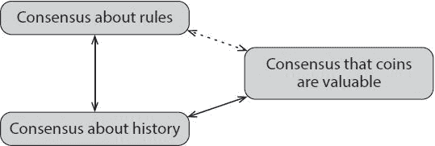
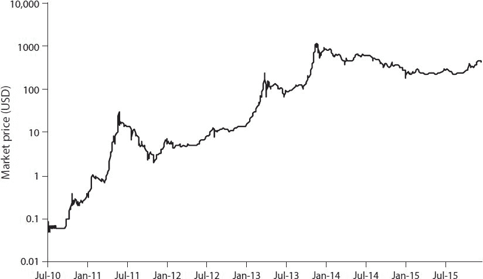
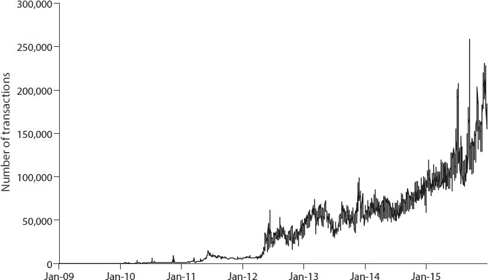

# 七、社区、政治和监管

在这一章中，我们将探讨比特币和加密货币技术对人类世界的所有影响。我们讨论比特币社区的内部政治，以及比特币与传统政治互动的方式，即执法和监管问题。

**7.1。比特币共识**

首先考虑比特币中的共识，即比特币的运行依赖于个体间共识的形成的方式。比特币要想成功，必须有三种共识。

*关于规则的共识*。所谓规则，我们指的是让交易或区块有效的因素，让比特币发挥作用的核心协议和数据格式。你需要对这些事情有一个共识，这样系统中所有不同的参与者就可以互相交流，并就正在发生的事情达成一致。

*关于历史的共识*。也就是说，参与者必须就区块链中有什么和没有什么达成一致，从而就发生了哪些交易达成共识。一旦这一点被确立，接下来就是关于哪些硬币——哪些未使用的产出——存在以及谁拥有它们的共识。这种共识来自于构建区块链的过程(在第 1 章和第 2 章中讨论)以及节点就区块链的内容达成一致的过程。这是比特币中最常见、技术上最复杂的一种共识。

*关于硬币价值的共识*。第三种形式的共识是普遍认为比特币是有价值的，特别是这样一种共识，即如果有人今天给你一个比特币，那么明天你就可以兑换或交易有价值的东西。任何货币，无论是美元这样的法定货币还是比特币这样的加密货币，都依赖于其具有价值的共识。也就是说，你需要人们普遍接受它可以和其他有价值的东西交换，无论是现在还是将来。

在法定货币中，第三种共识是仅*种共识。规则不是一致形成的——什么是一美元钞票，什么不是一美元钞票，是由法令宣布的。历史并不突出，但国家才是(例如，谁拥有什么)。状态要么由实物占有(如现金)决定，要么由专业记录人员(如银行)决定。然而，在加密货币中，规则和历史也需要达成共识。*



图 7.1。比特币三种共识形式之间的关系。

在比特币中，这第三种形式的共识与其他形式不同，有点绕圈。换句话说，我认为我今天收到的比特币是有价值的，这取决于我对明天其他人也会相信同样事情的预期。所以对价值的共识依赖于相信对价值的共识会持续下去。这有时被称为“小叮当效应”，类似于彼得潘的故事，据说小叮当的存在是因为你相信她。

无论是否循环，对价值的共识似乎是存在的，并且在比特币的运作中很重要。关于所有三种形式的共识，重要的是它们相互交织在一起，如图[图 7.1](part0013.html#fig7_1) 所示。

首先，对规则和历史的共识是联系在一起的。如果不知道哪些区块是有效的，就无法就区块链达成共识。如果不能就哪些数据块在区块链达成一致，你就无法知道一个事务是否有效，或者它是否试图消耗一个已经消耗掉的产出。

对历史和硬币价值的共识也是紧密相连的。对历史的共识意味着我们就谁拥有哪些硬币达成一致，这是相信硬币有价值的先决条件——如果没有我拥有某个特定硬币的共识，我就不能指望人们会在未来接受我的硬币作为支付。反过来也是如此——正如我们在第二章中看到的，对价值的共识激励矿工维护区块链的安全，这建立了对历史的共识。

比特币最初设计的天才之处在于，它认识到单靠自己很难建立任何一种共识。在一个没有身份概念的全球分散环境中，就规则达成共识是不太可能的。

类似地，就历史达成共识是一个困难的分布式数据结构问题，它本身不太可能解决。某种加密货币具有价值的共识也很难达成。比特币的设计和比特币的持续运行表明，即使你无法独自建立这些共识形式中的任何一种，你也可以以某种方式将三者结合起来，并让它们以相互依赖的方式运行。因此，当我们谈论比特币社区如何运作时，我们必须记住，比特币依赖于参与者的一致同意，而一致同意是一个脆弱的结构，由相互关联的技术和社会组件组成。

**7.2。比特币核心软件**

比特币核心是一款开源软件，是关于比特币规则的讨论和辩论的焦点。该软件是在麻省理工学院许可证下授权的，这是一个非常宽松的开源许可证。它允许软件被用于几乎任何目的，只要源是归属的并且麻省理工学院的许可没有被剥夺。比特币核心是使用最广泛的比特币软件，即使那些不使用它的人也倾向于遵从它对比特币规则的定义。也就是说，构建替代比特币软件的人通常会模仿比特币核心软件的规则定义部分——那些检查交易和区块有效性的部分。

比特币核心是比特币事实上的规则手册。如果你想知道什么是有效的比特币，你应该咨询比特币的核心软件——或者它的解释。

比特币改进提案

任何人都可以通过“拉请求”对比特币核心做出技术改进，这是开源软件世界中一个熟悉的过程。更实质性的改变，尤其是协议修改，使用了一个叫做“比特币改进提案”(BIPs)的流程。这些是改变比特币的正式提议。典型的 BIP 包括提议变更的技术规范和理由。因此，如果你有一个如何通过进行一些技术变革来改善比特币的想法，我们鼓励你写下其中一份文件，并作为 BIP 系列的一部分发表，这将在社区中引发一场关于该做什么的讨论。虽然正式的过程对任何人开放，但参与需要一个学习曲线，就像任何开源项目一样。

bip 按编号系列出版。每一个都有一个拥护者，也就是说，一个支持它的作者，协调讨论，并试图在社区中建立共识，以支持继续进行或实现他或她的特定提议。

以上适用于改变技术的建议。其他 bip 纯粹是信息性的，它们的存在是为了传播关于比特币的知识，或者标准化以前只在源代码中指定的协议的某些部分。然而，其他 bip 是面向过程的，并讨论如何在比特币社区中决定事情。

总之，比特币有一个规则手册以及一个提议、指定和讨论规则变化的流程，即 BIPs。

比特币核心开发者

要理解比特币核心软件的作用，需要理解比特币核心开发者的作用。原始代码是中本聪写的，我们在第 7.4 节的[中讨论了他。中本聪不再活跃；相反，一群开发者维护着比特币的核心。数百名开发人员为这个项目贡献了代码，但是只有少数人能够直接“提交”访问核心存储库。核心开发人员负责继续开发软件，并负责将哪些代码推入新版比特币核心。](part0013.html#sec7_4)

这些人到底有多厉害？从某种意义上来说，它们非常强大，因为你可以说，它们对代码所做的任何规则更改都会在比特币核心中发布，并且会被默认遵守。这些人可以书写比特币事实上的规则。从另一个角度来说，他们一点也不强大。因为它是开源软件，任何人都可以复制和修改它(即，在任何时候派生软件)，所以如果主要开发人员开始以社区不喜欢的方式行事，社区可以走向不同的方向。

从某种意义上说，领先的开发人员正在引领潮流。他们走在最前面，行进着，当他们转弯时，游行队伍通常会跟着他们。但是，如果他们试图将游行引向灾难性的道路，那么游行者可能会选择不同的方向。首席开发人员可以敦促社区前进，但是如果他们将系统带向社区不喜欢的技术方向，他们没有正式的权力强迫人们跟随他们。

让我们考虑一下，如果你不喜欢规则的趋势或运行方式，作为系统的用户，你可以做什么，并将其与法定货币等中央货币进行比较。在中央集权货币中，如果你不喜欢正在发生的事情，你有权退出，也就是说，你可以停止使用它。你不得不卖掉你持有的任何货币，你可能不得不搬到一个有不同法定货币的地方。在中央集权的货币体系下，退出实际上是你参与的唯一选择。

有了比特币，你当然有权退出，但因为它是作为一个开源系统运行的，你还有权违反规则。这意味着你，以及你的一些朋友和同事，可以决定你更愿意在一个不同的规则集下操作，并且你可以脱离这些规则，从主要开发人员的不同方向前进。分叉的权利比退出的权利更能赋予用户权力，因此社区在比特币这样的开源系统中比在纯粹的中央集权系统中拥有更大的权力。因此，尽管首席开发人员可能看起来像是一个控制事物的集中实体，但实际上他们并没有纯粹的集中管理人员或软件所有者所拥有的权力。

规则中的分叉

将软件和规则分叉的一个方法是用一个新的 genesis 块启动一个新的区块链。这是创建代用币的一个流行选项，我们将在第 10 章中讨论。但是现在让我们考虑规则中的另一种分叉，其中那些分叉的人决定也分叉区块链。


图 7.2。货币的分叉。如果规则中的分叉导致区块链中的硬分叉，货币本身也会分叉，并产生两种新货币。

如果你还记得第三章中硬分叉和软分叉的区别，我们在这里谈论的是硬分叉。当规则出现分歧时，区块链就会出现分叉，产生两个分支。一个分支在规则集 A 下有效，但在规则集 B 下无效，反之亦然。一旦在两个规则集下操作的矿工分开，他们就不能再回到一起，因为每个分支将包含根据另一个规则集无效的事务或块([图 7.2](part0013.html#fig7_2) )。

我们可以把分叉之前已经存在的货币想象成比特币——每个人都同意的大快乐比特币。分叉之后，就好像出现了两种新的货币，对应于规则集 A 的 A 币和对应于规则集 B 的 B 币，在分叉的那一刻，每个拥有一个比特币的人都会收到一个 A 币和一个 B 币。从那时起，A 币和 B 币作为单独的货币运行，它们可能独立运行。这两个群体可能会继续以不同的方式发展他们的规则。

我们应该强调，不仅仅是软件，或者规则，或者执行规则的软件分叉了——货币本身也分叉了。这是一个有趣的事件，可以在加密货币中发生，但不能在传统货币中发生，因为用户无法使用分叉选项。据我们所知，比特币或任何替代币都没有以这种方式分叉，但这是一种令人着迷的可能性。

人们会对这样的分叉作何反应？这要看为什么会发生分叉。第一种情况是，叉并不是为了表示对规则的异议，而是作为开始替代硬币的一种方式。如果有人想以类似于比特币的规则集开始，他们可能会通过分叉比特币的区块链来开始一个替代比特币。这对社区来说并不构成问题——altcoin 分道扬镳，分支和平共处，一些人会更喜欢使用比特币，而另一些人会更喜欢 alt coin。但正如我们之前所说，据我们所知，还没有人通过分叉比特币的或另一个现有的 altcoin 的区块链来启动 altcoin。他们总是从一个新的创世积木开始。

有趣的情况是，如果分叉反映了两个群体之间关于比特币的未来应该是什么的斗争——换句话说，比特币社区的反叛，其中一个子群体决定脱离，因为他们认为他们对系统应该如何运行有更好的想法。那样的话，两家分公司就是竞争对手，会争夺市场份额。a 币和 B 币都会各自努力说服更多的商家接受，更多的人购买。每个人都希望被视为“真正的比特币”。可能会有一场公关战，双方都声称自己是合法的，并将对方描绘成一个怪异的分裂团体。

可能的结果是，一个分支将最终获胜，而另一个分支将逐渐消失。这类竞争往往倾向于一个方向。一旦两者中的一个被视为更合法，并获得更大的市场份额，网络效应将占上风，另一个成为小众货币，最终将逐渐消失。赢家的规则集和治理结构将成为比特币事实上的规则集和治理结构。

**7.3。利益相关者:世卫组织说了算？**

比特币的利益相关者是谁，谁才是真正的负责人？我们已经看到比特币如何依赖共识，以及它的规则手册在实践中是如何编写的。我们已经分析了关于规则应该是什么的分歧或争斗的可能性。现在让我们开始讨论谁有权力决定谁可能赢得这场战斗的问题。

换句话说，如果社区中有关于规则设置的讨论和协商，并且协商失败，我们想知道什么将决定结果。一般来说，在任何谈判中，拥有谈判协议最佳替代方案的一方在谈判中处于优势。因此，弄清楚谁可能会赢得战斗将表明谁在关于比特币未来的社区讨论和谈判中占上风。

我们可以代表许多不同的利益相关方提出索赔:

1.核心开发者拥有权力——他们编写规则手册，几乎每个人都使用他们的代码。

2.矿工拥有权力——他们书写历史，决定哪些交易是有效的。如果矿工们决定遵守某一套规则，那么可以说其他所有人都必须遵守。背后有更多挖矿力量的分叉将建立一个更强大、更安全的区块链，因此有能力将规则推向特定的方向。他们有多少权力取决于是硬叉还是软叉，但无论哪种方式，他们都有一些权力。

3.投资者拥有权力——他们购买并持有比特币，因此决定比特币是否有价值的是投资者。你可能会说，尽管开发者控制着关于规则的共识，矿商控制着关于历史的共识，但控制比特币价值共识的是投资者。在硬分叉的情况下，如果投资者大多决定将他们的钱放在 A 币或 B 币中，该分支将被视为合法。

4。商家和他们的客户拥有权力——他们创造了比特币的主要需求。尽管投资者提供了一些支持货币价格的需求，但推动货币价格的主要需求，正如我们在[第四章](part0010.html#9H5K0-ea268daff50b4c55a00d858ef79f4a6c)中看到的，来自于使用比特币作为支付技术来调解交易的愿望。根据这种观点，投资者只是在猜测未来的主要需求在哪里。

5.支付服务有这个能力——他们是处理交易的人。许多商家不在乎他们使用哪种货币，只是想使用一种支付服务，在一天结束时给他们美元，允许他们的客户使用加密货币支付，并处理所有风险。因此，或许支付服务推动了主要需求，商家、客户和投资者会追随它们。

正如你可能已经猜到的，所有这些论点都有一些价值，所有这些实体都有一些力量。要取得成功，一枚硬币需要所有这些形式的共识——由开发者、矿业力量、投资、商家和客户的参与以及支持他们的支付服务编写的稳定的规则手册。因此，所有这些党派都在一定程度上控制着一场关于比特币未来的斗争的结果，我们无法指出谁是最终的赢家。这是一个巨大、丑陋、混乱的建立共识的练习。

与比特币监管相关的另一个参与者是比特币基金会。它成立于 2012 年，是一个非营利组织。它扮演两个主要角色。第一是用基金会的资产资助一些核心开发人员，这样他们就可以全职开发软件。第二，作为“比特币的声音”与政府对话，尤其是美国政府。

比特币社区的一些成员认为，比特币应该在传统的国家政府之外运作。他们认为比特币应该跨境运作，不应该向政府解释或证明自己，也不应该与政府谈判。其他人持不同观点。他们认为监管是不可避免的、可取的，或者两者兼而有之。他们希望比特币社区的利益能够在政府中得到体现，希望社区的观点能够被听到。该基金会的出现在一定程度上是为了满足这一需求，公平地说，它与政府的交往在很大程度上为理解和接受比特币铺平了道路。

该基金会经历了相当多的争议。一些理事会成员陷入了刑事或财务困境，有人质疑他们中的一些人在多大程度上代表了社区。该基金会与那些成为负担、不得不在短时间内被替换的董事会成员进行斗争。它被指责缺乏透明度，实际上已经破产。截至 2015 年，还不清楚比特币基金会是否会在比特币的未来扮演重要角色。

**开放协议的治理**

我们已经描述了一个系统，其中许多利益相关者在开放协议和软件上合作，并试图达成技术和社会共识。这可能会让你想起互联网本身的架构。比特币核心的发展过程和互联网的发展过程确实有很多相似之处。例如，BIP 进程让人想起 RFC，即征求意见稿，这是一种互联网标准制定文档。

【2014 年 9 月成立的另一个非营利组织“比特币中心”( Coin Center)总部位于 DC 华盛顿州，它承担了比特币基金会的角色之一，即宣传和与政府对话。硬币中心充当智囊团。截至 2015 年初，它的运营没有太多争议。比特币基金会和比特币中心都不比其他利益相关者更负责比特币。任何此类代表性实体的成功和公认的合法性都将取决于随着时间的推移它可以从社区获得多少支持和资金，就像这种开源生态系统中的其他事情一样。

总而言之，没有一个实体或团体能绝对控制比特币的发展。从另一个角度来说，每个人都是主宰，因为关于系统如何运行的共识——关于规则、历史和价值的三种连锁形式的共识——支配着比特币。任何能够随着时间的推移保持这种共识的规则集、团体或治理结构，在非常现实的意义上，都将掌管比特币。

**7.4。比特币的根源**

让我们看看比特币的根源——它是如何开始的，它的前身是什么，以及我们对其神秘创始人的了解。

密码朋克和数字现金

比特币的一个值得讨论的前身是 *cypherpunk* ，这是一场融合了两种观点的运动。首先是自由意志主义，特别是没有政府或政府最小化社会会更好的观点。第二，这场运动将自由主义(或者甚至是无政府主义)的理念与强密码技术，尤其是始于 20 世纪 70 年代末的公钥密码技术结合起来。cypherpunk 运动由一些人组成，他们相信凭借强大的在线隐私和强大的加密技术，他们可以重新设计人们互动方式的架构。塞弗朋克认为，在这个世界上，人们可以更有效地保护自己和自己的利益，而政府的活动(或者用他们的话说，政府的干预)要少得多。

赛博朋克运动面临的挑战之一是，在未来的赛博朋克世界中，人们将通过强大的技术和加密措施进行在线互动，如何处理金钱。这激发了许多研究，特别是由 David Chaum 和其他人的早期数字现金工作领导的研究，旨在创造新形式的数字价值，其功能类似于货币(具体来说，现金)，在某种意义上是匿名的和容易交换的。这些技术思想是如何发展起来的，为什么早期的数字现金*没有*席卷全球，这是一个有趣的故事(见前言)。无论如何，该领域的早期工作与赛博朋克的信仰——特别是拥有一种去中心化、在线和相对私有的强势货币的愿望——一起播下了比特币诞生的种子。这也是许多比特币支持者遵循的哲学基础。

中本聪

比特币始于 2008 年中本聪发布的题为“比特币:点对点电子现金系统”的白皮书。这篇在网上免费发布的论文是对比特币是什么、它如何工作以及其设计背后的哲学的初步描述。这仍然是快速了解比特币的技术设计和哲学是如何规定的一个很好的资源。实现该规范的开源软件不久后由同一个中本聪发布，这就是一切开始的地方。直到今天，Satoshi 仍然是比特币的核心谜团之一。

在一个重要的意义上，我们不知道 Satoshi 的身份并不重要，因为比特币的显著特点是去中心化，没有单一实体负责。Satoshi 并不负责，事实上自 2010 年中期将比特币源代码的控制权移交给其他开发者以来，他一直都不活跃。在某种程度上，Satoshi 怎么想已经不重要了。Satoshi 拥有的任何特殊影响力都只是因为 Satoshi 在比特币社区中拥有的尊重。

增长

自该系统于 2009 年 1 月投入运行以来，比特币已经大幅增长。在交易量随时间变化的曲线图([图 7.3](part0013.html#fig7_3) )和交易数量随时间变化的曲线图([图 7.4](part0013.html#fig7_4) )中，这种增长是显而易见的，尽管截至 2015 年的历史峰值价格在 2013 年末有所回升。有时增长是渐进的，但也有跳跃或爆发，通常与有新闻价值的事件相对应。一般来说，随着时间的推移，增长速度加快了。

**谁是中本聪？**

“中本聪”几乎可以肯定是一个假名。Satoshi 自称是居住在日本的 37 岁男子(截至 2009 年)。然而，没有证据表明 Satoshi 会说或懂日语，但我们知道 Satoshi 用英语写作相当流利，尽管有时使用美式拼写，有时使用英式拼写。为了回答一些基本问题，人们做了大量的尝试来检查 Satoshi 的文本、代码、发布时间、机器标识符等等:Satoshi 的母语是什么？聪是哪里人？甚至有人试图使用*风格学*(针对特定作者模式的文本算法分析)来揭示 Satoshi 的身份。尽管个人和至少一次新闻机构偶尔发表自信的声明，但聪的真实身份仍然未知。关于我们所知道的关于 Satoshi 的更长的讨论见前言。



图 7.3。比特币的市场价格(7 天平均值)。注意对数刻度。资料来源:bitcoincharts.com。



图 7.4。每日交易量(7 天平均值)。资料来源:bitcoincharts.com。

**7.5。各国政府注意到比特币**

本章的其余部分是关于政府的——政府与比特币的互动以及监管比特币的尝试。让我们从各国政府注意到比特币的那一刻开始，也就是当比特币成为一个足够大的现象，以至于政府开始担心它可能产生的影响以及如何应对它的时候。在这一节和下一节，我们将讨论为什么政府会特别担心比特币。然后在[第 7.7 节](part0013.html#sec7_7)中，我们将转向比特币业务可能因与其他类型业务类似的原因受到监管的领域。最后，在[第 7.8 节](part0013.html#sec7_8)中，我们来看一个拟议法规的案例研究，该法规将常规消费者金融保护的要素与比特币的特定方面结合起来。

资本控制

政府会注意到比特币这样的数字货币的一个原因是，不可追踪的数字现金(如果存在的话)可以击败资本管制。资本管制是一个国家制定的旨在限制资本(货币和其他资产)流入或流出该国的规则或法律。通过控制银行、投资等，国家可以试图监管这些流动。

在某些情况下，比特币是一种破解资本管制的简单方法。有人可以简单地在国内用资本购买比特币，通过电子方式将这些比特币传输到国外，然后用它们交换资本或财富。这将允许他们在没有政府控制的情况下输出资本或财富，或者反过来，输入资本或财富。因为这种电子形式的财富可以如此容易地跨境流动，而且无法真正受到控制，所以一个想要在比特币世界实施资本管制的政府，不得不试图将比特币世界与当地的法定货币银行系统断开。这将使一些人无法将大量本币兑换成比特币，反之亦然。我们确实看到试图保护其资本管制的国家正是这样做的，中国是一个明显的例子。中国已采取越来越强的措施，试图通过阻止企业将比特币兑换成人民币，将比特币与中国法定货币银行体系断开。

犯罪

政府可能担心无法追踪的数字现金的另一个原因是，它使某些类型的犯罪更容易实施——特别是绑架和勒索等涉及支付赎金的犯罪。当支付可以远程匿名进行时，这些犯罪变得更加容易。

例如，针对绑架者的执法通常依赖于利用受害者或受害者家庭将钱交给罪犯。当这可以以匿名的方式远距离进行时，执法部门追踪资金就变得困难得多。另一个例子是 CryptoLocker 恶意软件，它加密受害者的文件，并要求用比特币(或其他类型的电子货币)支付赎金来解密它们。所以犯罪和付款都是远距离进行的。同样，当人们可以随时转移资金并从事不容易与特定个人或身份联系在一起的交易时，逃税就变得容易了。最后，当资金可以远距离转移而不被监管机构处理时，非法物品的销售可能变得更加容易。

丝绸之路

这些可能性的一个很好的例子是丝绸之路，一个自封的“匿名市场”，也被称为“非法毒品的易贝”[图 7.5](part0013.html#fig7_5) 为丝路网站运营时的截图。非法药物是销售的主要商品，在图的左边你可以看到少量的其他种类。

丝绸之路允许卖家为出售的商品做广告，让买家购买。货物通常通过邮件或运输服务交付，并以比特币支付。该网站作为 Tor 隐藏服务运行，这个概念在第 6 章中讨论过。正如你在截图中看到的，它的地址是 http://silkroadvb5piz3r.onion。这样，服务器的位置对执法部门来说是隐藏的。由于使用比特币进行支付，执法部门也很难追踪资金去向和识别市场参与者。


图 7.5。丝绸之路网站截图(2012 年 4 月)。

在货物运输过程中，丝绸之路保管着比特币。这种创新的托管系统有助于保护买方和卖方免受其他方的欺骗。一旦买家证明货物已经到达，比特币就会被释放。还有一个类似易贝的声誉系统，允许买家和卖家获得遵守交易的声誉，通过使用这一声誉系统，丝绸之路能够激励市场参与者遵守规则。因此，丝绸之路在犯罪市场中是创新的，它找到了远距离执行犯罪市场规则的方法，这是过去的犯罪市场很难做到的。

丝绸之路是由一个自称恐惧海盗罗伯茨的人经营的——显然这是一个假名，你可能会认为这是指小说/电影*的主人公公主新娘*。该网站从 2011 年 2 月运营至 2013 年 10 月。丝绸之路在运营者罗斯·乌布里希特被捕后被关闭，他后来被确认为恐怖海盗罗伯特。Ulbricht 试图通过使用假名账户和 Tor、匿名回复邮件者等等来掩盖自己的行踪。然而，美国政府能够将这些点联系起来，将他与丝绸之路的活动联系起来——与他作为丝绸之路运营商控制的服务器和比特币联系起来。他被判犯有与经营网站有关的各种罪行。他还被指控雇佣谋杀未遂，尽管幸运的是他在这方面无能到没有人被杀。

在拿下“丝绸之路”的过程中，联邦调查局缴获了大约 17.4 万把 BTC，当时价值超过 3000 万美元。根据美国法律，任何犯罪所得都可能被政府没收。后来，政府拍卖了一部分被没收的比特币。

丝绸之路的教训

从丝绸之路和执法部门与乌布里切特的遭遇中可以吸取一些教训。首先，很难将现实世界和虚拟世界分开。Ulbricht 认为他可以在社会中过他真正的生活，同时拥有一个秘密的身份，在这个身份中他经营着一个相当大的商业和技术基础设施。很难将这两个世界分开，并且不意外地在它们之间建立某种联系。很难长时间保持匿名，同时保持活跃，并随着时间的推移与其他人一起参与协调行为的过程。如果这两个身份之间有联系——比如说，你不小心用了一个人的名字，却戴着另一个人的面具——这种联系永远不会被摧毁。随着时间的推移，不同的匿名身份联系在一起。这正是发生在 Ulbricht 身上的事情——他在早期犯了一些错误，使用相同的计算机访问他的个人帐户，并害怕海盗 Robert 的帐户。这些错误足以让调查人员最终发现他的离线身份。

另一个教训是，执法部门可以追踪资金。甚至在 Ulbricht 被捕之前，联邦调查局就知道某些比特币地址由丝绸之路的运营商控制，他们正在监视这些地址。结果是，虽然《区块链》称乌尔布里切特很富有，但他实际上无法从这笔财富中获益，因为任何将这些资产转换成美元的企图都会导致可追踪的事件，并可能导致迅速逮捕。因此，尽管乌布里切特拥有大约 174，000 BTC，但在现实世界中，他并没有像国王一样生活。他住在旧金山的一套一居室公寓里，但显然无法获得他积累的财富。

简而言之，如果你打算经营一家地下犯罪企业——显然，我们不会推荐这条职业道路——那么这比你想象的要困难得多。像比特币和 Tor 这样的技术并不是防弹的，执法机构仍然掌握着重要的工具。尽管执法部门对比特币的崛起感到有些恐慌，但这些机构仍然可以在一定程度上追踪这些钱，他们仍然有很大的能力调查犯罪，让那些想要参与协同犯罪行动的人日子不好过。

与此同时，通过取缔丝绸之路，执法部门并没有关闭基于比特币的非法毒品隐藏市场。事实上，在丝绸之路消亡后，这种市场如雨后春笋般出现。一些比较突出的是绵羊市场，丝绸之路 2，黑市重装上阵，进化，和 Agora。其中大部分现在已经关闭，要么是由于执法行动，要么是盗窃，通常是内部人员所为。然而，研究发现，销售总量只是上升了，针对个别网站的执法行动并没有显著减缓这一地下市场的增长。为了解决网站运营商带着买家托管的资金消失的安全风险，较新的市场使用多重签名托管(在第 3 章中讨论)，而不是丝绸之路将资金存放在市场运营商处的模式。

**7.6 .反洗钱**

在本节中，我们将了解洗钱和各国政府实施的反洗钱(AML)规则，尤其是在美国，这些规则影响了一些比特币相关业务。

反洗钱政策的目标是防止大量资金跨境流动或在地下经济和合法经济之间流动而不被发现。在第 7.5 节中，我们探讨了防止资金跨境流动的资本管制。在某些情况下，国家并不反对资金跨境流动，但他们想知道谁在向谁转移什么，钱从哪里来。

反洗钱政策旨在加大某些犯罪的难度，尤其是有组织犯罪。有组织的犯罪集团经常在一个地方收到大量的钱，并想转移到其他地方，但他们不想解释这些钱从哪里来——因此有跨境转移资金的愿望。或者，他们可能会发现自己在地下经济中赚了很多钱，并希望将这些钱转移到合法经济中，这样他们就可以用这些钱购买奢侈品或其他物品。因此，反洗钱的目标是让这种转移资金的方式变得更加困难，并让抓住试图这样做的人变得更加容易。

了解你的客户

反洗钱的基本对策之一是“了解你的客户”(KYC)法。细节可能有点复杂，取决于您所在的地区，但基本思想是这样的:KYC 规则要求处理资金的特定类型的企业做三件事:

1.*识别和验证客户端*。获得某种证明，证明客户确实是他们所声称的人，并且那些声称的身份与现实世界的身份相对应。因此，一个人不能走进来，声称自己是来自美国任何城镇主街 123 号的约翰·史密斯——他们必须提供可靠的身份证明文件。

2.*评估客户风险*。确定某一客户从事地下活动的风险。这将基于客户的行为——他们与公司的业务关系有多长久，他们在社区中的知名度有多高，以及各种其他因素。KYC 规则通常要求被保险公司监控那些活动看起来风险更高的客户。

3.*注意异常行为*。注意看起来有洗钱或犯罪活动迹象的行为。KYC 通常要求公司终止与看起来可疑的客户或无法充分证明自己或其活动符合法律要求的客户的业务。

强制性报告

美国的强制性报告要求可能会对比特币业务产生重大影响。许多行业的公司都必须报告超过 10，000 美元的货币交易。他们必须提交所谓的“货币交易报告”，说明交易是什么以及交易的另一方是谁。他们还需要验证该方是谁。一旦报告，这些信息将被输入政府数据库，然后可能会被分析以寻找表明洗钱的行为模式。

公司还被要求监视可能“构建”交易以避免报告的客户，如参与一系列 9999 美元的交易以规避 10000 美元的报告规则。发现结构化证据的公司必须通过提交可疑活动报告进行报告。同样，信息进入政府数据库，并可能导致对客户的调查。

这些要求因国家而异。我们绝不是想给你法律建议。本次讨论旨在让您了解反洗钱规则的具体要求。也就是说，请注意，美国和其他国家的政府倾向于严肃对待反洗钱规定，并对违规行为施以严厉的刑事处罚。如果政府稍后对你提出投诉，这些规则不是你可以忽视和处理的。

比特币业务已经被关闭——有时是暂时的，有时是永久的。商人被逮捕，人们因为不遵守这些规则而入狱。这是一个政府将大力执法的领域，无论使用法定货币还是比特币。自从政府机构注意到比特币大到足以构成洗钱风险以来，它们就针对基于比特币的企业实施了这些法律。如果你有兴趣开始任何种类的业务，将处理大量的货币，你需要咨询了解这些规则的律师。

**7.7。法规**

现在让我们直接讨论“监管”这个词。监管往往会背上恶名，尤其是在那些倾向于喜欢比特币的人当中。正如人们所说，监管是“一些不知道我的业务或我想做什么的官僚，他们进来把事情搞砸了。这是一种负担。这既愚蠢又毫无意义。”这种观点很常见，也很容易让人产生共鸣，尽管它通常至少部分是正确的，但我们不会在此赘述。

相反，在本节中，我们将更详细地探讨监管有时可能是合理的原因，因为这一论点并没有被很好地理解。需要明确的是，我们花了大部分时间讨论为什么监管可能是好的，这一事实不应被解读为对广泛监管的认可。但是，我们希望在一个监管通常被认为是天生糟糕的社区中，为讨论带来更多的平衡。

支持监管的最终论点是这样的:当市场失灵并产生糟糕的结果时——市场中的几乎所有人都同意这是糟糕的——那么监管可以介入并试图解决这一失败。因此，当有争论时，对监管的争论始于市场并不总是产生最优结果的观点。

让我们用经济学术语使这个概念更精确一点。有争议的是市场失灵，这里我们并不仅仅指发生了不好的事情，或者有人觉得他们被敲竹杠或者受到了不公平的待遇。我们的意思是，有一种商品对市场参与者的替代分配，这将导致每个人的境况变得更好，或者至少不会更糟。这种交替分配被称为*帕累托改进*。

柠檬市场

让我们来讨论市场失败的一种方式，一个经典的例子叫做*柠檬市场*。这个名字起源于销售汽车的背景，但这个想法并不局限于那个市场。假设所有的汽车要么质量低，要么质量高(中间没有)。高质量汽车的制造成本比低质量汽车高一点，但对购买它的消费者来说要好得多。

如果市场运行良好(如果经济学家称之为*高效*，它将向消费者交付大部分高质量的汽车。这是因为即使高质量的汽车稍微贵一点，大多数消费者还是喜欢它，并且愿意为它付更多的钱。因此，在某些假设下，市场会提供这种快乐的结果。

但是假设客户分不清低质车和优质车。停在停车场的低质量汽车(一辆“柠檬”)可能看起来很好，但你真的不知道它明天是否会抛锚或运行很长时间。经销商可能知道这是不是一个柠檬，但作为客户的你却不知道。

想想驱使人们进入这种柠檬市场的动机。作为一名消费者，你不愿意为一辆高质量的汽车支付额外的费用，因为在购买汽车之前，你根本无法分辨两者的区别。即使二手车经销商说一辆车是完美的，只需多花 100 美元，你也没有充分的理由去信任经销商。

因此，生产商无法通过销售高质量的汽车赚到额外的钱。事实上，他们销售高质量的汽车是赔钱的，因为生产成本更高，他们没有获得任何价格溢价。因此，市场陷入了一种均衡状态，只有低质量的汽车被生产出来，消费者对它们相对不满意。

这种结果对所有人来说都比正常运转的市场更糟糕。对买家来说更糟糕，因为他们不得不将就低质量的汽车。在一个更有效率的市场中，他们本可以以略高的价格买到一辆好得多的汽车。这对生产商来说也更糟糕——因为市场上的汽车都是柠檬，消费者不会买那么多车，所以卖车赚的钱比健康市场少。

这种现象被称为市场失灵。柠檬市场本质上并不与汽车有关。任何遭受*不对称信息*(卖方或买方比另一方更了解商品质量)的待售商品(或“小配件”)都可能导致市场失灵。经济学文献提供了更多汽车市场以外的例子。

修理柠檬市场

一些基于市场的方法试图修复柠檬市场。一种方法依赖于卖家的声誉。这个想法是，如果一个卖家始终如一地告诉消费者哪些小配件质量好，哪些质量差，那么这个卖家可能会获得说实话的声誉。一旦他们有了这样的声誉，他们可能会以更高的价格出售高质量的小配件，因为消费者会相信他们，因此市场可以更有效地运作。

这种方法只在某些时候有效，这取决于你对市场的准确假设。当然，它永远也不会像一个消费者可以实际辨别质量差异的市场那样运转良好。首先，制片人需要一段时间来建立良好的声誉。这意味着他们必须在一段时间内以低价出售高质量的产品，直到消费者意识到他们说的是实话。这使得诚实的卖家更难进入市场。

另一个潜在的问题是，如果卖家想退出市场(比如说，如果他们的销售额在下降)，即使他们到目前为止一直很诚实，也不再有诚实的动机。在这种情况下，他们的动机是一次性大规模欺骗人们，然后退出市场。因此，无论是在卖方出现在市场的开始还是结束阶段，声誉都没有发挥作用。

在消费者不会与同一实体进行重复交易的企业中，或者在产品类别非常新的企业中，基于声誉的方法往往也不起作用，因此卖家没有足够的时间来建立声誉。像比特币交易所这样的高科技市场就存在这些问题。

另一种基于市场的修复柠檬市场的方法是担保。这个想法是，卖家可以向买家提供一份保证书，说明如果小部件质量低劣，卖家将提供换货或退款。这在某种程度上可以很好地工作，但这种修复也有一个问题:保修只是另一种产品，也可以有高质量或低质量的版本！低质量保修是指当你带着坏掉的产品回来时，卖家不会兑现的保修。他们违背了他们的承诺，或者他们让你通过各种各样的箍跳赎回担保。

监管修复

因此，如果柠檬市场已经发展起来，如果这些基于市场的方法对特定市场不起作用，那么监管可能会有所帮助。具体来说，监管可能有三种方式来解决这个问题。

首先，监管可能要求披露。比如说，它可以要求所有的小配件都标明质量高低，并对说谎的公司进行处罚。这给了消费者他们所遗漏的信息。监管的第二个方法是制定质量标准，这样，除非符合质量测试的标准，否则任何产品都不能出售，只有高质量的产品才能通过测试。这将导致市场再次只有一种小工具，但至少是高质量的，假设监管如预期的那样发挥作用。第三种方法是要求所有卖家出具保证书，然后强制执行这些保证书，这样卖家就能信守承诺。

这些监管形式中的任何一种都可能明显失败——它可能不会像预期的那样发挥作用，可能写得很差或被误用，或者可能对卖家造成负担。但是，这种类型的监管至少有可能帮助解决柠檬市场导致的市场失灵。例如，主张监管比特币交易所的人有时会将它们视为柠檬市场的一个例子。

共谋与反垄断法

另一个市场非最优运行的例子是价格操纵。价格操纵是指不同的卖方相互勾结，同意提高价格或不降低价格。一个相关的情况是，本来会相互竞争的公司同意不竞争。例如，如果镇上有两家面包店，他们可能会同意其中一家只卖松饼，另一家只卖百吉饼，这样他们之间的竞争就会比他们都卖松饼和百吉饼时少。竞争减少的结果是，价格可能会上涨，商家能够阻挠市场的运作。

毕竟，市场在其正常运作中很好地保护消费者的原因是通过竞争这一工具。卖家必须竞争，以最好的价格向消费者提供最好的商品，如果他们不以这种方式竞争，那么他们就不会获得业务。固定价格或串通的协议规避了竞争。当人们采取阻止竞争的措施时，这是另一种市场失灵。

这类协议——提高价格或不竞争——在大多数司法管辖区都是非法的。这是反垄断法或竞争法的一部分。这套法律的目标是防止限制或损害竞争的故意行为。更一般地说，它限制了除了简单地以好价格提供好产品之外的行为，例如试图通过合并来减少竞争。反垄断法很复杂，我们给你的只是它的草图，但它是市场如何失败以及法律如何能够并将如何介入来纠正它的另一个例子。

**7.8。纽约的 BITLICENSE**

到目前为止，我们已经讨论了一般的监管:不同形式的监管，以及为什么监管在某些情况下可能是合理的，并且可能具有良好的经济意义。现在让我们来看看一个州引入比特币特定监管的努力，即纽约州的比特币许可证。对于我们的目的来说，细节并不重要，因为我们的目标并不是帮助你理解一个特定的规则。相反，我们希望帮助你理解监管机构正在做的事情，并让你了解他们是如何看待这个问题的。

BitLicense 提案于 2014 年 7 月发布，并根据比特币社区、行业、公众和其他利益相关方的意见进行了修订。2015 年 8 月生效。它是由纽约金融服务部(NYDFS)发布的，该机构是监管金融业的国家机构。当然，纽约州拥有世界上最大的金融中心，因此州政府的这一部分习惯于与相对较大的机构打交道。

谁被覆盖了

BitLicense 是一套处理虚拟货币的代码、规则和条例。基本上，如果您想做下面列出的任何事情，它要求您从 NYDFS 获得所谓的 BitLicense:

虚拟货币业务活动是指涉及纽约或纽约居民的以下任何一种活动:

1.接收虚拟货币用于传输或传输虚拟货币，除非交易是为了非金融目的进行的，并且不涉及超过虚拟货币名义金额的转移；

2.代表他人存储、持有或保管或控制虚拟货币；

3.买卖虚拟货币作为客户业务；

4.作为客户业务执行交换服务；或者

5.控制、管理或发行虚拟货币。

软件的开发和传播本身并不构成虚拟货币商业活动。

(摘自 NYDFS BitLicense 法规文本)

该文本提到“涉及纽约或纽约居民的活动”，反映了纽约 DFS 的监管权限。然而，诸如此类监管的影响远远超出了国家边界，原因有二。首先，对于人口众多的州，如纽约州或加利福尼亚州，在遵守州法律和不与这些州的消费者做生意之间面临选择时，大多数公司会选择遵守。第二，一些州通常被认为是监管某些经济领域的领导者，比如纽约的金融业，加州的科技业。这意味着美国其他州通常会遵循领导人设定的方向。

请注意第一个类别中的非金融用途的例外——这是在第二次修订中添加的，这是一个好的变化。这是从第 9 章开始讨论的比特币平台应用的一个特例。第二类可能包括钱包服务。至于第三类，看起来你可以为自己买卖比特币，但做客户业务需要 BitLicense。第四类是自明的。最后一种可能更适用于替代币，其中许多都有点集中，而不是比特币。我们在[第 10 章](part0016.html#F8900-ea268daff50b4c55a00d858ef79f4a6c)里看山寨币。

本文末尾的软件开发例外也是一个重要的例外。原文中没有这种语言，这引起了社区的强烈抗议。纽约 DFS 负责人本杰明·劳斯基(Benjamin Lawsky)不久后澄清说，其目的不是监管使用比特币的开发者、矿工或个人。最终版本包含上面列出的两个显式例外。

要求

所涵盖的实体必须申请许可证。提案中的详细语言解释了如何申请许可证，你可以阅读(见本章末尾的进一步阅读部分)，但大致来说，你必须提供关于企业所有权、财务和保险以及商业计划的信息——通常足以让纽约 DFS 知道你是谁、你有多好的支持、你的钱来自哪里以及你打算做什么。而且你必须支付申请费。

如果您获得了许可证，那么您必须向 NYDFS 提供有关所有权、财务、保险等方面的最新信息。你必须提供定期的财务报表，这样他们才能跟踪你的财务状况。你需要维持一笔财务准备金，金额由 NYDFS 根据你的业务的各种因素设定。

该提案包括如何保管消费者资产的规则。它可能包括反洗钱规则，这些规则可能会也可能不会超出现有法律的要求。有关于安全计划和渗透测试等等的规则。灾难恢复是有规则的—您必须有一个符合各种标准的灾难恢复计划。关于记录保存也有规定——你必须保存记录，并在特定情况下提供给纽约市消防局。您必须有关于法规遵从性的书面政策，并且您必须指定一名法规遵从性官员—您组织中负责法规遵从性并拥有必要权限的人。你必须向消费者披露风险，这样消费者才能理解与你做生意的风险。

如你所见，这些要求是实质性的，类似于对共同基金或公开交易股票的要求。这使得 BitLicense 成为比特币历史上的重大一步。或许其他司法管辖区也将开始监管比特币交易，比特币业务将开始向受监管金融机构的传统模式靠拢。

这在某种程度上违背了赛博朋克或赛博自由主义者关于比特币应该是什么的观点。但或许不可避免的是，一旦比特币变得真正有价值，比特币企业成为大企业，政府开始感兴趣，监管就会随之而来。比特币业务触及真实的人和法定货币经济。如果比特币大到足以产生影响，那么它也大到足以受到监管。它代表了比特币最初倡导者心目中的倒退，但从另一方面来说，它代表了比特币生态系统的成长，并融入了常规经济。不管你对它的立场如何，监管已经开始发生，如果你有兴趣开始比特币业务，你需要关注这一趋势。

这种监管比特币的努力会成功吗？有不同的方式来看待它，但有一种方式可以评估像 BitLicense 这样的监管在提高比特币业务质量的公共政策目标方面的有效性:如果公司开始向纽约以外的客户宣传他们可以信任，因为他们有 BitLicense，如果这种说法在消费者选择与一家公司做生意时能够说服他们，那么监管就会按照其倡导者希望的方式发挥作用。这是否会发生，以及它将如何影响比特币的未来，我们将拭目以待。

**延伸阅读**

关于丝绸之路及其后继者是如何运作的，包含许多有趣细节的两篇论文是:

```
Christin, Nicolas. “Traveling the Silk Road: A Measurement Analysis of a Large Anonymous Online Marketplace.” In *Proceedings of the 22nd International Conference on the World Wide Web*. New York: ACM, 2013.
```

```
Soska, Kyle, and Nicolas Christin. “Measuring the Longitudinal Evolution of the Online Anonymous Marketplace Ecosystem.” In *Proceedings of the 24th USENIX Security Symposium*. Berkeley, CA: USENIX, 2015.
```

这是比特币引发的监管问题的指南:

```
Brito, Jerry, and Andrea Castillo. *Bitcoin: A Primer for Policymakers*. Fairfax, VA: Mercatus Center at George Mason University, 2013.
```

一本着眼于比特币社区及其一些突出人物的非技术性书籍是:

```
Popper, Nathaniel. *Digital Gold: Bitcoin and the Inside Story of the Misfits and Millionaires Trying to Reinvent Money*. New York: Harper, 2015.
```

关于数字现金的早期工作，结合对数字隐私世界的愿景，一个流行的解释是:

```
Chaum, David. “Security without Identification: Transaction Systems to Make Big Brother Obsolete.” *Communications of the ACM*, 28(70), 1985.
```

信息安全经济学的一项调查讨论了市场失灵的几个原因，它是:

```
Anderson, Ross, and Tyler Moore. “The Economics of Information Security.” *Science* 314 (5799), 2006.
```

有关比特币特有的经济问题和监管选项的讨论，请参见:

```
Böhme, Rainer, Nicolas Christin, Benjamin Edelman, and Tyler Moore. “Bitcoin: Economics, Technology, and Governance.” *Journal of Economic Perspectives* 29(2), 2015.
```

BitLicense 提案的文本可在以下网址找到:

```
New York State Department of Financial Services. “Regulations of the Superintendent of Financial Services. Part 200: Virtual Currencies.” 2015\. Available at http://www.dfs.ny.gov/legal/regulations/adoptions/dfsp200t.pdf.
```