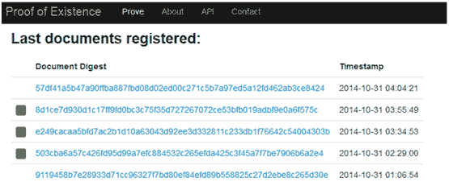
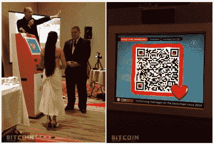
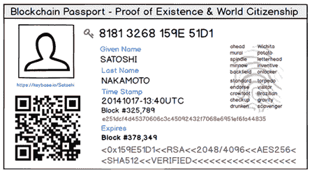

<title>Blockchain 3.0: Justice Applications Beyond Currency, Economics, and Markets</title>  <link href="../../stylesheet.css" rel="stylesheet" type="text/css"> <link href="../../page_styles.css" rel="stylesheet" type="text/css">

# 第三章。区块链 3.0:超越货币、经济和市场的司法应用

# 区块链技术是一种新的高效组织活动的模式

区块链技术不仅有可能彻底改造货币市场、支付、金融服务和经济的每一个类别，还可能为所有行业，甚至更广泛地说，为人类努力的几乎所有领域提供类似的重新配置可能性。区块链从根本上说是一种新的范式，以更少的摩擦和更高的效率来组织活动，并且规模比当前的范式大得多。这不仅仅是因为区块链技术是去中心化的，而且去中心化作为一种通用模式现在可以很好地工作，因为有一个足够流动的底层网络将所有人连接起来，包括非中介交易:区块链技术提供了一个以前不可能实现的普遍和全球性的范围和规模。这对于资源分配来说是真实的，特别是允许物理世界资产以及人力资产的日益自动化的资源分配。区块链技术促进了所有人类交互方式的协调和认可，促进了更高层次的协作，并可能为人机交互铺平了道路。也许人类活动的所有模式都可以在某种程度上与区块链技术相协调，或者至少用区块链概念重新发明。此外，区块链技术不仅在功能、实践和数量上是一个更好的组织模型；通过要求共识来运作，这种模式也可以在质量上有更大的自由、平等和授权。因此，区块链是一个完整的解决方案，整合了外在和内在以及定性和定量的好处。

## 区块链技术概念的可扩展性

区块链技术可能会在任何以广泛和普遍的方式遇到这些概念的人身上释放出创造力和发明的重要元素。从这个意义上说，有必要把新思想分开来理解，也有必要把它们放在一起理解。这些概念包括公钥和私钥加密、点对点文件共享、分布式计算、网络模型、假名、区块链分类帐、加密货币协议和加密货币。这就对现代世界的传统参数如货币、经济、信任、价值和交换的既定定义提出了质疑。为了在区块链的技术环境中运作，理解这些概念是一项要求和 21 世纪的技能。当你理解了相关的概念，不仅有可能创新出与区块链相关的解决方案，而且这些概念可以移植到其他领域。区块链相关概念的这种可扩展性可能是区块链技术最大影响的来源，因为人类代理理解这些概念，并在他们可以想象的每个地点部署它们。互联网是核心技术概念的应用普遍性和可扩展性的一个类似例子；这意味着一切都可以用新的方式完成——更快、覆盖面更广、实时、按需、通过全球广播、成本更低。区块链技术富含新概念，可能成为标准知识领域和工具包的一部分。

## 基本经济原则:发现、价值归属和交换

关于使用区块链概念的一种宽泛的思考方式是将它们应用到原始背景之外，以观察一切事物如何像经济、市场和货币——同样重要的是，一切事物如何像经济*而不是*。这种心态需要认识到现实生活中经济学和市场的基本属性。区块链技术有助于阐明我们看到和经历的一切，生活中的每个系统，在某种程度上都是经济学:一个分配资源的系统。此外，系统和相互作用是经济学，因为它们是意识和发现、价值归属以及潜在的相互作用和交换的问题，并可能包括这种交换的机制，如货币或代币，甚至是简单的力、能量或浓度的交换(如在生物系统中)。这种相同的基本经济结构可以说是普遍存在的，无论是在协作团队还是在农贸市场。分类账交易级别跟踪形式的区块链技术的量化结构可能意味着更高分辨率的活动跟踪，比我们目前习惯的更详细和更广泛几个数量级，那时我们仍然感谢 SKU 级别的物料清单跟踪。

区块链跟踪可能意味着，所有相关方对系统的所有贡献，无论多么微小，都可以以无缝、自动化的方式进行评估和归因，以便以后汇总到宏观层面——或者不，因为一些社区价值系统可能会规定不明确跟踪用户贡献。跟踪的精神气质和道德是一个单独的、有趣的社会科学话题，需要在区块链研究的研究议程中进行更广泛的探索。然而，一种基于区块链的跟踪能力可以发挥作用的方式是“GitHub +比特币”的概念，例如，随着时间的推移，逐行跟踪软件代码库的所有修订版本。这一点很重要，因为参与系统的有经济头脑的理性代理人(即目前的人类)希望评估他们和其他人所做的贡献，并跟踪和认可这些贡献，以获得报酬、声誉、地位和其他奖励。

## 区块链技术可以用于所有量子的管理

区块链能够以自动计算的方式为近乎无限数量的交易的协调活动提供一个通用的无缝模型，一个通用的交易系统，其秩序是人类活动从未想象过的。在某种意义上，区块链技术可以成为现实的超级计算机。任何和所有可以被量化的现象(在离散的单元或包中定义)都可以用这种方式来表示，并在区块链上以自动化的方式进行编码和处理。区块链风险投资家戴维·约翰斯顿对这种动态的总结和预测是，任何可以去中心化的东西都将是，显示了他对区块链模式内在效率和效益或优越性的信念。权力下放是“水往哪里流”，水就往哪里流，沿着阻力最小、最省力的路线。区块链可能是奥卡姆剃刀，协调所有人类和机器活动的最有效、最直接和最自然的方法；这是一个自然的效率过程。

## 区块链层可以促进大数据的预测任务自动化

随着大数据允许对现实中越来越多的过程进行预测建模，区块链技术可以帮助将预测转化为行动。区块链技术可以与大数据相结合，建立在大数据科学中正在缓慢进行的反应到预测的转变之上，以便通过智能合同和经济学实现大面积任务的自动化操作。大数据的预测分析可以与智能合同的自动执行完美契合。我们可以通过添加区块链技术作为嵌入式经济支付层和量子管理工具来实现这一目标，并通过自动化智能合同、Dapps、DAOs 和 DAC 来实现。大量任务的自动化操作可以减轻人类的负担，因为这些任务将由通用的、分散的、全球分布的计算系统来处理。我们认为大数据很大，但是通过区块链技术以更低和更高的分辨率对所有类别的活动和现实进行量化、跟踪和管理的潜力暗示了从当前大数据时代开始的下一个数量级的发展，当前大数据时代本身仍在发展中。

# 分布式抗审查组织模型

区块链 1.0 和 2.0 交易的主要论点是去中心化网络模型中无信任交互所提供的经济效率和成本节约，但自由和授权也是区块链的重要维度。在政治制度和资本管制严格的国家，分权模式在促进自由和经济转移方面尤其有效。自由是在地方政府的可见性、跟踪和监管范围之外的假名交易的意义上可用的。对于新兴市场的公民来说，这可能是一个重大问题，因为当地的资本管制、政府监管和过度限制性的经济环境使得他们更难从事各种标准活动，包括创办新企业。国家经济控制，加上对法定货币缺乏信任，一直在推动人们对加密货币的兴趣。

与区块链技术相关的自由属性在区块链 3.0 中变得更加明显，这是超越货币和市场交易的下一个应用类别。通过其全球分散的性质，区块链技术有可能绕过目前的地理管辖的限制。有一种观点认为，区块链技术可以更公平地解决与自由、司法、审查和监管相关的问题，也许是以民族国家模式和国际人权外交努力所不能做到的方式。不管是否支持民族国家的合法性，有一个规模和管辖权的承认和论点，即某些行动是跨国的，在更高的组织层次上，如世界贸易组织，更有效地管理、协调、监督和审查。

这个想法是将跨国组织从基于地理、民族国家管辖的限制提升到真正的全球云。第一点是，跨国组织需要跨国治理结构。区块链技术的影响力、可及性和透明度可以成为一种有效的跨国治理结构。区块链治理比民族国家治理更符合跨国组织的特征和需求。第二点是，区块链提供的跨国治理不仅更加有效，而且更加公平。在一个去中心化的、基于云的模型中，组织及其参与者可能会获得更多的平等、公正和自由。这是由区块链不可改变的公共记录、透明性、可访问性和可及性提供的。世界上任何人都可以查到并证实跨国组织在区块链的活动。因此，区块链是一个全球性的制衡体系，在各方之间建立信任。这正是那种核心的基础设施要素，它可以让人类通过真正的全球性组织和协调机制，取得数量级的更大进步。

这可能有意义的一项活动是互联网的管理。互联网管理组织拥有跨国权限，但却位于民族国家所在地。一个例子是互联网名称与数字地址分配机构 ICANN。ICANN 管理互联网协议号码和名称空间，协调将 www.example.com*翻译成数字 IP 地址 93.184.216.119，以便连接整个互联网。*

 *区块链技术同时强调了跨国公共产品的适当管理问题，并提出了一个解决方案。维基百科是一种类似的跨国公益物，目前受地方管辖，这可能会给该组织强加一种人为的或有偏见的议程。区块链机制可能是管理所有跨国公益物的最有效和最公平的模式，特别是由于其参与性、民主性和分布性。

一个著名的例子是维基解密，在这个例子中，司法民族国家实体能够实施集中的和有偏见的控制。在 2010 年的爱德华·斯诺登揭发案中，一些人试图捐款支持维基解密组织，但在中央政府议程、信用卡支付网络和贝宝的强力支持下，他们拒绝接受此类捐款，维基解密实际上被禁运了。 ^([75](../Text/afterword01.html#bib75)) 比特币捐款，如果当时可能的话，会是直接的，可能会产生不同的结果。电子自由基金会(EFF)是一个支持个人自由的非营利组织，其他相关组织目前也类似地位于管辖区内，如果当局要对该组织和相关个人施加影响，这总是意味着议程缩减。*  *# Namecoin:分散域名系统

区块链技术的第一个非货币用途是通过 [Namecoin](https://wiki.namecoin.info) 防止互联网审查，这是一种可用于验证域名系统(DNS)注册的替代货币。Namecoin 是一种跨国的替代 DNS，不受任何政府或公司的控制。分散式 DNS 的好处在于，它使世界上任何可能被压制或审查的人都有可能在互联网上自由发布信息。

正如比特币是一种无法关闭的去中心化货币一样，Namecoin 是去中心化 DNS(即 web URLs)的基础。这个想法是，永久嵌入区块链的网址可以抵抗政府对域名的查封。审查问题在于，在像 google.com 的 T4 这样的网址中，中央集权机构控制着顶级域名 T6。com 部分(美国控制*)。com*URL)，因此可能会捕获并重定向 URL。集中权限控制所有顶级域名；比如中国控制所有*。cn* 域名。因此，分散的 DNS 意味着顶级域可以不受任何人控制，并且它们在对等网络上共享 DNS 查找表。只要有志愿者运行去中心化 DNS 服务器软件，就可以访问在这个系统中注册的备选域。管理机构不能强加规则来影响设计和执行良好的全球对等顶级域名的运营。相同的比特币结构用于分散式 DNS 的独立区块链和硬币 Namecoin 的实施。

Namecoin 目前并不打算注册所有域名，而是作为对审查敏感的域名的言论自由机制(例如，在政治自由有限的国家)。Namecoin 的顶级域名是*。位*。利害关系人登记*。位*域名为 Namecoin。根据交易类型，注册新域名或更新现有域名所需的操作内置于 Namecoin 协议中，例如，成本为 0.01 NMC 的“name_new”交易(Namecoin 可在比特币中兑换/兑换)。域名可以直接在域名系统注册，也可以通过注册服务如*。*

 *因为顶级域名*。bit* 在互联网传统操作之外，方便查看*。bit* 网站，有*。位*到[的代理服务器处理浏览器](http://bit.ly/browsing_bit)中的 DNS 请求，以及[火狐](http://www.meowbit.com/)和 [Chrome 扩展](http://bit.ly/dot_bit_ext)。根据[比特币联系网站](http://namecoin.bitcoin-contact.org/)截至 2014 年 10 月，共有 178397 个*。第*位域名已注册，例如，包括*维基解密。重点是*。位*域是一种自由言论机制，因为现在有了查看*的能力。比特*网站意味着试图压制合法信息的人成功的机会将会更小。正如分散的货币交易有好处一样，许多其他类型的分散交易也有好处。*

## 挑战和其他分散式 DNS 服务

发现 Namecoin 实现存在技术问题，导致*。位*域容易被接管(一个错误，如果事务输入名称与事务输出名称匹配，就可能更新值，以及新注册被覆盖)。 ^([77](../Text/afterword01.html#bib77)) 开发者一直在补救这些问题。其他批评者(就比特币而言)指出，去中心化 DNS 服务的关键特征(廉价和匿名的域名创建，以及一个将域名置于中央当局管辖范围之外的系统)是如何助长不良玩家和非法行为的。然而，一份行业白皮书反驳了这些说法，列举了利用《区块链总账》的公共可追溯性功能逮捕罪犯的例子，并指出这项技术有许多合法用途。 ^([79](../Text/afterword01.html#bib79))

与此同时，其他的去中心化域名服务也在开发中，比如类似的 BitShares 的 [*.P2P* 去中心化顶级域名](http://dotp2p.io/)。该项目指出，分散式 DNS 模型如何消除了作为第三方中介的认证机构(这会使 URL 容易受到攻击)，并且区块链模型也可以更安全，因为只有当您共享私钥时，您才会失去对您的域的控制。 ^([80](../Text/afterword01.html#bib80)) DotP2P 还有其他功能可以改善 DNS 注册，比如类似拍卖的价格发现来对抗域名抢注。与分散式 DNS 服务相关的是数字身份确认服务；2014 年 10 月，BitShares 为此推出了 KeyID 服务。KeyID ，更名自 Keyhotee，在一个分散的区块链上提供一个身份识别和电子邮件系统，用于安全的消息传递和安全的认证。 ^([81](../Text/afterword01.html#bib81))

## 言论自由/反审查应用:亚历山大和奥斯特尔

亚历山大港是区块链促进言论自由项目的一个例子。它的目标是通过对区块链的 Twitter 信息进行编码来创建一个不可更改的历史记录。任何提到某些预先指定的关键词(如*乌克兰*或*埃博拉*)的推文都使用 [Florincoin](http://florincoin.org/) 编码到亚历山大区块链中，Florincoin 是一种基于比特币和莱特币的加密货币，具有快速交易处理(40 秒)和更长的备忘录注释字段(概念上:Memocoin)。这种方法捕捉可能会被删除请求删除的推文。Florincoin 的主要支持特性是事务评论，一个 528 个字符的字段，用于记录元数据和 tweet 内容。 ^([83](../Text/afterword01.html#bib83)) 扩展的注释功能可以更广泛地用于多种区块链应用，例如提供元数据和指向基因组序列或 X 射线文件的安全指针。另一个面向自由的应用是 [Ostel 的](https://ostel.co/)免费加密 IP 语音(VoIP)电话服务，因为美国国家安全局(NSA)可以监听 Skype 等其他服务。Ostel 是大卫·布瑞恩自下而上的监听制衡自上而下的国安局监听的一个很好的例子(包括传统电话和 Skype 的监听)。

## 超越言论自由的分散式 DNS 功能:数字身份

除了支持言论自由和为互联网的集中控制提供对策的初衷之外，分散式 DNS 功能在发展中的区块链 3.0 生态系统中还有其他重要用途。区块链正在允许对所有互联网网络操作进行重新思考和去中心化，例如，DNS 服务(Namecoin，DotP2P)，数字身份(KeyID，以及不久将讨论的 OneName 和 BitID)，以及网络流量通信(OpenLibernet.org，一种开放式网状网络通信协议)。

一个与比特币、互联网以及更普遍的网络通信相关的挑战是佐科的三角。这是在网络协议中给参与者命名的任何系统中遇到的问题:如何使诸如 URL 或人的句柄(例如，DeMirage99)的标识符同时是安全的、分散的和人类可用的(即，不是以 32 字符字母数字串的形式)。 ^([87](../Text/afterword01.html#bib87)) 区块链技术的创新和成熟需要解决佐科的三角挑战。Namecoin 功能可以提供这样的解决方案。Namecoin 是用来存储 URL 的，但是它可以存储任何信息。Namecoin 的核心功能是它是一个名称/价值存储系统。因此，正如比特币具有货币之外的用途一样，Namecoin 具有 DNS 之外的更广泛的存储信息的用途。使用 Namecoin 的非域名称空间，我们可以存储难以安全或方便地交换的信息。这方面的一个主要应用是 Zooko 三角形的解决方案，允许连续可用的基于互联网的公钥(32 个字符的字母数字字符串)的数字身份确认，以及人类可用的句柄(DeMirage99)，如 OneName 和 BitID 等数字身份服务所允许的。*  *# 数字身份验证

[one name](https://www.onename.io/)和 [BitID](http://bitid.bitcoin.blue/) 都是基于区块链的数字身份服务的例子。他们向网站确认个人身份。分散式数字验证服务利用了这样一个事实，即所有比特币用户都有一个个人钱包，因此都有一个钱包地址。这可以加速对网站各个方面的访问，同时改善用户体验、匿名性和安全性。它还可以促进电子商务，因为使用比特币地址登录的客户已经可以购买。

从表面上看，OneName 是一个优雅的比特币便利工具，但在后台，它是一个更复杂的分散式数字身份验证系统，可以扩展到最初的用例之外。OneName 有助于解决 27 到 34 个字符的比特币地址对人类用户来说很麻烦的问题(代价是加密的声音)。其他一些比特币钱包服务和交易所，如比特币基地，允许比特币发送到电子邮件地址已经有一段时间了。OneName 服务是更安全的解决方案。通过 OneName，用户可以设置一个更实用的名称(如社交媒体句柄)用于比特币交易。用户注册 OneName 后，要求付款就像在你的用户名上加一个加号一样简单(例如+DeMirage99)。OneName 是一个基于 Namecoin 协议的开源协议，让用户负责自己的数字身份验证，而不是让脸书、LinkedIn 和 Twitter 等集中式社交媒体网站成为事实上的身份验证平台，因为许多网站都选择用社交媒体 API 认证用户。 ^([88](../Text/afterword01.html#bib88))

一个类似的项目是 BitID，它允许用户用他们的比特币地址登录网站。你可以“用比特币连接”(你的比特币地址)，而不是“用脸书登录”。BitID 是一种分散式认证协议，它利用比特币钱包作为服务或平台接入点的一种身份识别和 QR 码形式。它使用户能够通过验证自己的钱包地址来访问在线帐户，并使用移动设备作为私钥身份验证器。 ^([89](../Text/afterword01.html#bib89))

另一个提议的数字身份验证业务是 [Bithandle](http://www.hackathon.io/bithandle) ，它是作为黑客马拉松项目开发的。Bithandle 提供短柄注册、验证和电子商务服务。与 Onename 和 BitID 一样，用户可以注册一个易于使用的句柄——例如，“coin master”——通过公共或私人的现实生活身份检查和比特币区块链交易与钱包地址相关联。该服务提供持续的实时数字身份验证和每次“使用比特币登录”网站时的一键式自动电子商务。主流采用比特币的一个明显问题是，发送和接收资金所需的 32 个字符的比特币地址(或 QR 码)难以处理。相反，Bithandle 让用户能够将一个短句柄链接到一个比特币地址，该地址最初是用现实生活中的身份确认的，并在未来任何时候根据需要在区块链中查找。实时数字身份验证服务可能相当重要；身份认证和验证的全球市场规模已经达到每年 110 亿美元。 ^([90](../Text/afterword01.html#bib90))

具体来说，Bithandle 的工作原理是，在数字身份注册过程中，参与者注册一个比特币用户名，这是一个易于使用的句柄，然后可以用来“用比特币登录”网站。如上所述，这类似于通过“用脸书登录”或“用 Twitter 登录”访问网站的能力，但会自动连接到用户的比特币地址以证明身份。当用户设置一个 Bithandle 时，他的真实身份通过脸书、Twitter、LinkedIn 或其他服务得到确认，这可以通过用户的 Bithandle 公开发布(如 OneName)或不公开发布(如 OneName 不允许)。

后来，对于实时数字身份验证，“用比特币登录”意味着 Bithandle 已经连接到比特币地址，这安全地促进了电子商务，而用户不必注册账户并提供个人身份和财务细节。因此，Bithandle 有助于以多种方式简化用户与网站的交互。首先，网站不必维护用户账户注册(“蜜罐”黑客风险)。第二，每个“用比特币登录”的用户都可以自动进行一键式电子商务购物。第三，Bithandle 服务可以提供实时区块链查找，以便在未来任何时候根据需要确认用户的数字身份，例如，重新授权用户进行后续购买。

## 区块链中立

密码学 专家和区块链的开发者和建筑师指出了用一些随着时间的推移已经融入互联网结构的相同原则来设计区块链产业的重要性，比如中立性。就互联网而言，*网络中立*是指互联网服务提供商应允许访问所有内容和应用程序，无论其来源如何，并且不偏袒或屏蔽特定产品或网站的原则。加密货币的概念类似:*比特币中立性*意味着任何地方的所有人都能够轻松采用比特币。这意味着任何人都可以开始使用比特币，在任何文化、语言、宗教、地理、政治制度和经济体制下。^(91比特币只是一种货币；它可以在任何现存的政治、经济或宗教体系中使用。例如，伊斯兰比特币银行正在研究用比特币开展符合伊斯兰教法的银行业务的方法。 ^([92](../Text/afterword01.html#bib92)) 比特币中立的一个关键点是，比特币最有用的真正目标市场是“无银行账户的人”，他们因为各种原因无法获得传统银行服务，估计占全球人口的 53%。即使在美国，预计也有 7.7%的家庭没有银行账户或银行服务不足。 ^([94](../Text/afterword01.html#bib94)))

比特币的中立性意味着没有银行账户和银行服务不足的人可以使用，这需要适用于所有低技术环境的比特币解决方案，具有短信支付、纸质钱包和批量区块链交易等功能。拥有面向中立、易于使用的比特币解决方案(比特币的“新兴市场 Twitter”)可能会在银行不足的市场引发极快的吸收，延续肯尼亚 31%的 GDP 通过手机消费的趋势。 ^([95](../Text/afterword01.html#bib95)) 有不同的短信比特币钱包和交付机制(如[37 coins](https://www.37coins.com/)^([96](../Text/afterword01.html#bib96))和 [Coinapult](https://coinapult.com/) ，以及类似[kipo chi](https://www.kipochi.com/)^([97](../Text/afterword01.html#bib97))的项目，这些项目与 M-Pesa 等常用的新兴市场移动金融平台相集成。一个类似的项目是一个移动加密钱包应用程序， [Saldo.mx](http://Saldo.mx) ，它使用 Ripple 开源协议进行清算，并将居住在美国和拉丁美洲的人们联系起来，以便远程支付账单、保险、通话时间、信用和产品。

## 比特币的数字鸿沟

数字鸿沟一词通常指的是能够获得某些技术的人和不能获得这些技术的人之间的差距。就加密货币而言，如果按照中立原则应用它们，世界各地的每个人都可能开始使用。因此，替代货币可以成为弥合数字鸿沟的有益工具。然而，除了接入，还有另一层数字鸿沟:技术。在那些知道如何在互联网上安全操作的人和那些不知道的人之间，一个新的数字鸿沟可能会出现(在某种意义上可以说已经出现了)。中立的原则应该得到扩展，以便适当的主流工具使任何人都有可能在他们所有基于网络的互动和交易中匿名(或者更确切地说是假名)地、私下地和安全地操作。

# 数字艺术:区块链认证服务(公证、知识产权保护)

数字艺术 是区块链密码学可以提供一个范式转换改进的另一个领域(这也是一个讨论哈希和时间戳的好机会，这是本书其余部分的重要概念)。术语*数字艺术*泛指知识产权(IP ),不仅仅指在线艺术品。*艺术*在专利的意义上是有内涵的，意思是“拥有的知识产权”正如我们所讨论的，在数字资产证明和保护的背景下，身份可以被视为仅仅是一个应用程序，尽管它可能需要更广泛的专业功能。数字身份依赖于拥有比特币钱包地址的用户，而认证服务环境中的数字资产证明依赖于哈希和时间戳的区块链功能。证明服务(声明某些东西是真实的，如资产所有权)被称为数字艺术。术语*数字艺术*在区块链行业的主要用途是指使用区块链注册任何形式的知识产权(完全数字化或代表物理世界中的某些东西)或进行更一般的证明服务，如合同公证。该术语在区块链产业中也用于表示在线图形、图像、照片或数字创作的艺术品，它们是数字资产，因此受知识产权保护。

## 哈希加时间戳

对于证明服务，区块链技术集合了两个关键功能: 哈希和安全 时间戳。哈希是对任何内容文件(文档、基因组文件、GIF 文件、视频等)运行计算算法。)，其结果是压缩的字母数字字符串，不能反算到原始内容中。例如，每个人类基因组文件都可以转换成 64 个字符的散列字符串，作为该内容的唯一私有标识符。 ^([98](../Text/afterword01.html#bib98)) 哈希表示原始文件的确切内容。每当需要重新确认内容时，都会对文件运行相同的哈希算法，如果文件没有更改，哈希签名将是相同的。哈希足够短，可以作为文本包含在区块链事务中，从而提供了特定证明事务何时发生的安全时间戳功能。通过散列，原始文件内容实际上已经被编码到区块链中。区块链可以作为文件登记处。

关键思想是使用加密散列作为资产验证和证明的一种形式，其重要性可能是极其显著的。区块链哈希功能可能是整个社会运作的关键功能，使用区块链来证明任何文档或其他数字资产在特定时间的存在和确切内容。此外，哈希加时间戳的区块链证明功能支持区块链作为一种新的信息技术的想法。

区块链证明服务更一般地包括与文档归档、存储和注册相关的所有方式的服务； 【公证服务】(验证)；和知识产权保护。如上所述，这些功能利用了区块链的能力，即使用加密哈希作为记录和存储信息的永久和公共方式，并且还可以在以后使用块浏览器和来自区块链的区块链地址指针作为通用中央存储库来查找信息。核心功能是通过公共总账验证数字资产的能力。

有几种基于区块链的证明服务处于不同的开发阶段或概念验证阶段，如 Proof of Existence、Virtual 公证人、Bitnotar、Chronobit 和 Pavilion.io。它们之间如何不同或相似的细节正在出现，并且可能有许多功能可替换性，因为任何服务都可以简单地散列任何类型的通用文件。接下来将详细描述第一个也是存在时间最长的服务，存在证明。

## 存在的证明

提供区块链认证的首批服务之一是 [存在证明](http://www.proofofexistence.com/)。人们可以使用基于网络的服务来散列诸如艺术或软件之类的东西来证明作品的作者身份。创始人 Manuel Aráoz 想通过使用加密散列来证明文档的完整性，但问题是不知道文档是何时创建的，直到区块链可以添加可信的时间戳机制。 ^([100](../Text/afterword01.html#bib100)) 存在证明在不暴露文档包含的信息的情况下证明文档所有权，并且它提供文档在特定时间被创作的证明。[图 3-1](#quotation_marklast_documents_registeredq) 显示了使用存在证明服务的新注册数字资产滚动列表的屏幕截图。

###### 图 3-1。存在证明中的“最后注册的文件”摘要

有了这个工具，区块链可以用来证明在某个时间文档或其他数字资产的存在和确切内容(一个革命性的能力)。在保持机密性的同时以不可更改的状态提供带时间戳的数据，这对于广泛的法律和民事应用程序来说是完美的。律师、客户和公共管理人员可以使用区块链存在证明功能来证明许多文档的存在，包括遗嘱、契约、委托书、医疗保健指示、本票、本票清偿等，而无需公开文档的内容。使用区块链时间戳功能，用户可以证明他们将来提交给法院的文档(如遗嘱)与之前提交给区块链的文档是同一份未经修改的文档。这些种类的证明服务可以用于任何种类的文档和数字资产。例如，开发人员可以使用该服务为他们创建的每个代码版本创建唯一的哈希，并在以后验证他们代码的版本，发明家可以证明他们在某个时候有了一个想法，作者可以保护他们的作品。

存在证明功能是这样工作的:首先，你把你的文档(或者任何文件)出示给[服务网站](http://www.proofofexistence.com/)；然后会提示您“点击或拖放您的文档到这里”该站点不上传或复制文档的内容，而是(在客户端)将内容转换为加密摘要或散列。算法创建一个摘要，或代表一段数据的加密字符串；哈希函数创建的摘要基于文档的特征。没有两个摘要是相同的，除非用于计算摘要的数据是相同的。因此，散列表示所呈现的文档的确切内容。文档的加密散列被插入到事务中，并且当事务被挖掘到块中时，块时间戳成为文档的时间戳，并且通过散列，文档的内容实质上已经被编码到区块链中。当再次呈现相同的文档时，将创建相同的标记，因此提供文档相同的验证。但是，如果文档发生了任何变化，新的标记将与以前的标记不匹配。这是系统验证文档的方式。 ^([101](../Text/afterword01.html#bib101))

证明服务的一个好处是它们利用区块链的效率。原始文档不存储在区块链上，只存储它们的哈希，可以通过私钥访问哈希。每当需要确认存在的证据时，如果重新计算的散列与在区块链中注册的原始散列相同，则可以验证该文档没有改变。散列不需要(也不能)转换回文档(散列只是单向的；它们的安全特征使得反向计算是不可能的)。存在证明功能的检索阶段可以被认为是“内容验证服务”关于寿命，关键部分是拥有在区块链上注册的数字资产的私钥(散列)。这确实意味着相信无论区块链使用的是什么，将来都是可用的；因此，最好选择使用标准区块链(如比特币区块链)的证明服务。

### 限制

不可否认，散列加时间戳的区块链证明服务有一些限制。首先，时间戳不需要区块链，因为其他第三方服务免费提供，而向区块链发布数字资产证明需要少量交易费(以补偿矿工)。此外，区块链交易确认不是即时的；记录文档被添加到区块链的时间，而不是文档被提交的时间；在知识产权注册服务中，数字资产创建的准确时间可能非常重要。最大的问题是，时间戳并不能证明所有权。然而，目前设想的区块链认证服务是重要的第一步，可以纳入包含区块链生态系统中其他元素的 3.0 版本中。一些想法建议包括使用 数字身份来证明所有权，并为“创建的时间文档”添加一个非区块链的时间戳元素一个潜在的技术限制是，与小文档(标准的 IOU 合同)相比，当您散列非常大的文档(例如，8gb 的基因组文件)时，散列可能不太安全，但这种担心是没有必要的。对任何文件大小的可伸缩性是哈希结构的优点，而哈希长度(目前通常为 64 个字符)是安全性的焦点，将来可能会变得更长。对哈希技术的常见威胁——反向哈希(试图反向计算哈希内容的反向函数)和冲突(两个不同的文件产生相同的哈希)—受限于哈希目前在区块链的使用方式。

## 虚拟公证人、比特公证人和计时比特

[虚拟公证人](http://virtual-notary.org/)是另一个项目，它类似地概念化了这些种类的 区块链证明服务的需求和实现。与存在证明一样，虚拟公证人不存储文件，而是在提交时提供证明文件内容的证书。该服务为许多不同的“文件类型”提供证书虚拟公证人类型的服务，例如文档、网页、Twitter feeds、股票价格、汇率、天气状况、DNS 条目、电子邮件地址验证、大学附属机构、房地产价值、声明和合同以及随机数抽取。文件可以是任何格式，包括 Microsoft Word、PDF、JPG、PNG、TXT 和 PPT (Microsoft PowerPoint)。该站点生成一个可以从该站点下载的证书，并且还提供服务的另一方面——检查现有的证书。虚拟公证人的目的是提供一个数字的、中立的、冷静的证人，记录在线事实，并以可信的方式将它们传达给第三方，这是一个重要的资源，因为我们生活的很大一部分现在是数字化的。 ^([102](../Text/afterword01.html#bib102)) 另外两个区块链时间戳项目分别是 [Bitnotar](http://bit.ly/bitnotar) 和chrono bit。一个类似的基于区块链的合同签署项目是 Pavilion.io，它提供的服务比 Adobe EchoSign 或 DocuSign 便宜得多；合同可以自由发送，只需一个 mBTC 签名。 ^([103](../Text/afterword01.html#bib103)) 另外两个虚拟公证项目是[方块](https://blocksign.com/)和 [btcluck](http://bit.ly/btcluck) 。

## Monegraph:在线图形保护

一个数字艺术保护 项目是 [Monegraph](http://www.monegraph.com/) ，其口号是“因为一些艺术属于链”，该项目旨在利用区块链账本比特币 3.0 应用程序的新证明方法来证明概念使用这个(目前是免费的)应用程序，个人可以通过注册他们的资产来促进他们的在线图形(他们已经创建并发布在网络上的数字媒体)的货币化。就像比特币验证货币所有权一样，Monegraph 验证财产所有权；这是区块链智能财产应用的一个例子。Monegraph 可以是一种补充服务或功能，用于像 Shutterstock 或 Getty Images 这样的库存照片图像和图形存储网站，可能会添加与图像使用强制和跟踪相关的未来功能。

Monegraph 使用 Twitter、Namecoin 和 Monegraph 分两步工作。使用 Namecoin 是因为它是一种替代 coin，可用于以自动、分散的方式验证 DNS 注册；可以使用任何类似的 DNS 确认服务。 ^([104](../Text/afterword01.html#bib104)) 首先，为了支持声明，用户访问[*http://www.monegraph.com/*](http://www.monegraph.com/)，允许其登录她的 Twitter 账户(通过标准化的 Twitter API OAuth 令牌)，并提供图片的 URL，Monegraph 随即自动以正确的格式发布该图片的链接。第二，为了记录标题，在 Monegraph 将链接推送到图像后，它提供了一段代码供用户复制并粘贴到 Namecoin 客户端。用户在 Namecoin 钱包中发起一个新的交易，并在 Namecoin 交易中添加代码块作为密钥和值(您可以在这里看到该交易:[*http://bit.ly/monegraph_verification*](http://bit.ly/monegraph_verification))。只有数字图像的一个副本可以具有有效的 Monegraph 签名。Monegraph 图像只是普通的图像文件，因此它们可以像任何其他图像一样被复制和分发，但只有原始文件才能通过 Monegraph 系统的验证。

一个相关的数字艺术和版权保护项目是 [归因](https://www.ascribe.io/)，旨在为 IP 注册提供底层基础设施。该公司正在以注册和转让版权服务的形式，为数字财产建立所谓的“所有权层”。尽管现有的版权法为创作者提供了免受侵权的保护和商业化的权利，但没有简单的全球界面来注册、许可和转让版权。“归属”服务旨在解决这一问题，向服务哈希注册数字作品，并在区块链上加盖时间戳。注册过程中的早期步骤使用机器学习来检测和解决任何现有技术挑战。然后，所有权可以转移，这为数字知识产权创造了二级市场。该服务处理数字艺术、照片、标志、音乐、书籍、博客帖子、推文、3D CAD 文件等等。用户不需要事先了解错综复杂的区块链、版权法或机器学习，就能从这项服务中受益。虽然个人用户也可以直接使用这个网站，但是大部分的 Ascribe 用户是在后台使用 Ascribe 的市场和白标网络服务。

## 作为自动化功能的数字资产证明

在未来，区块链注册中心形式的数字资产保护可能是数字资产发布的一个自动应用的标准化特征。对于某些类别的资产或网站，可以在发布任何数字内容时调用数字资产保护。一些例子可能包括 GitHub 提交、博客帖子、推文、Instagram/Twitpic 照片和论坛参与。数字资产保护可以像购买机票一样提供旅游保险。在 Twitter、博客网站、wikis、论坛和 GitHub 的帐户设置中，用户可以批准数字资产注册的微支付(通过提供比特币钱包地址)。加密货币现在作为网络的嵌入式经济层，为微内容提供微支付和微保护功能。加密货币为此提供了结构，无论是微内容被令牌化并批量进入区块链交易，还是数字资产使用自己的区块链地址进行注册。区块链证明服务也可以更广泛地部署，不仅用于知识产权注册，还可以更有力地满足出版业的其他相关需求，如权利转让和内容许可。

## 作为一类区块链基础设施的批量公证链

重要的是要记住，这仅仅是区块链经济全面发展的开始，区块链的技术可以实现人类努力的各个方面，区块链就像互联网，区块链是第五次互联网浪潮。在这种情况下，有可能目前所有与区块链有关的活动都可以被视为从未来某个时刻回顾的早期原型。现在零零碎碎的服务可以被收集到区块链服务的类别中。

从区块链基础设施总体设计原则的角度来看，我们希望看到这些特定行业功能的出现。不仅仅是独立的区块链公证服务，而是一种新的公证链，它们本身就是不断发展的区块链基础设施的一部分。公证链是 DAO/DAC 的一个例子，DAO/DAC 是一组更加复杂的操作，它们共同执行一类包含区块链技术的功能。在这种情况下，这就是公证链作为证明服务的一类区块链协议的想法。例如，与每个单独的事务处理相比，发布成批的事务处理可能更有效(需要大于零的挖掘成本)。公证块可以由许多数字公证资产的散列组成；然后，块本身可以被散列，使得公证块是被写入区块链的单元，从而更有效地利用系统，而不是已经被公证的每一个数字制品。由于 哈希是单向函数，比特币区块链中块级哈希的存在构成了子哈希存在的证明。 ^([105](../Text/afterword01.html#bib105)) 将区块链设计带入这样一个“工业”DAO/DAC 阶段带来了一些有趣的问题，即分层和分散架构的最佳组合将如何在大规模设计架构中发挥作用。 [Factom](http://www.factom.org/) 是一个开发批量交易上传到区块链的想法的项目，使用区块链证明/公证散列功能来批量交易，作为避免区块链膨胀的一种手段。

## 个人思考区块链

对于更远的未来，区块链技术作为自动会计分类账、量化级跟踪设备的概念可以扩展到另一个记录保存和管理类别。可能会有 “个人思维链”作为生活日志存储和备份机制。这个概念是“区块链技术+ *体内*个人连接体”以一种标准化的压缩数据格式对人的所有思维进行编码并使之有用。这些数据可以通过皮层内记录、消费者脑电图、大脑/计算机接口、认知纳米机器人和其他方法来获取。因此，思维可以在区块链中被实例化——实际上是个人的所有主观经验，可能最终是意识，特别是如果它被更精确地定义的话。在它们进入区块链后，各种组件可以被管理和交易——例如，在中风后记忆恢复的情况下。

正如还没有一个好的模型具有适当的隐私和奖励系统，区块链为公众共享健康数据和量化的自我跟踪数据提供，同样也没有一个模型或手段来共享精神表现数据。在精神表现数据的情况下，分享个人数据甚至会带来更多的耻辱，但这种“生活流+区块链技术”模式可以促进许多私人、安全和有偿分享数据的方式。如前所述，在生命记录的脉络中，可能会有个人思维区块链来捕捉并安全地将个人的精神表现、情绪和主观体验编码到区块链上，至少作为备份并作为历史记录传递给后代。个人思维档案区块链可能就像 iPhone 6 上的下一代 Fitbit 或苹果的 iHealth，它现在可以自动捕捉 200 多项健康指标，并将它们发送到云端，进行数据聚合和插补，形成可操作的建议。同样，个人思维区块链可以被轻松安全地记录下来(假设区块链技术的所有常见隐私问题都得到解决)，通过 Siri 或亚马逊的 Alexa 语音助手等服务向个人提出的精神表现建议，可能会通过个人大脑/计算机接口无缝传输，并作为有意识和无意识的建议提供。

这可能又有点像科幻小说，最终整个社会的历史可能不仅包括公共记录和文件库，以及所有数字活动的互联网档案，还包括个人的*思维档案*。 Mindfiles 可以记录每一次“交易”,即捕捉每个实体(人和机器)的每一个想法和情感，将这些活动编码并存档到生活日志区块链中。

# 区块链政府

作为区块链 3.0 一部分开发的另一个重要应用是区块链 政府；也就是说，使用区块链技术以分散、更便宜、更高效和个性化的方式提供传统上由民族国家提供的服务。使用区块链技术，许多新的不同种类的治理模型和服务都是可能的。区块链治理利用了区块链技术的公共记录保存功能:区块链是一个通用、永久、持续、共识驱动、公共可审计、冗余的记录保存库。区块链既可以成为现在的治理机制，也可以成为一个社会的所有文件、记录和历史的储存库，供未来使用——一个社会的通用记录保存系统。并非这里提出的所有概念和治理服务都需要区块链技术才能发挥作用，但是用区块链技术实现它们可能还有其他好处，比如使它们更值得信任，并且无论如何，它们都是公共记录的一部分。

区块链治理的一个含义是，政府可以从目前强制推行的一刀切的“更好”模式，转变为可以根据个人需求量身定制的模式。想象一个像星巴克咖啡订单一样个性化的治理服务世界。个性化治理服务的一个例子可能是，一个居民为包括堆肥在内的更高层次的垃圾清除服务付费，而一个邻居为更好的学校套餐付费。政府服务中的个性化，而不是目前的一刀切范式，可以通过区块链进行协调和交付。更精细的政府服务的一个例子可能是智能城市发行道路币，以补偿过路司机在道路建设项目中损失的#生活质量。同样地，可能会有意外事故硬币，涉及事故的人支付类似的补偿路过的司机损失的#生活质量；赔付可以是即时的，然后随着保险公司对责任的评估而转移。

按照科幻小说的说法，可以说尼尔·斯蒂芬森(Neal Stephenson)的*雪灾*中所设想的*弗兰丘拉特*终于出现了。^([106](../Text/afterword01.html#bib106))Franchulates 是一个特许经营和领事馆相结合的概念，这些企业提供收费的准政府服务，供个人消费任何其他产品或服务，区块链治理可以使这一概念成为可能。franchulates 概念的一个吸引人的方面是态度的转变:政府需要变得更像企业，而不是政府服务的默认垄断提供者；他们应该与消费者公民建立更积极的关系，提供不同细分市场所要求和重视的价值主张和服务。

区块链治理的另一个含义是，“政府在区块链”或“把一个国家放在区块链”背后的一个愿景是，可能会获得一个更加真正的代议制民主。实现这一点的一种方法是，使用区块链智能合约和 DAC，而不是依赖人类代理作为代表。让更少的人参与治理机构可能意味着更小、成本更低的政府，更少的党派偏见，以及更少的特殊利益游说者指导的政府。随着区块链技术提高金融系统的效率，将边际成本压缩到零，区块链技术也可以重新配置治理和公共行政的任务。小政府节省的成本可以直接用于保障基本收入的举措，促进社会中的平等和政治参与，并缓解向自动化经济的过渡。

区块链模型和分散模型的出现更普遍地质疑了人口规模的集合模型(如政府和保险)的持续有效性，这些模型已成为事实上的标准，因为其他模型尚不可能。然而，集合模型可能不再具有经济或政治意义。共识驱动的模式在经济上可能是一个更好的解决方案，并提供了一种更具代表性和更公平的与现实互动的方式，转向一个消除不平等状况的开放框架。 ^([107](../Text/afterword01.html#bib107)) 区块链作为一种信息技术的理念在区块链治理中得到进一步强调，它是一种新的、更有效的系统，用于组织、管理、协调和记录所有人类互动，无论是商业、政府还是个人。区块链技术的出现对政府服务的更有效执行提出了质疑，也对政府支持的权利提出了质疑，在某些情况下，政府支持的权利从设计上就不(也不应该)尊重个性。到目前为止，大多数项目只解决了治理服务方面，因此有机会开发有趣的基于区块链的权利实施模型。

## 分散治理服务

选择你的政府，选择你的服务。这是将民族国家放在区块链的想法，在某种意义上提供无国界、分散、选择加入的基于区块链的治理服务。这些类型的服务可以包括基于声誉的身份识别系统、争议解决、投票、国民收入分配以及各种法律文件的登记，如地契、遗嘱、儿童保育合同、 婚姻合同和公司注册。事实上，区块链——其结构适应安全身份、多重合同和资产管理——使其成为结婚等情况的理想选择，因为这意味着夫妇可以将他们的结婚合同与共享储蓄账户(例如，比特币钱包)以及儿童保育合同、地契和任何其他相关文件联系起来，以共同实现安全的未来。 ^([109](../Text/afterword01.html#bib109))

事实上，世界上第一场区块链记录的婚礼于 2014 年 10 月 5 日在佛罗里达州的迪士尼世界举行。这桩婚姻被提交给了比特币区块链，使用了区块链作为在线公共登记处的属性。誓言在文本注释字段中传输，嵌入在 0.1 比特币(32.50 美元)的比特币交易中，永久出现在区块链账本中。 ^([110](../Text/afterword01.html#bib110)) Liberty.me 首席执行官 Jeffrey Tucker 主持了仪式，并讨论了在婚姻平等的背景下，非国有化婚姻的进一步好处，以及如何在区块链比目前许多州和国家更公平和更自由地记录和认可婚姻。“区块链作为公共文件登记处”真正到来的一个标志将是，例如，如果有相应的比特币预测市场合同，用于夫妇生活中的事件，如生孩子、购买房地产，甚至可能申请离婚(这也将在区块链上记录)，以及随之而来的不可避免的社会科学研究表明区块链婚姻比他们的宗教或民事婚姻更持久(或不持久)。

###### 图 3-2。2014 年 10 月 5 日，佛罗里达州迪士尼世界，世界上第一场比特币婚礼，大卫·蒙德鲁斯和乔伊斯·巴约(图片来源:比特币杂志，鲁本·亚历山大)

基于区块链的治理系统可以提供一系列传统上由政府提供的服务，所有这些服务都可以完全自愿，用户公民可以随意选择加入或退出。正如比特币在某些情况下正在成为法定货币的更好替代品(更便宜、更高效、更容易传输、可以立即收到、支付机制更优越)，区块链的治理服务也是如此。通过使用区块链技术，传统“法定”政府提供的相同服务可以以更便宜、分布式、自愿的方式提供。区块链非常适合作为一个普遍的、永久的、可搜索的、不可撤销的公共记录库。所有政府法律文件，如契约、合同和身份证都可以存储在区块链上。 像区块链护照这样的身份系统需要达到临界规模才能被认可，就像比特币被认可并作为货币广泛使用一样。一个为区块链护照系统提供代码的项目是 [世界公民项目](https://github.com/MrChrisJ/World-Citizenship)。 ^([112](../Text/afterword01.html#bib112)) 该项目旨在通过使用可用的密码工具，通过可负担的分散式护照服务创造世界公民身份([图 3-3](#the_world_citizen_projectapostrophes_blo) )。

###### 图 3-3。世界公民项目基于区块链的护照(图片鸣谢:克里斯·埃里斯)

一个关键点是，世界上任何人都可以使用分散的政府服务；仅仅因为你生活在一个特定的地理位置，不应该限制你享受某些政府服务，并意味着你只有一个政府提供者。政府一直是垄断，但随着区块链政府服务在全球互联网连接的世界，这种情况不再需要。比特币等全球货币和全球政府服务的可能性带来了一些重要问题，这些问题涉及民族国家不断变化的性质以及它们在未来应该扮演的角色。一个国家可能有点像你的家乡，但在一个货币、金融、专业活动、协作、政府服务和记录保存都在区块链的世界中，它在日常活动中并不突出。此外，比特币提供了一个向这样一个世界的过渡，在这个世界中，个人在民族国家之间的流动性越来越大，可以从一个整体治理体系中受益，而不是从遵守多个民族国家的低效率中受益。作为加密货币代码的标准，分散治理软件也将是开源和可分叉的，因此任何人都可以在这个 DIYgovernance 的合作平台上创建自己的区块链国家和政府服务。

在产权和 契约领域，正如比特币之于汇款，分散化的区块链政府服务之于实施财产所有权登记，可能是执行埃尔南多·德索托(Hernando de Soto)等发展经济学家提出的详细计划。 ^([113](../Text/afterword01.html#bib113)) 分散的区块链政府服务，如公共文件登记和授权，可能是一个有用的工具，可以扩大德索托的自由和民主研究所或 [ILD](http://www.ild.org.pe) 等组织已经到位的工作，这些组织有记录、评估和诊断法外部门的项目，并使其与法律系统保持一致。一个以区块链为基地的统一的财产登记系统可以为那些不存在或正在形成这些结构的新兴市场带来急需的所有权文件、可转让性、可交易性、价值获取、机会和流动性(同时，也为其区块链服务兄弟——争议解决——带来潜在的业务)。正如一些非洲国家能够直接跨越到移动电话网络而不需要安装铜线基础设施(一些国家可能能够通过个性化基因组学直接跨越到预防医学)一样，新兴市场国家也可以直接跨越到区块链财产登记的实施。其他区块链政府服务可以促进类似的跨越式发展——例如，加快 Aadhar(世界上最大的生物特征数据库 ^([115](../Text/afterword01.html#bib115)) )向 25%没有国民身份证的印度人发放国民身份证的工作，并帮助消除国民身份证计划中因虚假身份证和重复身份证等问题而导致的低效率。

## PrecedentCoin:区块链争议解决

另一个 区块链 3.0 项目专门关注使用区块链进行更有效的争议解决。[判例](http://precedent.io/)在概念上类似于区块链上的*人民法院*或*法官朱蒂*到目前为止，还没有办法利用用于解决争议的集中式先例库，因此，先例正在开发一个概念、框架、备选方案和社区，以实现一个分散的自治法律程序组织(详见[“先例协议白皮书”)](https://github.com/mdelias/precedent)先例的“多中心分散法律系统”使个人用户可以选择他们喜欢的法律系统和功能，强调了区块链支持的治理和法律系统的个性化的持续主题。先例法律/争议解决社区受到激励，与社区硬币、先例硬币或 nomos 一起发展。

与分散的矿工社区通过检查、确认和记录新交易来维护比特币区块链的方式相同，先例社区中的“争端先例矿工”通过在争端解决区块链上输入新的争端、已解决的争端和先例(区块链条目是到安全存储的具有争端/先例细节的链外内容的链接)在功能上也是如此。先例作为区块链元协议覆盖运行(结构上类似于交易对手)。先例证明被设想为系统共识机制 的一部分(类似于工作证明或比特币挖矿的股份证明)。先例系统是完全对等的；用户规定了争议可受理性的含义(适合或适于裁决)，如果认为新标准更可取，他们可以派生协议。令牌化的 altcoin、Precedentcoin 或 nomos 用于社区经济功能，如付费向网络提交争议，以及为社区争议解决任务的“矿工”提供报酬(概念上类似于社区“陪审员”或“公民争议解决者”)。

应该指出的是，正如该项目在一份白皮书中指出的那样，“先例协议严格关注争议的可裁判性，完全不知道结果的公正或公平。”因此，存在滥用的潜在风险，其形式是购买或集体达成一个奇怪或不公平的共识决定。该项目旨在只决定争议的可诉性——法律的观点，而不是事实的观点。

## 流动民主和随机抽样选举

其他区块链政府的努力更直接地集中在发展制度上，以使民主更加有效。在 DAS(分布式自治社会)模型中，可能需要为基于共识的分散治理系统和分散投票系统制定标准化原则，如 [BitCongress](http://www.bitcongress.org/) 提供的系统。其他项目关注的是其他想法，如委托民主，一种民主控制的形式，投票权授予代表，而不是代表(今天许多国会和议会模式)。一个这样的项目是 [Liquid Democracy](http://liquidfeedback.org/) ，它提供开源软件来促进命题开发和决策制定。

在流动民主制度中，党员可以向任何其他成员分配代理投票，从而分配个人代表，而不是投票给代表。一个成员可以就所有问题、某个特定的政策领域或某个特定的决定向另一个成员投票，投票时间不限。那次投票可以随时取消。在这种制度下，一个人可以很快成为一个政体中多个成员的代表，从而行使通常为民选代表保留的政治权力。但是，一个人会很快失去这种力量。这就是液体民主中的“液体”，这个过程也可以称为“过渡授权”。如果某人在某个特定领域被尊为值得信赖的专家，他就能获得会员的投票。因此，流动民主平台中的每个人都是潜在的政治家。 ^([117](../Text/afterword01.html#bib117)) 目前提出的液体民主平台显然存在许多潜在问题。一个问题是随着时间的稳定性和连续性，这可以通过代理信誉机制来解决，如果存储在可访问的区块链中，代理信誉机制是广泛可确认和可转移的。

在基于区块链的框架中支持和执行的授权决策的想法可能具有超出政治投票和政策制定环境的广泛适用性。例如，卫生是另一个倡导、建议和决策经常被授权的领域，并且跟踪不力，几乎没有问责制。区块链技术为这种授权的更大责任和跟踪创造了机会。例如，艾伦·布坎南(Allen Buchanan)在《为他人做决定》(Deciding for Others)一书中阐述的委托医疗决策的生物伦理细微差别，可以在液体民主结构中实现。 ^([118](../Text/afterword01.html#bib118)) 这可以改善医疗保健相关的决策，并实现一个分散倡导的系统，因为许多个人手头没有足够的知情顾问来代表他们行事。在更远的将来，像区块链这样的文化技术可以成为应用伦理学的一种机制。

液态民主也是一个命题发展平台。任何成员都可以提出新的想法。如果有足够多的其他成员支持这个提议，那么这个提议就会进入讨论阶段，在这个阶段可以对其进行修改，并提出替代方案。在提交的提案中，获得足够支持的提案将被提交投票表决。使用舒尔茨优先投票法进行投票，这确保了投票不会被几乎相同的“克隆”提案分裂(如投票的双重花费问题)。这一切都是在线平台中协调的。投票系统可以运行在不同层次的透明度: 公开身份，匿名，或一个混合系统认证的假名。一个悬而未决的问题是，流动民主制度做出的决定有多大的约束力，以及软件中可以包括哪些执行或后续机制。或许最初，流动民主可以作为协调投票和指示方向性结果的中介工具。

多年来，人们一直在提出更细致地应用民主的想法，但直到现在，随着互联网和区块链技术等系统的出现，这些复杂而动态的决策机制才变得可以在现实世界中实施。例如，过渡投票形式的委托民主的想法最初是由 Lewis Carroll(*爱丽丝梦游仙境*的作者)在他的书*议会代表制的原则中提出的。^([119](../Text/afterword01.html#bib119))*

## 随机抽样选举

除了授权民主，另一个可以在区块链治理中实施的想法是 随机抽样选举。在随机抽样选举中，随机选择的选民会收到一张邮寄的选票，并被引导到一个以候选人辩论和活动家声明为特色的选举网站。正如密码学家 David Chaum 所说，这个想法是(像民意调查的理想一样)随机抽样的选民将更具代表性(或者至少可以包括代表不足的选民)，并给选民更多时间在家私下讨论问题，寻求他们自己的决策资源，而不是被广告所左右。 ^([121](../Text/afterword01.html#bib121)) 区块链技术可能是一种以大规模、可信、匿名的方式实现随机样本选举的手段。

## 专制:投票+预测市场的两步民主

另一个 概念是*，这是一个两级过程，个人首先对一般指定的结果(如“增加 GDP”)进行投票，其次，对实现这些结果的具体提案进行投票。第一步将通过常规投票程序进行，第二步通过预测市场进行。预测市场投票可以通过不同的加密货币(经济投票币或环境政策投票币)或其他具有经济意义的代币进行。预测市场投票是投资/投机，对一个提议的一方或另一方下注，对你想赢的提议下注。例如，您可能会购买“投资新生物技术合同”，因为您认为这是实现“GDP 增长”目标的最佳方式，而不是像“投资自动化农业合同”这样的其他合同)。与随机抽样选举一样，区块链技术可以以极其大规模的方式(分散的、可信的、有记录的、匿名的)更有效地实现 futarchy 概念。futarchy 的概念被简写为“为价值观投票，为信仰下注”，这个想法最初是由经济学家 Robin Hanson， ^([122](../Text/afterword01.html#bib122)) 提出的，并由以太坊项目创始人 Vitalik Buterin 在区块链的背景下进行了阐述。这是区块链技术潜在变革力量的典型例子。投票和偏好规范模型(如使用区块链技术的 futarchy 双层投票结构)有可能成为所有复杂的多方人类决策的通用、广泛的规范、特征或机制。这种情况的一个影响可能是一个全新层次的协调人类活动，比现在复杂几个数量级。当然，任何新的治理结构(包括二权制)都有足够的滥用空间，限制强制和直接结果黑客攻击的机制在一定程度上得到了整合，但需要在更强大的模型中进行改进。*

 *对于注册区块链交易所必需的商定共识，可能至少有两种模式，将来可能会有更多。第一个共识机制是采矿作业:在软件的帮助下，矿工审查、确认和登记交易。第二个共识机制是预测市场。如果在一个预测市场中有足够多的独立的无关联的人投票认为一个事件是真实的，那么这个事件可能被认为是真实的。 [Truthcoin](http://www.truthcoin.info/) 就是这样一个位于区块链的、不可信的、点对点的预测市场，它希望解决传统预测市场的一些问题，比如选民的偏见，并将预测市场的概念与比特币的有利可图的硬币和公共记录结构相结合。 ^([124](../Text/afterword01.html#bib124)) 更进一步，Truthcoin 的目标是提供一种不可信的 oracle 服务，记录区块链中可能记录的相关事件。感兴趣的“信息项”的一些示例将是当前利率、每日高温以及加密货币每日高和低价格和交易量。对于总部设在区块链的智能合同业务，提供信息的独立神谕是价值链中的一个关键组成部分。例如，基于区块链的抵押贷款可能在未来具有特定的利率重置日期，这可以在具有可信任的未来信息来源时自动实现，例如由像 Truthcoin 这样的知名独立 oracle 在区块链注册的信息。*  *## 区块链治理的社会成熟度影响

区块链治理的一个附带好处是，它可能会迫使个人和社会在治理、权威、独立和参与等主题的概念化和执行方面发展到一个新的成熟水平。我们不习惯治理是个人的责任和对等系统，而不是由一个遥远的中央机构从外部强加的东西。我们不习惯区块链技术的许多方面，比如不得不备份我们的资金，但当采用新技术时，我们学会了适当的精明和新的行为和概念化。我们不习惯分散的政治权力和自主权。

然而，我们已经成熟到在其他情况下接受分散的权力。权力的自由浮动已经发生在其他行业，如信息，其中新闻和出版业成为分散的博客和媒体行业的重组。娱乐业也类似，企业媒体资产与 YouTube 频道并存，个人将自己的内容上传到网上。价值链已经爆炸成长尾形式，个人成为自己的品味制造者和质量仲裁者。二十一世纪的一项关键技能是，个人必须检查内容，并独立思考其质量和有效性。比特币革命与现在发生在货币、经济、金融和货币政策上的事情是一样的。与文化和信息相比，在政府和经济事务中放弃中央集权似乎更难，但在这种情况下，没有理由社会成熟度不能类似地发展。***