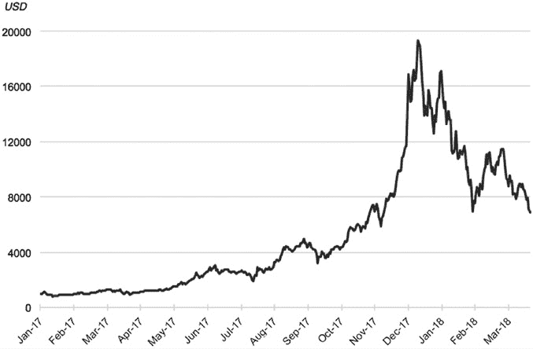
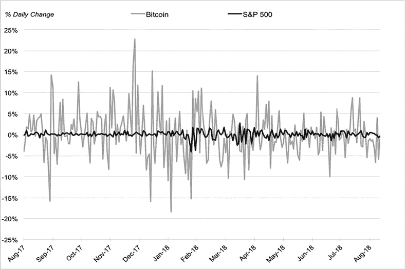

# [第二章
街区火爆](content.xhtml#bck_Ch02)

[基于公共资源的区块链开发和部署方法](content.xhtml#bck_Ch02)

桑恩·桑德贝克，A.T .金史密斯和朱利安·冯·巴根

## 介绍

区块链现在很火。为了更好地理解原因，我们必须考察支撑它们的政治条件。David Golumbia (2016)生动详细地阐述了比特币的技术基础设施——用加密证明取代国家或平台等“可信”第三方——与二十世纪右翼经济思想之间的相似之处，后者体现在约翰·伯奇学会和芝加哥经济学院等机构中。无论是作为一个数据库，一个网络，还是一个分布式账本，很明显，区块链不仅仅是一个代码或一个用于给数据记录和交易打上时间戳的计算工具。比特币不仅没有耗尽加密货币的潜力，加密货币也没有耗尽区块链的潜力。事实上，将伴随区块链的代币误认为总是加密货币是一个误导性的假设，排除了区块链在新自由主义激励计划之外的替代应用。

区块链是通过数字网络共享的分布式分类账或数据库。与互联网上传播的大多数信息不同的是，区块链像早期的互联网一样，是分布式的点对点系统。区块链之所以成为区块链，是因为网络中的每个节点都独立地更新和维护分布式分类账，而不是将主列表留给单个机构或主机。这一创新在互联网原始模型的捍卫者中引起了兴奋，因为它重振了对不受任何一个权威机构控制的去中心化信息系统的旧希望，同时还通过添加加密技术和管理激励的协议，在互联网的经典模型上进行创新。通过在没有中央集权的情况下解决真实性和授权问题，区块链被认为扩大了自下而上和无层级组织结构的能力，呼应了对现在已经失去(或者更准确地说从未实现)的互联网经典模式的渴望。

换句话说，正如 Rachel O'Dwyer (2016)所观察到的，区块链提供的是没有信任的合作的可能性。比特币和其他加密货币通常被宣传为“无信任架构”——在缺乏当地社区和地区监管机构等传统中介的情况下，信任的替代品。O'Dwyer (2016)强调，这种配置实际上与培养或建立信任完全不同。网络自由主义者和其他支持者提出的主张并不是我们可以在朋友、机构或政府中设计更高水平的合作或信任，而是我们可以完全抛弃社会和机构关系，而支持纯粹的技术解决方案。通过看似无害的选择，从算法上限制比特币的供应，或者通过要求计算的“工作证明”来创造新的货币，这种政治承诺，正如 Golumbia (2016)所强调的那样，被整合到系统的技术设计中。

迄今为止，区块链的历史表明，除了金融投机和追求惊人回报的高风险投资之外，这项技术的应用非常有限。这种动态的核心部分是由区块链的技术架构和新自由主义的社会和政治治理模式之间的关系的核心假设驱动的。正如过去十年所显示的，技术系统中的分散化与社会、政治或经济上的平等主义或公平做法之间没有线性因果关系(O'Dwyer，2016)。重要的是，正如 Maurizio Lazzarato (2013)指出的那样，新自由主义的特征，如去中心化、水平性和无结构性，与其说是对制度化监管机制的威胁，不如说是对经典自由主义经济学的许多僵局的理想解决方案，这些僵局产生了“以治理治理”的幻觉。

通过将技术架构与社会或政治组织模式混为一谈，区块链用协议的技术效率取代了信任(Galloway 2004)。这一章主要关注的是，区块链在新自由主义逻辑中的持续嵌入关系到什么——以及将会是什么。透过这一视角，我们首先考察了古典自由主义交换关系向新自由主义竞争关系的转变。对我们来说，最重要的是经济关系从交换到竞争的这种转变构成了一种新的“政府治理”模式，或者说经济主体范围的扩大，这种扩大已经内化为在区块链产生价值的协议。

在提取这些内在化的过程中，我们考察了网络自由主义者提出的货币论点，这些论点支持比特币是反对法定货币的理想货币形式，后者被认为在本质上是有缺陷的，因为它依赖国家认可的权威机构来获得信任和合法性。为了做到这一点，我们在转向影响区块链的三个更广泛的社会和政治因素:生产、价值和治理之前，调查了比特币协议背后的假设问题。第一部分的目标是剥去比特币激励机制给区块链带来的新自由主义包袱。最后，我们通过调查在开放网络中发展和部署高度可靠的、多用途的集体行动形式可能存在的其他选择来得出结论，这些选择是由区块链代表反对新自由主义资本主义和自由主义政治的项目而实现的。在这方面，我们认为，大多数现有区块链应用程序的问题不是它们试图激励政府，而是它们试图激励错误的政府。在最后一节，我们主要关注激励信任概念的尝试，这种信任是为共享而产生的，通过开放和参与性的共识过程记录下来，并作为共享资源实现。

## 经济人

新自由主义不仅恢复了阶级权力——资本主义是唯一可能的经济制度——也恢复了资本主义是现实的同义词。强加的(或“恢复的”)是从“经济人”或“经济人”作为一种交换动物向一种竞争动物的转变，这种竞争的趋势必须得到培养。Jason Read (2009 年，第 28 页)总结了这一转变的深远影响:“虽然交换被认为是自然的，但竞争被二十世纪的新自由主义者理解为一种人为的关系，必须加以保护，以防止市场形成垄断和国家干预的趋势”。新自由主义经济学中经济理性范围的根本扩大——断言经济学与所有社会、所有理性同延——不是一种自然状态，而是，如米歇尔·福柯(2008)所述，一种自然化的“政府性”,需要不断的干预和管理。

竞争需要国家不断干预，不是干预市场，而是干预市场条件。通过让可取的活动变得容易获得，让不可取的活动在社会和政治上变得昂贵，政府性可以影响选择的参数，从而在受试者计算他们的“理性”利益时，使某些结果更有可能实现(Lazzarato 2015)。这样，新自由主义让国家权力服从于市场的条件，言外之意是“政治问题”可以用术语来重新表述。这种重塑的有效术语不再是权利，而是利益、投资和竞争。古典自由主义假定权利是可以交换的——正如里德(2009)所观察到的，自由国家的法律主体(homo juridicus)是通过社会合约的交换构成的——而新自由主义提供了不可剥夺的市场现实。

为了制造“治理而不治理”的假象，行动者必须有很大的行动自由——在相互竞争的策略中“选择”。就其条件和效果而言，这种选择不是现实，而是意识形态的转变。正如 Lazzarato (2015)所观察到的，主要目标是通过让每个人都成为所有者，而不需要太多的直接国家监管，从而使人口去极权化。重要的是，这种所有权的自由并不在政治之外，而是，如 Read (2009)所强调的，通过利益、欲望和抱负而不是权利和法律运作的战略的一个组成部分。新自由主义的监管机制并不直接限制主权国家的行动。他们通过管理产生这些行为的条件来进行统治。

结果，新自由主义政府主义的轨迹产生了一个根本性的悖论；随着权力的限制越来越少，越来越少植根于监管的体制机制，它也变得更加激烈，充满了所有可能行动的领域，以便最有效地管理竞争的条件。一方面，人们期望政府为竞争创造条件。另一方面，政府应该避免成为市场的参与者。正如托马斯·莱姆克(2002 年)指出的，新自由主义通过试图创造一种它认为已经存在的社会现实来管理这一基本矛盾，认为竞争是社会关系的基础，同时促进这些关系。当代远离长期稳定工作、转向临时和不稳定劳动的趋势不仅是一种有效的经济战略——让企业摆脱合同和医疗及其他福利的昂贵承诺——也是一种有效的政治战略。 ^([2](Ch02.xhtml#fn2_2))

通过鼓励工人不要把自己视为社会和公共意义上的“工人”，他们通过团结和集体组织可以获得一些东西，而是视为“自我企业家”，一种经济视角，即市场视角，变得与整个社会共同延伸。谈到货币主权，这种经济关系范围的扩大已经内在化为在区块链产生价值的协议。比特币引起了人们的兴奋，因为它提出了一个问题的技术解决方案，这个问题以前需要一个可信的中介——货币，或者更具体地说，是保证和控制货币供应以及监控全球范围内资金再分配的问题。

正如新自由主义政府主义实际上并没有消除治理——而是减少了对系统中任何单一行为者的监管要求——区块链实际上并没有消除信任。他们所做的是最小化信任的数量。他们通过在系统中的不同参与者之间分配信任来做到这一点，激励他们作为理性代理人(理解为:经济人)根据协议定义的条款进行竞争。因此，区块链预示着数字秩序的到来，这一秩序通过将自由放任上升为自主、自我管理的算法，有效地融合了自由主义的治理哲学和新自由主义关于价值创造和分配的规则。

## 自由主义和新自由主义观点的交汇点

也许更准确地描述区块链的方式不是“无信任”，而是建立在分布式信任的基础上:信任所有人，作为经济代理人，在理性的自身利益和竞争的基础上参与网络。正如比特币的匿名设计者中本聪所说，“传统货币的根本问题在于它运转所需的所有信任。必须相信中央银行不会使货币贬值，但法定货币的历史充满了对这种信任的破坏”(Nakamoto 2008)。比特币和其他加密货币的支持者普遍认为，现代货币体系天生容易出现结构性通胀，并因其集中化而反复出现危机。因此，比特币及其分布式区块链账本被网络自由主义者誉为货币去中心化的革命——将货币的供应、分配和交换从任何个人或机构手中夺走。因此，像比特币这样的加密货币代表了新自由主义理论家和自由主义者所推崇的自由放任主义的顶点，但这在实践中是不可能的，直到现在。

比特币是如何在货币去中心化和自由放任(反)治理中完成这一壮举的？首先，比特币的供应量永久限制在 2100 万枚代币，这是一种模仿黄金等不可再生贵金属铸造的商品货币。因此，比特币在其架构中体现了金本位的理想化，这种理想化经常出现在反对法定货币的极右翼货币主义者身上。比特币的不可替代性凸显了它与贵金属铸币的相似之处:如果比特币丢失(比如，忘记了钱包密码或破坏了包含比特币钱包密钥唯一副本的硬盘)，它们将永远无法找回。

其次，比特币的工作验证算法——在该算法中，矿工通过解决将下一笔交易添加到区块链所需的密码问题来竞争新的比特币——根据比特币网络的整体计算能力或“哈希速率”进行自我调整，以便以稳定和可预测的速度释放额外的比特币。比特币在设计上是一种通缩货币，这种通缩的速度旨在随着时间的推移以稳定的方式进行。鉴于比特币的供应计划对矿商通过提高处理能力来争夺比特币的内在激励漠不关心，比特币的刚性通缩趋势甚至超过了最稀有的贵金属。简而言之，比特币的供应既不能加速，也不能贬值。

第三，由于比特币和大多数其他加密货币是由分散的用户网络供应和分发的，理论上，没有任何个人或组织可以垄断比特币，并扮演典型法定货币制度下国家或央行的角色。特别是对于比特币来说，高度竞争的工作证明算法创建了一个激励结构，可以理想地防范区块链中恶意分叉的可能性，因为攻击者必须积累整个比特币网络 50%以上的计算能力，才能改变交易块以对自己有利。考虑到天文数字般的成本，任何一家比特币矿商都不太可能做到这一点。

然而，网络自由主义者关于比特币在货币去中心化和自由放任治理方面的革命的主张，在其存在的过去十年中得到证实了吗？对比特币的生产、价值和“无治理的治理”算法的粗略概述表明，比特币作为一种可行货币的成功受到了其倡导者大力宣扬的属性的阻碍。

### 生产(和流通)

比特币的第一个也是最明显的失败，与关于比特币分散生产和分配的说法有关。正如 hme 等人(2015 年)指出的那样，比特币网络中有几个层面存在巨大的集中化潜力:货币交易所、数字钱包服务和矿池。 ^([3](Ch02.xhtml#fn2_3) 令加密货币的新自由主义倡导者懊恼的是，这种货币交易所和在线钱包提供了一个清晰的例子，说明即使在最自由的在线市场环境中，垄断趋势也很快确立，因为早期进入者获得了显著优势，并为后来者创造了巨大的进入壁垒。)

然而，对于比特币的拥护者来说，矿业卡特尔化一直是一个内生的棘手问题。尽管理论上任何人都可以成为矿工，但鉴于个体矿工在处理能力方面面临的巨大竞争，他们解决一个街区并获得比特币奖励的机会微乎其微。此外，从比特币中获利所需的哈希表早已淘汰了个人电脑，现在绝大多数矿池依赖于专用集成电路(ASICs)，其中大部分位于中国和其他新兴市场经济体，因为那里的硬件和电力成本相对低廉。与这种设置相关的成本使得比特币开采所需的硬件超出了大多数个人的承受能力，对于大多数新进入市场的人来说，唯一的办法是租用一部分基于 ASIC 的开采中心的处理能力。即便如此，这些人也可能需要数年时间才能看到投资回报。

采矿业的卡特尔化强调了一个事实，即信任一直存在于区块链系统中，对于加密货币的运行至关重要。采矿卡特尔化给工作证明区块链带来了一个固有的问题，因为任何获得整个加密货币网络 50%以上 hashrate 的池在理论上都可以“分叉”区块链，使其对自己有利，并开始双重花费加密货币令牌，使区块链不合法，并破坏对该货币的信任。但正如 Dowd 和 Hutchinson (2015 年)所指出的，加密货币开采的垄断趋势在理论上是绝对的，因为每个个体矿工最好向单个采矿池做出贡献，其中所有采矿池成员的成功概率为 1。在实践中，对于比特币和莱特币等一些更成熟的加密货币来说，这种趋势已经变得难以控制，这些货币的寡头垄断挖掘网络由少数大型资金池主导；超过 90%的比特币哈希分布在八个矿池中，其中四个最大的矿池占据了网络处理能力的大约 70%。 ^([4](Ch02.xhtml#fn2_4))

面对这种竞争的崩溃，比特币和其他证明有效的加密货币实际上依赖于矿池永远不会超过 hashrate 标志的良好意愿，并且没有内在的故障保险来确保这种情况永远不会发生。换句话说，治理的幽灵以决策的形式重新进入了比特币的区块链，这些决策是由一个小型的、未经选举的矿池集团做出的，这些矿池集团可以集体积聚某种权力来贬低比特币，只要有足够的哈希权力。这与中本聪所谴责的那种独断专行的央行权力非常相似。

### 价值

图 2.1 比特币的美元价格

资料来源:Quandl

加密货币货币有效性的第二个问题是大多数加密货币遭受的不稳定和不可预测的价值变化，单个比特币的价格在 2017 年出现了惊人的上涨，但随后在 2018 年初暴跌(见[图 2.1](Ch02.xhtml#fig2_1) )。这种购买力波动性使其根本无法作为价值储存手段，大多数比特币的长期持有者都投机性地投资于比特币，鉴于其通缩架构，比特币作为一种资产理论上应该增值(Weber 2016)。然而，对于那些打算使用比特币作为交易媒介的人来说，有一种内在的激励来尽量减少比特币的持有时间，因为比特币的价值波动不可预测。类似地，接受比特币作为支付手段的卖家通常会根据比特币与美元等既定货币的汇率浮动报价。从这个意义上说，比特币不仅不能作为价值储存手段，也不能作为记账单位，因为它的不稳定性导致价格被隐含地以既定的法定货币计价。

许多加密货币的不稳定性揭示了固定的名义供应和可预测的货币创造轨迹无法确保通缩趋势以任何有序的方式进行(Harwick 2016)。由于缺乏控制货币价值和供应的集中机制，比特币和其他加密货币的价格受到市场投机的支配，这不可避免地表现为极度波动。

图 2.2 比特币对标准普尔& P 500
的波动率

资料来源:Quandl

正如[图 2.2](Ch02.xhtml#fig2_2) 所示，比特币的每日波动性远远超过 S & P 500 等股指。这些突然的升值和下跌是如此严重和经常发生，以至于零售商和其他在线服务提供商几乎不可能承诺接受比特币支付。微软、Valve(最大的在线游戏分销商)和 Reddit 只是最近悄悄放弃支持比特币的公司。

### 治理(无治理)

第三个问题——在没有负责货币治理的中央机构的情况下，比特币的货币可行性——可能是比特币生存面临的最大挑战，也凸显了对自由放任原则的错误信仰。因为如果一种货币的价值对经济状况没有反应，或者相反，以一种不可控制的方式对普遍的市场情绪做出反应，那么这种货币有效促进市场交换的能力就会因为对这种货币的信任下降以及越来越倾向于将其视为投机资产而受到损害。因此，治理可能看起来限制较少，也不那么立足于监管的体制机制，但同时对于促进经济条件和市场情绪以便最有效地管理竞争条件变得更加重要。在这方面，比特币表面上不可信的架构并没有消除信任，甚至没有将信任最小化，而是将信任转移到协议上。

通过让区块链的投资者将自己视为“自我企业家”，比特币为一个以前需要可信中介的问题提出了技术解决方案，这引起了人们的兴奋。然而，虽然新自由主义在很大程度上是通过竞争性自我企业家的监管权力来治理的，但没有任何机制来解决保证和控制货币供应以及监测全球范围内价值再分配的问题。如果没有某种可以打破加密货币开采卡特尔化的集中式、分布式或替代形式的参与式参与，区块链作为管理、分配和确保危机时期代币价值稳定性的准确、可信和社会变革账本的神圣性将永远受到威胁。

比特币和其他加密货币的网络自由主义倡导者对制度的核心批评——即货币可以由非市场力量有效管理——谴责了货币的监管特性，正是这一特性让货币发挥了作用。从某种意义上说，网络自由主义者无法面对数字货币的普遍局限性，因为他们顽固地坚持关于货币起源的普遍神话，这种叙事描绘了一幅无政府主义的城市社区的画面，在这种社区中，国家和货币曾经是分离的，货币可以自由有效地作为一种效用最大化的技术来避免物物交换的阻碍(Gammon 2012)。但更重要的是，这些支持者忽略了现代货币的基本性质，因为货币和纸币的唯一区别在于，由不同机构组成的监管机构所实施的干预，这些机构是货币现状的最终担保人。

与任何私人开采的商品一样，比特币协议和其他证明有效的加密货币中嵌入的不可撤销的自由放任特性无法抵御难以避免的垄断趋势和投机性价值飙升。比特币和其他所谓的“不可信”加密货币架构只是通过依赖金融主观性和投机性未来作为区块链治理的主要推动力来促进新自由主义政府。然而，正如我们在下一节中所讨论的，如果我们以不同的方式处理治理问题，绕过“技术信任”的比特币悖论，区块链可以为开发和部署高度可靠、多用途的集体行动、参与和交换形式提供可能性，在开放的网络中代表反对新自由主义资本主义和自由主义政治的项目。

## 区块链能摆脱他们的新自由主义政府吗？

尽管比特币和其他区块链算法未能引入一种真正颠覆当今时代主导逻辑的治理形式，但问题依然存在:金融和个人激励的新自由主义逻辑能从区块链的架构中根除吗？正如我们所展示的，如果新自由主义政府主义被编码到比特币和类似加密货币的协议中，那么如果没有这种逻辑，区块链会是什么样子？新自由主义政府主义的影响是否玷污了区块链、分权或信任的理念，或者仅仅是它们的新自由主义变体？我们在这里建议的是，事实上，区块链有一些重要的东西可以提供给基于公共资源的项目，并可能被成功地用来灌输信任、交换、共享治理和集体资源部署的替代概念。然而，关键在于认识到这样一个事实，即区块链架构不仅仅是技术设计，而是一系列政治选择，正如我们所争论的那样，这些选择总是已经包含了治理。

尽管新自由主义政府是区块链最受欢迎的应用之一，但问题不在于区块链，也不在于分权、“无信任”架构、密码学或分布式账本。玷污区块链的是我们当代的社会历史时刻。不可否认，比特币等区块链应用旨在颠覆这一当代时刻，即使正如我们所认为的那样，它们最终重新宣扬了新自由主义政府主义。事实上，这恰恰支撑了比特币和区块链的吸引力:金融体系不是中立的，只为某些利益服务，而不是其他利益。因此，即使你不同意比特币的政治观点，或者正确地坚持认为比特币是一个不成功的设计，最终被它试图破坏的金融利益所占有，但还是有可能想象出一种基于公地的方法来对待区块链，而不是简单地照搬新自由主义的逻辑。

尽管区块链基于公共资源的应用没有比特币那样的担忧，但它们可能都担心政府会干预刺激竞争。这是因为国家不仅仅是一个国家；正如我们所说，这是一个新自由主义的资本主义国家。这个国家的主要职能之一是激励竞争、私有化和放松管制，以取代对集体资源的共享、基于公地的治理模式。因此，总是可以依赖新自由主义国家将共享资源分配给私营部门，作为刺激竞争的基础。这种模式深深植根于国家本身的逻辑之中，左翼政府无数次试图通过国家权力建立不同的经济秩序的失败证明了这一点。因此，在国家本身的特征得到根本改变之前，通过国家主义的部署建立替代秩序的希望微乎其微。对一些人来说，区块链是抵御这一问题的堡垒，甚至可能是解决凯恩斯主义国家提供的社会供给崩溃的办法。

因此，区块链可以为基于公共资源的项目提供关键优势，在拥有共同价值观的社区中建立一致性和信任，建立替代性价值来源，保护公共资源并允许服务不足的社区共享资源。因此，区块链有可能促进和放大对私有化公地、新自由主义政府、紧缩政治和由国家和企业权力主导的全球金融体系的替代方案的日益增长的渴望。

### 信任

在一个小组织中，每个人都互相认识，关系已经建立，区块链是不必要的。区块链只是作为一个定义明确的社区的有用工具出现的，在这个社区中，成员分享价值观，但不一定相互认识，没有正式的治理结构，国家机构和金融利益占主导地位。在这些条件下，如果一个社区寻求在一个强调参与和共享治理的框架内集中或管理资源，区块链提供了一种潜在的革命性技术来维护信任和管理共享资源。通过使用区块链来透明地管理、分配和确保共享资源的稳定性，可以在社区内培养信任，即使在外部，市场关系被强加于社会生活的每个方面和领域，紧缩政策进一步削减了国家提供的服务(Gammon 2012)。这样，区块链被一些人视为一种逃避生存沦为利润率和福特模式枯竭的方式，福特模式至少将利润和生产率增长与工资挂钩。

但这里的一个关键因素是，区块链应用程序的设计必须在范围上有所限制:这样的区块链不会破坏占主导地位的经济和政治体系，而是旨在规避它，为小规模组织提供替代工具。这种规避的第一步是建立不以初创企业方式构建的本地区块链，其最终目标是在全球范围内扩展(Pazaitis et al. 2017)，因为在全球范围内扩展时，必须从具有不同和冲突利益的各种各样的全球行为者那里达成共识。这一要求限制了行动者作为共享社区的一部分追求地方目标的能力。相反，通过社区规模扩大，一个确定的社区的共同价值观和目标可以保持其在区块链社会再生产中的指导作用。

在这种缩减的规模下，区块链作为适应当地社区需求和愿望的基于社区的项目的一部分，得到了真正的成功部署(Gloerich，Lovink，de Vries eds，2018)。将这一愿景带得最远的项目是社会钱包，这是一系列遍及欧洲的试点项目。社会钱包的一个实施是米兰的澳门，这是一个艺术家社区，他们使用社会钱包的区块链组织起来，记录社区之间的资源分配。该分类账对社区的所有成员都是可见的，确保资源的分配是完全透明的，这为维护公平和公正提供了至关重要的激励。分配的主要资源是基本收入，但社区成员也被赋予了创建、分配和跟踪资源分配以及根据对社区的贡献小时数兑换货币的权力。这些贡献是为了组织活动，照顾公共空间，或为城市公共资源做出贡献，它们基于劳动时间([www.macaomilano.org](http://www.macaomilano.org)，2018)。 ^([6](Ch02.xhtml#fn2_6))

### 价值

社交钱包的实施暗示了一种非常不同的价值观。与比特币的价值不同，比特币的价值与金融资产交换价值的推测价值有关，对于社交钱包来说，价值来自于公平奖励与社会再生产相关的所有劳动，而不会将价值降低为交换价值。Freecoin 的开发者表示，其区块链架构为社交钱包提供了基础，该特定架构旨在“让人们运行对其他组织透明、可审计的奖励计划”。它是为希望激励参与的参与式民主组织而设计的，不同于集中式银行数据库”([https://freecoin.dyne.org/](https://freecoin.dyne.org)，2018)。区块链对该系统至关重要，因为它们创建了一个信任管理系统，允许社区维护其贡献的神圣性，而不会将这些贡献降低到交换或货币价值。这意味着信任并不存在于中央权力机构，也不存在于“无信任架构”中，而是存在于社区中，社区被赋予了维护特定贡献价值的能力。这些时间被跟踪、记录和回报。成员通过为社区目标做出贡献来投入时间，作为回报，他们可以获得货币，这些货币可以用于社区其他贡献者提供的其他服务。

### 激励

通过在社区层面扩大规模并使用共享价值和目标作为区块链架构的基础，激励机制不必模仿已建立的加密货币的投机和金融化逻辑，正如我们所见，加密货币只是复制了新自由主义政府模式。此外，没有必要将加密货币和既定的货币形式视为相互排斥的。例如，一些共同为基础的区块链已被设计为“补充货币”。这些货币旨在补充而不是取代国家货币，旨在刺激当地社区的支出。例如，圣诞货币用于圣诞老人节。它允许节日游客将欧元兑换成圣诞货币，并在当地参与的商贩处消费。这个想法是把钱留在当地社区内部，在这个过程中建立信任、网络和团结。根据设计师的说法，这个想法是要“从头开始建造福利”(【www.santarcangelofestival.com/en/santacoin/】，2018)。这提醒我们，货币不仅仅是一种交换手段，而是社会关系的体现，它在设计上从来不是中性的。通过仔细选择我们如何设计货币架构——现在通过区块链技术可以在地方层面实现——可以建立新的激励机制，培育与新自由主义主导逻辑背道而驰的集体价值观和关系。基于公地的组织中的这种革命潜力使得公地活动家、左翼运动和参与式民主倡导者对区块链如此兴奋，这是有充分理由的。

## 结论

此时此刻，对区块链技术的社会投资至关重要，因为它仍然不在既定的机构利益和国家控制范围之内，其潜力仍然是无限的。在过去几年中，围绕区块链的炒作达到了白热化，主要是基于这样一种观念，即该技术本质上是反霸权的，对国家和既定法定货币具有破坏性(Herian 2018)。然而，正如我们在这里所展示的，鉴于自由主义区块链建筑的主导地位及其对新自由主义逻辑和金融化竞争激励的隐含坚持，区块链技术的革命潜力存在实质性限制。这些局限性的背后是一种基本信念，即区块链人天生缺乏信任，因此不受政府控制。但正如比特币和其他加密货币的历史所表明的那样，通过将经济人的幽灵转化为组织原则，这样的区块链只是复制了新自由主义政府的最糟糕特征，对破坏卡特尔化和垄断控制的趋势没有起到什么作用。简而言之，具有颠覆现有秩序的全球雄心的加密货币已经成为投机性和高度不稳定的数字资产，将区块链技术变成了金融暴利的怪诞平台。

然而，我们已经阐明的是，区块链技术不需要为这些目的服务。通过认识到区块链建筑固有的政治维度，从而认识到区块链的治理，就有可能为了当地社区和组织的利益和授权而重新设计技术。从这个意义上说，我们认为基于公共资源的区块链应用方法是可能的、持续的、充满潜力的。然而，这种对区块链的基于公地的方法必须缓和其扩展范围，以确保该技术在当地部署并服务于社区的目的，而不是旨在通过仅仅部署区块链来引发反霸权变革。套用波兰尼(1944/2001)的话来说，基于公地的项目必须旨在将区块链嵌入社区，而不是寻求将社会关系嵌入区块链本身(正如其自由主义支持者可能倡导的那样)。然而，通过这样做，区块链技术具有真正的潜力来促进实现区块链最初的系统变革目标所需的社会关系和集体组织。

## 注释

## 参考

勃姆、莱纳、尼古拉斯·克里斯汀、本杰明·埃德尔曼和泰勒·摩尔。2015."比特币:经济、技术和治理."经济展望杂志，29(2):213–238。

多德，凯文和马丁哈钦森。2015.“比特币会大败。”《加图期刊》，第 35 卷第 2 期:第 357-382 页。

米歇尔·福柯。2008.生物政治学的诞生:法兰西学院讲座，1978-1979。纽约:帕尔格雷夫·麦克米伦。

亚历山大·盖洛维。2004.协议:分权后控制如何存在。麻省剑桥:麻省理工学院出版社。

你好，厄尔。2012."新自由主义的心理和社会起源."批判社会学，39(4):511–528。

大卫·戈伦比亚。2016.作为右翼极端主义的软件。明尼苏达州明尼阿波利斯:明尼苏达大学出版社。

卡梅伦·哈维克。2016."加密货币和中介问题."独立评论，20(4):569–588。

赫里安，罗伯特。2018.“认真对待区块链。”法律与批判，29(2):163–171。

Inte Gloerich、Geert Lovink 和 Patricia de Vries (eds) (2018 年)，《MoneyLab Reader 2:克服炒作》。阿姆斯特丹网络文化研究所。

拉扎拉托，毛里齐奥。2013."政府在当前危机中的作用。"代在线，本文是在柏林发表的演讲的翻译。在[www.generation-online.org/p/fp_lazzarato7.htm](http://www.generation-online.org)有售

拉扎拉托，毛里齐奥。2015.以债治国。洛杉矶:Semiotext(e)/Intervention 系列。

托马斯·莱姆克。2002."福柯、政府与批判."重新思考马克思主义，14(3):49–64。

中本聪(2008)比特币:点对点电子现金系统。[https://bitcoin.org/bitcoin.pdf](https://bitcoin.org)(2019 年 1 月最后一次访问)。

奥德怀尔，瑞秋。2016.“区块链和他们的陷阱。”在 Trebor Scholz 和 Nathan Schneider(编辑)的《我们的黑客和拥有:平台合作主义的兴起，对未来工作和更公平的互联网的新愿景》一书中。纽约:或者书。

Pazaitis，Alex，Primavera De Filippi 和 Vasilis Kostakis。2017.“共享经济中的区块链和价值体系。反哺的例证。”技术预测和社会变革，125:105–115。

卡尔·波兰尼。1944/2001.伟大的转变。波士顿:灯塔出版社。

读吧，杰森。2009."经济人谱系:新自由主义和主体性的产生."福柯研究，6(1):25–36。

韦伯，打。2016.“比特币和货币的合法性危机。”剑桥经济学杂志，40:17–41。