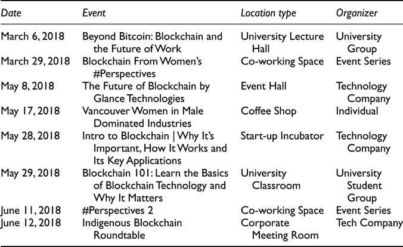

<title>Blockchain and Web 3.0</title>  <link rel="stylesheet" type="text/css" href="../stylesheet.css"> <link rel="stylesheet" type="text/css" href="../page_styles.css">

# [第四章
见面会](content.xhtml#bck_Ch04)

[在区块链为女性创造空间](content.xhtml#bck_Ch04)

菲利帕·r·亚当斯、朱莉·弗里佐·巴克、贝蒂·b·阿卡和彼得·a·周·怀特

## 介绍

区块链有个性别问题。科技行业的性别差异仍然是女性面临的一个持续存在的、证据充分的挑战(Byrne，2017)。区块链代表了这种熟悉趋势的更糟糕的情况，只有 5-7%的女性加密货币投资者(Tans，2018)。自比特币出现以来的短暂历史中，区块链一直是男性主导的领域。它植根于它声称要破坏的金融和技术行业，并以“比特币兄弟”等刻板印象为特征(鲍尔斯，2018)。一个极端的例子是，最近在迈阿密举行的北美比特币会议上，88 名发言者中有 3 名是女性，活动以脱衣舞俱乐部的派对结束(Primack，2018)。然而，女性正在越来越多地影响区块链的发展，并在一些最成功的初创企业中变得更加明显(Bowles，2018)。更广泛地说，对区块链感兴趣的妇女的当地聚会为不同专业水平的妇女提供了在区块链学习和建立关系网的机会(Griffith，2018)。作为一项新兴技术，区块链的定义、发展和传播仍在固化。这为学者提供了一个机会来评估技术的早期阶段，并潜在地影响其发展，以使尽可能多的用户受益(Callon，Law 和 Rip，1986)。因此，在调查这种新的技术-社会组合时，考虑区块链的技术、经济和性别方面是很重要的(Kitchin，2014)。这样做，我们可以确定相关的行动者和社会团体，并探索谁有权力塑造这一新兴技术的过程。我们感兴趣的是区块链如何成为一个潜在的“颠覆性创新”(Christensen，1997)，因为它在性别差异中扩散不均匀。

2019 年区块链将迎来十个年头。它已经经历了几个发展阶段。区块链 1.0 展示了数字货币的可行性，这种货币可以由人们而不是政府来创造和管理。区块链 2.0 将该技术的范围从货币扩展到了其他应用。智能合约使开发人员能够将区块链用于其他应用程序和自我管理的 exchange 方案。以太坊社区是区块链向其他领域扩张的典型例子。区块链 3.0 技术超越了加密货币和智能合同，彻底改变了更广泛的社会应用，包括政府、卫生、艺术和文化(Swan，2015)。这特别代表了对妇女的承诺，为全球 42%的妇女提供了金融服务，这些妇女在区块链没有银行账户、安全的身份记录和土地所有权登记册，为发展中国家的妇女提供了金融服务，并为投资加密货币的人带来了潜在的经济收益(Allen，2018；汤姆森，2017；Lielacher，2018)。改善性别不平等不仅是一个紧迫的道德和社会问题，也是一个经济问题。2015 年的一份报告发现，通过促进妇女在工作和社会中的平等，到 2025 年，全球 GDP 可增加 12 万亿美元(Woezel et al .艾尔。).全球区块链商业理事会(Global block chain Business Council)首席执行官桑德拉·罗(Sandra Ro)评论道:“(T)除了技术发展之外，还有人类、文化转变的因素。”。虽然区块链已有十年历史，但它仍处于采用和推广的早期阶段。区块链还有很长的路要走，才能扩大到作为数字货币或去中心化网络的主流用途。然而，开发者和早期采用者认为，它有可能重组和民主化价值分配的方式，以带来一个更公平的世界。当然，我们以前在其他 1.0 和 2.0 中听到过这种充满希望的话语，如互联网和社交媒体。区块链的未来仍不明朗。这个不确定的空间是理解人们如何协商他们对未来的希望和恐惧的关键时刻。

在这一章中，我们将区块链作为一个重要的场所进行研究，探索一种新兴技术的性别化实例。我们从技术女性主义的角度分析了区块链聚会中女性的话语和实践。技术女性主义反思性的“技术的社会塑造”观点强调了性别和技术如何在技术人工制品、社会关系和文化意义的无缝网络中共同进化(Wajcman，2004)。这一立场挑战了技术中立和无价值的流行观念。在这一框架内，性别和区块链教都被视为构成当代生活的一部分，而不是与社会分离的。我们的观察探索了本卷中包含的分散技术的一些社会经济方面和后果。

## 理论框架

技术方法的社会塑造(Pinch & Bijker，1987；Mackenzie & Wajcman，1999)强调了人类的偏见，无论是有意还是无意，都会影响创新的设计、轨迹和社会价值。这些学者认为技术与文化、价值观和社会认可的实践直接相关。技术历史学家 Ruth Schwartz Cowan (1976 年)描绘了一幅引人注目的画面，对比了蒸汽机的大量文献和婴儿奶瓶的类似创新，两者都是具有社会意义的技术。新技术通常有助于某些社会群体巩固权力，同时削弱其他群体的权力。例如，Winner(1980)对新泽西州郊区发展的研究揭示了美国种族关系的地缘政治背景。建筑师设计的桥梁阻止了工人阶级和以黑人为主的社区的公交车进入以白人中产阶级为主的地区的海滩。物理学家 Ursula Franklin 将技术概念化为一种思维和实践，因此:“当某些技术和工具主要由男性使用时，男性就成为这些技术定义的一部分”(1999 年，第 8 页)。

在 20 世纪 90 年代，女权主义学者庆祝互联网的解放潜力，以消除性别不平等的差距(Haraway，1991；植物，1997 年；特克尔，1995 年)。网络女权主义强调女性的能动性和主体性。技术本身被视为对女性的解放。然而，这种技术传道者的方法过分强调了技术的作用。对电子人、灵活身份和社会变革的热情往往忽视了持续的性别挑战。到 21 世纪初，学者们开始在性别理论和科学技术研究之间进行卓有成效的交流，以便将技术作为社会物质或社会技术实践来研究。特别是，Judy Wajcman 的技术女性主义融合了网络女性主义和技术的社会塑造理论的见解，将“性别和技术之间的相互塑造关系概念化，其中技术既是性别关系的来源，也是性别关系的结果”(2004 年，第 7 页)。

技术女性主义在技术爱好者和技术恐惧症之间达成平衡，“探索数字化时代女性日常生活和技术变革相互关联的复杂方式”(Wajcman，2004 年，第 6 页)。妇女对技术的使用往往同时促进和限制了她们的身份和经历。例如，社交媒体允许新形式的厌女症和对妇女的骚扰，同时也促进了妇女对这种虐待的集体抵抗，如#metoo 运动(Mendes，Ringrose 和 Keller，2018 年)。同样，尽管区块链的文化以男性为主导，但该国妇女正积极参与全球经济赋权运动(联合国妇女署，2018 年)。技术女性主义提供了一个细致入微的视角来分析性别和技术中固有的复杂性和矛盾。

罗杰斯(2003)的创新扩散是我们用来分析特定技术如何以及为什么以特定方式被采用的一个补充理论透镜。扩散是指创新通过各种渠道在社会系统成员之间传播的过程。这是一种与新思想传播有关的特殊类型的交流。目前，区块链正处于扩散的最初阶段。区块链的定义一直在变化，无论是字面上还是象征性的。在符号学的层面上，我们观察到许多新闻报道、学术论文和地方会议都以“区块链是什么”为开头一旦一项技术成功地扩散到日常使用和公共话语中，定义就固化了，也就没有必要再去定义它了。在社会经济层面，区块链教也仍然处于其扩散的最早期阶段。它最适合哪些群体和事业？

STS 对基础设施的研究调查了创新是如何扩散、巩固和消失在日常使用的背景中的。这一过程具有社会经济意义。Star (1999)将基础设施描述为嵌入的、透明的、作为成员学习的一部分、与实践惯例相联系的、建立在已安装基础上的。在这种情况下，区块链是建立在男性主导的科技和金融行业现有结构的基础上的。作为一种基础设施，区块链需要一种传统上排斥妇女的社会技术专长。正如一位技术历史学家所说，“自上而下的结构性歧视的性别化历史定义了英美世界现代计算产业的形态”(Hicks，2017)。这个项目试图解开男性主导的空间和文化习俗之间的复杂关系(Wajcman，2004；吉尔，2007；吉尔，2011；伯恩，2017 citeNeely，2018)。我们通过研究区块链聚会的作用，探索了女性如何创造她们自己的空间并进入男性主导的世界。我们通过询问几个研究问题来集中我们的调查:本地聚会如何塑造区块链技术的定义、发展和传播？女性如何塑造区块链聚会和被其塑造？演员如何在区块链聚会中使用性别话语？性别在区块链发展中的作用是什么？

## 方法学

在我们的实地工作中，我们通过技术女性主义的视角观察了当地的聚会，以分析性别和区块链教是如何相互影响的。我们在加拿大不列颠哥伦比亚省温哥华市的各种区块链聚会上进行参与者观察，温哥华是一个以活力、多样性和创新而闻名的技术产业中心(Simon Fraser 大学道德批准#2018s0237)。这座城市是一个新兴的区块链社区的所在地，其中包括专门从事智能合约的 Etherparty、区块链咨询公司 Vanbex 和制作了第一款区块链游戏 Cryptokitties 的 Axiom Zen 等公司。当地人对区块链的兴趣也通过每周在这座城市及周边地区举行的许多与区块链相关的活动表现出来。

学者们研究了 meetups 作为研究社交网络和信息共享的有价值的网站，其方式不同于其他空间，如工作场所或在线社区(Sessions，2010；沈&凯奇，2015)。“meetup”是兴趣相投的人面对面的聚会。它可以是在当地咖啡店定期举行的非正式会议，也可以是正式场合的短期学习活动。一个半专业的同行团体可以出现并定期会面。参与者将现实世界的会议和数字平台结合起来，相互支持，传递信息、工作机会和基于实践的社会关系(Benkler，2006；Hindman，2009)。我们参加的活动规模从 15 到 90 人不等(参见附录)。大多数活动发生在工作日晚上，有两次是全天活动。我们发现其中一些侧重于演示，更具公司氛围，而另一些则以讨论为主，不太正式。公司举办的活动通常包括与区块链有关的服务、产品或工作场所的简短推销。有些活动是免费的，有些是每张票 50 或 100 美元。

我们发现 meetups 是分析区块链发展和性别化的理想观察点。在网上简单搜索一下区块链当地的聚会，就会出现一个男女聚会的列表，包括“比特币绅士俱乐部”和“加密女巫未来主义者早午餐”我们参加并分析了区块链当地的各种聚会和活动，以便从自然环境中收集详细的观察和丰富的见解(Babbie & Benaquisto，2010)。我们参加的聚会面向各种受众，包括区块链初学者、学生、男性主导行业的女性、专业人士、程序员和潜在的加密货币投资者。这些人们围绕共同兴趣和主题交流的空间是全球趋势的本地示例(Griffith，2018)。区块链聚会吸引了不同技术经验、背景和动机水平的人。与会者聚集在一起，将抽象的技术工具和创新与具体的社会世界联系起来。作为这些活动的参与者，我们观察了聚会的形式和内容，特别关注参与者之间的话语和性别角色。在温哥华举行的 meetups 和其他区块链活动的开放、热情性质，使它们成为考察参与者形成对话和聚焦方式的绝佳场所。我们分析了女性在哪里、为什么以及如何与区块链这样的新兴技术互动，因为她们的互动塑造了技术本身的定义和发展。

由于区块链技术还处于早期阶段，企业家、技术工人和好奇的普通大众都在决定它的进程中发挥着作用。技术的社会塑造部分是通过公共领域的对话、辩论和讨论来实现的，比如聚会。我们观察了会议的框架和焦点、与会者以及提出的问题。我们参加了一系列不同的聚会，有些是针对女性或少数利益群体的，有些则没有特别的性别焦点，目的是为了比较和对比它们，尽管我们在每次聚会上都保持对性别动态的观察。在我们通过社交媒体在线确定的许多活动中，[Meetup.com](http://Meetup.com)和[Eventbrite.com](http://Eventbrite.com)，我们的研究团队在 2018 年 3 月至 6 月的五个月时间里亲自参加了八次聚会。

## 调查的结果

根据我们在研究过程中所做的许多观察，出现了两个主题。首先，区块链会议反映了通常在新技术采用曲线开始时观察到的机遇和挑战。其次，以女性为重点的区块链聚会既是反抗的空间，也是支持的空间。

## 区块链 101:来自“区块链是什么？”到“超越比特币”

我们参加的每次聚会都以介绍区块链开始，这是为非技术、非专业观众设计的。大多数演讲者以一张概述“什么是区块链”的幻灯片开场这个问题之所以如此持久，是因为这项技术很新，但也是因为对于广大受众来说，这是一个很难回答的问题。区块链明显的技术密度使得人们认为区块链在技术上比实际情况更复杂。演示者和 meetup 主持人在处理这种复杂性时取得了不同程度的成功。一些主持人和小组成员使用隐喻、图表或笑话来表达技术的相关性和有用性。在一次活动中，在对区块链如何工作进行了长时间的讨论后，演讲者似乎改变了话题，他建议道:“你并不真正知道你的电脑或汽车是如何工作的，你只知道如何使用它们以及它们能为你做什么。这将与区块链类似。”然而，按照汽车的比喻，区块链仍处于早期阶段，大多数普通用户还不知道如何转动钥匙和启动它。所有这些讨论都指向这项技术的新奇之处，以及对它将如何发展的好奇。

对于演讲者和参与者来说，每次聚会在基调、空间定位和动机上都是独一无二的。例如，一些人在行话、座位安排和社交网络方面有更大的公司倾向。相比之下，有更多的非正式活动，其中一些是针对妇女和少数群体的。非正式的活动更倾向于学院式和对话式，而其他的活动在行话、座位安排和社交方面更倾向于公司化。例如，一个女性聚会强调了性别焦点，首先是在休息室环境中的葡萄酒和开胃菜，然后与会者在摆放着新鲜鲜花的桌子前就座。与会的女性年龄不等，有年轻的，也有经验丰富的专业人士。在演讲开始前，所有与会者都向整个小组介绍了自己和他们参加的动机。有些人是第一次了解区块链，有些人是区块链的程序员，有些人是成功的加密货币投资者。这种群体范围的介绍风格与我们在其他聚会上观察到的更典型的做法形成了鲜明的对比，即作为一种简短、非正式的破冰方式向坐在你旁边的人介绍你自己。

总的来说，我们发现非正式会议更有成效，因为它允许参与者相互联系，组织者可以根据参与者的兴趣定制内容。相比之下，更精致的企业活动更多地将与会者定位为观众，而不是活动过程中的代理人，这也为演讲前后的对话部分定下了基调。我们在聚会中观察到的一个统一因素是社区和支持感。这种基调与科技公司的竞争和个人主义文化截然不同。使用富兰克林对技术作为实践的定义，我们可以将聚会本身视为开放接入技术。即使在微软或当地科技公司赞助的聚会上，也有一种分享学习和合作的感觉，关于一些新的和令人兴奋的东西。一些聚会以邀请参加社交媒体小组或邮件列表结束，以便参与者之间的后续对话。

大多数演讲都将加密货币作为区块链最著名的例子，事实上，许多与会者都对如何开始投资这个新市场表示了兴趣。一名演示者花了一个多小时描述比特币交易的细节，并完成了一个模拟练习，参与者签署并交换了纸张。人们常常把区块链和比特币的定义混为一谈，与此形成鲜明对比的是，人们越来越意识到区块链在公共生活其他领域的潜在好处。例如，在两场活动中对加密货币进行了长时间的讨论后，观众问演讲者是否可以讨论加密货币以外的区块链应用。在另一次聚会上，一位医生问她在哪里可以找到更多关于健康类区块链应用的信息。为了对比不同类型的专业知识，我们参加的学生主导的活动主要由计算机科学本科生组成，他们对如何挖掘各种加密货币有复杂的问题。大多数发言人热情介绍了区块链的潜在利益和机遇。在各种情况下，怀疑或困惑的观众提出了关于区块链潜在风险或挑战的重要讨论。例如，一位与会者质疑区块链食品来源声明的价值。如果涉及到对产品进行物理或数字标记，这些信息不会被泄露吗？这引发了对进入区块链的数据的质量和核查过程的有益讨论。一些聚会利用了与会者的怀疑态度，比如一个题为“区块链或不区块链:你的公司需要区块链解决方案吗？”

区块链聚会和活动在温哥华的迅速扩散表明了区块链目前的发展形成阶段。甚至在一年前，关于区块链的事件或公开讨论还少得多。我们注意到，一些活动在后勤和展示方面都很精致和专业。其他的似乎是随意或匆忙拼凑起来的。早期采用者，或者那些渴望给自己定位的人，都在叫嚣着要进入区块链舞台。我们观察到的两个例子说明了这一点。我们参加了一个由当地“区块链妇女”组织的“区块链介绍”活动，在[meetup.com](http://meetup.com)上做了广告。当我们到达时，我们意识到事实上不同的团体，都与同一个创业孵化器组织有关联，已经为这个聚会做了广告。我们原本打算参加一个针对女性的聚会，由活动清单上照片中的女性主持。然而，她当天未能赴约，她的一位男性商业伙伴(他通过区块链当地的一个不同团体宣传了同一活动)做了陈述，出席者男女混杂，女性代表略少，在讨论中的声音也小得多。当主持人宣布他将是唯一的发言人时，我们注意到语气的转变。一些女性参与者对这一事件不是她们所期望的表示失望。对于参与者来说，交际环境很重要。在另一个例子中，当我们按照 Eventbrite 的门票清单到达“区块链中的女性”聚会时，我们意识到它已经被取消并被重新安排在稍后的日期，没有通知，所以我们出现在一个空房间里。这种聚会有一种紧迫感，在这种情况下，伴随而来的是混乱。这些观察结果支持了我们在创新扩散曲线的最早期阶段对区块链现状的评估。

## 反抗和支持的性别空间

区块链的性别问题在我们参加的所有聚会中都很明显。在一家初创组织的“区块链入门”会议上，所有以女性为主的会议主持人和一名男性主持人都强调了科技领域的性别差异，并补充说这种差异在区块链甚至更明显。这位男性演讲者建议，组织聚会的目的是让更多的人了解区块链，这是平衡性别比例的一种方式。在针对普通观众的聚会和专门针对妇女的聚会中，性别问题都发挥了作用。“在温哥华顶级区块链创业公司中遇见女人”等聚会的存在表明，有必要为女性主持的聚会创造一个空间，主要针对女性。这些聚会旨在抵制过于男性化的区块链空间，并通过强调区块链妇女在这一空间中的领导地位来促进她们之间的相互支持。

在一次女性聚会的演讲开始时，主持人问观众，“为什么你觉得区块链没有更多女性？”沉默了一会儿，这是少数几个首先发言的男性之一，他评论说，女性在历史上一直被抛在科技和金融的后面。区块链延续了这种文化上的群体互动。几周后，我们在一个男性主导行业的女性聚会上采访了一位女性，她解释了自己如何喜欢科技和视频游戏行业以女性为中心的活动。但她注意到更多的男性参加了他们的活动，这些男性往往比女性更直言不讳，这种方式闯入了女性在科技领域可以声称拥有的少数领域之一。

我们向“男性主导行业中的女性”的组织者询问了她在市中心的一家咖啡店发起这个每月一次的活动的动机。她的回答呼应了我们与其他与会者的几次对话。“如果这个领域没有适合你的空间，你需要创造你自己的空间来取得成功，并提高你的工作水平，”她说。她曾在采矿业工作过，希望与同领域的其他少数民族妇女建立联系，寻求支持、建立关系网和职业发展。因此，组织这些聚会是她突出女性在各种男性主导的行业中的成功和斗争的方式。男性主导行业女性会议的一名与会者谈到，她参加了各种各样的活动，但真的很喜欢女性创造的活动，因为这些活动的能量和对话“就是不一样”。女性更愿意说出自己的希望和恐惧，而不会被解雇或骚扰。

我们发现，由女性发起和关注女性的活动是对男性主导的技术和金融领域的抵制，也是在冷漠的技术领域的更广泛背景下相互支持的空间。在各种对话中，女性将区块链视为一个平台，让她们在科技和金融界崭露头角。一些女性组织者谈到，有必要通过聚会提供的各种教育和交流机会进入区块链世界。一位演讲者以一句振奋人心的口号开始了她关于区块链的演讲，讲述了如果女性不理解并参与区块链空间，她们将如何错失良机，并讲述了男性如何在过去从金融和技术创新中获得了不成比例的好处。在她的一张介绍性幻灯片中，她使用了 Reddit 和 Pinterest 的并排截图来突出分别由男性和女性主导的在线社区。这个例子说明了这些技术平台的性别和社会文化方面。

我们注意到，在妇女为妇女设计的聚会上，组织者宣称他们是区块链领域的领导者，而不是追随者或初学者。相比之下，大多数面向普通观众的活动主要由男性小组成员和主持人组成。这凸显了男性作为该领域事实上的专家的偏见，特别是在涉及数字和金融技术的领域。在“区块链的未来”峰会上，男性占发言人的 70%以上。男性主持人讲述了区块链的金融和技术等话题。相比之下，女性演讲者关注的是区块链将如何影响其他领域，如医疗保健、艺术和营销。这表明，由于近年来妇女在这些行业实现了更好的性别平等，她们被认为有足够的可信度向更广泛的受众讲述区块链在这些领域的情况。相比之下，同一场活动中的男性演讲者更有可能专注于加密货币或区块链的商业相关方面，这似乎是一种“天然的契合”，因为男性在这些领域的代表性过高。

比特币和以太坊等加密货币的面板是寻求新投资机会的与会者的热门选择。这两种加密货币在 2017 年底和 2018 年初价值飙升后，受到了媒体的广泛关注。许多与会者将聚会视为获得相关信息和联系的机会，以便做出明智的投资决策。其他已经投资加密货币和其他区块链产品的参与者参加了聚会，以获取和分享更先进的知识。例如，在 Block-chain from Women ' s Perspectives meetup 的介绍会上，一位经营着一家成功的在线企业的参与者评论说，她一年前曾鼓励丈夫投资加密货币。当他不同意时，他们不投资，因为他管理他们的投资。自那以后，比特币的价值大幅上升。她不想错过未来的投资机会，所以现在她积极主动地研究如何自己投资。因此，她参加这一活动是她自学并随后启动投资程序的方式。

以女性为中心的活动颠覆了展示女性多样化专业知识的常规。专门针对女性的聚会让女性可以进行不围绕性别的对话。举例来说，第一届“女性在区块多样性区块链会议”在纽约市举行，50 多名女性区块链专家就筹集资本、创建创业公司和法律问题进行了发言，所得收入将用于一个慈善基金，以支持技术领域的妇女和女孩(Women on the Block，2018)。在这样的聚会上，没有必要召开“区块链妇女”的专题讨论会在我们自己的观察中，我们注意到女性在这样的聚会上交流个人故事、名片和专业见解。这些活动中的许多也为听取与会者关于应该涵盖哪些主题的兴趣留出了空间，然后演示者针对这些主题定制对话。男性主导行业中的女性会议完全是参与者驱动的，因为参与者决定了对话的主题、参数和节奏。主持人的唯一指示是定期提醒参与者定期更换座位，以便与不同的人互动。以妇女为重点的活动本质上是代理性的，鼓励妇女参与。

## 结论

通过我们的实地调查，很明显，女性已经意识到了技术和金融领域的性别差异。组织者和参与者都将区块链会议视为学习更多技术、实现个人和职业目标的场所。我们发现，女性确实在影响区块链的发展，正如区块链正在塑造女性在科技和金融领域的经历，尽管她们的代表性较低。我们还发现，妇女们热情地创建了许多这样的聚会，以满足妇女参与区块链环境所需的可获得的、支持性的、教育性的社交网络。区块链正处于扩散和创新的早期阶段。那些参与当前围绕区块链的各种技术-社会实践的人将决定它的发展方向、发展方式和使用方式。因此，探究妇女在区块链发展的这一阶段的作用至关重要。

我们对区块链当地聚会的研究表明了话语在新技术发展中的重要作用。关于技术领域女性的现有研究大多集中在工作场所或行业，以及影响性别差异的趋势或具体政策。区块链是一种新兴的、去中心化的技术，正在以去中心化的、有机的方式扩散。这项技术对学者提出了新的挑战，但对未来的研究、开发和创新具有巨大的潜力。技术女性主义强调了这样一个事实，即每一种社会动态都在影响着我们与技术的关系，同时也被我们与技术的关系所改变。基于身份的不同方面，技术以不同的方式支持或约束个人。这些聚会展示了区块链技术的社交面，并帮助说明了女性在一个历史上排斥她们的空间中发出声音的一些方式。通过我们对当地温哥华区块链社区的研究，我们清楚地看到区块链的性别问题依然存在。然而，同样明显的是，无论是技术或金融背景的女性，还是完全没有区块链经验的女性，都有兴趣获得区块链提供的潜在好处。

区块链的支持者声称，去中心化和民主化是一个积极的愿景，有可能改善妇女的生活。在早期，很难说这项技术是否真的会这样发展。现在区块链社区中的积极参与者是那些其想法将随着区块链的发展而塑造它的人。在我们观察的几次会议中，与会者和发言人都提到了区块链的性别差异，这一因素削弱了支持者对权力下放的主张。聚会反映了区块链拥有巨大的机会，即使在新兴技术的挑战和波动中。通过在类似我们参加的活动中的对话，女性正在积极塑造区块链空间。通过聚会，这些女性正在努力让自己和他人了解技术，并利用技术和她们自己的社会关系创新解决无数问题的方法。区块链开发者在平台上构建的东西比技术本身更重要。同样，如果没有各种各样的声音积极地塑造技术，区块链就有重新书写它声称要拆除的现有权力结构的危险。区块链的妇女聚会是一个例子，说明一个小而扩散的运动如何塑造一个正在形成的新技术的进程。

## 参考

艾伦，B. (2018)。解说:区块链赋予全球女性权力的三种方式。2018 年 3 月 1 日检索自[http://fortune . com/2018/02/13/区块链-比特币-cryptocurrencywomen-rights/](http://fortune.com)

巴比和贝纳奎斯特(2010 年)。社会研究基础(第二版。).多伦多:尼尔森教育。

本克勒，Y. (2006 年)。网络的财富:社会生产如何改变市场和自由。康涅狄格州纽黑文和伦敦:耶鲁大学出版社。

邦德，F. (2018 年 6 月 21 日)。高层女性正在推动加密货币的发展。2018 年 7 月 19 日检索自[www . raconteur . net/finance/women-at-the-top-is-driving-crypto-evolution](http://www.raconteur.net)

新泽西州鲍尔斯(2018 年 2 月 25 日)。使用加密货币的女性反对“区块链兄弟”。纽约时报。检索自[www . nytimes . com/2018/02/25/business/cryptocurrency-women-区块链-bros.html](http://www.nytimes.com)

Byrne，C. (2017)。四张图表显示科技仍然是男人的世界。2018 年 4 月 6 日从[www.weforum.org/agenda/2017/08/women-in-tech-gender-parity/](http://www.weforum.org)检索

卡伦，法学硕士，法学博士和里普，A. (1986 年)。如何研究科学的力量？描绘科学和技术的动态(第 3-15 页)。伦敦:帕尔格雷夫·麦克米伦。[https://doi.org/10.1007/978-1-349-07408-2_1](https://doi.org)

克里斯滕森，C. (1997 年)。创新者的困境:将改变你做生意的方式的革命性的书。纽约:哈珀平装本。

考恩(1976 年)。家庭中的“工业革命”: 20 世纪的家庭技术和社会变革。技术与文化，17 (1)，1–23。

富兰克林大学(1999 年)。真实的技术世界。多伦多:安纳西之家。

吉尔(2007 年)。性别与媒体。剑桥:政治出版社。

吉尔(2011 年)。性别歧视重装上阵，或者说，又要生气了！女权主义媒体研究，11 (1)，61–71。土井指数:10.1080/14680777 . 3686767687

格里菲斯，E. (2018)。对于加密货币领域的女性来说，这是一项壮大她们队伍的新努力。2018 年 4 月 6 日检索自[www . wired . com/story/for-women-in-cryptocurrency-a-new-effort-grow-thes-ranks/](http://www.wired.com)

哈拉威博士(1991 年)。电子人宣言:二十世纪后期的科学、技术和社会主义女权主义。《猿人、电子人和女人:自然的再创造》(第 149-181 页)。纽约州纽约市:劳特利奇。

希克斯，M. (2017)。程序化的不平等:英国如何抛弃女性技术专家并失去其在计算机领域的优势(W. Aspray & T. J .米砂编辑。，第 1 版。).麻省剑桥:麻省理工学院出版社。

亨德曼(2009 年)。数字民主的神话。新泽西州普林斯顿:普林斯顿大学出版社。

基特钦河(2014 年)。数据革命:大数据、开放数据、数据基础设施及其后果。千橡，加州:鼠尾草。

Lielacher，A. (2018 年 3 月 3 日)。非洲的女性科技:认识在非洲开创比特币的女性。2018 年 4 月 6 日检索自 http://bitcoincafrica . io/2018/03/03/femtechin-Africa-women-in-tech-先锋-区块链-非洲/

麦肯齐博士和韦克曼律师(编辑。).(1999).技术的社会塑造(第二版。).巴克英厄姆和费城:麦格劳希尔教育/开放大学。

k .门德斯、j .林罗斯和 j .凯勒(2018 年)。#MeToo 和通过数字女权运动挑战强奸文化的承诺和陷阱。欧洲妇女研究杂志，25 (2)，236–246。

中本聪(2009 年 5 月 24 日)。比特币:一种点对点的电子现金系统。2018 年 3 月 5 日检索自[https://web . archive . org/web/20140320135003/https://bitcoin . org/bitcoin . pdf](https://web.archive.org)

M. T .尼利(2018)。适合当国王:华尔街的世袭主义如何导致不平等？社会经济评论，16 (2)，365-385 页。

t .平奇和 W. E .比约克(1987 年)。事实和人工制品的社会建构:或者科学社会学和技术社会学如何相互受益。在 W. E. Bijker，T. P. Hughes，T. Pinch 和 D. G. Douglas(编辑。)，技术系统的社会建构:社会学和技术史的新方向(第 17-51 页)。麻省剑桥:麻省理工学院出版社。

植物，S. (1997 年)。数字女性+新技术文化。伦敦:第四等级。

Primack，D. (2018 年 1 月 26 日)。比特币会议在一家脱衣舞俱乐部结束。2018 年 4 月 6 日检索自[www . axios . com/bit coin-conference-strip club-1516983254-35e 78 aad-ee30-4872-bfe 6-13190 DD 46061 . html](http://www.axios.com)

罗杰斯(2003 年)。创新的扩散(第 5 版。).纽约州纽约市:新闻自由。

塞申斯，L. (2010 年)。线下聚会如何影响线上社区。信息、交流和社会，13 (3)。

沈、凯奇(2015)。《出埃及记》到现实世界？评估线下聚会对社区参与和社会资本的影响。新媒体与社会，17 (3)，394–414 页。

Star，S. L. (1999 年)。基础设施的民族志。美国行为科学家，43 (3)，377–391。

斯旺，M. (2015)。区块链:新经济蓝图(第 1 版。).北京和塞瓦斯托波尔，加州:奥赖利媒体。

Tans，G. (2018)。为什么缩小科技领域的性别差距至关重要。2018 年 4 月 6 日检索，来自世界经济论坛网站:[https://www . weforum . org/agenda/2018/01/close-the-tech-gender-gap-Gillian-tans/](https://www.weforum.org)

Thomason，J. (2017 年)。区块链:妇幼健康的加速器？全球健康杂志，1 (1)，3–10。

特克尔，S. (1995 年)。银幕上的生活。纽约州纽约市:试金石。

妇女署。(2018).联合国妇女署的创新和技术项目。检索于 2018 年 2 月 28 日，来自联合国妇女署网站:[http://www . UN Women . org/en/digital-library/publications/2019/03/innovation-for-gender-equality](http://www.unwomen.org)

Wajcman，J. (2004 年)。科技女性主义。剑桥:政体。

胜利者，L. (1980)。神器有政治吗？代达罗斯，109 (1)，121–136。

Block 区块链大会上的女性——2018 年 5 月 13 日。(2018).检索于 2018 年 8 月 15 日，来自网站:[https://www.womenontheblock.io/](https://www.womenontheblock.io)

## 附录

表 4.1 温哥华区块链事件

