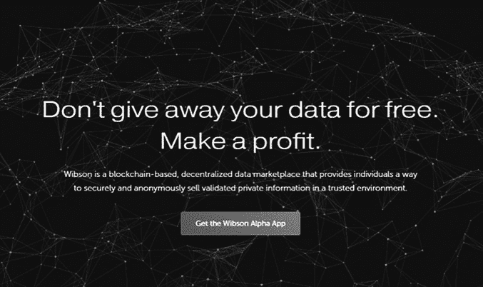
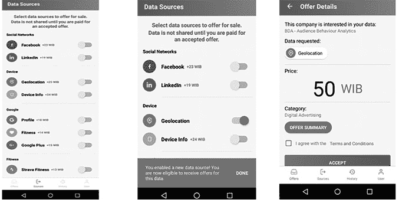

<title>Blockchain and Web 3.0</title>  <link rel="stylesheet" type="text/css" href="../stylesheet.css"> <link rel="stylesheet" type="text/css" href="../page_styles.css">

# [第十一章
区块链和数据市场](content.xhtml#bck_Ch11)

[从批评的角度看威布森的案例](content.xhtml#bck_Ch11)

吉列米娜·闫森

## 介绍

最近，比特币，一种最广泛的区块链加密货币，吸引了全世界的关注。很快，文学注意到它真正的新颖性是它的基础技术，区块链。区块链是一种创建分散的同行验证的时间戳分类账的方式，先验透明和匿名。在比特币的情况下，它记录现金交易，但它可以应用于各种商品(Preukschat，2017)。因此，研究人员开始关注这种技术的去中心化性质，强调其在社会和经济生活的不同领域中“民主化”商品流通和增强“社区”权能的潜力(Kosten，2015；Atzori，2015；维格娜和凯西，2016)。事实上，民主和权力下放多次被用作可互换的术语，指的是区块链破坏不同类型的中央信息中介的潜力(Scott，2014)。

在这种背景下，Wibson 应运而生。^([1](Ch11.xhtml#fn11_1))wib son 基于以太坊区块链，是一款专有的营利性移动应用，旨在连接数据的生产者(和所有者)(主要是个人)和数据购买者(主要是组织和公司)。如果数据生产者目前通过非排他性许可向脸书或谷歌等平台免费提供数据，并从中获利，维布森建议数据生产者通过应用程序出售数据。 ^([2](Ch11.xhtml#fn11_2)) 威布森告诉我们，“在威布森市场中，公民将首次能够参与到一个分散的数据市场中，这个市场既提供了经济激励，也提供了对他们个人信息的控制，而这一切都不会牺牲隐私”(威布森，2017)。正如我们将详细看到的，Wibson 对数据卖家是免费的，对买家收取费用。它还提供了关联公司检查数据的验证机制(Aitken，2018；希门尼斯，2018)。通过区块链，威布森承诺真正打破当前社交媒体业务的逻辑，“民主化”这个市场。对于对获取数据感兴趣的利益相关者，它承诺对用户有效数据的访问不会被像谷歌或脸书这样的公司控制和集中；避开中介，进入商业的壁垒将被拆除，或者至少减少。对于用户——数据所有者——威博森保证，他们不仅能够控制自己的数据，还能从中获得金钱利益。

这听起来是个好消息。然而，批判方法必须更进一步。事实上，一些作者已经提请注意链段的演变，强调了各种问题。

第一，不存在所谓的“区块链技术”(Pilkington，2016；Yli-Huumo 等人，2016 年；Preukschat，2017 年)，而是与其他技术结合发挥作用的几种区块链。从这个意义上说，区块链的第一种表达方式，即公共区块链，就像比特币所基于的一样，并不是最广泛的。综合来看，每个互联网用户都可以访问公共区块链(详见最后一节–Pilkington，2016)。但是现在各种私有和混合区块链正在出现(Shrier et al .，2016)。它们有一些共同的特征，但在其他方面有很大的不同，例如用户社区中某种类型信息的集中程度(Preukschat，2017)。这使人们对区块链的有效分权和“民主”的自然或内在特征产生了疑问，特别是关注那些与资本主义背景下的所谓企业家有关的人(Herian，2018)。因此，值得考虑每个区块链的具体特点。Wibson 是一个由私人区块链支持的专有应用程序，并在其各个层面与日益集中化的互联网相连(Zukerfeld，2010)。因此，有必要指出一个重要的参与者:该应用背后的公司 Gran Data，一个营利性的参与者。

此外，一些学者质疑区块链赋予社区权力的能力(Scott，2014；Pel，2015)。他们注意到，用户社区不是指社区关系的构建，而是指“通过数学契约法调解的防御性个人主义的避难所”(Scott，2014: 20)。事实上，威布森并非出生在真空中。主要盈利行为者对数据的使用已经成为不同协会和国家的目标，这可以被解读为该应用程序发布的背景。从这个意义上来说，我们可以问，这种文化和制度领域是否会导致对数据传输的公共效用的讨论，或者反而有助于巩固其他资本主义形式，而不会质疑公共和私人领域之间的关系。因此，需要考虑区块链的社会或外部特征，主要是监管。“赋予个人权力”，威布森清楚地表达了一种个人主义，这种个人主义隐藏在数学的“中性”法律背后的商业存在。

在这一章中，我们将进一步研究威布森，指出这些和其他可能的批评。这一案例研究涉及不同的概念(民主、权力下放、透明度、治理、商业化等)。)，我们无法全部分析。但我们能做的是将 Wibson 和类似的区块链应用置于正确的位置:首先，在资本主义和数字信息(DI)日益商业化的时期，其次，在一种数据市场中心化(包括脸书和谷歌等互联网巨头)替代另一种中心化(包括 Wibson)的过程中。

威布森是一个典型的案例，可以观察到区块链技术的潜力是如何被归入互联网商品化的逻辑中的，因此，抛开了关于公众意义的讨论。坦率地说，这代表了另一种形式的资本主义争论。

在这篇介绍之后，这篇手稿的结构如下。在接下来的两节中，我们将把区块链技术放在信息资本主义的背景下，特别是在数据商品化领域。最后一节将描述区块链的一般功能，特别是 Wibson。关于 Wibson，我们将重点关注(1)参与数据生产和商业化过程的行为者(个人行为者、投资者、拥有 app 的公司等。)，试图澄清他们之间发生的交流类型，以及(2)应用程序所基于的话语基础。最后，我们给出了结论。

本章主要是理论性的。在方法上，它基于二手资料(Wibson 的官方网站、白皮书和论坛——称为“媒体”——以及其他相关新闻材料)来描述 Wibson App 及其话语。不幸的是，仍然没有学术文献涉及 Wibson 或类似的应用程序。

## 理论起点:信息资本主义、信息商品和知识产权

在这项工作中，我们从当今时代可以被命名为“信息资本主义”(Castells，1997)的想法出发。与“知识社会”的概念相反，这一概念一方面旨在强调知识的经济和社会重要性，特别是由数字信息支持的知识。另一方面，它强调了这一阶段的资本主义性质。“资本主义本身经历了一个深刻的重组过程”(卡斯特尔斯，1997: 2)。我们简要地提到它的两个结构特征，那些对手稿至关重要的特征。

首先，在信息资本主义中，代理人的“生产力和竞争力”从根本上取决于他们有效生成、处理和应用基于知识的信息的能力(Castells，1997: 77)，更准确地说是数字信息(Zukerfeld，2010)。DI 不同于其他种类的知识是因为它的“可复制性”:它可以以接近零的成本被复制。因此，视频、文本、图像、软件、数据库，以及一般来说，所有由纯 DI 制成的商品(这里是“信息商品”——IG)，都逃离了传统或非数字商品的商品化逻辑(Cafassi，1998；Boutang，2004；鲁拉尼，2004；Zukerfeld，2010)。从这个意义上说，信息商品是非竞争性和非排他性的，这些特征可能导致把它们作为公共商品，本质上是不可商品化的商品(Ostrom 和 Ostrom，1977)。

第二，与第一个相关，知识管制(即知识产权)近年来急剧扩大和增长，成为现阶段特有的知识“圈地”(Boutang，1999；Zukerfeld，2010)。

电影、音乐和软件行业(以及其他行业)一直在采用不同的策略来防止数字版权和信息商品的可复制性(通过利用版权数字管理等技术发展或对所谓的盗版者进行“示范性”审判)，同时利用这种可复制性(使用免费许可商品，甚至选择性侵犯某些知识产权)(Zukerfeld，2010)。今天，关于 DI 商品化的争论已经延伸到了日益增长的用户生成数据领域。谷歌或脸书等互联网巨头利用并商业化了来自非营利用户的大量数据。区块链，特别是 Wibson，加入了这场争论。

在下一节中，我们将简要描述互联网上数据商品化的社会经济重要性。我们这样做是以一个当前的商业模式为中心的，这个模式是 Wibson 的竞争目标。

## 数据值:扩展的业务模型

为了盈利，大量数据的开发和商业化超过了与“社交媒体”的非营利用户相关的数据。更重要的是，数据对经济生产一直很重要(Rullani，2004)。例如，从二十世纪初开始，泰勒主义进入工厂，能够从工作过程中获取数据。此外，世界各地的咨询公司也以不同的方式做着同样的事情，很多是在数字革命之前。如今，企业通常通过审查捕捉并分析自己生产过程中的大量数据(斯尔尼塞克，2017)。与此同时，国家机构可以获得公民的数据，并将其用于不同的目的。斯诺登事件因揭露了一个商业政治联盟而闻名，该联盟的电话和平台使用数据被截获(Van Dijck，2014 年)。所谓的数据经纪人，如 Axciom，从可用的公共记录和消费者调查中收集、分析和商业化大量数据，尽管没有有效的方法来证明它们的所有来源(Roderick，2014)。每一个获取和利用数据的过程都有自己的特点、规则和参与者。

这一章指的不是全部，而是一种特殊的资本主义数据利用，特别是一种扩展的商业模式，以特定的方式从非营利用户的网络数据中获利。虽然它可以结合不同的策略，但这种模式主要包括免费提供服务(电子邮件、社交网络、流媒体服务、搜索引擎等)。)来换取用户的数据。脸书、Twitter、LinkedIn、Skype、WhatsApp、YouTube、Gmail、Hotmail 等等都是如此。这些是盈利平台或应用程序，广告商可以根据他们收集的信息向我们出售商品，成为大型信息中介(Zukerfeld，2010；范·迪杰克，2014；斯科特，2014)。正如 Zukerfeld (2010)所提出的:这些平台的目标是包容性，邀请人们自由分享他们的数据(带来输入数据)从而从相关服务和商品中获利，而不是将他们的业务建立在对其产品的知识产权的强制执行上，排除那些不付费的人(指他们提供的服务或 IG)。

近年来，这种模式一直受到各种关于隐私界限、滥用和企业缺乏透明度的辩论。事实上，经过多年的辩论，2018 年颁布了通用数据保护条例(GDPR)，这是一部关于数据保护和隐私的欧盟法律。特别是，剑桥分析公司(Cambridge Analytica)和脸书最近处于风暴的中心，因为它被曝光从脸书收集并向政治家出售大量用户数据，影响了不同国家的选民意见。然而，脸书与 CA 之间的关系与那些与其他公司建立上述平台的关系没有太大区别。平台和应用每天与第三方分享用户的数据，以定制营销为目的，换取免费服务。无论这些公司内部(以及它们之间)发生什么，都是在数据所有者背后发生的。

隐私和透明确实很重要，但它们并没有提出当前这些扩展实践所提出的唯一也不是主要的问题:价值呢？在这种商业模式中，用户不仅放弃了他们对数据的部分隐私和控制权，而且放弃了他们作为数据生产者的部分经济价值 ^([4](Ch11.xhtml#fn11_4)) (Petersen，2008；祖克菲尔德，2010；富克斯，2010；Scholz，2014；斯尔尼塞克，2017 等等)。

数据有助于改进生产流程，开发新的商品和服务，更好地了解和预测人们的行为，发现新的市场“需求”，将商品定位在更有利可图的地方，等等。不管现实与否，将数据比喻为 21 世纪的石油显示了当前数据市场的经济重要性(Kenney，In Olma，2014)。一般来说，数据产业的价值估计超过 1000 亿美元，并以每年近 10%的速度增长(《经济学人》，2010)。信息领域最大的公司正在数据管理和分析方面进行大量投资。例如，来自美国的大型数据经纪人 Axciom“每年收集和分析超过 50 万亿次数据交易，仅在美国就存储了超过 1.9 亿消费者和 1.44 亿家庭的详细条目，……2011 年记录了 11 亿美元的收入”(Roderick，2014:1–2)。具体到我们感兴趣的商业模式，即用户生成数据，脸书“在 2016 年通过其广告产品创造了近 270 亿美元的收入，相当于每年每个月活跃用户约 20 美元”(Aitken，2018)。仅仅几年前，谷歌仅在广告销售上就获得了超过 1700 万美元的收益(Reischl，2008)。正如一些学者所指出的，如今数据可能来自近一半的世界人口，互联网接入正在快速增长(Kenney，在 Olma，2014；斯尔尼塞克，2017 年)。

因此，Wibson 进入了信息领域最赚钱的分支之一，有可能与脸书和谷歌这样的大公司竞争。Wibson 的首席执行官 Mat Travizano 表示，该应用程序无意与他们竞争。相反，他的目标是与数据经纪人(即 Axciom)竞争，在他看来，这些经纪人不同于谷歌或脸书，因为他们不向用户提供任何东西来交换数据(Jiménez，2018)。但不管 Wibson 首席执行官的观点或意图如何，为了发现 Wibson 是否真的有可能与这些互联网巨头竞争，我们可以问这个问题:如果用户可以通过 Wibson 获得控制权和金钱，他们为什么会自由地放弃他们的数据并失去对数据的控制？更重要的是，如果一家公司可以获得经过验证的数据，并通过 Wibson 与个人单独谈判价格，那么它为什么要求助于脸书，面对高昂的成本并获得未经验证的数据？事实上，我们很快就会看到威布森是如何注意到上述网络上当前的辩论(一方面是用户数据的透明度和控制，另一方面是用户数据的经济价值)并利用这一点来宣传自己，甚至特别提到了谷歌和脸书，描述了它们的运营方式和利润来源，以说明推出这款应用背后的动机。

## 区块链和 Wibson

### 区块链:从起源到最近的应用

最近，比特币，一种最广泛的区块链加密货币，吸引了全世界的关注。很快，文学注意到它真正的新颖性是它的基础技术，区块链。区块链是一种创建去中心化的同行验证的时间戳分类账的方法。正如布雷特·斯科特所说，“这是一种奇特的说法，它是一种绕过使用中央集权的官员记录东西的方法”(斯科特，2014)。更准确地说，区块链是一个分布在不同参与者或节点之间的分类账，受到密码保护，并以不可更改的方式组织在数学上相关的交易块中(Preukschat，2017)。它拥有的节点越多，它就变得越强大，以至于有更多的参与者在注册和控制数据流通，减少了双重交易的可能性。就比特币而言，它记录现金交易，但它可以——也已经——应用于各种各样的商品(钻石、艺术作品以及现在的用户数据等)。).存在的证明、记录、归属等。，都是已知的例子(斯科特，2014；Preukschat，2017；赫里安，2018)。因此，研究人员开始关注这种技术的分散“性质”，强调其在社会和经济生活的不同领域中“民主化”商品流通和增强“社区”权能的潜力(Kosten，2015；Atzori，2015；维格娜和凯西，2016)。

然而，从这个有限的定义出发，正如 Preukschat 解释的那样，不存在所谓的“区块链技术”(Pilkington，2016；Yli-Huumo 等人，2016 年；Preukschat，2017)而是几种结合其他技术发挥作用的区块链。分散的， ^([5](Ch11.xhtml#fn11_5)) 公开的 ^([6](Ch11.xhtml#fn11_6)) 和伪匿名的 ^([7](Ch11.xhtml#fn11_7)) 区块链是公开的 ^([8](Ch11.xhtml#fn11_8)) 区块链。最后，它意味着“每个人都可以自由和无条件地参与决定向链中添加哪些块，以及其当前状态是什么的过程”(Buterin，2015b in Pilkington，2016: 230)。但是各种私有和混合区块链正在出现(Shrier 等人，2016)。它们有一些共同的特征，但在其他方面有很大的不同，例如用户社区中某种类型信息的集中程度(Preukschat，2017)。这一方面导致一些批评者质疑区块链的有效分权，从而质疑其民主、自然或内在的特征，特别是关注那些与资本主义背景下的所谓企业家有关的特征(Herian，2018)。此外，一些作者已经表明，即使在公共区块链上运行的比特币中，去中心化也可能转变为再中心化(Scott，2014；Pel，2015；Zukerfeld 和 Rabosto，在舒斯特，2017)。

因此，首先，值得考虑每个区块链的具体特点。

更具体地说，区块链可以是私有的(只有参与者-注册/邀请用户-可以访问数据库或其中的某种信息)或封闭的(不是所有人，但某些用户可以参与注册信息，包括为不同类型的用户设置不同访问级别的可能性)，此外，还可以建立不同程度的用户标识。这完全取决于设计(Lessig，2009)。

因此，从第一个公开的区块链(如比特币的基础)中，某些模型改变了使用的可能性。它们保持一定程度的分散，因为数据库分布在节点之间，没有一个节点可以改变区块链，但是信息是集中的(节点之间有层次结构)，不是每个人都能访问，只有注册用户才能访问。威布森就是这种情况。Wibson 是一款基于私人以太坊区块链的专有营利性应用。Wibson 本身并不存储数据，但是，正如我将很快详述的那样，它集中了其他有价值的信息，也保持了随时改变规则的能力。事实上，正如 Wibson 的首席执行官兼共同创造者所解释的那样，通过 Wibson，他希望“创建一个公平透明的数据经纪人”(Jiménez，2018)。

因此，这里有必要指出一个重要的参与者:该应用背后的公司 Gran Data，一个营利性的参与者。这个参与者是建立这个应用程序的整个设计或设计规则(或重新设计，如果必要的话)以及它的底层区块链的特征的人。一个新的、不同的中介诞生了。

接下来，应该注意的是，私有或公有区块链有一个共同的特点:它们有可能随时跟踪 DI 或 IG，并在区块链上即时注册交易。那就是:一个信息商品不能同时出现在两个地方。换句话说，区块链构成了抑制 ID 和 IG 复制的有效途径。这一特征与那些 IG 的商业化或非商业化没有必然联系，但显然可以帮助前者。

可以肯定的是，根据 Wibson 首席执行官的说法:“我们正在将个人数据转化为消费者可以轻松控制和交易的宝贵资产，就像更传统的资产一样”(Wallen，2018)。

通过区块链，在维布森，私人的东西仍然是私人的，区块链和维布森的所有参与者都是为了这个目的。无论这些数据是由脸书、格兰特数据公司还是由个人使用，都不会对这些数据是否应该公开和防止商业化提出质疑。这与区块链无关，与监管有关(尤其是与 IG 相关的智能合约)。从这个意义上来说，人们可以问，当前的文化和制度领域是否导致了对公共事业、数据流量的关心和透明的讨论，或者反而有助于建立其他资本主义形式，保持公共和私人之间的平衡不变。

与此相关，一些学者质疑这些技术赋予社区权力的内在能力(Pel，2015；斯科特，2014)。他们注意到，用户社区不是指社区关系的构建，“人们聚集在互助自助团体中”，而是指“作为自主代理的个人”。因此，这种假设的赋权来自“通过数学契约法从信任中退缩并在防御性个人主义中寻求庇护”(Scott，2014: 20)。通过区块链的应用程序“赋予个人权力”(Wibson，2017)，Wibson 似乎是这种个人主义的一个相关案例，如果不是最好的表达。正如我们将会看到的，它的激励系统有助于它。

在下一节中，我们将详细介绍 Wibson 是如何工作的，以及它是如何描述(并证明)自己的([图 11.1](Ch11.xhtml#fig11_1) )。

图 11.1 威博森主页(【Wibson.org】图 )

来源:作者自己的阐述(截图)(2018)

### 威布森案例:功能、行动者、交流和话语——一个新出现的中介

#### 根据 Wibson，Wibson 是什么？

维布森指出了“当今经济”中的一个“挑战”:“数据等于金钱。不幸的是，这对你来说并不意味着钱”，然后指出有罪的一方:“大型科技公司巧妙地利用互联网的底层技术协议来捕获和控制你的个人信息”。最后，Wibson 为那些“数据的真正所有者”的“个人”提出了一个“解决方案”:“Wibson 数据市场为个人提供基础设施和财务激励，以安全地出售经过准确性验证的私人信息，而所有这些都不会牺牲个人隐私”(Wibson，2017)。根据 Wibson 的说法，总而言之，这是“一个分散的数据市场，使个人能够安全地将自己的数据货币化”(Wibson，2017)。

正如我们之前所建议的，在这里我们可以清楚地看到 Wibson 如何一方面关注当前的数据隐私、控制和透明度问题，另一方面关注数据经济或财产问题，以证明和促进其业务。

可以肯定的是，它可以在“白皮书”中读到，在描述该应用程序推出的“动机”的部分，这些“大型科技公司”是谁。他们“聪明地使用底层技术协议来构建专有应用程序层，以捕获和控制大量的个人数据。……前五大公司(谷歌、脸书、苹果、微软和亚马逊)的总市值接近 3.5 万亿美元”(Travizano 等人，2018: 2)。

#### 这个“解决方案”的背后是什么？

Wibson 是 Gran Data company 于 2017 年 2 月推出的一款专有的营利性应用。自 2007 年以来，Gran Data 一直在所谓的大数据领域(包括数据的捕获和分析)开展业务。它开始向企业提供服务，自 2017 年以来，它打算通过 Wibson 将“个人”包括在内。尽管其总部位于硅谷，但该公司的大部分业务都在阿根廷进行，在那里雇佣了约 60 名员工。首先通过 Binaria，现在通过 Wibson，该公司的目标一直是相同的:“了解市场趋势，预测用户行为”，销售相关服务([grandata.com](http://grandata.com)，2018)。在一次采访中，当被问及 Wibson 的盈利模式时，这位联合创始人说:“我实际上想要的是将 Wibson 作为一种为我的另一家公司 Gran Data 获取数据的方式”(Jiménez，2018)。

Wibson 基于以太坊区块链，提供数字数据市场和数据交易的法律咨询，主要是连接数据生产者(个人)和数据购买者(组织或公司)。综合来看，一旦用户安装了该应用程序——这将“社区”缩小到注册用户——该应用程序就会将自己链接到不同的数据源(社交媒体档案、设备位置和其他——见[图 11.2](Ch11.xhtml#fig11_2) )。从应用程序中，用户可以看到数据买家的报价。同时，“公证人”检查数据的真实性。然后，用户将数据出售给买家，始终监控数据的位置，并通过 Wibson 收到付款。由于区块链，数据可以始终被用户监控，被加密，并且不存储在任何 Wibson 服务器中，这些服务器只保存交易记录，包括卖方和数据买方之间达成的智能合同(Wallen，2018)。

图 11.2 威博森 app，“数据来源”和“报价详情”；选择一个信号源的示例

来源:作者自己的阐述(app 截图)(2018)

因此，Wibson 的模型包括以下参与者和交易所:

*   数据卖家(注册用户，大部分是个人):从金钱角度来说，这个应用对他们是免费的。当交易完成时，他们赢得 Wibson 积分(最终代表金钱的数字奖励)。^([10](Ch11.xhtml#fn11_10))
*   数据购买者(公司或个人)。这款应用目前是免费的。数据购买者付费并从用户那里获得数据，不依赖于 Face-book 或谷歌(而是通过 Wibson)。如果他们想让公证人验证数据，他们可以增加一笔支付给 Wibson 的费用。因此，在一个事先没有互联网巨头的高准入门槛的市场中，这些参与者应该从用户那里获得经过验证的数据。在这里，钱进入电路。在 Wibson 的这个测试版本中，数据购买者与投资者/合作伙伴没有什么不同，投资者/合作伙伴将与 Wibson 一起成为数据的唯一购买者(Wibson，2017-常见问题)。
*   App 投资者/学术合作伙伴:从大学到大公司(包括电信行业、银行等)，这些行动者可以扮演两个角色。他们中的一些人是前面提到的“公证人”:他们负责核实数据(根据他们自己的记录)，从 Wibson 那里收取报酬。其他人可以使用数据进行研究或用于与他们自己的业务相关的其他目的(Wibson，2018 b–medium)。任何集中信息的组织或公司都有可能与 Wibson 合作并充当公证人。他们获取数据，当然也在应用上投资。
*   app(以及背后的公司):Wibson 可以获取一些有价值的东西，通过不同的方式盈利。首先，它接受“合伙人”的投资。第二，它通过上述付款从想要验证数据的买家那里收钱。第三，Wibson 获取用户行为信息(数据买卖双方)。尽管正如我们所见，Wibson 无法访问交易数据本身，但像其他应用程序和平台一样，Wibson 可以在应用程序中拥有用户行为的数据(日志、位置、使用时间、交互和交易的数量和种类、兴趣)(Wallen，2018)。当然，这可以用来制作更好的应用程序版本，也可以用来销售相关服务，即所谓的高级服务，甚至是新的应用程序。 ^([11](Ch11.xhtml#fn11_11))

在这个意义上，Wibson 的条款和条件说:

使用移动应用程序时，我们将收集有关您的应用程序使用情况的数据。我们将在内部使用这些使用数据，并且仅用于研发目的。此外，您可以选择与我们分享您的移动设备或手机中包含的不同数据。…我们收集这些数据是为了对移动应用程序以及您和其他用户对其的使用进行内部测试，以便进行研究和最先进的营销。通过向我们提供这些数据，您也授权我们出于相关目的将其转让给 Wibson Ltd .和我们的学术合作伙伴。

(Wibson，2017–隐私政策、条款和条件-)

这些术语与脸书的有什么不同？Wibson 用户是应该只依赖代码，还是也应该信任 Wibson？当然，Wibson 保留“随时对移动应用程序上提供的内容和服务进行更改”的权利(Wibson，2017–条款和条件-)。

我们已经看到行动者之间的基础设施和交流。为了完成对 Wibson 功能的理解，让我们看看“激励系统”是如何工作的。像比特币和其他区块链一样，威布森也有一个“代币模型”，这里称为“威布森点数”。它的描述将完成之前提出的个人利益推动“社区”作为“共同目标”的想法。

迄今为止(在其“alpha”版本中)，正如我们所提到的，Wibson 正在使用 Wibson 积分来激励“用户”在应用程序中进行互动。但在不久的将来，“代币模型”将由 Wibcoins 组成，这是一种 Wibson 加密货币。因此，在一定程度上，更多的用户进入应用程序和区块链，Wibcoins 将会升值，同时，Wibson 作为中介将会更强大。简而言之，该系统使网络参与者能够朝着一个共同的目标，即网络的发展和代币的升值而共同努力。通过这个系统，最终，用户的兴趣(就个人而言)和 app 的兴趣趋同。

## 结论

本章旨在通过 Wibson 的案例，描述在用户生成数据的流通和商业化领域使用区块链技术的扩展方式。

为了做到这一点，我们把这个位于区块链的营利性应用放在了一定的背景下:首先，在信息资本主义的大背景下；第二，更具体地说，在用户生成数据的商业化大扩张以及随后作为回应而发生的辩论中，从经济和社会角度来看。这些辩论开始质疑互联网巨头在这方面所扮演的角色。清除这些中介的时候到了，区块链的权力下放性质在这方面会有所帮助。

然而，我们已经表明，首先，没有“区块链”这样的东西，而是不同种类的区块链，在这个意义上，没有区块链技术的“自然或内在特征”。特别是，通过 Wibson 的私人区块链，中介不是消失了，而是易手了。事实上，数据经纪人已经发生了变化:从脸书或谷歌到威博森，给予“个人”一些金钱回报和对其数据的控制权。从这个意义上说，Wibson 似乎在告诉它的用户“不要相信我，我不存储你的数据；对区块链社区的信任”。但 Wibson 保留了监管应用程序权限和规则的权力。正如我们所看到的，“将控制权还给个人”和“为他们的数据支付公平份额”的想法已经成为 Wibson 作为不断增长的数字数据市场中的新中介的存在的话语理由。在威布森出现之前，用户就已经相信了巨人的邪恶。

其次，但与之相关的是:通过 Wibson，区块链致力于开发另一种互联网信息商品(特别是数据)的商业化方式。因此，Wibson 有助于表明数据市场的某种程度的去中心化——受控去中心化——并不代表数据市场的民主化；它是一种工具，用来与互联网巨头就当今最重要的利润来源之一:用户数据展开争论。这是一场资本主义内部的争论，在这场争论中，社区——变成了个人利益的行动者——只是一个媒介。

依靠区块链技术的某些属性，像 Wibson 这样的应用程序将数字技术的颠覆性潜力保持在资本主义的边界之间。因此，关于非营利组织对数据的兴趣和数据的公共用途的问题仍然没有答案。如果说这些年来互联网的商品化在基础设施、软件和内容领域稳步推进，那么现在是数据时代了。

## 注释

## 参考

艾特肯河(2018)。区块链能挑战“方”科技巨头对我们数据的控制权吗？福布斯。可在[www . Forbes . com/sites/Roger Aitken/2018/02/28/can-区块链-challenge-Fang-tech-giants-for-control-over-our-data/# 1662 d12f 3367](http://www.forbes.com)查阅。最后访问时间:2018 年 8 月 4 日。

Atzori，M. (2015 年)。区块链技术和去中心化治理:国家还有存在的必要吗？SSRN 文件。

y . m . boutang(2004 年)。Riqueza，propiedad，libertad 和 renta en el capitalismo cognitivo。在资本主义认知、知识产权和集体创造中。马德里:Traficantes de sueos，第 107-120 页。

卡法西出版社，1998 年。互联网:政治与通信(第 3 卷)。社论 Biblos。

卡斯特尔斯，M. (1997 年)。身份的力量:信息时代:经济、社会和文化。牛津:布莱克威尔出版公司。

经济学人。(2010).数据，无处不在的数据:信息管理专题报告。《经济学家》，2 月 27 日。可在[网站 www . EMC . com/parallels/analyst-reports/ar-the-economist-data-data-everywhere . pdf](http://www.emc.com)查阅。最后访问时间:2018 年 9 月 17 日。

Fuchs，C. (2010 年)。信息资本主义和互联网上的劳动。信息社会，26(3)，179–196 页。

授权数据。(2018).官网。在[https://grandata.com/](https://grandata.com)上市

赫里安河(2018)。区块链和资产阶级权力的分布式再生产。在 Gloerich，I .，Lovink，g .，和 De Vries，p .(编辑。)MoneyLab reader 2:克服炒作。阿姆斯特丹网络文化研究所，第 43-51 页。

贾伊莫维奇博士(2018)。很遗憾，一个阿根廷的应用程序把数据传给了个人。[Infobae.com](http://Infobae.com)，2018 年 5 月 7 日。可在[www . info BAE . com/tecno/2018/05/07/wibson-una-app-Argentina-para-que-PUE das-ganar-dinero-con-tus-datos-personales/](http://www.infobae.com)查阅。最后访问时间:2018 年 7 月 17 日。

希门尼斯，男(2018)。Wibson，la 'app 允许一个人和他的朋友一起吃饭。El País .可在[https://El Pais . com/tecnologia/2018/02/27/actualid ad/1519749269 _ 061405 . html](https://elpais.com)处获取。最后访问时间:2018 年 3 月 4 日。

Kosten，D. (2015 年 10 月 31 日)。比特币宣言。秘密社会主义——下一步是什么？或者说共享经济和分布式信任是什么意思？社会科学研究网络。可在[https://mpra uni-muenchen . de/73568/1/MPRA _ paper _ 73568 . pdf](https://mpra.ub.uni-muenchen.de)上查阅。最后访问时间:2019 年 5 月 1 日。

Lessig，L. (2004 年)。自由文化——创造力的本质和未来。伦敦:企鹅。

Lessig，L. (2009 年)。代码:和网络空间的其他法律。想怎么读就怎么读。

奥尔马，S. (2014 年)。别管共享经济:这是平台资本主义，博客，10 月 16 日。可在[网站 http://network cultures . org/my creativity/2014/10/16/never-mind-the-sharing-economy-heres-platform-capitalism/](http://networkcultures.org)查阅。最后访问时间:2018 年 5 月 7 日。

奥斯特罗姆和奥斯特罗姆(1977 年)。公共物品和公共选择。在萨瓦斯。提供公共服务的替代方案:提高绩效。科罗拉多州玻尔得市:韦斯特维尤出版社，第 7-49 页。

Pel，A. (2015)。免费的钱和免费的比特:比特币的地理。论文。多伦多大学地理与规划系。在[https://tspace.library.utoronto.ca/handle/1807/70121](https://tspace.library.utoronto.ca)上市

彼得森，S. (2008 年)。失败者生成的内容:从参与到剥削。第一个星期一，13(3)。

m .皮尔金顿(2016 年)。区块链技术:原理与应用。在奥勒罗斯，F. X .和哲古，m。)数字化转型研究手册。埃德华·埃尔加出版社，第 225 页。

Preukschat，A. (2017 年)。区块链。互联网上的工业革命。巴塞罗那:2000 年管理。

Reischl，G. (2008)。谷歌:在互联网上控制世界的潜力。巴塞罗那:媒体直播内容。

罗德里克大学(2014 年)。数字时代的纪律和权力:美国消费者数据经纪人行业的案例。批判社会学，40(5)，729–746 页。

Rullani，E. (2004 年)。认知资本主义，似曾相识？在《认知资本主义》、《知识产权》和《集体创造》。马德里:Traficantes de sueos，第 99-106 页。

茨韦塔纳·舒尔茨(2014 年)。平台合作主义与共享经济。大数据和公民参与，47 岁。

舒斯特，M. (2017)。在电影和电影中。安德烈斯·拉博斯托和马里亚诺·祖克菲尔德。电子杂志。新社会。可在[http://nuso . org/articulo/entre-las-criptomonedas-y-El-criptocapitalismo/](http://nuso.org)查阅。最后访问时间:2018 年 9 月 4 日。

斯科特，B. (2014 年)。技术利维坦的愿景:比特币区块链的政治，2014 年 6 月 1 日。电子-国际关系。可在[网站 www . e-IR . info/2014/06/01/visions-of-a-techno-leviathan-the-politics-of-the-the-bit coin-区块链/](http://www.e-ir.info) 查阅。最后访问时间:2015 年 6 月 6 日。

d .施里尔、w .吴和 a .彭特兰(2016 年)。区块链和基础设施(身份、数据安全)。麻省理工学院连接科学，1-18。

北卡罗来纳州斯尔尼塞克(2017 年)。平台资本主义。剑桥:政治出版社。

Travizano、m . Minnoni、g . Ajzenman、c . Sarraute 和 n . Della Penna(2018 年)。Wibson:一个分散的市场，使个人能够安全地将他们的个人数据货币化(白皮书)。可查阅[https://Wibson . org/WP-content/uploads/2018/10/Wibson-Technical-Paper-v 1.1 . pdf](https://wibson.org)。最后访问时间:2018 年 11 月 28 日。

Van Dijck，J. (2014 年)。数据化、数据主义和数据监督:科学范式和意识形态之间的大数据。监督与社会，12(2)，197–208。

维格娜 p .和凯西 M. J. (2016)。加密货币时代:比特币和区块链如何挑战全球经济秩序。麦克米伦。

j . wallen(2018)。区块链运行的平台为欧洲消费者提供了从自己的个人数据中获利的机会。《福布斯》7 月 23 日。可在[www . Forbes . com/sites/joewalleneeurope/2018/07/23/区块链-run-platform-offers-Europe-consumers-opportunity-to-profit-from-own-personal-data/# 72e 330 AC 290 a](http://www.forbes.com)获取。最后访问时间:2018 年 9 月 14 日。

威博森。(2017).官网。在[https://wibson.org/](https://wibson.org)有售

威博森。(2018a)。威博森推出消费者控制的个人数据市场。威布森培养基。可从[https://medium . com/wibson/wibson-launchs-consumer-controlled-personal-data-market place-87b 572 a 392 bb](https://medium.com)获取。最后访问时间:2018 年 9 月 20 日。

威博森。(2018 年 b)。Wibson 发布活动回顾:巴塞罗那的美妙夜晚。威布森培养基。可在[https://medium . com/wibson/wibson-launch-event-recap-a-wonderful-night-in-Barcelona-8f 71 de 002411](https://medium.com)上获取。最后访问时间:2018 年 5 月 5 日。

Yli-Huumo，j .，Ko，d .，Choi，s .，Park，s .，和 Smolander，K. (2016 年)。目前对区块链技术的研究在哪里？–系统审查。PLoS ONE，11(10)，e0163477。

祖菲德先生。(2010 年)。资本主义和知识。认知唯物主义、知识产权和信息资本主义(博士论文，阿根廷 FLACSO)。可用于:[https://capitalism recognition . WordPress . com](https://capitalismoyconocimiento.wordpress.com)。上次访问时间:2018 年 4 月 12 日。