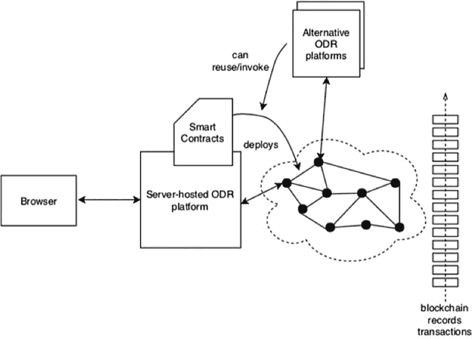

# [第 12 章
大规模应用智能合同解决网上争议及其监管影响](content.xhtml#bck_Ch12)

珍妮特·薛辉和拉尔夫·霍尔茨

## 1.介绍

本章分析了大规模使用智能合同技术处理网上争议解决(ODR)的可行性。网上争议解决(ODR)是“指利用技术进行争议解决的过程。” ^([1](Ch12.xhtml#fn12_1)) ODR 结合了非诉讼纠纷解决方式(ADR)和信息通信技术； ^([2](Ch12.xhtml#fn12_2)) 既可用于线上电子商务交易，也可用于购买等线下交易产生的纠纷。ODR 在跨境电子商务中变得尤为重要。它可以包括传统的法律程序，虽然它通常不依赖于它:传统的法律程序经常涉及法院，法官，可能还有陪审团来裁决纠纷。然而，ODR 有一个可伸缩性的问题:考虑到电子商务仍在强劲增长，并且需要大量中介来支持最终实现电子商务的金融交易，它无法轻易满足数百万消费者的大量可能请求。此类中介包括一系列金融机构:银行、经纪人/交易商，以及与金融交易的最终用户互动的其他机构；该术语还包括支付、清算和结算系统等基础设施。 ^([4](Ch12.xhtml#fn12_4)) 在国际和地区层面存在多个 ODR 体系，包括易贝的 ODR 体系 ^([5](Ch12.xhtml#fn12_5)) 或 ICANN 使用的域名争议解决机制。然而，还没有一个全球可行的 ODR 模式出现。最近，所谓的区块链智能合同被认为是“自我执行网上争议解决”的一种可能的解决方案。据称，智能合同的优势在于它能够更快、更大规模地处理纠纷。

然而，智能合约技术还处于初级阶段，这种高级用途尚未得到充分探索。目前尚不完全清楚什么样的智能合约平台将最终存在，以及它们将支持哪些功能。对智能合约技术可行性的预期可能过于乐观；对于可能的特性和限制也有一定程度的混淆。重要的是，虽然已经提出了许多用例，但是很少从法律遵从性的角度进行分析。因此，希望进入金融行业的中小企业(SME)，例如第三方支付供应商，在考虑电子商务的区块链和智能合同时面临许多不确定性。就连央行和政府等传统监管机构也面临一些挑战。

本章确定并阐明了可行的监管空间，以帮助理解如何监管 ODR 平台的智能合约并将其嵌入当前的法律体系。本章首先定义了智能合约，并解释了它们与区块链的关系。它介绍了它们的能力和局限性，以及它们与传统的、更集中的方法有何不同，从而突出了对未来 ODR 平台大有帮助的独特贡献:争议过程的强制透明度。基于这一技术分析，本章通过概述适用于仲裁员的原则和访问控制的定义，例如国家行为者的访问需求，提出了智能合同如何能够在目前使用的 ODR 平台，如欧盟 ODR 平台、 ^([9](Ch12.xhtml#fn12_9)) 中发挥作用的方法。本章介绍了应用智能合同以规范大规模提交案件和高效处理争议的程序的可能方法。这些提议基于过去几年在以太坊区块链交易所开发智能合约过程中吸取的经验教训，以太坊是目前唯一支持智能合约的主要区块链。 ^([10](Ch12.xhtml#fn12_10)) 本章最后分析了对未来监管和法律合规性的影响。

出于本章的目的，我们不需要区分允许任何人参与的公共区块链和需要权威实体(或实体组)某种形式的许可才能参与的私有区块链。智能合约的可能性和局限性在很大程度上是相同的；不同之处主要在于，在私有区块链中使用的基于许可的系统更容易将特定的角色分配给某些参与者。因此，在下面的讨论中，我们将自己局限于更一般的公共区块链的情况。

## 2.区块链:分布式账本、共识和信任

区块链是分布式账本技术的一种形式:区块链参与者对曾经发生的所有交易保持共享的联合视图。传统上，解决双方如何信任交易有效性的问题需要银行等中介机构。公共区块链用一个运行所谓共识协议的大型参与者网络的集合来代替可信中介；任何人都可以参与。共识协议为网络作为一个整体所接受的交易的有效性提供了强有力的保证。存在许多共识协议。在著名的中本聪共识(Nakamoto consensus)的例子中，该共识在比特币和今天的以太坊的一个变体中被采用， ^([11](Ch12.xhtml#fn12_11)) 人们可以表明，只要大多数参与者忠实地执行共识协议，整个网络最终将对任何两方之间的所有余额达成一致的看法。建立共识需要每个参与者将交易分组为所谓的块。块有前趋者和后趋者，因此它们形成了一个链。创建一个块需要投入计算精力来解决一个密码问题。第一个成功创建新区块并将其链接到区块链的参与者将获得一定数量的货币奖励(比特币或以太，分别用于比特币和以太坊)。这就是一般所说的“挖矿”。

密码问题被定义为使得具有相同计算能力的参与者具有创建新块的相同概率。这种结构确保欺诈的可能性变得非常小，可以忽略不计——试图干扰共识需要欺诈参与者拥有比大多数其他参与者加起来还要多的计算资源。 ^([12](Ch12.xhtml#fn12_12)) 只要网络中具有“计算多数”的部分忠实地遵守协议，网络就会保存所有交易的可信记录。共识协议在每个参与者都可以运行的软件中实现。 ^([13](Ch12.xhtml#fn12_13)) 在本章中，我们总是使用术语参与者作为参与网络和共识协议的实体。

## 3.智能合同:性质、执行和显著特征

智能合约的概念是对区块链范式的补充。智能合同是由区块链中的参与者执行的计算机程序。这与 web 服务采用的原理相同:人们可以通过一个接口从 web 服务发送和接收数据，并使用它进行进一步的处理和显示。使用智能合约，区别在于每个参与者都可以创建一个智能合约，并定义一组可调用的例程(称为“方法”)，供其他参与者使用智能合约并与之交互。一个典型的例子是一个智能合约，它在其方法中实现并公开计算器的功能。网络中的其他参与者，原则上还有其他智能合同，可以调用这些方法来获得结果；例如，他们可能将数字发送给一个名为“sum”的方法，并接收总和作为结果。

智能合约存储在发送到区块链的交易中；因此，一旦网络达成共识，智能合同就成为区块链中不可改变的条目。所有参与者都需要执行一个被“调用”的智能合约，即与之交互。与智能合约的交互也是事务。 ^([15](Ch12.xhtml#fn12_15)) 这意味着与智能合约的任何交互也存储在区块链中，因此对整个网络是透明的。 ^([16](Ch12.xhtml#fn12_16)) 这是参与者对总账保持一致看法的必要前提。智能合约由(加密)地址标识，就像网络中的发送方和接收方由这些地址标识一样(通常不是由它们的真实身份标识)。就像用户一样，智能合同甚至可以控制数字资产。

人们经常对智能合同表达的希望是，它们可以用来定义真实、合法合同的条款、规则和处罚，还可以自动执行和实施相关义务，特定事件触发交易。这通常被称为“自我实施”。它们还有助于简化交易，在这种情况下，需要多方签署才能生效。然而，重要的是要理解智能合约仍然只是计算机程序，即算法的集合。这使得它们可以被用作支付、清算和结算流程的手段，这些流程定义了转移资金、清算和结算证券和商品及其衍生品的方式。 ^([17](Ch12.xhtml#fn12_17)) 这些都很容易用算法描述。原则上，这意味着处理争议案件的程序也可以编码在智能合同中。但是，智能合同不能用于推理索赔的有效性，如果这需要法律解释的话。此外，智能合约总是需要被事务调用，这反过来要求存在一个可以创建这样的事务的区块链参与者。在撰写本文时，没有一个块链系统允许定义外部事件来自动触发调用事务的创建——某些参与者必须始终参与其中。

智能合约的一个显著特征是，调用一个方法需要为方法的执行支付某种形式的费用。例如，在以太坊中，智能合约中定义的操作加起来就是所需的“气体”总量——“气体”在这里是衡量执行成本的内部单位。调用该方法的参与者(或合同)必须为所需的天然气付费。调用方提供“气价”，即从以太坊的内部货币以太到气的转换率，以及他们愿意为调用支付的以太总量。选择将事务包含在块中的参与者必须执行调用的方法。gas spent 作为 Ether 奖励给第一个创建包含调用事务的块的参与者。智能合约可以按照其作者的指定发送和接收货币；作者们还可以在将智能合约部署到区块链之前，赋予其货币使用权。

重要的是，智能合约可以通过指定访问条件来“保护”它们的方法和天赋。智能合约的所有者拥有特殊的访问权限，例如，清空当前持有的内容或关闭智能合约(这使得无法进一步调用)。所有权是使用区块链典型的非对称加密技术实现的；需要所有者的私钥来与智能协定的受保护方法进行交互。从这个意义上说，智能合约实现了大多数计算机安全常见的相同形式的访问控制。这自然意味着所有已知的访问控制问题–参与者丢失钥匙、钥匙被盗等。–也适用于智能合同。在传统的计算机安全中，访问控制通常伴随着操作程序，如要求组织内只有经过彻底审查的人员才被允许进行更改，或四眼原则启动交易。智能合约可以重现所有这些特征；但是默认情况下，没有预定义的操作过程。总之，这打开了一个经典的监管空间:理论上，智能合约可以被强制要求为某些(国家)行为者提供默认访问。此外，监管可能会要求智能合同的所有所有者有义务将他们的访问控制钥匙放在安全的地方。

监管空间超越了智能合约的作者。所有智能合约都在区块链开发商提供的软件上运行。因此，将软件中的某些交易“列入黑名单”并“重写历史”并不困难:如果大多数参与者接受开发者的这种决定，那么效果就是交易从未发生过。虽然这似乎是一种应对欺诈性智能合同的解决方案，但需要注意的是，这是一个瓶颈:开发者不可能跟踪所有的欺诈行为。

总之，智能合约的显著特征不是它们的表达能力:智能合约不能表达任何经典软件不能表达的计算或工作流。智能合约的吸引力在于一个更大的网络执行它们的方式，并提供每次调用的透明记录。这是软件的一个根本区别，因为它现在在金融机构、保险公司、政府机构等中运行。所有交易的记录由区块链中的所有参与者保存。

另一个限制也是至关重要的:智能合约无法推理条款的“含义”以及它们是否得到履行。他们不能做出我们传统上认为是法官解释成文法或监察员调解的决定。在 ODR 的背景下，这意味着人类通常仍需要评估案件，就像现在的情况一样——这里没有智能合同可以添加的内在去中心化。智能合约没有解决 ODR 的人类可伸缩性问题。它们的潜力在于技术程序的统一。

与所有程序一样，智能合约可能包含即使是经验丰富的程序员也不会发现的缺陷和错误； ^([18](Ch12.xhtml#fn12_18)) 这是计算机固有的本性。 ^([19](Ch12.xhtml#fn12_19)) 这已经被反复证明是非常有问题的，其中“道”是最引人注目的一个例子。DAO 是分散自治组织的缩写，是第一个试图实现整个组织的工作流并使其“自主”执行的智能合同，即没有人类管理活动。在 DAO 的案例中，智能合约中的规则允许投资者对要资助的项目进行投票；利润会回流给投资者。任何人都可以通过购买“道令牌”成为投资者，道令牌代表投资者的权利，通过智能合约来实现。 ^([20](Ch12.xhtml#fn12_20))

不幸的是，在“DAO”事件中，一个相对简单的编码错误导致了大规模的违规，相当于 360 万以太网被攻击者窃取(当时价值约 6000 万美元)。由于智能合约的自主性，攻击无法被遏制。最后，这个

以太坊的开发人员介入，并在他们软件的下一个版本中将所有与 DAO 相关的交易列入黑名单，从历史中根除了这种攻击。虽然这是最广为人知的案例，但随着调查的进行，许多其他缺陷也被报道出来。 ^([21](Ch12.xhtml#fn12_21)) 在最近的一项研究中， ^([22](Ch12.xhtml#fn12_22)) Brent 等人构建了一个工具来调查以太坊区块链中的所有 141，000 份智能合约。他们可以证明高达 60%的智能合约包含使 DAO 可被利用的那种错误。作者还发现，只有个位数比例的智能合约无法保护他们持有的以太网资产免受未经授权的访问。

## 4.智能合同技术与人在回路中相结合的模型

在下文中，我们提出了一种监管模型，该模型结合了智能合约和人工干预，作为当前 ODR 系统原理的扩展。该模式有助于提高处理具有共同性质(即非常相似)的案件的效率，同时保持法律推理和解释所需的灵活性。在这种模式下，区块链对所有交易的记录所提供的透明度对于以后的审计来说是一个无价的信息来源；它还允许收集有关案例、投诉类型和结果的数据，以便在必要时进行进一步调查。这些信息会自动打上时间戳，可供所有参与者使用。尽管我们没有确切定义如何存储案例信息(如支持文档)，但我们注意到区块链本身通常不提供这种功能。这种数据通常存储在外部，但是可以在区块链中以保持完整性的方式引用它:以后修改引用文档的任何尝试都会立即被检测到。

我们的模型基于智能合约的一个拟议应用:所谓的 DApps——分布式应用。DApps 是指其功能从根本上依赖于与区块链智能合约交互的应用程序。DApp 可以被实现为独立的(桌面)应用、在服务器上运行的应用、或者甚至是混合形式，例如，作为网站，其中部分功能在服务器上实现，而另一部分作为在浏览器中执行的 JavaScript。关键特性始终是与智能合约的交互，为此部署的区块链环境提供了一个执行环境，包括消息传递和对外部存储的完整性保护引用。我们注意到，目前，愿景和现实之间存在巨大差距。目前对 DApps 的建议集中在将它们作为网站来实现，例如，通过在区块链的智能合约交易中记录每个活动，或者提供用户友好的界面来与智能合约交互。一个例子是实验性的市场预测或在新的 Brave 网络浏览器中实现的微支付功能。至关重要的是，作为 DApp 的实现增加了透明度，并允许使用区块链货币进行支付。

在我们的模型中，ODR 被实现为这样一个 DApp:一个在线应用程序允许通过浏览器访问，而区块链负责透明性和支付。我们在[图 12.1](Ch12.xhtml#fig12_1) 中展示了这一点。这为进一步的 ODR 奠定了基础:通过调用智能合约实现的方法，其他 ODR 系统可以链接到现有系统。结果是不同的 ODR 可以实现相同的过程，区块链保证了所有人的可审计性。

图 12.1 ODR 平台实现为服务器托管的应用程序，可通过浏览器访问。功能在部署在区块链上的智能合约中实现。区块链记录所有的交易。

使用在整个网络中广播的透明审计记录也值得注意，因为它创造了另一种形式的制衡:它对人类仲裁员施加压力，从而有助于抑制不公平或有偏见的判断。可以用对每个人都透明的代码来定义导致案件(提交给仲裁人)的步骤。仲裁人不能轻易滥用他们的权力。一旦人工仲裁员做出决定，ODR 剩下的步骤，如支付和解或拒绝，也可以在智能合同中得到促进。这建立了从最初的索赔到结果的完全透明的事件链。标准化有助于简化流程，提高速度。智能合同还允许建立反馈渠道。从简单的肯定/否定“投票”(拇指向上/向下)到更复杂的设计，例如，提供反馈，同时表达对另一个提案的支持。投票在整个网络中再次变得透明。这自然有助于受影响的当事人或仅仅遵守 ODR 的外部当事人就同意或不同意仲裁员的决定进行反馈。

表 12.1ODR 智能合约

| 方面 | 智能合同的相关功能 | 使用智能合同的直接效果 | 结果 |
| --- | --- | --- | --- |
| 

* * *

 |
| --- |
| 透明度 | 

*   每个参与者对智能合约的定义/方法都有相同的看法。
*   每个参与者对结果都有相同的看法。

 | 

*   每个参与者都可以查看争议案例。
*   每个参与者都可以对仲裁人做出的决定进行投票/提供反馈。

 | 

*   更好的制衡对仲裁员施加压力。

 |
| 效率 | 

*   定义明确的流程，向人工仲裁员提供明确的移交点。

 | 

*   一定量的模板允许对案例进行分类。
*   与反馈和支付机制相联系。

 | 

*   更短的争议解决时间，立即支付。

 |
| 标准化 | 

*   模板化的智能合同规定了处理案件的程序和原则。

 | 

*   重用定义明确的过程，减少开销。
*   可以基于模板定义变体。

 | 

*   统一 ODR 系统的实施，同时保留灵活性。

 |

除了透明性之外，标准化可能是智能合约在我们的模型中做出的最大贡献:较大的监管机构可以提供(部分或完全)定义 ODR 过程的模板。人工仲裁员必须交互的点将在模板中明确定义。这样，效率将与需要法律判断的进一步推理和解释的充分空间相结合。公司可以选择(或被强制)使用该模板。例如，欧盟可以在 EU-范围内标准化 ODR 平台的某些功能；这些模板也可以在欧盟之外使用，以努力协调《ODR 公约》的实施。可以提供典型的模板来提出投诉，对争议案件进行分类，并根据某些特征(如紧急程度、金钱损失)对案件的处理进行优先排序。人的决策仍然是整个过程的一部分，但是人的交互将在精确定义的时刻发生，具有明确指定的输入和输出。只有更特殊的情况可能必须在这个系统之外进行(但是仍然保留这个事实的记录)。支付可以透明地与决策挂钩；甚至更复杂的金融结构也能以透明的方式实现。一个例子是债务发行，其中票面价值、期限和支付结构是智能合同模板的参数。我们在表 12.1 中总结了我们模型的这些方面。然而，我们强调智能合约的使用并非没有风险，正如前面在智能合约的访问控制和所有权方面所讨论的那样。

## 5.在 ODR 使用智能合同的监管意义和潜力

总部位于区块链的智能合约所宣称的潜力是，让复杂的交易所变得更加透明，并减少对交易的不必要干预。 ^([26](Ch12.xhtml#fn12_26))

然而，央行和政府等传统监管机构需要适应新监管空间的可能性和局限性。关于 ODR 体系中智能合同的监管，这意味着在高效处理案件和为增加参与创造包容性环境之间达成平衡，允许那些社会资源较少的参与者以更有效的方式纠正其利益。效率和参与度的提高都可以通过代码中的标准化过程来实现。以我们模型中描述的欧盟 ODR 平台为例，EU-范围内的法律监管标准变得更容易实施；与此同时，所有参与者都可以获得访问和查看交易记录的权利和手段，并在自愿的基础上为决策过程提供反馈。重要的是，保留所有反馈的记录，并且可以跟踪滥用该机制的企图。在下文中，我们将讨论共同监管性质的变化，特别关注智能合约中的错误和监管影响。

### 5.1 共同监管性质的改变

这种新模式并没有取代传统监管模式中存在的监管操纵。政府仍然可以在智能合同中强制规定某些功能，并且它们可以是 ODR 智能合同模板的作者。共同监管发生了，但性质发生了变化:在这种情况下，这意味着更多的行为者有平等的权利查看智能合同中内置的流程并提供反馈。共同监管意味着采用法规监管和法律监管相结合的方法。然而，在这种混合的共同监管方法中，许多原则需要进一步澄清:如何定义访问控制，即智能合同的哪些部分可以激活、更新或停用，由谁激活，以及在什么条件下激活？

这种形式的共同监管允许任何感兴趣的行为者参与监管过程。主要参与者包括我们从金融系统监管中了解到的传统参与者，但也包括新的中介机构(经纪人、交易商和其他与最终用户互动的实体)以及最终的个人消费者。我们从当前金融体系中了解到的传统监管机构将继续存在，但将扮演一个额外的角色:ODR 案件的模板化处理允许在大得多的规模上分析决策，同时考虑反馈的数量和质量。中间人是 ODR 案件的典型对象——支付供应商就是一个典型的例子。理想情况下，ODR 案例应该包含与争议交易所相关的金融交易记录。正如今天的情况一样，这些交易中的中间人可能经常位于不同的法域。这是一个经典的跨界问题。模板化的 ODR 智能合约的优势在于，由于该准则非常明确，中介机构更容易接受参与 ODR 进程，从而减少了不确定性以及就如何解释 ODR 进程本身发生争议的可能性。个人消费者通过两种方式获得权力。首先，模板化 ODR 合同的存在使得它们不太可能受制于公司单独预先确定的条件，而没有合理的机会来谈判条款。其次，消费者可以提供更及时的反馈，并引起监管者的注意，监管者可以对越来越多的类似纠纷做出更快的反应。这可能有助于防止像以前那样的不幸结果，在以前的情况下，单一法院通常不会执行消费者在合同中提出的条款。 ^([27](Ch12.xhtml#fn12_27))

### 5.2 智能合同中的错误

即使代码是明确的，智能合约仍然可能包含错误。可能会出现两种错误。我们需要考虑的第一种错误是，智能合约的开发人员误解了 ODR 流程的(法律)含义，并且错误地实现了它们。第二个错误发生在创建者的解释是正确的，但他们对编程语言的使用导致了可利用的错误:看似正确的代码可能成为攻击的目标，从而攻击者可以“接管”智能合约，即，导致它错误地运行并执行由攻击者控制的步骤，而这些步骤不是原始开发人员想要的。第二类错误通常可以(但不总是)被自动化工具检测到——存在各种各样的工具，例如 Brent 等人的 ^([28](Ch12.xhtml#fn12_28)) Kalra 等人的 ^([29](Ch12.xhtml#fn12_29)) 或 Luu 等人的 ^([30](Ch12.xhtml#fn12_30)) 等等。理论上的限制使得不可能普遍地识别所有可能的错误。到今天为止，第一种形式的错误根本不能被自动检测，因为没有机器能够推理法律解释到代码的映射的正确性。这仍然是人类的任务。

#### 5.2.1 共同监管:发生错误时的干预

错误执行的代码应该停止，任何错误执行的步骤都应该撤销。然而，区块链的执行模式使得任何形式的干预都相对困难。这将需要有适当授权的公认行为者的(人为)干预。为了修复第一类错误，错误的智能合约必须被终止并被替换或更新。这是一个更漫长的过程，可能比传统监管机构发布的建议和澄清更昂贵。但是，问题出在哪里还是比较清楚的，以前的交易记录可以有序地回滚，智能合约中的更新机制或许可以解决这个问题。

在第二种错误的情况下，干预可能更加困难，金融损失也更加难以预防。问题是主动攻击者的存在，他正在采取主动步骤来破坏进程。就像在第一类错误中一样，可以终止或更改有缺陷的智能合约以防止进一步的损失，但时间是关键:正如我们在 DAO 的案例中看到的那样，在很短的时间内就可能导致重大损失。消除损害还需要干预和对实际的区块链软件进行关键的修改。要在我们的 ODR 模式中做到这一点，政府或多政府机构可能是唯一能够授权进行这种变革并在短时间内看到其实施的行动者。任何拖延都会损害 ODR 进程中各行为体的信任。然而，使用基于区块链的智能合同的一个优势是,(刑事)调查将被简化，因为专家可以查看审计线索和交易历史，这也提供了必要的信息，以确定各方的责任和可能的赔偿。为了解决智能合同的第二个风险，ODR 流程的代码可能需要由特定组织(例如，在我们的示例中是欧盟)雇用的工程师编写和维护——对于许多人来说，这可能会导致他们的运营模式发生重大变化。

#### 5.2.2 共同监管:错误智能合同情况下的风险分配和责任

政府干预并不是人们需要考虑的唯一(共同)监管影响。我们认为智能合约并不排除在实际的区块链/智能合约系统之外实现的许多经典支持机制的需要。

风险分配:由于智能合同中的错误是不可避免的，依赖智能合同的组织需要清楚地了解其法律义务及其合作伙伴在风险分配和分布方面的义务。特别是，金融机构必须考虑在贸易伙伴损失资金的情况下如何分配风险——对于中介机构来说，这是一个重要的考虑因素。 ^([31](Ch12.xhtml#fn12_31)) 此类安排需要在智能合同定义之外，在其部署开始或风险实现之前到位。 ^([32](Ch12.xhtml#fn12_32)) 不同交易者之间不一致的理解会在责任方面与法律合规性相冲突，并就哪一方需要以何种方式参与达成协议。

风险分配的技术支持:由于风险分配必须在 smart 合同之外定义，因此仍然需要技术基础设施和支持来定义、评估和量化风险，并制定策略来处理不同类型的风险。智能合约无法消除这一成本；基础设施支持必须为法律解释提供空间。对 DAO 攻击的后果可能有助于说明不明确的风险分配和程序的后果。既然 DAO 是在理解所有规则都以明确的术语在代码中表达出来的情况下发布的，那么攻击者就没有权利利用漏洞并提取资金吗？这个问题被以太坊的开发者认真考虑，并导致了社区的分裂。主要开发者决定改变区块链软件，以便参与者可以忽略所有与攻击相关的交易——本质上是“重写不可改变的区块链”。然而，相当大的一部分人不同意，并继续使用旧软件，因此创建了第二个“分叉”的区块链，运行相同的智能合同。我们还注意到，已经设想了所需类型的支持基础设施，但是在现有的 ODR 平台中还没有实现。例如，根据关于消费者争议在线争议解决的第 524/2013 号条例(欧盟)，^([【33】](Ch12.xhtml#fn12_33))，2016 年建立的当前 ODR EU-门户网站中没有该网站，该网站允许消费者和贸易商提交投诉，投诉可通过该平台进行处理。 ^([34](Ch12.xhtml#fn12_34))

一些旧的监管挑战仍然存在:正如我们已经表明的那样，在智能合约代码中实施的监管并不排除传统监管机构和中介机构的参与。然而，一旦智能合同中出现上述错误，可能会造成很高的经济损失，那么法官和陪审团仍然必须审查和解释代码的含义及其法律基础。区块链系统似乎让攻击者更难伪装他们的真实身份，因为执行(攻击)智能合约中的方法可能需要某种形式的认证。然而，攻击者可以简单地通过传统的身份盗窃来泄露另一个合法参与者的身份，并使用该假定的身份来发起他们的攻击。攻击的归属和保护个人身份的责任问题与今天一样。参与 ODR 系统的中介机构数量众多，包括其他司法管辖区的中介机构，可能会加剧这种情况。

## 6.摘要

在区块链运行的智能合约经常被认为是改变游戏规则的创新，可以使 ODR 系统更具可扩展性。在这一章中，我们批判性地分析了这一观点，并描绘了 ODR 使用智能合同的监管空间和含义。

我们深入描述了智能合约背后的技术，强调了它们的技术潜力和局限性。就表达能力而言，智能合同不能取代人类仲裁员，因为它们不能在法律背景下推理索赔的有效性。智能合同的所有步骤，包括最初索赔的提出和仲裁员的最终裁决，都是由 ODR 系统的参与者触发的。

然而，智能合约确实提供了一些真正的优势。我们提供了一个模型，很好地利用这些来改进 ODR 过程。首先，区块链系统提供了关于执行步骤的完全透明性，创建了难以伪造的审计跟踪，并且参与者可以很容易地检索细节。这导致仲裁员在决策过程中承担更大的责任。对 ODR 来说，政府可以通过提供智能合同模板的形式来实施监管，这些模板定义了法律要求的程序。模板包含可由众多 ODR 平台执行的标准化方法，消除了独立实施这些方法的需要，从而降低了合规性方面的法律不确定性。这种智能合同还提供了一种统一的方式来收集有关 ODR 结果和索赔的数据，从而使 ODR 进程的有效性更容易分析，并具有更高的可信度。重要的是，可以实施有效的反馈机制来收集参与者的意见，无论结果是否符合他们的期望。这为新形式的共同监管创造了条件。

最终，智能合约并不是万能的。首先，它们引入了新的问题，因为它们可能包含两种错误:由于法律误解导致的错误程序和使代码容易被利用的错误。我们表明，在这两种情况下，干预都不容易，而且损害可能发生得很快，很难恢复。仍然需要一套经典的机制和支持基础设施来处理错误情况下的风险评估和风险分配。

## 笔记