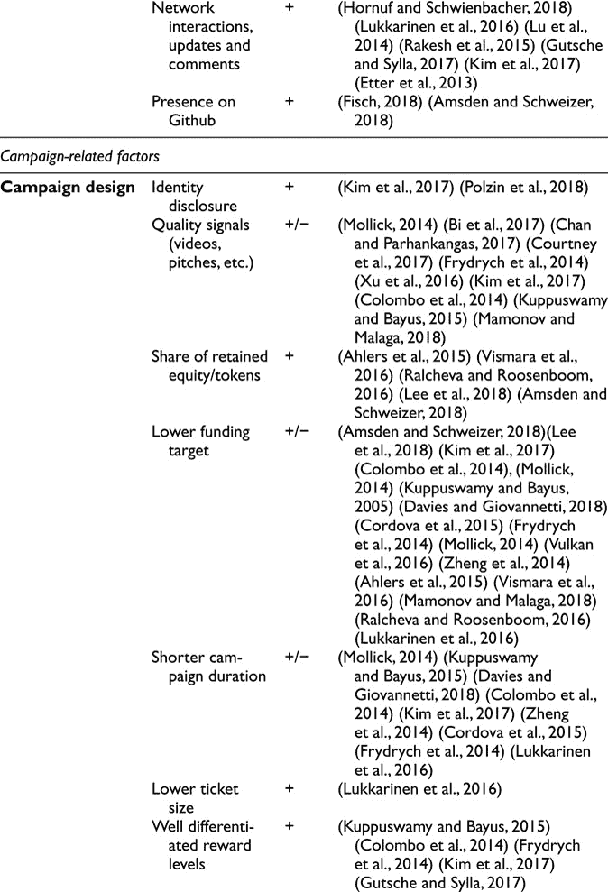
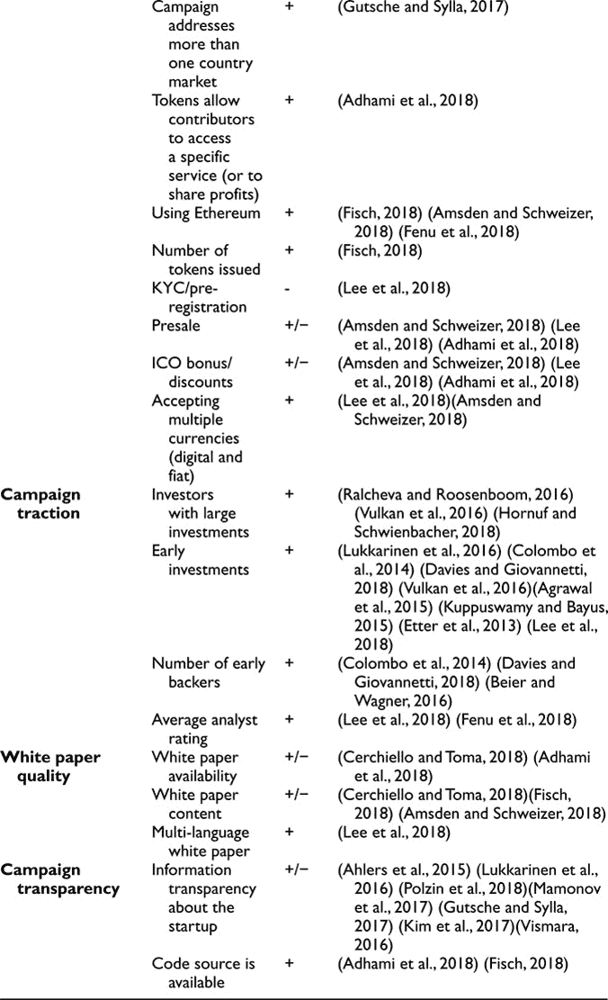
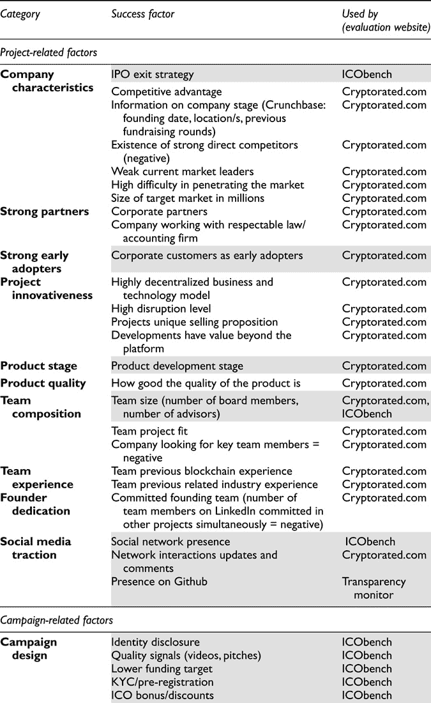
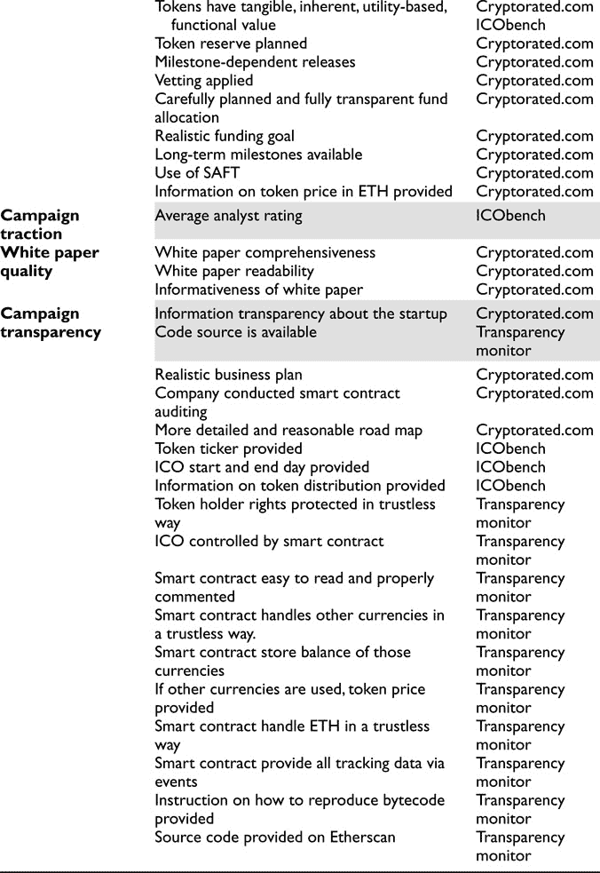
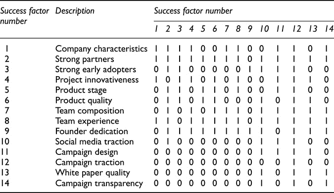
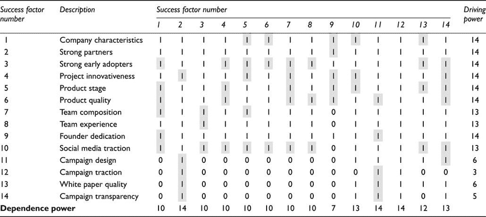
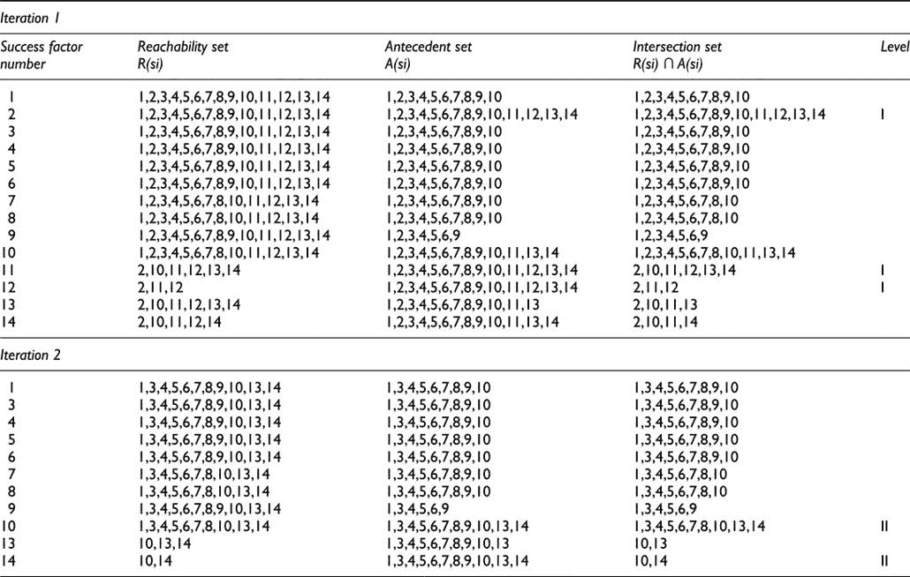
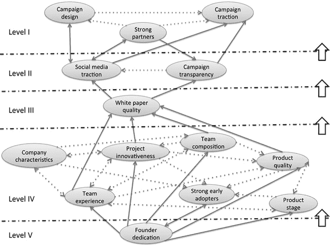
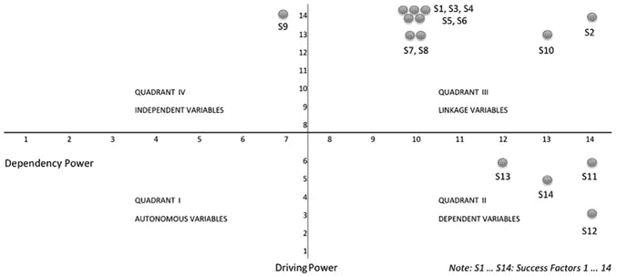
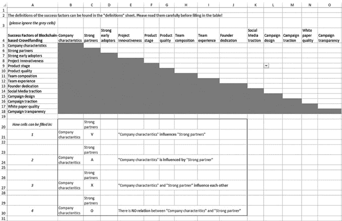

<title>Blockchain and Web 3.0</title>  <link rel="stylesheet" type="text/css" href="../stylesheet.css"> <link rel="stylesheet" type="text/css" href="../page_styles.css">

# [第十六章
(区块链)众筹成功因素的层级结构模型](content.xhtml#bck_Ch16)

菲利克斯·哈特曼、王晓凤和玛丽亚·伊拉里亚·卢内苏

## 介绍

众筹是新创企业和创新项目的重要筹资机制。它是从大量人群中筹集资金的做法，通常使用 Kickstarter 或 Republic 等在线平台。以初始硬币发行(ico)和安全令牌发行(sto)的激增为代表的基于区块链的众筹成为一种新的替代形式的众筹，今天可以被认为是少数基于区块链技术的功能应用之一。

基于区块链的众筹是一种新兴的经济现象，也是为风险投资融资的最先进战略。与首次公开募股(IPO)、风险投资(VC)和第一代众筹等传统融资模式相比，区块链的众筹仍然高度不受监管。发起区块链众筹的项目以区块链上的代币/硬币的形式向公众提供新的数字平台或网络和/或其产品或服务的一小部分所有权(股份)。股份(代币/硬币)可以代表公用事业、证券、资产、商品、货币或收藏品。与其他形式的早期风险投资的另一个主要区别是，加密资产可以在在线二级市场(集中/分散交易所)获得快速流动性。

过去几年，区块链的众筹活动数量急剧增加。2018 年初，更多老牌公司也开始探索新的融资机会。然而，人们对如何设计一个成功的区块链众筹活动以及如何作为投资者验证潜在项目缺乏了解，部分原因是这种现象的新生性质。对这种活动的成功因素的良好理解将使新企业或企业家能够恰当地设计他们在区块链的筹资活动，这反过来将有助于潜在投资者寻找优秀项目的主要信号和驱动力。基于这一观察，我们在研究中提出了以下研究问题:

*   RQ:区块链众筹活动的成功因素是什么，它们之间有什么联系？

在这项研究中，我们关注的是企业或项目内部的成功因素，这些因素由发起活动的人控制。独立活动无法控制的外部因素，如活动期间的参考代币价格，不在我们的研究范围内。

为了回答这个研究问题，我们采用了一种混合方法。关于众筹活动成功因素的出版物的文献综述，尤其是 ICO 成功因素的文献综述，使我们能够确定区块链众筹成功的初步决定因素。基于这个列表，我们分析了一组选定的 ICO 评估网站，以了解哪些因素在实践中被考虑，但在文献中没有报道。在获得成功因素的扩展列表后，我们分析了它们之间的关系，并使用解释结构模型(ISM)建立了一个因素模型。我们工作的贡献是对(区块链)众筹活动成功的更广泛和结构化的理解。

本章的其余部分组织如下:下一节描述了在相关文献中已经确定的成功因素。研究过程在“研究方法”部分报告。“调查结果”部分详细介绍了研究结果，这将在“讨论”部分进一步讨论。本章最后的“结论”部分强调了本研究的贡献，并概述了未来的工作。

## 文献评论

在过去的十年中，许多作者关注众筹的成功因素。成功因素是每个众筹项目的内在因素，实现这些因素可以导致一场成功的运动。有几项关于众筹成功因素的研究，往往颇具争议。众筹可以分为两种主要模式:非金融众筹(奖励和捐赠)和金融众筹(股权、版税和债务)。金融众筹平台的投资者不同于非金融众筹平台的投资者(Belleflamme et al .，2014)。金融众筹的支持者通常会因其投资价值的增加而预期收益，而非金融众筹的潜在回报、认可或税收减免。

基于区块链的众筹也可以归为这两种主要模式。一个公司可以提供公用令牌、支付令牌(加密货币)或安全令牌(Hacker 和 Thomale，2017 年)。公用设施代币销售可以被视为未来产品或服务的预售。奖励众筹是一种传统的众筹模式，投资者向项目投入相对较少的资金，以换取某种奖励。根据这一假设，我们可以认为，公用事业代币销售与基于奖励的众筹等非金融众筹有相似之处。另一方面，安全令牌的销售在许多司法管辖区受到安全法规的约束。证券代币发行(STO)的一种形式是股权代币发行(ETO)。在 ETO 中，一个项目向一群投资者出售其部分股权。根据这一假设，sto 类似于股权众筹等金融众筹活动是有争议的。

首先，研究表明传统众筹成功因素和代币销售成功因素之间的关系(Fisch，2018；阿德哈米等人，2018；Lee 等人，2018)。因此，我们回顾了基于奖励的众筹成功因素的文献，以发现对非金融众筹模式重要的因素，并回顾了股权众筹文献，以发现对金融众筹模式重要的因素。

然而，区块链众筹运动有一些不同于传统众筹运动甚至首次公开募股(IPO)的内在特征。有关该项目的信息通常在白皮书中进行总结。所包含的信息不受严格规定的约束，如首次公开募股招股说明书中所包含的规定。就 ICO 而言，底层技术是区块链。智能合约是微小的程序，可以上传到 Github 进行第三方验证。代币销售通常通过分散的加密货币(如以太或比特币)进行融资，而不是像传统融资方式那样通过集中的法定货币进行融资。出于上述原因，我们还回顾了最近的文献，以确定适用于区块链众筹运动的成功因素。

我们使用两个主要类别来报告确定的因素:项目相关和活动相关。[表 16.1](Ch16.xhtml#table16_1) 提供了这些因素的概述，并进一步分为子类别。

### 与项目相关的成功因素

#### 公司特征

行业:Mamonov 等人(2017 年)对美国股权众筹网站的一项研究表明，房地产行业的众筹项目远比其他行业的项目成功。这一发现表明，某些行业的项目会比其他行业的项目更成功。在奖励众筹领域，Davies 和 Giovannetti (2018)的一项研究发现，项目类别对 Kickstarter 活动成功的影响存在巨大差异，其中一些类别对项目成功的概率产生了积极影响。相比之下，在区块链众筹文献中，我们发现一种说法，即各行业的 ICO 估值并无不同(Fisch et al .，2018)。

表 16.1 来自文献的众筹成功因素列表

地点:Ralcheva 和 Roosenboom (2016)的一项研究概述了总部位于大城市的项目在英国的股权众筹中通常更成功。Agrawal 等人(2015)的一项研究表明，艺术家和其资助者的接近程度不会影响众筹的成功。在 Kickstarter 上，美国的项目似乎有更大的成功机会(Colombo et al .，2014)。然而，很难说明位置是否对众筹成功有重大影响，因为在某些地区只有有限数量的项目(Davies and Giovannetti，2018)。对于 Kick-starter 上的所有项目类别，位置的重要性似乎并不一致。游戏、漫画和技术项目相对较少依赖其地理位置来吸引资金(Rakesh 等人，2015)。在区块链众筹领域，由于监管限制和不确定性，选择合适的司法管辖区成立提供代币的公司至关重要。Adhami 等人(2018 年)的一篇论文得出结论，项目发起人为代币销售选择参考管辖区是值得赞赏的，并增加了活动成功的可能性。来自某些地区的项目似乎比其他地区更容易成功(Fenu 等人，2018 年)。相比之下，Fisch (2018)的一项研究表明，合资企业的位置不会影响 ICO 估值。

IPO 退出策略:Vismara 等人(2016)发现，IPO 退出策略不会影响股权众筹活动的结果。在未来五年内宣布退出战略的项目吸引的投资者较少，但筹集的金额并无不同。与这一发现相反，Ahlers 等人(2015)发现 IPO 退出建议对筹资成功有积极影响。

#### 强大的合作伙伴

声誉良好的投资者:马莫诺夫和马拉加(2018)对 2016 年 5 月至 2017 年 2 月期间推出的 16 个 Title III 股权众筹网站的 133 个项目进行了分析。他们发现，专业商业天使和风险资本的参与与股权众筹成功之间存在相关性。这些声誉良好的投资者在信息不对称方面的杠杆效应可以对众筹的成功产生积极影响。Ralcheva 和 Roosenboom (2016)的另一项研究分析了英国股权众筹活动的表现。该研究得出结论，商业天使投资和赢得赠款增加了竞选成功的可能性。同时，Kim 和 Viswanathan (2013)发现，具有应用程序开发经验的投资者和具有应用程序投资经验的投资者对人群中的后来投资者具有不成比例的影响，并有助于减少投资者群体中的信息不对称。领投人的信誉和倡导行为，如身份证明、投资经验、投资比例和对项目的评论，是影响众筹绩效的重要因素(李等，2016)。

#### 强大的早期采用者

作为早期采用者的企业客户:马莫诺夫和马拉加(2018 年)在美国 16 个股权众筹网站上进行的一项研究发现，有证据表明企业客户的存在与股权众筹成功之间存在正相关关系。

#### 项目创新性

智力资本:以前的研究承认，初创公司申请专利的最重要原因之一是为了获得资金(Graham et al .，2008)。令人惊讶的是，Ahlers 等人(2015 年)以及 Mamonov 和 Malaga (2018 年)的研究发现，知识资本(以专利衡量)与股权众筹融资成功之间没有相关性。相比之下，Ralcheva 和 Roosenboom (2016)的另一项研究认为，在英国，知识资本保护和股权众筹成功之间存在正相关关系。

#### 产品阶段

产品开发阶段:Mamonov 和 Malaga (2018)调查了与股权众筹成功相关的产品开发状态的影响。他们发现，与已经完成产品开发的项目相比，处于测试或原型阶段的公司不太可能在活动期间筹集到大量资金。Ralcheva 和 Roosenboom (2016 年)对英国股权众筹的研究发现，如果一个项目已经完成了第一笔销售，活动绩效就会提高。另一项研究表明，投资股权众筹活动的意愿显然分别受到业务发展或实现的里程碑的影响(Loehrer 等人，2018 年)。这些结果与 2017 年区块链众筹的表现形成了某种反差。当年进行 ICO 的许多项目虽然还没有接近完成产品开发，但却相当成功(CB Insights，2018)。

#### 团队组成

团队规模:马莫诺夫和马拉加(2018)发现，由个体企业家经营的股权众筹活动不如由创业团队经营的活动成功。Ahlers 等人(2015 年)认为，董事会成员人数越多，股权众筹就越成功。在一项关于基于奖励的众筹中的创业合法性的研究中，Frydrych 等人(2014 年)揭示，结对和团队的项目比个人项目的成功率高得多。这些发现意味着，众筹投资者认为，更大的团队能够以更好的方式处理意想不到的困难。Stam 和 Schutjens (2005)的一项研究发现，团队创业相对比个人创业更成功。有趣的是，这种效应只在创业的前三年有效。较大的团队可能会引发更多的讨论，并使决策过程陷入瘫痪。拥有顾问和导师似乎会积极影响股权众筹的绩效(Ralcheva 和 Roosenboom，2016 年)。Fisch (2018)分析了团队规模对 ICO 成功的影响，没有发现创始人数量和 ICO 成功之间存在联系的证据。相比之下，Cerchiello 和 Toma (2018)指出，拥有更大的团队和更多的顾问对 ICO 的成功有积极的影响。同样，Amsden 和 Schweizer (2018)发现，一般来说，顾问越多，团队规模越大，代币出售后交易代币的可能性就越大，筹集资金的可能性就越大。另一方面，Fenu 等人(2018)的研究发现，团队规模和 ICO 成功之间没有关系。

女性创始人:有几项研究表明，女性创始人在传统金融领域处于不利地位，不太可能获得机构资本、私募股权和银行融资(Becker-Blease 和 Sohl，2007 年；毕格罗等人，2014；Eddleston 等人，2016)。有趣的是，有一些文献表明，女性企业家在基于奖励的众筹中更成功(Frydrych 等人，2014 年)。Colombo 等人(2014 年)发现，与女性或公司相比，男性个人支持者获得支持者和资本的可能性较小。在股权众筹领域，Vismara 等人(2016 年)发现，女性创始人能够吸引相同数量的投资者，但筹集的资金较少。有趣的是，另一项关于股权众筹投资者出资模式性别差异的研究发现，女性投资者更有可能投资于男性创始人比例较高的项目(Mohammadi and Shafi，2018)。

#### 团队体验

之前的创始人经历:在一项关于 Kickstarter 平台上众筹项目成功因素的研究中，Gutsche 和 Sylla (2017)指出，有之前众筹经历的创始人比没有经历的人更成功。本文强调了如果企业家和他们的团队缺乏这方面的经验，寻求外部建议的重要性。其他研究也证实了之前众筹经历的重要性(Davies 和 Giovannetti，2018)。支持者倾向于对他们过去支持过的创造者产生信任(Rakesh 等人，2015)。随着时间的推移，连续创作者可以创造一个支持性的资助者基础。Kim 等人(2017)发现，创始人之前的筹资经验对众筹成功有积极影响。作者指出，这种经历可以被视为创始人能力和竞争力的积极信号。另一方面，Colombo 等人(2014 年)发现，作为社会资本的指标，以前创建的众筹活动的数量在预测基于奖励的众筹活动的成功方面并不重要。马莫诺夫和马拉加(2018)的另一项研究发现，之前的行业经验或连续创业经验与股权众筹成功之间没有显著关系。

人脉广泛的 CEO:AMS den 和 Schweizer (2018)的一项研究发现，拥有人脉广泛的 CEO(通过 LinkedIn 500+衡量)的项目更有可能在代币出售后出售可交易的代币，并筹集更多资金。

团队教育背景:Ahlers 等人(2015)的一项名为“股权众筹中的信号”的研究基于澳大利亚小规模发行委员会(ASSOB)的数据，分析了 2006 年至 2011 年间的 104 次发行。结果显示，拥有 MBA 学位的团队成员数量与竞选成功正相关。这一结果可能与这些创始人平均拥有更好的人际网络有关。这项研究表明，高素质的董事会成员可以增加吸引投资者的可能性，也可以提高筹集资本的速度。

#### 创始人奉献

忠诚的 CEO:忠诚的 CEO 必须提供更少的激励来吸引投资者投资他们的 ico。忠诚的首席执行官能够在更短的时间内筹集到更高的资金额，并显著降低失败的概率(Momtaz，2018)。

财务承诺:企业家投入到业务中的时间和金钱在商业天使和风险资本的投资决策中非常重要(Cardon et al .，2018；Busenitz 等人，2005 年；Prasad 等人，2000 年)。这与 Leland 和 Pyle (1977)的发现一致，他们认为预期成功的创始人愿意投入更多的初始投资。然而，这取决于创始人的财务状况。在一份关于企业家财务承诺和众筹成功的研究报告中，Loehrer 等人(2018 年)明确指出了企业家财务承诺和股权众筹成功之间的正相关关系。此外，Gutsche 和 Sylla (2017 年)以及 Davies 和 Giovannetti (2018 年)的研究表明，如果创始人积极参与众筹平台上的其他项目，他们可能会引发额外的资金。

#### 社交媒体牵引力

社交网络存在:莫利克(2014)发现，支持者在脸书的朋友数量与众筹活动中筹集的资金数量呈正相关，尽管没有脸书账户比没有几个脸书朋友要好。Colombo 等人(2014 年)的一项研究强调了内部社会资本对成功的重要性，通过活动期间吸引的贡献者数量来衡量。Ordanini 等人(2011 年)的一项研究强调，最初的资本筹集主要是通过在运动之外部署的社会关系(外部社会资本)完成的，并强调了这些投资对运动成功的重要性，因为它对增加内部社会资本有积极影响。郑(Zheng et al .)(2014)的一项研究利用通过和微博在中国和美国收集的数据，证明了社交网络对奖励众筹成功的显著影响。Vismara 等人(2016 年)的一项研究分析了 271 项英国股权众筹活动。该研究指出，拥有更多 LinkedIn 联系的企业家能够完成更成功的活动。在区块链众筹领域，Davies 和 Giovannetti (2018)的一项研究发现，脸书人脉的数量对 ICO 成功的概率有着显著但不是特别强的影响。Cerchiello 和 Toma (2018)的一项研究表明，电报渠道的简单存在可以增加 ICO 活动成功的可能性。Amsden 和 Schweizer (2018 年)的一项研究表明，在 Telegram 上拥有一个通信渠道可以增加筹集更多资金的可能性，并且代币在首次发行硬币后会在交易所上市。此外，拥有一个活跃的 Twitter 账户似乎对 ICO 的成功有积极的影响(Cerchiello 和 Toma，2018)。

网络互动更新和评论:Lukkarinen 等人(2016 年)的一项研究表明，社交网络的存在和活动与股权众筹的成功相关。一项关于德国股权众筹的研究得出结论，企业家发布更新会增加后续投资，尤其是第二天(Hornuf 和 Schwienbacher，2018)。Gutsche 和 Sylla (2017 年)的一项研究得出结论，与社区的持续对话增加了活动的成功率。作者建议项目经常与他们的人群互动，尽可能使用多种渠道。Kim 等人(2017 年)的一项研究概述了评论和更新的数量影响奖励众筹活动的成功。Etter 等人(2013 年)的一项研究概述了 Kickstarter 活动开始后 Twitter 消息增加的重要性。Lu 等人(2014)概述了 Kickstarter 活动期间社交媒体推广活动的重要性及其对成功的积极影响。Rakesh 等人(2015 年)的一项研究发现，快速的早期推广与更多的整体推广相关，并强调了它对奖励众筹成功的重要性。有影响力的 Twitter 用户推广的项目有吸引更多支持者的潜力，Kickstarter 的投资者的支持习惯受其社交圈的影响(Rakesh et al .，2015)。

Github 上的存在:Fisch (2018)的一项研究表明，Github 页面的简单存在不会影响 ICO 估值。另一方面，连接到 Github 帐户的明星数量似乎是更好的质量信号，并增加了活动成功的概率(Fisch，2018)。Amsden 和 Schweizer (2018)的另一项研究表明，出现在 Github 上(例如，发布代码更新)会增加令牌在 ICO 之后列出的概率。

### 与活动相关的成功因素

#### 活动设计

身份披露:Kim 等人(2017 年)在关于基于奖励的众筹中创始人和项目特征的作用的研究中指出，身份披露与活动成功率有积极的、统计上显著的关系。Polzin 等人(2018 年)在荷兰进行的一项研究表明，关于项目背后人员的信息在奖励和捐赠众筹中尤为重要。

质量信号(视频、宣传等。):几项研究强调了质量信号的重要性及其对众筹成功的影响(Mollick，2014；毕等，2017；Chan 和 Parhankangas，2017；考特尼等人，2017；Frydrych 等人，2014 年；徐等，2016；金等，2017)。Colombo 等人(2014)的研究发现，外部链接与奖励众筹成功的图片和视频数量没有显著相关性。这项研究表明，这些因素完全是由早期贡献介导的。另一方面，Kuppuswamy 和 Bayus (2015)关于奖励众筹的研究表明，一个视频可以吸引更多的支持者。在股权众筹方面，马莫诺夫和马拉加(2018)没有找到视频材料和活动成功的直接证据，但莫利克(2014)认为，视频和频繁更新等信号与更大的成功有关。拼写错误似乎降低了成功的机会。似乎在 Kickstarter 这样的成熟众筹平台上，视频推介成为一种标准，大多数项目都在提供它们(Frydrych 等人，2014)。

保留股权/代币的份额:Ahlers 等人(2015)的研究发现，保留股权可能是增加融资成功可能性的有效信号。在其他关于股权众筹中的股权保留和社会网络理论的研究中，Vismara 等人(2016)和 Ralcheva 和 Roosenboom (2016)得出了相同的结果。如果企业倒闭，这种影响可能与保留权益的成本有关，如果项目成功，这种影响可能与价值的潜在增加有关。坚信企业会成功的创始人更有可能保留尽可能多的股权。有趣的是，在区块链的众筹领域，Lee 等人(2018 年)和 Amsden and Schweizer (2018 年)的研究发现，同样的模式也适用于 ico。保留更多代币的项目似乎更成功。Lee 等人(2018 年)认为，“保留更多代币可能是一个重要的治理指标，出售给投资者的代币比例衡量了管理层在公司中的地位”，这一结果可能与之前关于信号股权保留的积极影响的研究有关。投资者似乎是被留存率较高的项目所吸引。保留较高比例的代币可以被视为创始人对项目有信心的信号。只出售一小部分代币给项目提供了在未来融资中出售未出售代币的可能性；这与上市公司使用的股权再融资相当。然而，在大多数代币出售的情况下，代币与任何股东权利(如治理)都没有联系。经理们通常保持对公司的完全控制。事实上，随着 eto 等证券代币发行的新趋势，这种情况可能会发生变化，eto 受到更及时的投资者保护的约束。

较低的融资目标:在股权众筹领域，Lukkarinen 等人(2016 年)研究了融资目标金额的影响及其与活动成功的关系。作者发现，较高的最低筹资目标与投资者数量和筹资金额之间存在很强的负相关性。另一方面，该研究发现，总体较高的筹资目标与筹资成功正相关。这可能是因为股权众筹领域的投资者预计，项目需要花费更多资金才能实现估值的大幅提升。根据这一结果，Ralcheva 和 Roosenboom (2016 年)对股权众筹的一项研究发现，成功的活动有更高的目标。相比之下，马莫诺夫和马拉加(2018)的一项研究发现，股权众筹中的目标金额和众筹成功具有负面影响。更高的目标导致最坏的结果。Vulkan 等人(2016 年)进行的一项关于股权众筹的研究发现，融资目标增加一个标准差会使成功概率降低 11 至 18 个百分点。Vismara 等人(2016 年)和 Ahlers 等人(2015 年)发现，目标资本与更多的投资者有关，但并不影响筹集的总额。在奖励众筹领域，郑等人(2014)的一项研究表明，众筹目标与美国和中国的竞选绩效呈负相关。几项关于众筹的研究证实，较大的筹资目标与众筹成功率呈负相关(Kim et al .，2017；科伦坡等人，2014 年；莫利克，2014；库普斯瓦米和巴尤斯，2015；戴维斯和乔瓦尼蒂，2018；科尔多瓦等人，2015 年)。另一方面，几项研究发现，平均而言，筹资目标较低的成功活动往往会获得过多资金(Frydrych 等人，2014 年；莫利克，2014；Vulkan 等人，2016 年)。在区块链众筹领域，该活动的上限资金目标被称为“hard cap”；最低筹资目标被称为“软上限”。有趣的是，成功和不成功的 ICO 营销活动的软成本几乎相同，因此似乎对营销活动的成功没有影响。然而，没有软上限似乎与 ICO 期间筹集的金额成负相关(Amsden 和 Schweizer，2018)。另一方面，成功代币销售的硬资本似乎是不成功代币销售的两倍(Lee et al .，2018)。硬上限的存在增加了代币交易的概率和筹集的金额(Amsden 和 Schweizer，2018)。

缩短活动持续时间:一些研究分析了活动持续时间对活动成功的影响。在股权众筹领域，Lukkarinen 等人(2016 年)发现，活动持续时间与投资者数量呈负相关，但与筹集的金额无关。该研究提出，较短的活动持续时间可能会鼓励投资者快速行动，并显示出果断和兑现承诺的能力。在奖励众筹领域，几项研究发现，较长的活动持续时间对活动成功有负面影响(Mollick，2014；库普斯瓦米和巴尤斯，2015；戴维斯和乔瓦尼蒂，2018)。更长的竞选时间可能意味着缺乏信心。一些研究发现奖励众筹活动持续时间和活动成功之间没有关系(Colombo 等人，2014；金等，2017)。郑等人(2014)的另一项研究发现，活动持续时间在中国有显著影响，但在美国没有。Cordova 等人(2015 年)的一项研究发现，较长的活动持续时间对奖励众筹的成功有积极影响。Kickstarter 上的另一项研究发现，高筹资目标和长筹资期的结合与不太成功的众筹活动有关，而较短的活动持续时间通常与较高的成功率相关；然而，他们发现活动持续时间和资金比率之间的相关性较低(Frydrych 等人，2014 年)。Cordova 等人(2015)发现，项目持续时间增加了成功的机会，并导致给定项目每天贡献的美元金额增加。

较低的门票金额:Lukkarinen 等人(2016 年)的一项研究发现，较低的门票金额与众筹成功相关。门票规模是投资者参与众筹活动必须承诺的最低投资额。这种影响可能与未获得信贷的投资者的小额融资有关。

差别化奖励等级:有一些关于差别化奖励等级效果的文献。差异化的奖励应该有助于吸引整个众筹社区的资金，因为他们有不同的能力和意愿来提供资金(Gutsche 和 Sylla，2017 年)，并增加投资者基础(Kuppuswamy 和 Bayus，2015 年)。由于投资者基础有限，较低的奖励水平可能会导致活动失败(Kim 等人，2017 年)。(Frydrych et al .，2014)的一项研究指出，更多以创意为导向的项目(如艺术、设计、音乐等。)往往有更多的奖励等级。然而，研究发现，成功和不成功的活动所提供的平均奖励数量没有显著影响。给予社区归属感的奖励似乎对众筹成功有积极影响(Colombo et al .，2014)。看来，奖励众筹投资者很欣赏成为一个社区的一部分。

活动面向多个国家的市场:Gutsche 和 Sylla (2017 年)的一项研究强调，对于具有较高融资目标的项目来说，瞄准多个县很重要。这使得项目能够接触到投资者，从而提高众筹成功率。然而，监管环境限制了项目在特定市场开展某些活动。欧洲的金融众筹就是这种情况。没有统一的法规，众筹平台在提供跨国活动时面临几个困难(欧盟委员会，2017 年)。

代币允许贡献者获得特定的服务(或分享利润):Adhami 等人(2018 年)的一项研究概述了获得服务的权利和获得公司利润份额的权利似乎与区块链的众筹成功正相关。

使用以太坊:以太坊是在区块链发起众筹活动最广泛采用的平台。似乎使用以太坊来构建项目可以提高 ICO 估值(Fisch，2018)。使用以太坊网络增加了 ICO 的高参与率(Amsden 和 Schweizer，2018 年)和 ICO 成功的概率(Fenu 等人，2018 年)。

代币发行数量:Fisch (2018)的一项研究认为，项目发行的代币数量增加了众筹活动的估值。投资者似乎更有可能投资于某项投资能够获得更多代币的活动，而不是每个代币必须投入更高金额的项目。提供更多的代币还会缩短整体活动持续时间。实际上，这种特征似乎是一种心理偏差。投资者似乎认为，如果他们获得较高数额的代币，投资就比获得较低数额的代币更有价值。这可能是因为他们错误地将代币视为一种股权投资。

KYC/预注册:有趣的是，根据 Lee 等人(2018 年)的一项研究，开展了了解你的客户(KYC)流程的项目不太可能成功完成代币销售。在他们的研究中，他们还发现，类似地，在某些国家要求预先注册或限制销售的 ico 也不太可能继续进行。这应该与中国、韩国和美国等 ICO 监管严格的国家将投资者排除在外有关。

售前:代币预售似乎对 ICO 的成功非常重要(Adhami 等人，2018)。如果是这样的话，预 ICO 可能是一种有趣的方法，可以在启动主要销售或为主要销售费用融资之前测试市场。此外，Lee 等人(2018)发现代币预售与 ICO 成功之间存在正相关关系。成功的预售通常由高净值投资者参与，由于支出的灵活性更高，因此可以创造动力。Amsden 和 Schweizer (2018)的一项研究发现，组织预 ICO 的项目提供的代币不太可能在代币出售后被交易。这可能是因为许多项目从机构投资者那里收集了足够的资金，而这些投资者对不受监管的二级市场更具风险厌恶。这些项目筹集的资金也较少。

ICO 奖金/折扣:Lee 等人(2018 年)的一项研究发现，高奖金(定义为 20%或以上)在失败的 ICO 中更普遍。奖金可以在早期吸引投资者，但也可能被视为对后期投资者的负面信号，他们可能会认为该项目是一个柠檬或骗局。Adhami 等人(2018 年)的另一项研究发现，奖金计划对活动的成功概率只有微弱的影响。奖金结构有助于吸引早期投资者，但与 ICO 的成功无关(Amsden 和 Schweizer，2018)。

接受多种货币(数字和法定货币):接受多种(数字)货币的 ico 比只接受一种货币的 ico 更有可能成功。鉴于 BTC 和 ETH 等主要数字货币波动剧烈，扩大货币的选择，从而增加流动性，可以促进交易(Lee et al .，2018)。接受法定货币与 ICO 成功负相关(Amsden 和 Schweizer，2018)。这可能是因为加密投资者对与传统金融市场相关的项目缺乏信心。

#### 运动牵引力

大额投资的投资者:Ralcheva 和 Roosenboom (2016)进行的一项研究得出结论，英国成功的股权众筹活动能够吸引承诺大幅提高资金数额的投资者。另一项关于英国股权众筹的研究(由 Vulkan 等人进行，2016 年)发现，与不成功的活动相比，成功活动的每个投资者的平均认捐额高出三分之一。此外，研究表明，成功活动的最高单笔投资占筹资目标的 30%。这凸显了单笔高价值投资对于推动成功营销活动的重要性。一项关于德国股权众筹的研究表明，过去七天内至少 5000 欧元的投资会增加第二天的总融资额(Hornuf 和 Schwienbacher，2018 年)。

早期投资:在股权众筹领域，Lukkarinen 等人(2016 年)发现，在隐藏阶段从私人网络筹集的最低目标份额的金额与最终投资者人数和活动期间筹集的金额密切相关。这种效应可能是因为后期投资者相信早期支持者已经进行了一些尽职调查而引发的。在奖励众筹领域，我们发现了几项研究，分析了早期投资者对竞选成功的影响。Colombo 等人(2014 年)和 Davies and Giovannetti (2018 年)在奖励众筹领域的研究强调了早期投资的重要性及其对整体众筹成功的积极影响。Vulkan 等人(2016 年)对英国股权众筹的一项研究发现，成功的活动平均在活动开始后一周内收集到总目标的 50%。Agrawal 等人(2015 年)的一项研究强调了早期 F&F 投资在版税众筹领域吸引“外部”众筹投资者的重要性。在活动的六分之一时间内筹集的资金低于总投资目标的 28.8%的项目在 Kickstarter 上失败的风险很高(Colombo et al .，2014)。Kuppuswamy 和 Bayus (2015 年)的一项研究表明，大型早期投资会减少第二阶段的支持者数量。作者认为，这种效应是由投资者认为项目会得到足够多人的支持而引发的。然而，成功的项目往往会在活动的最后阶段吸引额外的资金。因此，成功项目的融资曲线是 U 型的。Etter 等人(2013 年)的一项研究概述了活动前四个小时内投资的重要性。早期贡献者似乎在 ICO 领域也至关重要，这可能是由于信息级联(Lee et al .，2018)。

早期支持者的数量:在奖励众筹领域，Colombo 等人(2014 年)的一项研究概述了早期支持者的数量作为成功众筹活动的重要信号的重要性。Beier 和 Wagner (2016 年)进行的另一项关于瑞士奖励众筹的研究证实了早期支持者对整体众筹成功的重要性。最后，Davies 和 Giovannetti (2018)的一项研究强调了活动前六分之一的早期支持者数量的重要性及其对奖励众筹成功的积极作用。

分析师平均评级:就区块链的众筹而言，独立分析师参与了此类产品的评估。Lee 等人(2018)的一项研究发现，这些分析师的高平均评级对投资者来说是一个重要的信号，可以导致更成功的 ICO 活动。在没有传统承销商的世界里，独立分析师似乎在应对信息不对称方面有所贡献。与之前的发现一致，Fenu 等人(2018)发现，在 ICOBench 上的较高评级对 ICO 成功有积极影响。

#### 白皮书质量

白皮书的可用性:Cerchiello 和 Toma (2018)的一份工作文件指出，白皮书的存在对 ICO 的成功具有积极影响。相比之下，Adhami 等人(2018)的一项研究表明，ICO 的成功概率完全不受白皮书可用性的影响。这种文档的可用性可能并不重要，因为白皮书通常没有经过审计，也不受任何法律保护。

白皮书内容:( Fisch，2018)的一项研究表明，较长的白皮书对 ICO 的成功有积极的影响。糟糕的白皮书可能会损害 ICO，如果是这样的话，风险企业最好不要白皮书(Fisch，2018)。就内容而言，在不成功的 ico 中，负面和特定词语出现的频率更高(Cerchiello 和 Toma，2018)。提供更详细的白皮书增加了在 ICO 完成后收集更多资金和拥有可交易令牌的机会(Amsden 和 Schweizer，2018)。

多语言白皮书:提供多语言白皮书和网站的项目更有可能成功完成(Lee et al .，2018)。这可能与这些项目面临的语言障碍减少有关。目前尚不清楚这种做法是否会导致一些国家扩大监管对策，在这些国家，代币将在不久的将来被列为证券。以某些语言提供材料可能会增加项目直接针对某些国家的嫌疑。

#### 活动透明度

关于创业公司的信息透明度:有几项研究强调了股权众筹中财务预测的重要性(Ahlers 等人，2015；Lukkarinen 等人，2016；波尔津等人，2018)。Ahlers 等人 2015 年发现，没有披露财务预测或预测的项目在活动期间收集的金额较小，提供更多关于风险的细节与众筹成功正相关。Lukkarinen 等人(2016 年)关注提供销售增长、EBITDA 利润率和估值倍数的重要性。财务数据的可获得性似乎与投资者数量呈正相关(尽管不是很强),但与融资额没有显著关系。Polzin 等人 2018 年的研究使用了在荷兰进行的一项调查收集的数据，该调查有 1，278 名受访者。研究发现，金融信息的提供在金融众筹(如股权或债务)中很重要，在非金融融资(如捐赠和奖励)中不太重要。Gutsche 和 Sylla (2017 年)的一项研究强调了拥有强大的价值主张并清晰传达的重要性。Kim 等人(2017)的一项研究表明，项目细节的阐述是奖励众筹成功率的一个具有统计意义的指标。马莫诺夫等人(2017)的一项研究分析了 17 家美国股权众筹网站。该研究得出结论，众筹平台进行的流程标准化和尽职调查可以有效减少信息不对称，导致更好的众筹绩效。Vismara 等人(2016 年)发现，更长的推介持续时间对股权众筹的成功有积极影响。

代码源可用:Adhami 等人(2018)的一项研究表明，区块链项目的一套代码对 ICO 的成功有着强烈而积极的影响。代码源可以被视为概念的透明证明。然而，可能只有少数投资者能够读懂它。

综上所述，从回顾的众筹文献中可以清楚地看到，各种因素可以影响一个区块链的众筹活动的成功。然而，我们目前对这些因素及其影响的理解并不一致。更不清楚的是，这些因素如何相互关联，共同影响最终的众筹成功。

## 研究方法

根据提出的研究问题，研究过程分为两步:(1)扩展成功因素；(2)建立成功因素之间的关系。

### 扩展成功因素

区块链众筹的一个特点是，投资者依赖评级平台提供的评估来做出投资决定。不同的平台使用不同的评估机制来决定评级分数。通过分析这些机制，我们可以提取评估网站认为在评估众筹项目和预测其成功时需要考虑的重要因素。通过将我们从该分析中获得的因素与我们从文献中获得的因素进行对比，我们可以确定文献中未涵盖的新因素，从而扩展[表 16.1](Ch16.xhtml#table16_1) 中列出的成功因素列表。

在我们之前的工作中，我们确定了一个 ICO 评估网站的列表，并使用两个标准评估了它们的质量——信息丰富度和评估机制的透明度(Hartmann et al .，2018)。在这项研究中，我们使用了三个在评估机制方面最透明的评级平台。在我们之前的工作发表时，Cryptomoon 是三个最透明的评级网站之一。在撰写本文时，该网站似乎已经失去了对 ICO 评级的关注。我们使用了三个仍在运行的最透明的平台。通过仔细分析三个 ICO 评估网站，我们扩展了成功因素集。对于每个评估网站，我们搜索了该网站用于对 ico 进行评级的记录评估机制。然后，我们使用文献中报告的成功因素作为种子类别，对文档进行定性分析，以确定新的成功因素。此步骤的结果在“结果”部分的第一部分中报告。

### 建立成功因素之间的关系

在这一步中，我们采用了解释结构建模(ISM)，这是一种由 Malone (1975)介绍的系统结构建模方法，用于分析和构建图形形式的元素层次结构连接模型。它是解释性的，因为专家的判断决定了变量之间是否相关以及如何相关。依靠专家知识，它将一个复杂的系统分解成几个元素，并建立一个多层次的结构模型。它是结构性的，因为在关系的基础上，一个整体结构是从复杂的变量集中提取出来的。这是一种建模技术，因为具体的关系和整体结构是在一个图形模型中描绘的(Sage，1977)。层次模型允许集中查看变量之间潜在关联的隐含性质。ISM 已被应用于各种研究领域，如知识管理、供应链管理、项目管理和复杂工程问题。由于这项研究的目的是为区块链的众筹开发一个成功因素的结构化模型，ISM 是一个合适的使用方法。

在本研究中应用 ISM 技术的各个步骤如下:

1.  Develop a structural self-interaction matrix (SSIM) of the success factors, which indicates pairwise relationship between the factors, using the experts’ knowledge as input. The relationship between the two factors can be:
    *   v:因素 I 影响因素 j；
    *   答:因素 I 受事实 j 影响；
    *   x:因素 I 和 j 相互影响；和 O:因子 I 和 j 之间没有关系。
2.  开发可达性矩阵:在 SSIM 上应用一组规则以将其转换为主要的可达性矩阵，然后通过检查传递性来生成最终的可达性矩阵——上下文关系的传递性是 ISM 中的一个基本假设，该假设认为如果元素 A 与 B and B 相关，则元素 A 与 C 相关
3.  将可达性矩阵划分为不同的级别。
4.  基于最终可达性矩阵中给出的关系，绘制有向图(有向图)并移除传递链接；用语句替换元素节点。
5.  使用 mic MAC(matrix d ' impacts Croise 的乘法应用程序 a UN Classement)分析对成功因素进行分类，以确定对系统模型开发有影响、相关和必要的变量。其主要目的是分析相互作用，即变量的驱动力和依赖性。

下一节的第二部分将详细解释这些步骤以及这些步骤之后的中间结果和最终结果。

## 结果

### 区块链众筹的扩展成功因素

[表 16.2](Ch16.xhtml#table16_2) 显示了三个 ICO 评估网站在其评估机制中对 ICO 进行评级的成功因素。灰色行表示文献中报道的成功因素，并被三个网站中的一个或多个使用。没有灰色背景的行表示通过网站分析确定的新因素，这些因素没有被文献所涵盖。大多数新因素都符合[表 16.1](Ch16.xhtml#table16_1) 中报告的子类别。然而，有一个因素——产品质量——不适合任何现有的子类别。因此，在[表 16.2](Ch16.xhtml#table16_2) 中将其列为子类别。

### 成功因素的层次结构模型

#### 1 开发结构性自我互动矩阵(SSIM)的成功因素

我们用 LinkedIn 联系活跃的区块链投资者。我们从筛选知名的区块链公司开始，搜索支持这些项目的投资基金名单。然后我们寻找

表 16.2 三家 ICO 评测网站使用的众筹成功因素

各基金的 LinkedIn 页面，并筛选其员工在 LinkedIn 上的报告。通过 LinkedIn 联系了其中几位专家，并使用 Excel 模板要求他们提供信息，如附录所示。在 Excel 模板中，我们还提供了因素的类别和子类别的定义，以方便他们确定它们之间的关系。

在为 30 家投资基金工作的 70 位专家中，有 10 位回答了问题，4 位提交了填写好的 Excel 文件。一位专家是一家专注于区块链行业的中国风险投资公司的投资经理，投资了火币、Coldlar、Bocheninc、锦瑟金融、联商科技等企业。第二位专家是新加坡一家大型投资公司的高级经理。他是区块链和风险资本领域的直接投资者，专攻定量和数值金融、数学、政治经济学、宏观经济学、博弈论、统计学、区块链和密码经济学。第三位是新加坡一家数字资产对冲基金的创始人，专注于区块链项目、分散式协议和 ico。该公司投资了 Fantom、Zilliqua、假人、以太坊、Tezos 等项目。第四位专家是一位企业家，是几家区块链相关初创公司的联合创始人，也是区块链和加密货币领域的积极投资者。

使用 Fleiss’kappa(适用于来自两个以上评价人的名义分类数据)检查来自四位专家的回答的评价人之间的一致，结果显示专家之间略有一致(kappa = 0.134)。

然后，我们继续制作一个独特的数据集，作为构建 SSIM 的输入。数据统一过程遵循以下规则:

1.  如果所有四个专家、四个专家中的三个或四个专家中的两个同意两个成功因素之间的关系，则该关系被保留在唯一的数据集中。在 91 个关系中(向每个专家询问的输入总数)，77 个是在这一步中确定的。
2.  如果四个专家被两个不同的回答分成两对，我们在第一步中计算每个专家的保留回答的频率。其组合频率高于另一对的组合频率的一对所同意的关系被保留；如果两对的组合频率相等，则对于每对，在对的响应和迄今为止实现的唯一响应中计算 Fleiss kappa。具有较高 Fleiss 值的对所指定的关系被保留。在 91 个关系中，有 10 个是在这一步中确定的。
3.  如果所有四位专家在两个成功因素之间的关系上意见不一致，我们在前两步中计算每位专家保留回答的频率。由专家指定的具有最高频率的关系被保留。如果两个或更多专家具有相同的最高频率，对于这些专家中的每一个，Cohen 的 kappa 是在他/她的响应和迄今为止获得的唯一响应之间计算的。由具有较高或最高 Cohen 值的专家指定的关系被保留。在 91 个关系中，有 4 个是在这一步确定的。

基于获得的唯一数据集，我们构建了结构自交互矩阵，如[表 16.3](Ch16.xhtml#table16_3) 所示。

表 16.3 区块链众筹成功因素的结构化自我互动矩阵

#### 2 从 SSIM 发展可达性矩阵

在这一步中，通过用 1 和 0 替换 V、A、X 和 O，SSIM 被转换成二进制矩阵，称为可达性矩阵(RM ),遵循此处指定的规则:

*   规则一:如果对(I，j)是 V，那么用 1 代替，使(j，I)项在初始 RM 中为 0；
*   规则二:如果对(I，j)是 A，那么用 0 代替，使(j，I)项在初始 RM 中为 1；
*   规则三:如果对(I，j)是 X，那么用 1 代替，使(j，I)项在初始 RM 中为 1；
*   规则四:如果对(I，j)是 O，那么用 0 代替，使(j，I)项在初始 RM 中为 0；
*   规则 V:如果 i = j，则在初始 RM 中生成(I，j)条目 1。

注:I 代表行号；j 代表列号

表 16.4 初始可达性矩阵

得到的初始可达性矩阵如[表 16.4](Ch16.xhtml#table16_4) 所示。

最终的可达性矩阵是在包含了传递性之后产生的。结果如[表 16.5](Ch16.xhtml#table16_5) 所示(突出显示的单元格是使用传递性规则导出的关系)。每个成功因素的驱动力计算为列值之和，显示为[表 16.5](Ch16.xhtml#table16_5) 的最后一列，而每个成功因素的依赖力计算为行值之和，显示为[表 16.5](Ch16.xhtml#table16_5) 的最后一行。

#### 3 将可达性矩阵划分为不同的级别

在这一步中，将使用最终的可达性矩阵([表 16.5](Ch16.xhtml#table16_5) )，来开发邻接可达性 R(s i)集和邻接先行 A(s i)集。R(s i)由成分 I 本身和其他成分组成，即它可能影响的行中的成分，而先行 A(s i)由成分 I 和其他成分组成，即可能影响它的列中的成分。

R(s i) ∩ A(s i)导致 R(s i)和 A(s i)中的共同成分。然后对 R(s i)和 R(s i) ∩ A(s i)进行比较。当 R(s i)和 R(s i) ∩ A(s i)相等时，成功因素被判断为层次结构中的最高因素，并被指定为 I 级。一旦确定了最高级别的成分，就将它们与其余成分分开。这个迭代过程一直持续到获得所有变量的水平。在本研究中，该过程在五次迭代中完成，如[表 16.6](Ch16.xhtml#table16_6) 所示。

表 16.5 最终可达性矩阵

表 16.6 显示分区级别的迭代

#### 4 区块链众筹成功因素的结构模型

展示成功因素之间关系的结构模型是根据初始可达性矩阵([表 16.4](Ch16.xhtml#table16_4) )和划分层次([表 16.6](Ch16.xhtml#table16_6) )创建的。在有向图中，顶级因素(如迭代 1 中所示的级别 I，[表 16.6](Ch16.xhtml#table16_6) )被放置在组的顶部，二级因素(级别 II)在顶级因素之下，依此类推，直到基本级别使能因素(级别 V)被放置在最低位置。如果因素 I 和 j 之间存在关系，则绘制一个从影响因素指向被影响因素的有向箭头。如果影响是相互的，则画一个双向箭头。实心箭头线用于连接两个不同级别的两个因素。虚线箭头线用于连接同一级别内的两个因素。得到的图是一个有向图，如图[图 16.1](Ch16.xhtml#fig16_1) (带数字)和[图 16.2](Ch16.xhtml#fig16_2) (带名称)所示，展示了要素之间的层次关系。

图 16.1 因素的有向图

图 16.2 区块链众筹模式的成功因素

#### 5 多指标类集分析的成功因素

在分析的最后一步中，我们使用[表 16.5](Ch16.xhtml#table16_5) 中显示的驱动力和依赖力的值，将 14 个成功因素分为四类，如图 16.3 中[的四个象限所示。它提供了这些成功因素的另一个视角。](Ch16.xhtml#fig16_3)

*   象限 I——自主变量:该象限中的因素既有微弱的驱动力，也有依赖力；他们与系统的联系更少。如图[图 16.3](Ch16.xhtml#fig16_3) 所示，没有成功因素被归类到该象限。
*   第二象限——因变量:该象限中的因素驱动力较弱，但依赖性较强。如图[图 16.3](Ch16.xhtml#fig16_3) 所示，所有四个与营销活动相关的成功因素都在这个象限中:营销活动设计、营销活动吸引力、白皮书质量和营销活动透明度。
*   第三象限——关联变量:该象限中的因素具有很强的驱动力和依赖性，即受模型中较低层变量的影响，同时对其他变量也有显著影响。如图[图 16.3](Ch16.xhtml#fig16_3) 所示，大多数因素(14 个中的 9 个)都在这个象限内。

图 16.3 区块链众筹成功因素 MICMAC 分析

*   象限 IV——自变量 s:该象限的因素驱动力强，依赖力弱。如图[图 16.3](Ch16.xhtml#fig16_3) 所示，创始人敬业度这一因素被归入该象限。

## 讨论

我们的研究揭示了区块链众筹活动成功的各种决定因素，并描绘了不同类别的成功因素之间相互交织的关系，包括项目相关因素和活动相关因素。

[表 16.1](Ch16.xhtml#table16_1) 和[表 16.2](Ch16.xhtml#table16_2) 的冲突表明，只有少数文献中报道的成功因素被 ICO 评估网站实际应用。相比之下，这些网站正在使用许多文献中没有报道的新的成功因素来评估 ico。一方面，我们可以质疑这些网站所采用的评估机制的科学和理论基础；另一方面，可以说，由于区块链景观的快速发展，研究和实践之间的差距将永远存在。我们的研究就是一个证明。

在生成的模型([图 16.2](Ch16.xhtml#fig16_2) )中，我们可以看到与营销活动相关的因素(归纳为四类)都位于模型的上半部分。它们与众筹活动的成功相关，但不像与项目相关的成功因素那样重要，大多数成功因素位于模型的下半部分。

白皮书质量作为一个与活动相关的成功因素子类别，是区块链众筹的内在因素，但由于该主题的文献有限，最近只有几篇论文涉及到它。相比较而言，从评测网站的分析中，我们发现了更多与白皮书质量相关的因素:白皮书全面性、白皮书可读性、白皮书信息量。白皮书质量类别是一个位于模型中间的关联变量，因此具有高依赖力和高驱动力(如图[图 16.3](Ch16.xhtml#fig16_3) 所示)。包含因素似乎取决于几个潜在的因素类别，如产品质量、团队经验、项目创新性和团队组成，并影响其他几个因素类别，包括社交媒体牵引力和活动透明度。

另外两个与营销活动相关的因素类别——营销活动的吸引力和营销活动的设计——都严重依赖于几乎所有其他类别，几乎没有驱动力。文献中已涵盖了与活动牵引类别相关的几个因素，如大额投资的投资者、早期投资、早期支持者的数量和分析师平均评级。在评级网站上，我们发现在 ICO 评估中仅使用平均分析师评级，没有发现新的因素。在活动设计方面，它是文献中以及评估网站上覆盖最多的因素类别。我们发现文献中涵盖了 15 个因素；在评估网站上，我们发现了五个重叠因素和九个新因素。活动设计是一个驱动力弱但依赖力强的因变量(如图[图 16.3](Ch16.xhtml#fig16_3) )。它受社交媒体牵引力的影响，也影响社交媒体牵引力。

第四个与活动相关的因素类别是活动透明度。[表 16.1](Ch16.xhtml#table16_1) 和[表 16.2](Ch16.xhtml#table16_2) 的对比显示，活动透明度作为一个重要的因素类别在某种程度上被文献所忽略，文献只报告了两个可以被认为相关的因素，即关于启动和代码来源的信息透明度是可用的。相比之下，三大 ICO 评估网站之一的 ICO Monitor 非常重视活动透明度，如[表 16.2](Ch16.xhtml#table16_2) 所示，并使用许多具体因素来评估 ICO 的透明度。在这些因素中，许多与使用智能合约以透明方式控制 ICO 有关。

项目相关因素细分为十个因素类别。它们位于模型中除了一个层次之外的所有五个层次中。所有五级和四级类别都属于这一组。大部分都是四级。最基本的因素，也是模型的最低层(第五层)和唯一的元素，是创始人的奉献精神。我们预计创始人的坚定承诺将影响他们的众筹计划的成功，但该模型强调了其影响的重要性和根本性。令人惊讶的是，文献只涵盖了两个因素——忠诚的 CEO 和财务承诺。在评测网站上，我们只发现了一个因素，敬业的创始团队。创始人奉献具有较强的驱动力和较弱的依赖力，有趣的是，它与较强的早期采用者类别存在相互影响的关系。

模型的第二个最低级别(级别 IV)是密集层。这一级别的类别之间的联系是紧密的，其中相当一部分是双向的。这意味着，公司、团队、项目和产品，这些风险投资的基本要素，总是扮演着关键的角色，即使是在一种新的、某种程度上非常规的筹资机制中。一类是公司特征，在文献中已经涉及，行业、地点和 IPO 退出策略作为三个因素属于这一类。分析评估网站，我们发现 IPO 退出策略是一个重叠因素和六个新因素(见[表 16.2](Ch16.xhtml#table16_2) )。公司特征是一个关键变量，会影响团队组成和强大的早期采用者。看到公司特征影响其他因素并不奇怪；然而，令人惊讶的是，it 和团队经验以及项目创新性之间存在相互影响，这意味着后两者会影响公司特征。可以说，区块链空间中真正创新的公司需要选择某个有利的管辖区来建立，因此公司的地点可能会受到项目创新性的影响。与此同时，经验丰富的团队会比经验不足的团队选择更好的公司设计。

团队类别，即团队经验和团队组成，位于同一级别。团队经验在我们的模型中充当联动变量，具有很强的驱动力和很强的依赖力。在评估网站上，我们发现团队以前的区块链经验和团队相关行业经验是 ICO 成功的重要因素。同样，团队组成也是一个关联类别，取决于创始人的奉献精神和公司特征，并推动白皮书质量、项目创新性和产品质量。此外，它与团队经验相互影响。值得注意的是，团队构成类别中的一个具体因素——公司寻找关键团队成员——被认为是负面的，因此对众筹成功有不利影响。这表明区块链的众筹支持者也将团队相关因素作为一个重要的投资评估变量。

项目创新性也处于四级。在文献中，我们发现只有智力资本(专利)属于项目创新的范畴。在评估网站上，观察到更多的因素。作为一个联动变量，产品创新性依赖于创始人奉献和团队构成，驱动白皮书质量、产品质量和强大的早期采用者，同时与公司特征和团队经验相互影响。

同样的第四层次，还有产品阶段和产品质量。在产品阶段方面，我们在评测网站的分析中没有发现任何新的因素。另一方面，产品质量作为一个类别只出现在对网站的分析中，而不是从文献中。能表明产品质量的具体因素是什么还有待了解。产品阶段和质量都会影响早期采用者。

令人意想不到的是，强大的早期采用者出现在与公司、产品和团队相关的其他更基本的因素类别相同的水平上。我们在文献中只发现了一个与这一类别相关的因素——企业客户是早期采用者。在对评估网站的分析中，我们发现这个因素被一个平台使用。有趣的是，这是唯一一个与创始人奉献有相互关系的类别，这似乎在某种程度上增加了这一类别的重要性。

唯一不在模型下部的两个产品相关因素类别是社交媒体吸引力(第二级)和强大的合作伙伴(第一级)。毫不奇怪，社交媒体的吸引力会影响竞选活动的吸引力。相比之下，看到强伙伴位于模型的顶层有点令人惊讶，因为伙伴关系是风险企业商业模式的基本方面之一。基于文献和我们自己的研究，没有合理的解释可以提供，除了这可能是由于专家的(错误)解释。通过研究文献，我们发现声誉良好的投资者(商业天使、专家)因素与这一类别有关。通过分析评估网站，我们扩展了这一类别，增加了两个新因素——企业合作伙伴和与受人尊敬的律师/会计师事务所合作，这是非常重要的合作伙伴，尤其是在区块链领域。

### 研究的局限性

我们的研究有几个局限性。首先，对我们建立的模型的通用性有潜在的威胁。我们只能从少数专家那里得到答复。这种限制可能会影响 ISM 过程中输入数据的质量，并最终对模型的可推广性产生负面影响。第二，可能是一个或多个专家在填写 Excel 表格时由于时间或全面性问题而出错。Excel 表格的设计可能会产生误导。这对研究结果的内部有效性是一个潜在的威胁。在发给专家之前，我们在几位同事身上测试了表格的全面性。我们还通过遵循严格定义的流程来创建唯一的数据集，从而尽最大努力确保构建 ISM 的输入的可靠性。

另一个问题是，区块链的众筹现象仍处于初级阶段。未来会往哪个方向走，现在还不清楚。过去的几年在未来可能会被视为一个极端的异数。未来几年，由于监管和更激烈的竞争，融资将变得更加困难和昂贵。我们在研究中发现的一些假设在今天可能是有效的，但在未来几年甚至几个月内可能会失效。

## 结论

在这一章中，我们调查了可能影响区块链众筹活动成功的因素，如今众筹已成为新创企业和创新项目筹集资金的重要手段。通过检查三个主要的 ICO 评估网站，我们扩展了文献报道的成功因素列表，将它们分为项目相关和活动相关的类别和子类别。然后，我们利用领域专家的知识，使用子类别作为构建模块，构建了一个成功因素的层次模型。由此产生的模型解释了成功因素之间的复杂联系，并强调了众筹成功背后更基本的驱动因素。

我们的发现可以作为进一步研究区块链众筹项目的决定因素和成功指标的理论基础。他们还可以为这一领域的企业家和投资者提供一个整体图景，让他们了解在众筹活动中发挥作用的多种力量，尤其是在区块链舞台上。

未来的工作可以通过使用更多的专家来提高 ISM 流程输入数据的质量，或者使用使用更客观数据的不同研究设计来验证我们研究中建立的模型。我们计划的一项未来研究是对成功因素和区块链众筹活动的成功之间的相关性进行定量分析，使用本研究中建立的分层模型(或其一部分)作为研究模型。

## 参考

Adhami，s .，Giudici，g .，和 Martinazzi，s .，2018 年。为什么企业要加密？初始硬币的实证分析。经济与商业杂志。

Agrawal，a .，Catalini，c .，Goldfarb，a .，2015。众筹:地理、社会网络和投资决策的时机。特刊:创新经济学 II，第 253-274 页。

Ahlers，G. K .，Cumming，d .，Günther，c .，和 Schweizer，d .，2015。股权众筹中的信号传递。创业理论与实践，第 955-980 页。

Amsden 和 and Schweizer，2018 年。区块链众筹销售是新的“淘金热”吗？首次发行硬币的成功决定因素。SSRN，第 59 页。

可在以下网址查阅:[www . sec . gov/oiea/investor-alerts-and-bulletins/IB _ coin offerings](http://www.sec.gov)【2018 年 7 月 18 日获取】。

Becker-Blease，J. R .和 Sohl，J. E .，2007 年。女性拥有的企业能平等获得天使资本吗？商业冒险杂志，第 503-521 页。

m .贝尔和 k .瓦格纳，2016 年。众筹平台的用户行为——来自瑞士的探索性证据。夏威夷:IEEE。

Belleflamme，p .，Lambert，t .，和 Schwienbacher，a .，2014 年。众筹:挖掘合适的人群。商业冒险杂志，第 585-609 页。

毕，s，刘，z，和乌斯曼，k，2017。在线信息对报酬型众筹投资决策的影响。商业研究杂志，第 10-18 页。

bige low l .，Lund mark l .，Parks j .，wueb ker r .，2014 年。回避问题:IPO 招股说明书评估中性别偏见的实验证据。期刊管理，第 1752-1753 页。

Busenitz，L. W .，Fiet，J. O .，和 Moesel，D. D .，2005。风险投资家-新风险团队投资决策中的信号:它预示着长期风险投资的结果吗？创业理论与实践，第 1-12 页。

Cardon，M. S .，Mitteness，c .和 Sudek，r .，2018 年。动机暗示和天使投资:热情、准备和承诺之间的相互作用。创业理论与实践，第 1057-1085 页。

CB Insights，2018。区块链投资趋势回顾。公司:CB Insights。

Cerchiello，p .和 Toma，A. M .，2018 年。ICOs 成功驱动因素:文本和统计分析。Dem 工作文件系列，第 7-18 页。

Chan，C. S. R .和 Parhankangas，a .，2017 年。众筹创新理念:渐进式和激进式创新如何影响融资结果。创业理论与实践，第 237-263 页。

m .科伦坡，c . Franz oni 和 c . Rossi-Lamastra，2014 年。内部社会资本与众筹中早期出资的吸引力。创业理论与实践，第 75-100 页。

科尔多瓦，a .，多尔奇，j .，和吉安弗拉特，g .，2015。众筹成功的决定因素:来自科技项目的证据。Procedia:社会和行为科学，第 115-124 页。

考特尼，c，杜塔，s，李，y，2017。解决信息不对称:信号、认可和众筹成功。创业理论与实践，第 265-290 页。

众筹 Hub，2016。欧洲众筹的现状。阿姆斯特丹:众筹。

Davies，W. E .和 Giovannetti，e . 2018。信号经验&互惠以缓和众筹中的信息不对称来自 10，000 个项目的证据。技术预测和社会变革，第 118-131 页。

艾德斯顿，K. A .，拉奇，J. J .，米滕尼斯，c .和巴拉钱德拉，l .，2016。你看到我看到的了吗？性别和企业特征对创业企业融资的信号效应。企业家精神:理论与实践，第 489-514 页。

以太扫描，2018。以太扫描。[在线]可在:[https://etherscan.io/tokens](https://etherscan.io)[2018 年 7 月 18 日访问]。

Etter，v .，Grossglauser，m .，和 Thiran，p .，2013 年。努力发射或者回家！预测 Kickstarter 活动的成功。在池，第 591-600 页。

欧盟委员会，2017 年。确定欧盟众筹跨境发展的市场和监管障碍。s.l .:欧洲委员会。

佐治亚州费努、路易斯安那州马切西、路易斯安那州马切西和路易斯安那州托内利，2018 年。ICO 现象及其与以太坊智能合约环境的关系。Campobasso，2018 面向区块链的软件工程国际研讨会(IWBOSE)。

费舍，c，2018。为新企业融资的首次公开募股:一项探索性研究。SSRN。

Frydrych 博士、Bock 博士、Kinder 博士和 Koeck 博士，2014 年。探索基于回报的众筹中的企业家合法性。风险投资，第 247-269 页。

Graham，S. J .，Merges，R. P .，Samuelson，p .和 Sichelman，t .，2008 年。高科技企业家和专利系统:2008 年伯克利专利调查结果。伯克利技术评论。

Gutsche 和 s . syl la，2017 年。Kickstarter 平台众筹项目的成功因素。德国-土耳其对信息技术和创新管理的观点。施普林格，第 361-374 页。

Hacker，p .和 Thomale，c .，2017 年。欧盟金融法下的 ico、代币销售和加密货币。欧洲公司和金融法评论，即将出版。

哈特曼，f .，王，x .，和卢内苏，M. I .，2018。初始加密资产提供的评估:实践状态。坎波巴索:IEEE。

Hornuf，l .和 Schwienbacher，a .，2018 年。股票的市场机制和融资动态。公司金融期刊，第 556-574 页。

icodata.io，2018。icodata . io .[在线]可在:[www.icodata.io/stats/2017](http://www.icodata.io)[2018 年 5 月 21 日访问]。

k .金和 s .维斯瓦纳坦，2013 年。人群中的“专家”:经验丰富的投资者在众筹市场中的角色。出现在 MIS 季刊上。

Kim，t .，Por，M. H .，和 Yang，S. B .，2017。赢得在线筹款平台的人群:创始人的角色。电子商务研究与应用，第 86-94 页。

Kuppuswamy 和 b . l . Bayus，2015 年。众筹创意:Kickstarter 中项目支持者的动态。SSRN。

李，j .，李，t .，申博士，2018。金融科技中的群体智慧和信息瀑布:来自最初硬币发行的证据。SSRN。

利兰，H. E .和派尔，D. H .，1977。信息不对称、金融结构和金融中介。金融期刊，第 371-387 页。

Loehrer，j .，Schneck，s .，和 Werner，a .，2018 年。企业家财务承诺与众筹成功的研究报告。风险投资。

陆春涛，谢，孔，于，2014。推断社交媒体对众筹的影响。14 年的 WSDM。

Lukkarinen，a .，Teich，J. E .，Wallenius，h .，和 Wallenius，j .，2016 年。在线股权众筹活动的成功驱动因素。决策支持系统，第 26-38 页。

马龙，华盛顿，1975 年。解释结构模型的应用介绍。IEEE 会议录，63(3)，第 397-404 页。

s .马莫诺夫和 r .马拉加，2018 年。美国 title III 股权众筹的成功因素。电子商务研究与应用，第 65-73 页。

s .马莫诺夫、r .马拉加和 j .罗森布鲁姆，2017 年。title II 股权众筹成功的探索性分析。风险投资，第 239-256 页。

Mohammadi 和 k . Shafi，2018 年。股权众筹投资者出资模式的性别差异。小企业经济学，第 275-287 页。

莫利克，2014 年。一项探索性研究。商业冒险杂志，第 1-16 页。

Momtaz，P. P .，2018。CEO 忠诚度与首次发行股票的定价。SSRN。国家公园管理局，2015 年。

国家公园管理局。[在线]可在:[www.nps.gov/stli/learn/historyculture/joseph-pulitzer.htm](http://www.nps.gov)[2018 年 7 月 13 日访问]。

奥尔达尼尼、米塞利、皮泽蒂和帕拉苏拉曼(2011 年)。众筹:通过创新的服务平台将客户转化为投资者。服务管理杂志，22(4)，第 443-470 页。

波尔津，f .，Toxopeus，h .，和斯塔姆，e .，2018 年。融资中的群体智慧:信息异质性和众筹者的社会网络。小企业经济学，第 251-273 页。

普拉萨德博士、布鲁顿博士和沃兹基斯博士，2000 年。向商业天使传递价值信号:作为决策信号的企业家投资于新企业的净值比例。风险投资，第 167-182 页。

拉克什，v .，乔尔，j .，和雷迪，C. K .，2015。众筹中利用异质特质的项目推荐。AAAI。

Ralcheva，a .和 Roosenboom，p .，2016 年。在股权众筹的成功路上。[在线]可在 https://ssrn.com/abstract=2727742【2018 年进入】。

塞奇，美联社，1977 年。解释结构模型:大规模系统的方法论(第 91-164 页)。纽约州纽约市:麦格劳-希尔公司。

Stam，e .和 Schutjens，v .，2005 年。团队创业的脆弱成功。企业家精神、增长和公共政策论文。

维斯马拉，S. (2016 年)。股权众筹中的股权保留和社会网络理论。小企业经济学，第 46 卷第 4 期，第 579-590 页。

Vulkan，t . ste brob 和 m . f . Sierrac，2016 年。股权众筹:一个新现象。商业风险洞察杂志，第 37-49 页。

郑，h，李，d，吴，j，徐，y，2014。多维社会资本在众筹中的作用:中美比较研究。信息与管理，第 2014 页。

## 附录
用于收集基金专家意见的 Excel 表格

