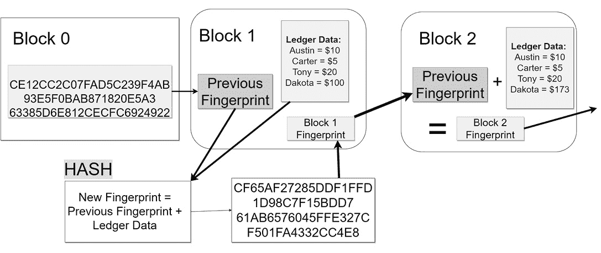
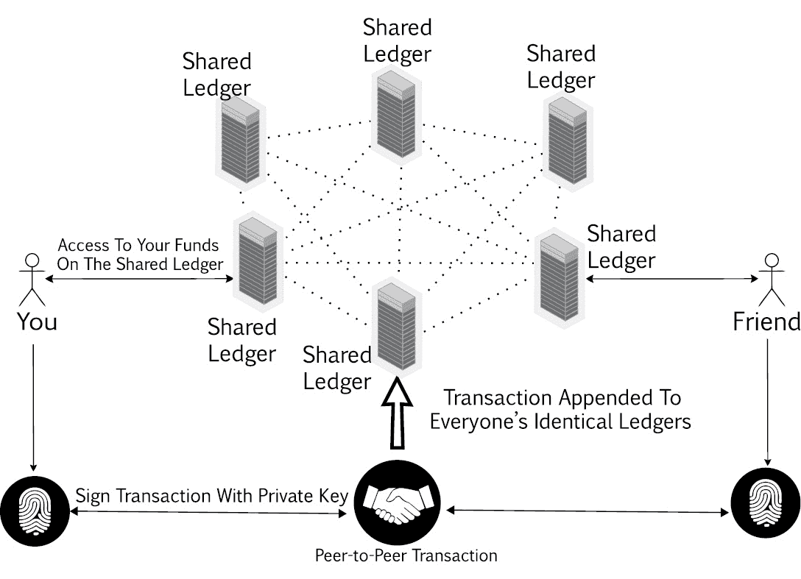
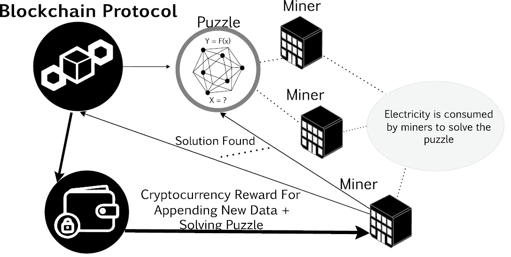

## 一、区块链&脚踏实地

很抱歉让你扫兴。为普通观众写这个东西的描述是非常困难的。 [17](CarterLeeWoetzel_019_ebook-4.xhtml#footnote-045)

—中本聪，比特币的匿名创造者

当我第一次开始以简单的方式描述区块链时，我花了几个月的时间研读原始研究论文:大卫·乔姆 1977 年的论文，中本聪 2008 年的白皮书，维塔利克·布特林的以太坊白皮书，以及一份可以持续相当长时间的清单。 [18](CarterLeeWoetzel_019_ebook-4.xhtml#footnote-044) 、 [19](CarterLeeWoetzel_019_ebook-4.xhtml#footnote-043) 、 [20](CarterLeeWoetzel_019_ebook-4.xhtml#footnote-042) 我不满意。我将我的搜索扩展到简化的解释:这方面的一个例子是加州大学伯克利分校 2015 年的“区块链技术——超越比特币”论文。甚至像“区块链简单解释”这样的 YouTube 视频在评论部分也包含了惊人的混乱。 [22](CarterLeeWoetzel_019_ebook-4.xhtml#footnote-040) 人家好像没听懂。即使他们这样做了，他们也没有信心回应别人。

在我的研究过程中，我意识到:我们没有被教授分类账的概念和逻辑，因为区块链只是一个激进的未来分类账，大多数人在第一次尝试了解区块链时遇到的困境很快变得明显。

我们知道如何去加油站买汽水，但我们不会真的停下来想一想加油站、银行和所有从任何给定交易中分一杯羹的中介是如何记录这笔交易的。在最好的情况下，普通人跟踪他们账户/分类账的余额是如何增加或减少的。我们被困在用单一分类账范式来看待世界。

理解分类账是理解区块链的第一步。分类账是财务交易的活记录。你每天都在使用分类账，除了你自己的账户，其他分类账也在发挥作用，它们是确认你自己账户余额不可或缺的一部分，我喜欢称之为“分类账生态系统”因为事实上，你目前银行账户中的 34，220 美元仅仅是所有进出你账户的交易的总和。

你公司的薪水增加了+832 美元到你的账户上(公司的分类账反映了-832 美元)，转移到你的 PayPal 账户上的银行账户净额为-150 美元(PayPal 的分类账增加了+4.99 美元的交易费)，购买巨无霸的外向交易为-2.32 美元(麦当劳的分类账为 2.32 美元)。你自己每天使用的账户余额是一个简单的分类账，与数百个其他分类账相互作用，不断相互调节和平衡。

这是理解区块链的起点。我们需要开始将这个世界视为数百个不同的分类账，不断地相互协调和平衡，许多集中的美元分类账是授权和所有权的集中点。此外，并非所有分类帐都是平等的。有些人比其他人更有权力。这不仅适用于银行，也适用于任何种类的海量数据系统。数据库(脸书服务器、Twitter、易贝或亚马逊)仅仅是数据的分类账，而不是美元的分类账。所有这些都是试图促进双方交易的集中中介。

在目前的系统中，许多分类账集中控制着许多人的资金和数据，带来了操纵和不信任的风险。这就是为什么我们一直有会计和审计(这是相当昂贵的)。我们逐渐发现，协调大型集中式分类账之间的争议是非常昂贵的。**集权玩家不喜欢互相信任。整个系统建立在一个不稳定的信任体系之上。**

*”。。。银行、经纪公司、托管人和清算机构为核对多个分类账而进行的重复且耗时的交易后过程代表了嵌入在现有系统中的非常大的信任成本"* [23](CarterLeeWoetzel_019_ebook-4.xhtml#footnote-039)

*—* 经济政策研究中心

#### **分散解决方案**

但是，如果有一种方法可以在你我之间或企业之间实现真正的点对点互动，而不需要任何第三方中介减慢速度并吸收价值，那会怎么样呢？如果你和我真的控制了我们自己的账户呢？如果有一个由数学和密码学支持的系统，每个人都可以信任它，以完全自动化的方式作为交易的推动者，我们知道它是安全的、可审计的和永久的，会怎么样？

这正是区块链所做的。区块链颠覆了集中式账本范式。

我们现在知道区块链的存在是为了解决什么，但是区块链到底是什么？

区块链是一个分散的交易、账户和数据的分类账，由分类账的分散所有权保护，其中数学和密码学是分类账的数字法律。在使用数字加密货币作为交换媒介的生态系统中，共享账本的维护和使用成为可能，这同时也激励那些维护和保护账本的人继续这样做。

我们不再信任一系列集中的团体来备份、更新和验证您自己的交易和财富，而是信任公开可见的编码协议来管理和维护我们的交易。账本的数字法律是用数学构建的——一个我们都可以信任的完全中立的方，作为真正点对点交易的推动者。

更重要的是，数字分类账及其规则的控制是由一个分散的社区组成的——阻止任何一方操纵分类账或分类账条目的规则。因为每个人都有相同的账本副本，协议很容易发现任何试图操纵账本的人。

最终，利用公钥加密(与互联网的工作原理相同)让每个使用这种分散分类账的人都可以进行点对点交易，而不需要依赖多个中介来实现简单的交易。

#### **区块链是如何工作的？**

你和一群朋友在一起，你决定借给你的朋友奥斯汀十美元。你的两个朋友 Dakota 和 Tony 看到了这个交易的发生，并在心里记下了它。一周后，奥斯汀付给你八美元，并说:“这是我欠你的。”自然你就不爽了！奥斯汀退错金额的证据是什么？达科塔和托尼支持你:“那是 10 美元——你做那笔交易的时候我们在场。”作为一个朋友团体，公认的共识是奥斯汀欠你十美元，而不是八美元。你的小组已经创建了一个**伪分散式分类账**，其中各方都在交叉检查，以确保交易记录保持公平和平衡。

也被称为分散式分类账技术(DLT)，区块链是一种数字分类账形式的记录保存系统。 [24](CarterLeeWoetzel_019_ebook-4.xhtml#footnote-038) 区块链具有以下一组属性:分类帐是分布式的、共享的、不可变的，并且由分类帐中以“块”的形式加密链接的条目组成该协议是控制如何在分类账上维护和执行交易和余额的编码法律，旨在就任何给定时刻共享分类账包含的内容不断建立共识。 [25](CarterLeeWoetzel_019_ebook-4.xhtml#footnote-037)

你的二十人朋友团决定制造自己的货币。我们将方便地称这种货币为“加密货币”你已经决定任何人被允许彼此交易的唯一方式是如果每个人都出席交易，并且大多数人将允许交易进行。每个人都在自己的个人账上记录同样的交易。使用这个系统，每个人都有一个相同的分类账，并保持共识。如果托尼从达科塔购买了一件价值 10 美元的物品，所有 20 个人都将在他们自己的分类账中记录这笔交易。

如果任何人试图将他们分类帐上的余额从 90 美元改变到 100 美元，则下次他们试图与该组中的其他人进行交易或交易时，所有其他人都单独拥有他们自己的相同的“共享”分类帐，这表明该个人没有与该组的其他人相匹配的分类帐。因为小组发现了分类账中的不匹配，这个人就会受到某种费用的惩罚，并且不允许与任何人交易，直到他们采用了小组中其他人正在使用的分类账。这是区块链的另一个特点:**它消除了任何一方操纵总账对自己有利的危险——创造了一个比传统的中央系统更安全的交易网络。** [26](CarterLeeWoetzel_019_ebook-4.xhtml#footnote-036)

我们已经强调了区块链账本的以下有价值的特征:**共识、增强的安全性、抗腐败、分布式账本(通过设计)以及权力的分散。这使得分散式分类账的以下特征有待检验和解释:不变性、可审计性和无许可参与。**

#### **完美的数据指纹**

二十个朋友的委员会决定坐下来，想出一个办法，让查看每个人的分类账是否匹配的过程变得更容易。你已经做了三年了，曾经是分类账的小本子现在变成了一本厚厚的交易字典。人们担心这 20 个人中的大多数人可能会勾结起来对过去的账本进行一系列的修改，并使那个被破坏的账本被采用，从而掠夺无辜者并使邪恶的行为者致富。

如果有一种数学方法可以确保过去的条目不会被更改，那会怎么样？这种保证将使分散的分类账具有不变性。更重要的是，数学保证会不会成为协议“法律”的一部分，自动地“不信任地”确保没有人能够欺骗系统？

这就是编程和数学的力量交汇之处。“哈希”函数是这个问题的完美数学解决方案。散列是将给定的一组数据转换成独特的数字指纹的算法过程，其形式是完全独特的字符串输出。无论输入的数据大小，这个函数都有效。汤姆·斯科特是一名网络开发人员，也是著名的 YouTube 频道“Computerphile”的所有者，他解释道:“哈希算法有点像信用卡条形码中的‘校验位’。。。信用卡条形码的最后一位数字由所有其他数字决定。” [28](CarterLeeWoetzel_019_ebook-4.xhtml#footnote-034)

使用安全散列算法 256 (SHA-256)的示例如下:

**图 1: SHA-256 哈希示例**

**图 2:输入发生变化的 SHA-256 哈希示例**

"[奥斯汀= $10 卡特= $5 托尼= $20 达科他= $173]"作为输入。

输入的 SHA-256 哈希= 19409681d 75421 FD 47 fa 76 f 9 EB 0 c 47051 af 27 a9 a 64 fcbcabaafc4 a 06d 9 c 3 b 03 c

"[奥斯汀= $10 卡特= $5 托尼= $20 达科他= $100]"作为输入。

输入的 SHA-256 哈希= 1 DFC ffc 46 e 60 f 433d 29381 EFE 48 e 798 EFD 402 c 7d 70 ab 998591 f 4 f 859 cdac 5 b 6 c

对数据的任何更改，在本例中是 Dakota 的总金额为$100 而不是$173(作为散列函数的输入发送)，都会产生完全不同的指纹。这是了不起的。您可以将一个十万页的字典输入到一个散列函数中，**和** **如果有人更改了字典中的一个单词或字典中任何地方的一个字符，输出将明显不同于整个字典的原始散列。**这是瞠目结舌。这完全令人震惊——这种事实让我停下来思考数学的美，以及使这一切成为可能的研究。散列法给出了数学上的保证；一种让计算机系统和人们 100%确信给定的一组数据没有被篡改的方法。

在我们把“哈希”纳入朋友圈之前，我们需要想一想其中的困难。对整个分类账或交易字典进行散列需要大量的时间。如果有更快的方法呢？这就是“积木”进入游戏领域的地方。我们制定一个简单的规则。任何人都不允许回到分类账的历史中去修改任何记录。如果你打破这个规则，很容易被发现。

方法如下:每个人开始一个新的分布式账本，和以前一样。这个新分类账的每一页都包含一组记录和账户余额更新。当一个新的页面或“块”被创建时，前一页数据的散列被标记到新的页面上。随着越来越多的交易和页面被添加到每个人的相同分类账/账簿中，我们一次又一次地这样做。这意味着每一个新的页面都包含一个完全独特的指纹，该指纹是由分类帐前一页的指纹创建的。

**例 3:指纹链**

您不能在每一页上重新创建这些“散列”指纹，除非您拥有来自所有先前页面或“块”的相同数据和指纹历史这是通过使用散列函数将这些块/页“链接”在一起而产生的保证。因此，使用了“区块链”这个名字。

这个记录链被称为区块链，是一种数学保证，提供了一种极其方便的方法来检查分散的数字分类账是否被更改过。现在，我们不再比较每一页和每一个条目，而是在分类账的最近一页上有一个单一的值，所有 20 个朋友都可以与之比较。只需比较事务的最新散列页面。没有人需要被信任在检查期间犯错误。是数学。一加一等于二。永远永远。不可信的信任。 [29](CarterLeeWoetzel_019_ebook-4.xhtml#footnote-033)

这种数学保证，结合分散式分类账的设计，创造了信任——同时赋予了**不变性**和**可审计性**的属性。区块链是不可改变的，因为在不破坏指纹链的情况下，过去的财务记录不能被改变，因此任何恶意改变的分类账(与其他人正在使用的商定的分布式分类账相比)的有效性被破坏和忽略。因为过去是不可改变的，你可以很容易地翻阅分类账的页面/区块，观察整个生态系统内交易和平衡的完美的未改变的历史。关于谁与谁交易以及交易金额的争论为零。所有交易都在区块链分类账中。公开可见。完全可审计。永恒的混凝土。

最后，区块链的**无许可**意味着什么？简单来说，**任何人**都可以加入你的二十个好友圈子。任何人都可以和任何人交易。你可以在协议规定的范围内自由交易。从数字的角度来说，这意味着任何一个拥有电子设备、互联网连接和连接到你最喜欢的区块链的“钱包”(有很多)的人都可以让你立即参与到整个生态系统中。这种设置非常简单，只需下载一个浏览器扩展或在手机上安装一个旨在集成到区块链中的应用程序。 [31](CarterLeeWoetzel_019_ebook-4.xhtml#footnote-031) 你是无许可的，因为你拥有独立于任何中央集权的完全代理权。没有复杂的表格需要填写。没有信用记录。没什么。你可以直接以对等的方式与他人进行交易。

这看起来像什么？嗯，我在电脑上点击两下，就能在 Chrome 浏览器上打开我的安全加密钱包。这个加密钱包也在我的手机上。用户界面和 Venmo 没什么区别；我可以与集成在区块链上的网站、游戏和应用程序进行交互，所有这些都是为了利用区块链的特性而设计的。我可以随时随地向世界上的任何人发送加密货币:点对点，只要我想。我可以使用完全自动化的、不受单一一方控制的分散式交易所。我可以马上申请抵押贷款——不需要文书工作。我可以使用 Augur 在几秒钟内从零开始参与衍生品市场。我可以从传统商店购买加密货币——全球超过 15000 家供应商接受加密货币，包括维基百科、微软、Expedia、AT&T。这样的例子不胜枚举。

这一切都是无缝的，都集成在区块链上，没有一个看起来与我们当前的网络浏览器有很大的不同。你仍将拥有你的手机应用和网站。与众不同的是，您只需拥有一个加密钱包，就能获得更高的自由度和功能性。任何有网络连接的人都可以开始一个——零文书工作。

区块链的哪些特征是这种更大自由度和功能性的催化剂？共识、增强的安全性、抗腐败性、分布式账本(通过设计)、权力分散、不变性、可听见性和本质上的无许可性是赋予区块链技术(以及由此延伸的加密货币)内在价值的基本要素。与当今存在的许多集中式系统相比，这些属性将可以使用分散式总账技术或区块链构建的系统区分开来。

欢迎来到分散化的未来。

#### **分散值**

区块链的核心是一个数字分布式记录系统，在这个系统中，世界上任何有互联网连接的个人都可以参与更新和验证这些共享的数字记录。

有了数字银行，你就有了一个有余额的账号。每当您进行交易时，银行都会通过跟踪您的数字现金流动的进出来更新中央分类账，并相应地更改您的总体余额。

传统上，为了能够向他人汇款或在各方之间进行交易，需要建立一系列链接:你的银行到 PayPal 或借记卡，然后这些信息被输入到一个集中的平台，如亚马逊或易贝。如果一个客户从另一个客户那里购买，那么下游的银行必须在跳过交易平台后，在自己的分类账上进行沟通并完成交易。

**图 3:集中台账**

我们没有将备份、更新和验证您自己的交易的工作委托给一个集中的交易方链，而是将数字账本的控制权移交给一个分散的社区，让所有交易对等进行，全面更新共享账本，而不是通过一系列集中的中介。

**图 4:分散式台账**

你不再需要提出“一加一等于多少”的问题去银行。你问这个问题甚至不需要银行的许可！相反，你可以代理和控制你将发送多少加密货币以及发送到哪里。支持分布式分类账的分散节点组作为一个集体单位来回答“一加一等于二”——淹没了任何试图用“三”来回答的单个邪恶行为者。这与集中式账本形成对比，集中式账本可以毫无挑战地回答“三”，损害你的个人账本和对系统的信任。

从业务角度来看，是什么让这种共享分类账变得有价值？分布式分类帐是有价值的，因为它是公开维护的，是一致同意的，并且所有权是分散的。在 21 世纪，大部分记录都是由一方维护、更新和出售的。对于任何需要使用由一个集中的团体持有的记录的人来说，这是昂贵的，并且导致信任一个人类组织是道德的和与数据一致的。此外，中央集权的玩家很难相信其他中央集权方的数据分类账。瞧，即使是最大的玩家也不信任彼此！

让我画一幅画。你打开银行账户，试图给你在南非的“朋友”电汇 50，000 美元(看着你，尼日利亚王子电子邮件骗子)。您的银行会标记并阻止该交易。另外，出了点问题。这笔钱意外地从你的账户中扣除了。然后你卷入了一场旷日持久的法律纠纷，你试图用收据和支票向法庭证明这笔钱的所有权。银行的账本最终说了算，你被留下来与从未真正控制自己的钱的后果作斗争。

这里有几个令人沮丧的部分。为什么你不能把你的钱寄给世界上任何地方的任何人？为什么你要向仅仅是你资产保管人的人证明所有权呢？在试图证明你拥有什么和你试图交易什么的过程中，你为什么要与这么多的第三方打交道？

如果我们在这个交易中使用区块链会怎么样？你只需打开你的数字加密钱包(有很多)，向你朋友的公共钱包地址(类似于邮箱，但在数字高速公路上)发送价值 5 万美元的比特币。在这个过程中，你会产生一笔小额费用，支付给区块链网络上的分散节点，以促进交易。事务要么发生，要么不发生——在执行中是二进制的。

不存在灰色地带和可能的交易中间状态。你的资产要么被转移，要么没有，所有这些都在区块链上公开记录。没必要去找第三方。你对资产的所有权已经被记录在区块链上，就像你对你在南非的朋友的所有权转移被记录在全球分布的所有相同的分散分类账上一样。

这一切都是无缝的:没有单一的第三方，也没有集中的分类账。你的交易决定是未经许可的。控制自己资产用途的能力并不取决于第三方。权力完全掌握在你的手中——由一个分散的网络提供便利。

#### **齿轮和杠杆**

现在我们倒回时钟。那笔交易怎么可能？如果每笔交易都被添加到记录链中，并且每个人都必须在同一页上，分散的数字分类账才能工作，那么我们作为一个整体如何得出结论呢？

答案再次是“共识”。有成千上万的节点或计算机，都有相同的数字账本副本。每当有人想对账本进行更改时，这个分散的网络必须有 50%以上的人同意才能进行更改。这与选举没什么不同，许多经济基础都重复使用了正常选举的原则。 [34](CarterLeeWoetzel_019_ebook-4.xhtml#footnote-028)

这对你来说应该是一个小小的警告。难道没有人可以任意设置大量的节点并控制超过 50%的网络吗？如果网络具有“无权限”的属性，不加区别地允许任何人加入维护分类帐，那么如何阻止这种攻击呢？如果网络的大部分决定某个加密钱包应该将资产从地址 A 移动到 B，那么无论钱包所有者同意与否，这都将发生。

这被称为女巫攻击。这被称为“百分之五十一的攻击”在区块链真正存在之前，这是区块链空间中需要解决的最后一个问题。是什么阻止了某人伪造多重身份来影响共识过程？

2008 年，匿名的比特币创始人中本聪的智慧在这里架起了一座桥梁，解决了这个棘手的问题。你看，直到 2008 年，大量的组成部分，使区块链的现实进行了研究，并有可能实现。51%的攻击是一个有待解决的基本瓶颈。我们如何阻止西比尔的攻击？我们如何阻止人们玩弄共识系统？

中本聪意识到，玩弄共识系统是没有成本的。博弈论很容易打破共识。需要牺牲具有真实世界价值的有限资源来换取向记录链发布一组事务的能力。

Nakamoto 通过设计一个被称为工作验证共识模型(PoW)的解决方案解决了这个问题。为了提出交易或对数字总账的改变，必须以计算能力或电力的形式向网络支付价格。功率计算用于解决一个需要大量电力才能解决难题。这就是“采矿”一词的由来。任何人都可以挖到金子并解决这个难题，但那些投入更多资源的人更有可能挖到金矿。

**图 5:电力开采**

最终，这种采矿激励成本系统的目标是，随着时间的推移，没有一个实体能够接管记录更新(批量生产)，因为需要大量的资源消耗。此外，在区块链创造的钱包或身份的数量不再重要——共识现在是基于成本的。**工作证明不支付邪恶的演员，只有那些有助于持续成功的分类帐。使用工作证明共识模型，区块链最终可以实现无许可，同时对破坏共识的恶意企图具有强大的威慑。**

Nakamoto 设计的最出色的细节是，谜题的难度会根据试图解决谜题的计算能力的总量自动调整——解决谜题的节点越多，算法就变得越难。当谜题被解开时,“矿工”试图添加到分类账中的交易块(或页面)变成了添加到每个人分类账中的事实上的最新交易块。拒绝采用最新块的分类帐/矿工将被忽略——最近页面上的“散列”指纹将不再匹配所有其他相同分布的分类帐。 [38](CarterLeeWoetzel_019_ebook-4.xhtml#footnote-024)

通过一次只添加一个分类账更新块/页面(比特币大约每十分钟一次)，另一个问题得到了解决——时间戳问题。如果可以同时添加一个以上的块，则会导致“双重花费”问题。如果用户使用账本上的同一套比特币提交了两笔出站交易，并同时将其发送到两个不同的区块，我们就会遇到排序问题。其中一项交易应该被允许通过，而另一项则不允许，否则用户将“花同样的钱两次”并破坏加密货币的公平性。通过一次只对分类帐进行一个块的改变，区块链设计通过使协议自动检查单个提议的块内的双重花费而解决了“双重花费”问题，同时如果允许同时附加多个块，则不必处理时间戳冲突，这是不可能的困难。 [39](CarterLeeWoetzel_019_ebook-4.xhtml#footnote-023)

但是如果这个最新的单个页面/块是邪恶的呢？如果分类账的所有其他“页面”都是正确的，除了最近提出的区块，会怎么样？

这就是公钥加密再次拯救世界的地方。每个加密的钱包/地址都有一个私人密钥——类似于社会安全号码或你的指纹。每当从该地址/余额向外进行交易时，该交易必须由该私钥“盖章”,以便该交易被接受到提议的块中。从本质上来说，用一个假的私钥“标记”一个出站交易在数学上是不可能的。该协议验证地址的所有者用私钥签署了出站交易。否则，建议的块将被立即忽略并丢弃。坏演员以浪费电力支出的形式损失金钱，并可能成为“白名单”，被网络的其他人忽视:真正支持区块链的矿工会受到永久的惩罚。

我应该注意到，在共识系统中，改进的 SHA-256 难题算法创造了一种彩票动态，在这种动态中，拥有一张“选票”的人绝对可以解决难题，而拥有九十九张“选票”的人则具有计算能力。简单地说，这个谜题的答案是用椭圆曲线加密法随机分布的，而这种随机性是不可游戏的。 [41](CarterLeeWoetzel_019_ebook-4.xhtml#footnote-021) 更多的计算会增加中奖的频率，但是谜题的解的分布仍然是随机的。

迄今为止，工作证明共识模型运行得非常完美——比特币的区块链上存在 534，500，000 笔交易，每天有超过 13，000 笔新交易添加到比特币分类账中。 [42](CarterLeeWoetzel_019_ebook-4.xhtml#footnote-020) ， [43](CarterLeeWoetzel_019_ebook-4.xhtml#footnote-019) 在区块链上交易的个人越多，相应区块链的本地加密货币的价格就越高。高价格激励更多的矿工尝试解决难题，并成为向分类账提交新区块的矿工。这有两个原因。矿工解决了一个难题，并将最新添加的区块发布到待采用的分类帐中，通过以下方式获得收入: [44](CarterLeeWoetzel_019_ebook-4.xhtml#footnote-018)

1.从像你我这样想交易、交易或更新账户的普通人那里获得交易费

2.对于每个解决的难题和提交的新块，协议自动奖励一定数量的加密货币

这造成了矿工之间激烈的竞争，成为被选中的矿工。越多的人竞争成为赢家，共识就变得越分散，网络就越安全。任何加密货币价格上涨的一个美丽的副作用是，它鼓励更多的矿工试图解决这个难题，最终保护账本。这是因为，通过让更多的节点用它们的通用分类帐的冗余副本来支持分散的分类帐，使系统与更多的竞争博弈变得更加昂贵，同时增加了网络的分散性。

#### **交易**

但是，如果我不想支付这些巨大的电费来试图解决这个难题，并让我的交易过帐到区块链，该怎么办呢？如果我只是想用我的加密货币转账或交易，就像我使用 PayPal 一样，该怎么办？

这恰恰是“矿工”派上用场的地方！首先，将您的事务提交到“待处理事务池”这个池是根据协议的定义验证您的交易是否合法的地方。除了提交到此池，您还为发布您交易的任何矿工设置了奖励。想象这是一个披萨小费，该地区的所有司机都知道你要给多少小费(相对于其他人)。那些提交更高“小费”的人将会更快地公布他们的交易。

如果多个矿工认为你的小费足够多，他们会拿起你的交易，并将其添加到单个矿工试图添加到分类账的交易“块”中。一个比特币“块”可以包含 500 笔交易。不同的区块链，如比特币现金，有更大的块大小，允许每个块有更多的交易被发布到分类账。如果挖掘者解决了难题，则新的记录集被附加到当前商定的记录链，并且挖掘者被自动支付“小费”以及用于解决难题的加密货币的协议奖励，以补偿计算成本。瞧啊。您的交易现已提交并被铭刻在历史记录中，而矿工则心满意足地离开了。

你现在已经牢牢掌握了这个被称为区块链的复杂而美丽的怪兽是如何工作的。不同的区块链使用除工作证明之外的其他共识模型。尽管存在一些折衷(利益相关证明、权威证明)，但最终所有这些共识模型都为区块链提供了前面提到的有价值的属性。[第四十六期](CarterLeeWoetzel_019_ebook-4.xhtml#footnote-016)

共识、增强的安全性、抗腐败、分布式账本(通过设计)、权力分散、不变性、可听见性和本质上的无许可性是加密货币和区块链的价值所在。随着我们最终转向加密货币作为投资，这些分散式账本技术的宝贵原则将被用于各种应用和业务，以解决现在和未来的问题。

* * *

[17](CarterLeeWoetzel_019_ebook-4.xhtml#footnote-045-backlink) 中本聪，“关于:1.0 的 Slashdot 提交”，中本聪研究所，2010 年 7 月 5 日最后修改。

David Chaum，“由相互怀疑的团体建立、维护和信任的计算机系统”(加州大学伯克利分校博士论文，1979)。

中本聪，“比特币:点对点电子现金系统”，中本聪研究所，2008 年 10 月 31 日最后修改。

[20](CarterLeeWoetzel_019_ebook-4.xhtml#footnote-042-backlink)Vitalik buter in，“下一代智能合约和分散式应用平台”(白皮书，2014 年)。

[21](CarterLeeWoetzel_019_ebook-4.xhtml#footnote-041-backlink)Fthi Arefayne Abadi，Joshua Ellul，和 George Azzopardi，“比特币之外的区块链事物:系统综述”(摘要，2018)。

[22](CarterLeeWoetzel_019_ebook-4.xhtml#footnote-040-backlink)y0 coin，《Ted Talks:区块链详解》，2016 年 12 月 23 日，视频，15:31。

[23](CarterLeeWoetzel_019_ebook-4.xhtml#footnote-039-backlink)m，Casey，J. Crane，G. Gensler，S. Johnson 和 N. Narula，《区块链技术和金融的影响:变革的催化剂》，*日内瓦世界经济报告* *第 21 期*，2018。

[24](CarterLeeWoetzel_019_ebook-4.xhtml#footnote-038-backlink) 安德鲁·梅奥拉，《分布式账本技术&区块链讲解》，《商业内幕*，2020 年 1 月 16 日。*

 *[25](CarterLeeWoetzel_019_ebook-4.xhtml#footnote-037-backlink) 丹尼尔·康特·德莱昂(Daniel Conte De Leon)等人，《区块链:属性与误解》，*亚太创新与创业杂志* 11，第 3 期，2017 年 4 月。

[26](CarterLeeWoetzel_019_ebook-4.xhtml#footnote-036-backlink)Mike Orcutt，“区块链真的有多安全？”*麻省理工科技评论*，2020 年 4 月 2 日。

布莱恩·詹布拉诺，“区块链解释:不变性是如何工作的？”*极有可能*，2018 年 2 月 27 日。

计算机爱好者，“哈希算法和安全性——计算机爱好者”，2013 年 11 月 8 日，YouTube 视频，8:11。

埃德·费瑟斯通，“区块链:你想让我信任一个‘无信任的信任’系统？”

[30](CarterLeeWoetzel_019_ebook-4.xhtml#footnote-032-backlink)Matile、Raphael 和 Christian Zurich，“基于区块链的电子投票中的隐私、可验证性和可审计性”，*苏黎世大学信息学系—通信系统组*，2018 年 4 月 4 日。

[31](CarterLeeWoetzel_019_ebook-4.xhtml#footnote-031-backlink)Christian Cachin 和 Marko Marko Vukoli，《荒野中的区块链共识协议》，*康奈尔大学计算机科学*，2017 年 7 月 7 日。

[32](CarterLeeWoetzel_019_ebook-4.xhtml#footnote-030-backlink) “有多少商家接受比特币？完整列表(2020)，”Fundera，2020 年 1 月 1 日。

33lbid。

[34](CarterLeeWoetzel_019_ebook-4.xhtml#footnote-028-backlink) 伯纳德·马尔，《伯纳德·马尔&公司智能商业绩效》，*伯纳德·马尔&公司，智能商业绩效*(博客)，2019 年 8 月。

[35](CarterLeeWoetzel_019_ebook-4.xhtml#footnote-027-backlink)Darcy w . e . Allen 等著《秘密民主的经济学》， *SSRN 电子期刊*，2017 年。

[36](CarterLeeWoetzel_019_ebook-4.xhtml#footnote-026-backlink) 张世杰和 Jong-Hyouk Lee，“比特币去中心化网络中带有 Sybil 攻击的双花费”， *IEEE 工业信息学汇刊* 15，第 10 期，2019 年 10 月。

[37](CarterLeeWoetzel_019_ebook-4.xhtml#footnote-025-backlink)Daniel Krawisz，“工作验证概念”，*工作验证概念|中本聪研究所*，2013 年 6 月 24 日。

[38](CarterLeeWoetzel_019_ebook-4.xhtml#footnote-024-backlink)Julian Martinez，“理解工作证明，第 1 部分:揭开解决障碍的神秘面纱”，Medium，2018 年 5 月。

[39](CarterLeeWoetzel_019_ebook-4.xhtml#footnote-023-backlink)Gregory Trubetskoy，《区块链工作证明是一个去中心化的时钟——Gregory Trubetskoy》， *Gregory Trubetskoy* (博客)，2018 年 1 月 23 日。

电子前沿基金会固态硬盘，“深入研究端到端加密:公钥加密系统如何工作？”监视自卫 2019 . 2 . 19。

[41](CarterLeeWoetzel_019_ebook-4.xhtml#footnote-021-backlink)Darrel r . hank erson，Scott A. Vanstone 和 A. J. Menezes，*椭圆曲线密码学指南*，纽约:Springer，2011 年。

[42](CarterLeeWoetzel_019_ebook-4.xhtml#footnote-020-backlink) 《比特币 n-交易-总额》，[*Blockchain.com*](http://Blockchain.com)，2020。

[43](CarterLeeWoetzel_019_ebook-4.xhtml#footnote-019-backlink)lbid。

[44](CarterLeeWoetzel_019_ebook-4.xhtml#footnote-018-backlink)bit pay—4 月 16 日，“什么是比特币矿工费用？，“BitPay 支持，2020 年 4 月。

[45](CarterLeeWoetzel_019_ebook-4.xhtml#footnote-017-backlink)Tushar，“一个区块有多少笔交易？”*比特币栈交易所*，2015 年 4 月 1 日。

[46](CarterLeeWoetzel_019_ebook-4.xhtml#footnote-016-backlink)Rahul katar ya 和 Aamir Mustafa，“区块链和共识算法”， *SSRN 电子杂志*，2020 年 3 月 30 日。*