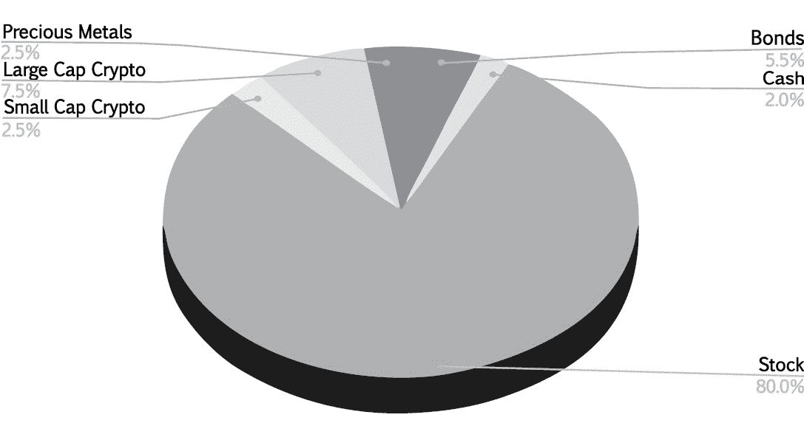
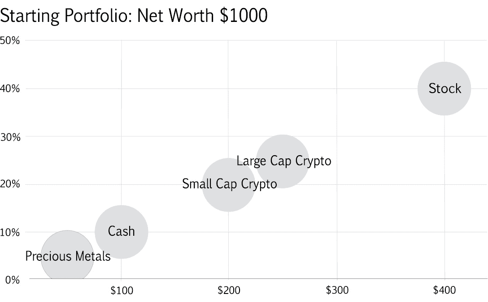
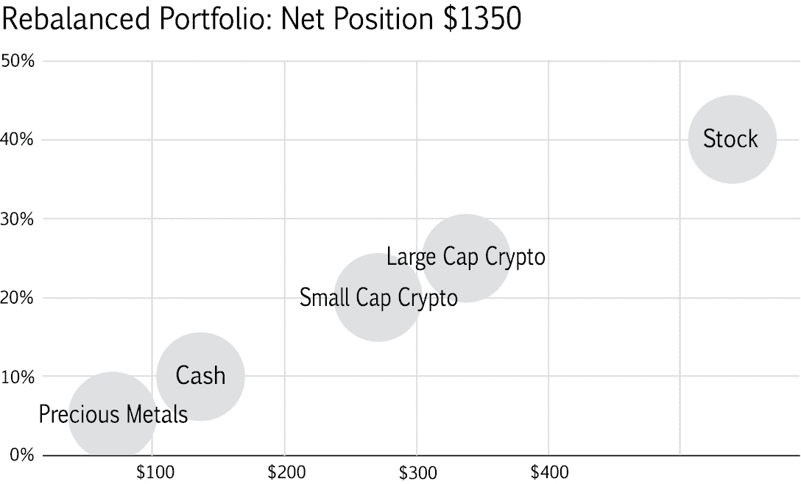

## 八、原理

一位股票经纪人因发烧住院。当一名护士走进房间给他量体温时，股票经纪人问道:“多少钱？”

“102，先生。”护士回答。

股票经纪人紧锁双眉，全神贯注。

沉思片刻后，他选定了一个计划。“到 103 就卖了。”

坚持原则，而不是你的直觉。如果我们的直觉通常是正确的，我们都会成为百万富翁。回到我们的投资信条(由沃伦·巴菲特提供)，*“只买那些如果市场关闭十年你也会非常乐意持有的东西。”市场永远充满混乱。这就是原则如此重要的原因。原则是你能控制的。以下是投资者控制的关键原则: [191](CarterLeeWoetzel_019_ebook-11.xhtml#footnote-202)*

目标

平衡

成本

纪律

早在 1985 年，沃伦·巴菲特的第一次电视采访就谈到了这些。*“短期专注不利于长期盈利。”* [192](CarterLeeWoetzel_019_ebook-11.xhtml#footnote-201) 经历了 2018 年的加密货币泡沫，投资原则缺失。对未来价格的大肆宣传似乎压倒了任何关于未来五年价格合理性的讨论。如果时间可以倒流，我会让自己和其他投资者坐下来，问一些简单的问题。

“你的目标是什么？你的投资组合在多个不同的资产类别之间是否合理平衡？你有目标出场价格吗？你有纪律来坚持你的计划吗？”

我可以想象，一个没有原则的投资者会感到紧张不安，时刻紧张不安。他们全速奔跑，避开任何可能“让他们慢下来”的障碍——这是一种与贪婪交织在一起的疯狂，拒绝面对简单的问题。

硬道理——投资原则是你的资本赖以生存的真理。尊重确立原则的意义。在市场变得混乱之前，给自己一个机会放慢脚步，确立自己的投资原则，这样当一切都在运动的时候，你就能准确地知道自己的下一步是什么。

#### **目标**

目标包括建立可测量和可实现的投资基准。 [193](CarterLeeWoetzel_019_ebook-11.xhtml#footnote-200) 该目标要求开发一个流程或一组步骤来达到这些基准。投资目标的第一部分是**目标**。我们的加密资产投资目标可以是任何东西，但定义您的目标会带来清晰度。以下是加密货币投资的目标示例。

分散投资组合，将高风险/高回报的资产类别纳入投资组合的一小部分

与标准普尔 500 相比，增加你的投资组合的阿尔法(回报)

看到初始资本投资增加了 [x.xx](http://x.xx) 个百分点

将净头寸增加$ [xxxx.xx](http://xxxx.xx)

购买一辆新车

提前两年退休

您的目标不一定需要完全包含在您对 crypto 的投资中。也许你的目标是让你在加密方面的投资支付 50%的新车费用，20%的新业务费用，或者帮助你提前两年退休。目标设定让我们对我们试图获得的东西有长远的眼光。在这个目标上，你可以激进，也可以保守。

目标的第二个要素是**时间范围**。我们希望多快达到目标？给自己一个总体时间表是很重要的。现实地看待你的时间范围。你的时间范围和目标不能是无法实现的幻想。现实主义并不意味着我们放弃我们的目标——它意味着我们明白，为了实现大的目标，你必须在现实的时间框架内执行现实的目标。如果我们超过了，太好了！

目标的第三个要素是**储蓄率**，或总切入点。 [195](CarterLeeWoetzel_019_ebook-11.xhtml#footnote-198) 简单来说，你愿意投多少钱？如果你有许多不同资产(房地产、股票、债券等)的投资组合。)，决定你的投资组合中包含新资产的百分比是一种健康的做法。这给了你一个你愿意投资多少的目标。投资者投资组合中 2%的资产配置可能意味着他们愿意向加密货币投资 6 万美元或 200 美元。这完全取决于你有多少资本。

通常，当投资者经历成功时，他们会感到被迫增加投入到投资中的资本量。这是人的本性。虽然这不一定是一件坏事，但你需要非常谨慎，不要过度扩张你的头寸，超过被认为是安全和一致的投资。如果你继续过度投资(突然你的投资占你投资组合的 40 %,而不是 2 %),那么你就是在赌博——简单明了。

如果你的日常生活方式和幸福因为你的投资所冒的风险而被消极地改变了，这就是你过度投资于一项风险资产并且没有充分分散你的风险的信号。写日志再次成为发现这一点的绝佳信号。

一旦我们决定了愿意为一项投资分配多少资金，我们该如何进行投资呢？

成本平均法是一种有用的开始方法。你不再试图把握市场时机，而是决定定期投资(比如说，一整年每两周 100 美元)。这有助于将你的投资“成本平均化”到一个合理的价位——降低波动的影响。

这里有一个例子:

第一周:以 8000 美元的现价购买价值 100 美元的比特币(0.0125 比特币)

第二周:以 6000 美元的现价购买价值 100 美元的比特币(0.016 比特币)

第三周:以 2000 美元(0.05 比特币)的现价购买一百美元的比特币

第 4 周:以 1000 美元(0.1 比特币)的现价购买价值 100 美元的比特币

当一项资产的价格随着平均成本的下降而下降时，你最终会用你预先确定的固定金额购买更多的资产“股票”。当价格上涨时，你最终购买的股票会减少。在这个例子中，你的平均购买成本和盈亏平衡点是 4，250 美元，用(8，000+6，000+2，000+1，000)/4 或总共购买 0.1785 个比特币计算。如果价格超过 4250 美元，你就赚了。如果价格跌破，你就亏本了。

请注意这与以下内容的显著不同:

第一周:以 8000 美元(0.05 比特币)的现价购买价值 400 美元的比特币

在这种情况下，如果比特币的价格超过 8000 美元，你就会赚钱。由于你的一次性购买，你购买了 0.05 个比特币，这比你在四周内的平均美元成本(0.1785 个比特币)少了 0.1285 个比特币。

在一次性购买的情况下，如果比特币价格低于 8000 美元，你就是在亏本操作。这就是为什么美元成本平均作为一种策略与一次性进入相比是惊人的——你不必试图去把握市场时机。相反，确定你想投资的金额，并随着时间的推移慢慢来。你降低了整体风险，给自己一个获得更安全投资回报的机会。

另一个有效的方法是**值平均**。这种策略旨在当投资价格下跌时增加投资，当资产价格上涨时减少投资。 [197](CarterLeeWoetzel_019_ebook-11.xhtml#footnote-196) 例如，我们设定了一个目标，利用价值平均法每月增加 500 美元的比特币头寸。下面是一个例子:

花 5000 美元购买 1 个比特币

价格上涨到 5，100 美元，所以你的头寸在月底价值 5，100 美元，比目标值少 400 美元

购买 0.078 比特币(价值 400 美元的比特币)，以实现月底价值 5500 美元的比特币的目标头寸(价格为 5100 美元的 1.078 比特币价值 5500 美元)

第二个月末，价格降至 4000 美元，因此你的 1.078 比特币头寸价值 4312 美元

净头寸比新月份的 500 美元目标头寸少 1，688 美元(6，000 美元至 4，312 美元)

以每比特币 4000 美元的价格，用 1688 美元购买 0.422 个比特币

投资组合有 1.5 个比特币——净头寸价值 6000 美元，当前价格为 4000 美元

这种模式在接下来的几个月里不断重复。如果每月增长超过 500 美元，你会非常高兴，并选择在月底不投入更多资本，因为我们预先计划的增长目标已经实现。

价值平均法的主要目标是在价格下跌时获得更多的股票，在价格上涨时获得更少的股票。这种情况也发生在成本平均法中，但是效果不太明显。几项独立研究表明，在多年的时间里，价值平均法可以产生略高于成本平均法的回报，尽管两者都非常接近同期的市场回报。价值平均策略的弱点是在严重短缺时没有资金进行适当的投资。这就是为什么对潜在回报有一个现实的看法，并对你的投资进行明智的预算，对你的目标的成功至关重要。

第三个也是最后一个进入点策略是**整笔进入**策略。这是最常见的散户策略。一个投资者决定他们喜欢一项资产，然后决定立即购买，而不是慢慢地扩大头寸。正如你在前面的例子中所看到的，这会让投资者焦头烂额。如果你有耐心使用成本平均法或价值平均法在合理的时间范围内设定你的储蓄率，你会降低整体风险。与此同时，如果价格在你购买后继续上涨，整笔进入可以最大化可能的回报——你以增加风险(无法实现你的目标回报率的可能性)为代价获得了最大可能的回报。

我无法充分表达这一点:随着时间的推移慢慢进入——你将为自己节省一个痛苦的世界。如果资产真的被低估了，你仍然会获得极高的利润，而承担的风险却小得多。

总的来说，目标原则就是要有清晰、恰当的投资目标。这意味着建立一个健康的时间框架，预先确定你愿意投资的资本或增长金额。

#### **平衡**

平衡原则是利用多样化的投资组合选择和决定资产配置的系统**。**平衡既是一种心态，也是一种策略，你必须采纳和实践。平衡投资的最前沿是多样化和资产配置——专业投资者的标志。

GAIN Capital 前研究主管 James Chen 对资产配置的定义如下:*“根据投资者的风险承受能力、目标和投资时间* *框架，通过调整投资组合中每种资产的比例，平衡风险与回报的投资策略的严格实施。”*

通俗地说，就是在一定的时间框架内，我们对任何给定的资产类别投入了多少资本。因为加密货币是它自己的资产类别，所以平衡原则必须作为投资应用于它——与任何其他资产一样。

我再怎么强调在多种资产类别之间分散投资的重要性也不为过。

多样化是平衡原则的核心，也是投资中最重要的原则。随着时间的推移，加密货币之外的其他资产类别已被证明具有持续的价值，将所有资本投入任何一个资产类别都是愚蠢的。你可以通过将投资资本分散到多种投资工具来降低整体风险水平。这种背离不仅是健康的，而且对你的投资组合的健康也是必要的。

以下是投资组合可以包含的主要资产类别:

现金

股票

债券

房地产

黄金

贵金属和商品

另类投资

**跨多个资产类别的多样化之所以奏效，是因为多样化的投资组合暴露于多个不同的关键市场——防范任何一个领域的疲弱表现。** [198](CarterLeeWoetzel_019_ebook-11.xhtml#footnote-195) 对于你们这些机会主义者来说，有些投资组合风格有很高的风险/回报。在我讨论简单的投资组合设置之前，我想简要谈谈加密货币分类的误称。

一个常见的误解是加密货币属于另类投资的范畴。某些加密货币可以归类为贵金属、股票，甚至房地产(令牌化资产)。这是区块链空间的一个强大的潜在未来现实，我认为随着市场监管机构和区块链开发商继续推进和定义这项技术，它将变得更加充实。

截至目前，即使是美国证券交易委员会这样的庞然大物实体也不知道如何一致地对某些加密货币进行分类！最好将加密货币视为一种替代投资，在未来可能被归类为其自己的资产类别，有一套单独的法规和法律。

在讨论投资组合构成时，资产类别配置百分比是投资组合的基础。你对任何给定的资产类别投入多少(与你在该资产类别中选择的投资分开)在很大程度上决定了你的总体风险和回报。 [199](CarterLeeWoetzel_019_ebook-11.xhtml#footnote-194)

每个资产类别都有数千种不同的投资可供选择。加密货币分为两类:小市值和大市值加密货币。市值是一种加密货币在总供应量中的市场价值的粗略表示。

举个例子，在写这篇文章的时候，比特币的市值(比特币的价格乘以比特币的供应量)是 1178.1 亿美元。比特币是所有加密货币中市值最大的。这与第九十七种加密货币 HyperCash 形成鲜明对比，后者的市值为 4300 万美元。请注意，与比特币相比，这一市值要小得多。投资市值较小的加密货币的风险明显更大，原因在第 9 章:定性分析-风险中讨论。

这就是拥有一个平衡的投资组合如此重要的原因。100%投资于加密货币等替代投资资产类别，同时将 100%的资本投入相对未知的高风险加密货币(排名前二十的加密货币之下)，这完全是疯狂的行为。分散你的风险！不要仅仅为了一次显著增加财富的机会，而将你的财务安全赌入一项没有出路的投资。

不要把所有的鸡蛋放在一个篮子里

—沃伦·巴菲特

#### **简单的投资组合**

存在无限数量的投资组合。本节将涵盖两个:积极和防御性的投资组合。这些插图旨在让你对多样化的含义有一个大致的了解。因为设计投资组合的过程是获得丰厚回报的主要组成部分，我建议投入大量时间研究这个话题。

**图 11:进取型投资组合**

这是一个激进投资组合的例子。激进的投资组合具有很高的增长潜力，任何投资者都应该愿意将 10%的最大配置比例投入加密货币。请注意，即使是最激进的投资组合，也只有 2.5%的配置用于小型加密货币——这是你可能投资的最高风险投资(和最高潜在回报)资产。

**图 12:防御性投资组合**

防御型投资组合与进取型投资组合完全相反。防御型投资组合是一个很好的投资组合设置，适合希望安全、聪明地涉足加密市场的新手投资者。不仅如此，总体而言，这是一个非常棒的投资组合，我会向规避风险的个人推荐这种风格的投资组合。防御性投资组合的目标是抵御市场衰退和低迷。这是通过大量投资保值资产(债券和贵金属)以及投资为经济提供必需品的公司来实现的。

我将在这里暂停一下，并向怀疑者发表意见。“百分之五投资于防御型密码投资组合？这家伙疯了吗？”我坚信 crypto 具有巨大的增长潜力，并且由于防御型投资组合的其余部分极其安全，在投机性投资中拥有一定比例的投资组合是对投资组合中低水平风险的非常强大的对冲。如果 5%的加密资产配置表现良好，你的投资组合将优于许多其他不包括加密货币的防御性投资组合设置。如果您的加密资产表现不佳，您的情况会更糟。但是，95%的投资组合致力于价值保留，也许这是你愿意承担的风险。

你有如此多的投资组合选择——依我拙见，规划你想如何分配是非常有趣的！普遍的共识是，你越年轻，你可以承担的风险就越大，从长远来看也不会有问题，因为你的投资组合将更容易从市场低迷中恢复过来，而且还会增长。一如既往，我会鼓励你谨慎行事。只要你分散投资，不要把太多的投资组合投入加密货币等高风险资产，你就能让自己的财富增长。

投资平衡才是王道，不要去追女王。

#### **成本**

我们可以控制的第三个原则是**成本**。当我们谈到成本原则时，你能完全控制的最重要的变量是你的费用。进入点和退出点也属于这一类，但是你不能控制价格(与费用形成鲜明对比)。因此，控制发生的费用属于成本原则，因为你可以控制这个变量。 [201](CarterLeeWoetzel_019_ebook-11.xhtml#footnote-192) 购买、出售和转移加密货币都会产生费用。

简单地说，如果你在两年内投入 100，000 美元，你的目标应该是以最低廉的费用购买场内菲亚特交易所、交易平台和加密经纪人。这似乎是显而易见的，但人们通常不会去寻找更好的交易所/经纪人，因为他们被这种搜索吓倒了。较高的费用通常与容易进入有关。容易存放法定货币并立即用美元购买密码的交易所通常会收取更高的费用。这也可能与这样一个事实有关，即拥有华丽用户界面、客户服务和简单注册流程的交易所拥有更大的客户群，因此可以收取更高的费用。

比特币基地是任何人用美元购买加密货币最容易的交易所。如果你是一个新手投资者，这是必去的交易所。比特币基地拥有简单的用户界面、强大的客户支持和良好的银行关系。当你开始更频繁地投资时，最好是寻找一个费用结构比比特币基地更便宜的交易所(符合成本原则)。一些替代的菲亚特坡道是双子座，北海巨妖和币安。

总之，尽可能降低成本。这是你能真正控制的少数事情之一。

#### **纪律**

投资的第四个也是最后一个原则是**原则**。不幸的是，每一个自我提升大师和健身杂志总是在我们面前抛出这个词。事实是:真正的纪律不会挑三拣四。纪律不会有一天选择遵循一个可靠的游戏计划，只是在它变得缓慢或无聊时抛弃它。

你需要接受这样一个事实:真正的纪律是冷酷、无情和不宽容的。真正的纪律是 21 世纪注意力跨度的对立面。纪律是一个永无止境的过程，通过在你长期目标的马拉松过程中采取正确的小步骤，稳步地将自己投入到一个计划中。在所有原则中，纪律是对你的投资成功最重要的原则。

充分发展的纪律就像呼吸一样——你不必去想它。最纯粹形式的纪律本身并不有趣。你从纪律中获得的东西是有趣的。投资日志周刊需要纪律。不要每隔一周就跳槽，这需要自律。一个月后不要改变你的资产配置需要自律。这山望着那山高，所以要坚信自己的决定，并坚持下去。这就是你发展纪律的方式。

投资纪律主要表现在三个方面

1.拒绝“追逐”收益

2.当一个部分的表现超过或低于预先计划的百分比时，重新平衡投资组合

3.坚持你的资金分配计划(在已经用预先确定的金额购买了 x 笔钱之后，不要冲动购买)

听起来很简单，对吗？要是这么容易就好了。

普通投资者很少重新平衡投资组合。这就是重新平衡的样子。我们的初始投资组合价值 1000 美元，我们所有资产类别的价值加起来是投资组合价值的 100%。六个月过去了。在此期间，我们的大型加密货币价值激增。

**图 13:开始投资组合**

当我们在六个月结束时查看我们的投资组合(如下所列)时，我们所有资产的净值保持不变，除了大型股 crypto。从 250 美元涨到 600 美元。这是惊人的增长！请注意，与 6 个月前投资组合开始时相比，配置图看起来有多么不同。这是因为大型股加密头寸现在在总投资组合配置中占据了更大的比例。尽管其他资产没有增值/减值，但由于大型股加密，它们的配置比例有所下降。

**图 14:六个月后的投资组合**

许多新投资者会忘记将投资组合重新平衡至最初的资产配置构成。因为风险更高的资产也不会保值(因为波动性更大)，如果你不重新平衡你的投资组合，那么你就有可能无法真正锁定你的收益。向前推进的最佳方式是卖出 262 美元的大型股加密头寸，同时在所有其他资产类别中购买更大的头寸，直到我们回到与我们开始时大致相似的每个资产类别的配置构成。

**图 15:重新平衡的投资组合**

重新平衡后，投资组合的结构回到了我们最初的资产分配百分比，同时我们的总净头寸总值从 1，000 美元增长到了 1，350 美元！这就是再平衡的含义。

再平衡的代价是它与成本原则相冲突。你重新平衡的次数越多，买入和卖出的费用就越多。专业投资者设定一个容忍度百分比，他们愿意在重新平衡之前允许自己的投资组合构成发生变化。灵活性越大，产生的费用越少。更大的灵活性的代价是招致更大的风险，假设偏离你最初的投资组合构成代表风险。

基于目标投资组合分布的不断再平衡会扼杀净头寸增长潜力。相反，要有一个自律的心态，不要让你投资组合中的某个资产类别超出其原始配置的正负 3%至 10%。理想情况下，你希望投资组合构成的变化能够指导你的决策。**投资组合构成的变化应该在你的投资日志中提出问题**；通过挖掘重大投资组合变化的“原因”,可以获得有价值的洞察力。

重新平衡需要坚持面对你的投资现实，即使面对巨大的成功也要做出改变。再平衡是一种纪律，即不要过于沉迷于任何单一资产类别可能获得的暂时成功。通过持续的再平衡来保护投资组合的原则，将在长期内增加你的总净值，因为你通过再平衡的行为将增长重新分配给安全的价值持有资产。

最后，坚持你的消费计划是纪律的终极表现。我曾经和一些人在房间里，他们计划不足，研究不足，在上周输入了他们本月的“限额”后，不明智地购买了股票和密码。他们一次又一次地这样做，直到他们的日常生活突然因为银行账户里没有足够的法币而受到影响。

过度投资后，他们的情绪会受到影响，进而做出更加重大的无计划财务行为。这是可怕的，会导致改变人生的金融不稳定。

原则是我们投资决策的基石。拥抱他们。努力理解和改善你的长期计划、资产配置策略(平衡)、成本最小化和你的投资纪律。

到现在为止，你可能已经渴望冰冷、坚硬的数字策略了。抽象是重要的，配置是必不可少的，但通过定性分析识别任何资产类别(在这种情况下是加密货币)中的优秀投资是许多投资者熟悉的面包和黄油。现在是时候谈谈投资的乐趣了。

你和 200 个人在一个房间里，而你对他们一无所知。这种人十个会让你变富，大部分房间会让你变穷。我们如何开始探索成功之路？我们问什么问题？这就是定性分析的艺术。

* * *

[191](CarterLeeWoetzel_019_ebook-11.xhtml#footnote-202-backlink) 《投资成功的先锋原则》，先锋投资，2017 年。

[192](CarterLeeWoetzel_019_ebook-11.xhtml#footnote-201-backlink)Thayqua，《股神巴菲特:如何选股&致富(1985)》，2018 年 1 月 16 日，视频，6:28。

193lbid。

[194](CarterLeeWoetzel_019_ebook-11.xhtml#footnote-199-backlink) 阿什利·乔彭宁(Ashley Chorpenning)，*SmartAsset*2020 年 1 月 8 日，“投资中时间范围为何重要”。

Jim Chappelow，“储蓄率”，Investopedia，2020 年 3 月 10 日。

[196](CarterLeeWoetzel_019_ebook-11.xhtml#footnote-197-backlink) 约书亚·肯农，《美元成本平均解释》，余额，2019 年 12 月 2 日。

[197](CarterLeeWoetzel_019_ebook-11.xhtml#footnote-196-backlink) 运动资本，【价值平均化:DCA 或一次付清的替代方案】*运动资本，*2019 年 12 月 3 日。

[198](CarterLeeWoetzel_019_ebook-11.xhtml#footnote-195-backlink) “什么是投资组合多样化？”富达，2020 年 6 月 4 日访问。

[199](CarterLeeWoetzel_019_ebook-11.xhtml#footnote-194-backlink) “投资回报的最重要决定因素”，指数基金顾问公司-信托财富服务，DFA 基金。2018 年 2 月 7 日接入。

Stephan A. Abraham，“5 种流行的投资组合类型”， *Investopedia* ，2020 年 4 月 13 日。

2020 年 3 月 3 日，《美国新闻与世界报道》艾伦·张(Ellen Chang)。

里克·费里，《纪律投资的六条规则》，福布斯(《福布斯》杂志，2018 年 4 月 24 日)。

埃里克·罗森博格，“反对重新平衡你的投资组合的理由”，《天平》，2020 年 4 月 6 日。