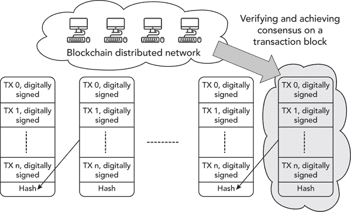

# 七、量子验证区块链

量子优势时代的安全

***弗拉德·乔吉奥、谢尔盖·戈尔布诺夫、米歇尔·莫斯卡、比尔·曼森***

|  | **量子威胁与防御简介** |

强大的量子计算机的到来将打破目前部署的公钥加密，削弱对称密钥加密，从而破坏保护我们系统和基础设施的网络安全。区块链技术中用于认证交易的数字签名方案是完全易受攻击的。

区块链的量子验证问题可以分为两种情况。第一种情景指的是量子验证新区块链，即从零开始设计抗量子的区块链，而第二种情景指的是量子验证现有的区块链(如比特币网络)。

也许使区块链抵抗量子攻击的经济有效的方法是用后量子方案取代目前部署的数字签名方案(基于 RSA 或 EC-DSA ),后者的安全性来自某些数学问题的难度；因此，它们提供了通常所说的*计算安全性。*

量子计算极易受环境噪声影响，因此需要量子纠错码才能正常工作。因此，这种现实的量子实现不会构成威胁，除非我们在容错量子纠错方面取得重大进展，或者新的量子计算架构开始发挥作用。

后量子数字签名方案提供了对抗量子对手的安全性，代价是更大的公钥/私钥大小或签名大小，这可能带来严重的可扩展性挑战。减小签名长度和公钥/私钥长度对于设计一个健壮有效的抗量子区块链至关重要。

**量子威胁简介**

我们似乎正处于一些人所谓的*区块链革命的风口浪尖。^(这种能力有着深远的影响，因为社会一直在努力争取分布式信任。)*

很快，我们将处于我们称之为*量子革命的风口浪尖。*世界各地的科学家和工程师正在努力建造第一台可行的计算机，它使用量子位(或量子位)而不是传统位来解决极其困难的数学问题，速度比今天的计算机快得多。异常强大的量子计算的到来将打破当前部署的公钥加密，削弱对称密钥加密，从而破坏保护我们基础设施和系统的网络安全。

不幸的是，我们不能假设区块链对公开密钥加密有很强的依赖性，可以免受这种生存威胁。区块链的安全性基于现代密码协议。 ^([447](23_bm005.html#ch7fnr447)) 例如，交易的真实性基于公钥加密数字签名，数据的有效性和进一步的不变性基于对称密钥加密(哈希函数)。目前部署的公钥基础设施容易受到量子攻击，这是基于计算问题的难度，如因式分解或计算离散对数，这些都可以被量子计算机破解。

因此，区块链社区必须采取行动，确保这项技术能够抵御量子动力网络攻击。这意味着评估量子计算对保护区块链系统元素的加密的潜在影响，然后设计并实施必要的措施，通过部署旨在抵御量子攻击的加密技术来缓解量子威胁。

**来自 2030 年的故事**

现在是 2030 年。一家庞大的全球性公司在区块链经营其全部业务。它的客户(以及所有机器人)参与了区块链网络的一部分:他们通过智能合约就产品和服务进行谈判，并在区块链用加密货币支付。 ^([448](23_bm005.html#ch7fnr448)) 对公司的信任度明显高于 2017 年，因为每笔交易的完整性现在都是内在的，并在区块链上得到保证。

在世界的另一个角落，一个小组已经集结，即将部署第一台容错通用量子计算机。 ^([449](23_bm005.html#ch7fnr449)) 在实验室之外，计算机将首次能够分解 2048 位 RSA 数字。第一台样机预计将在不到六个月的时间里投放市场。不幸的是，我们庞大的全球公司从未认为量子计算是一个严重的风险；其首席执行官认为这些警告是科学的胡言乱语，对商业运作没有任何实际影响。

现在想象一下，该公司区块链中的一些节点(即参与者，无论是人还是物)在等待访问量子计算机的客户名单上，并准备在不到一年的时间内使用它们。这些节点中的一些不会让道德——甚至法律——代码阻止他们快速赚到大量的钱。也许这些无名小卒会利用量子计算机，在任何可能的时候，通过用他们自己的地址替换预期的目的地地址，来修改发送来进行验证的交易，并误导资金。

没有量子计算机，发动这样的攻击是不可能的，因为数字签名——使用经典(非量子)计算机是无法伪造的——保护了数据的真实性。然而，通用容错量子机器将使我们不太好的节点在几分钟内伪造数字签名，比网络验证一个块平均需要的 10 分钟还少。攻击节点然后广播改变的事务，这对其他节点看起来完全有效；他们不会知道一些钱直接进入了攻击者的数字钱包，而不是回到原始发送者的钱包。

区块链应该是公开和不可改变的，应该在几十年内保持其完整性和安全性。然而，利用量子计算机，人们有可能重写历史:伪造 10 年前发生的交易，并有效地计算出新的最长路径链，以覆盖过去 10 年的整个历史。我们将在后面分析这种攻击的严重性。

回到我们的故事，久而久之，越来越多的这类袭击发生了。公众对该公司的信任度降到了历史最低点。客户已经将他们的资产重新投资于更安全的公司，这些公司采用抗量子区块链作为其基础商业模式。 ^([451](23_bm005.html#ch7fnr451)) 一年之内，公司破产。

这种情景是否显得牵强？60 年前，大多数人认为自动化计算机器在大公司之外永远不会有用，个人电脑是完全不可想象的。如今，我们每个人智能手机的处理能力都超过了 50 年前全球计算能力的总和。

量子计算机是现代密码学的真正威胁。即使今天还没有，量子计算机在 2026 年问世的可能性估计是七分之一，而在 2031 年问世的可能性增加到二分之一。鉴于加密技术支撑着我们的网络安全，我们认为即使是七分之一的可能性也太大了，不容忽视。

让我们回到 2030 年，一个组织(比如说，一个外国政府或大公司)可以访问第一台通用量子计算机，而世界上没有其他人知道它。计算机足够强大，通过运行 Shor 的算法，可以在几秒钟或几分钟内破解 RSA 或椭圆曲线密码(ECC)密钥。对于目前的区块链技术来说，这样的场景是灾难性的。为什么？

假设上述组织恶意攻击一家使用比特币区块链作为底层支付系统的银行。银行的每个客户都有一个钱包，钱包由成对的公钥/私钥组成，其中公钥是从私钥中导出的，而私钥是不可能单独从公钥中恢复出来的。 ^([453](23_bm005.html#ch7fnr453)) 类似地，银行有一个由许多这样的公钥/私钥对组成的钱包。每当银行想要向客户汇款(在这种情况下，是比特币)时，银行使用相应客户的公钥的散列作为钱将进入的钱包的地址，然后签署“我，X 的银行，向地址 z 标识的客户 Y 发送了 10 个比特币”形式的交易。银行用其秘密密钥之一签署交易，然后广播到区块链网络，该网络将在 10 分钟内验证交易。 ^([454](23_bm005.html#ch7fnr454))

然而，银行的私钥在几秒或几分钟内就被使用量子计算机的恶意组织破解。然后，后者可以安装一个新的钱包，将泄露的密钥装入其中，然后冒充银行进行支付。由于这个新钱包与原来银行的钱包相同，所以没有人能够看出交易中的差异，并且会认为交易是有效的，并且应该包括在区块链中。恶意组织现在可以利用银行的所有支付，并将其重定向到自己的钱包。

这只是当前比特币区块链的安全性在量子对手面前变得过时的一个例子。我们之前提到，量子计算机不仅可以使用 Shor 算法破解当前基于 RSA 或 ECC 的公钥密码系统，还可以通过运行 Grover 的搜索算法来加速对哈希函数的攻击。后者的加速没有那么引人注目，只比任何强力经典算法快一倍。然而，这种袭击仍然会在区块链造成巨大破坏。

例如，让我们假设整个交易链已经被验证并添加到区块链中。同样，假设我们的恶意组织“及时回到”区块链上的某个点，并在该时间点分叉链，然后开始按顺序修改链中的所有交易，并在运行中验证它们，以便资金(比特币)被重定向到其钱包。恶意组织很可能能够比其他一些挖掘池更快地验证每个事务，因为它可以更快地执行 PoW。

最终，恶意组织能够“赶上”区块链中当前的诚实分叉，然后进一步扩展其恶意分叉。最终，网络同意新的恶意分支比现有的诚实分支更长，并集体同意切换到新的分支——整个长交易链立刻受到损害。

上面的例子仅仅触及了恶意用户如何使用量子计算机来对抗不知情的公共区块链网络的表面。网络安全的历史告诉我们，很可能会有更巧妙的攻击，我们只有在它们发生的时候或之后才会意识到。许多应用将面临危险，从使用区块链作为分类账来验证彼此之间交易的金融机构，到使用区块链进行小额支付或记录用户健康等国家信息的物联网系统，再到区块链。 ^([456](23_bm005.html#ch7fnr456))

**问题:区块链并不完全是量子安全的**

今天的区块链不是量子安全的，至少不完全是。一个区块链事务由两个步骤组成:事务本身*，随后是由区块链网络分组到一个块中的多个事务的验证。交易本身可以是任何东西。为简单起见，我们假设这是一笔金融交易，Alice 同意支付 Bob 100 个单位。这样的交易被 Alice 打上时间戳并数字签名，Alice 将其广播到网络，网络集体同意 Alice 确实同意支付 Bob 100 个单位。网络怎么能保证是爱丽丝自己给鲍勃发的消息，而不是鲍勃想快速致富？*

 *这就是公钥加密发挥作用的地方。Alice 的数字钱包由一个或多个所谓的公钥/私钥对组成。每个私钥直接对应公钥；公钥和私钥在数学上是联系在一起的。然而，以今天的技术，仅从公钥中恢复私钥在计算上是不可行的。 ^([457](23_bm005.html#ch7fnr457) 网络可以验证确实是爱丽丝使用她的公钥来发送交易。不可能有其他人在邮件上签名。)

我们在实践中使用什么样的数字签名方案？最受欢迎的是基于 RSA 的签名(Rivest-Shamir-Adelman)、DSA(数字签名算法)和 EC-DSA(椭圆曲线数字签名算法)，这是今天比特币区块链使用的方案。 ^([458](23_bm005.html#ch7fnr458))

基于 RSA 的签名的安全性来自分解两个非常大的素数的乘积的困难，每个素数的长度在数百到数千位的范围内，这取决于特定的方案。如果我们得到这么大的数字，那么提取它的因子似乎是一个指数级的计算难题。

后两种方案基于一个完全不同的难题:求解大阿贝尔群(即两个群元素应用群运算的结果不依赖于它们出现的顺序的群)中的离散对数问题。 ^([459](23_bm005.html#ch7fnr459)) 简单地说，如果给我们一个组的元素——姑且称之为 *g* ，形式为 *g=b ^k* ，其中 *b* 是同一组的另一个已知元素， *k* 是一个未知整数——问题是找到*k*

使用 EC-DSA，组本身由椭圆曲线上的点组成，并且组操作遵循一些规则。因式分解和离散对数问题都是有限生成(阿贝尔)群上的一类更一般的问题的实例，称为隐藏子群问题(HSP)。传统计算机发现 HSP 问题很难处理，而它的难处理性支撑了我们目前的公钥基础设施。

1994 年，Peter Shor 意识到通用量子计算机可以在多项式时间内分解并找到离散对数，也就是说，可以有效地解决这些问题。 ^([461](23_bm005.html#ch7fnr461)) 因此，任何基于这些问题的公钥密码系统(或 HSP)在对抗量子敌手时都是不安全的。在我们的案例中，区块链中用于认证交易的数字签名方案是完全脆弱的:任何拥有足够强大的量子计算机的人都可以冒充爱丽丝，并将交易中的一些资产重定向到他/她自己的口袋(数字钱包)中，而网络不会意识到发生了攻击。这是因为攻击者可以在量子计算机的帮助下从公钥中恢复私钥，然后更改交易并使用各自的私钥伪造签名，这在网络上看起来是完全合法的交易，因为只有 Alice 能够正确地签署交易。

因此，量子计算机对区块链构成了非常严重的威胁:用户的钱包只有在不消费的情况下才会安全。换句话说，只要用户只将资产收集到他们的钱包中，并且从不广播他们的公钥，对手就无法了解他们的私钥。 ^([462](23_bm005.html#ch7fnr462)) 用户只有在需要签署交易，也就是要消费的时候，才会广播自己的公钥。如果有人在该阶段冒充用户，那么用户可能会不可逆转地失去与该公钥/私钥对相关联的金钱。

第二阶段呢，网络的验证？在交易被分组到一个块中之后，该块必须被整个网络验证。只有当大多数网络节点同意该块时，它才被添加到区块链，也就是说，通过后一个块的散列链接到前一个块。通常，验证方案基于工作证明原则(尽管存在其他方案)，这要求网络的节点解决困难的计算问题或难题，例如在子域上反转散列函数。首先解决难题的节点通常会获得一些奖励(例如根据比特币协议新铸造的比特币)，因此节点有参与验证过程的动机。

攻击者可以通过广播两个交易来尝试重复花费一些资产吗？在这两个交易中，攻击者与 Bob 和 Charlie 花费了相同的资产。只有当攻击者能够接管网络并试图验证两个交易时。然而，要做到这一点，攻击者必须比组合网络的其他部分更快地解决工作证明问题。否则，网络的其余部分将在攻击者之前提出解决方案，并且区块链验证属于最长链的交易，在这种情况下将属于诚实用户。

幸运的是，总的来说，量子计算机对哈希函数和对称密钥密码术构成的威胁不那么严重。 ^([463](23_bm005.html#ch7fnr463)) 针对哈希函数最广为人知的攻击是基于蛮力的，也就是攻击者搜索哈希的前像，直到达到所需的验证条件。因为这样的搜索完全是非结构化的，量子计算机相对于经典计算机所能提供的只是二次加速。 ^([464](23_bm005.html#ch7fnr464))

因此，量子电脑确实威胁到杂凑函数，但是我们可以轻易地让工作证明难题变得更难，以至于即使是量子电脑也无法足够快地解决它。然而，网络中拥有更多计算能力(可能包括量子计算机)的用户有更高的机会赢得谜题，因此，总是集中力量。因此，非对称分布的快速计算机器(即量子计算机等快速机器只对有限数量的用户可用)对网络构成了重大威胁。在设计抗量子区块链时，我们应该考虑到这一点。

**我们的期权分析**

**区块链的抽象模型**

区块链是一个分布式的信任分类帐，其中共识由网络集体获得，而不需要任何集中的权威机构。区块链由事务块组成，每个事务块通过某种链接机制(如前一个事务块头的散列)链接到其父事务块。只有当网络验证一个块时，它才被附加到区块链上([图 7-1](#fig7-1) )。

**图 7-1**
区块链示意模型

每个块通过前一个块的散列“链接”到前一个块，即，每个块包含前一个块的散列(这里由指向前一个块的箭头表示)。

*由弗拉德·乔吉奥、谢尔盖·戈尔布诺夫、米歇尔·莫斯卡和比尔·曼森于 2017 年创作。*

最著名的共识机制是:

**1。**工作证明，其中只有首先解决计算困难问题的网络节点可以验证事务

**2。**利害关系证明，其中具有更多利害关系(例如，持有更多加密货币)的节点更有可能被选为验证者

**3。**存储证明或时间证明，其中具有更多网络可用计算资源(如磁盘空间或中央处理器时间)的节点更有可能被选为验证者

上述所有共识机制都防止了重复支出的问题。尽管 PoW 被认为是密码安全，但它有一个主要的缺点，即它需要大量的热力学功和时间。 ^([465](23_bm005.html#ch7fnr465)) 其他的共识机制，比如容错的拜占庭协议(如 Algorand、Tendermint 和 Hyperledger)，避免了 PoW 问题。然而，我们还不完全清楚这些协议在密码学上有多安全，更不知道我们是否能使它们抗量子攻击。

从更高的层面来看，我们可以看到区块链由几层组成:

**1。**密码构建模块(例如，哈希函数、公钥交换、对称密码)

**2。**算法原语(例如，Merkle 树、密码难题、全局时钟)

**3。**共识协议(如 PoW、容错拜占庭协议)

**4。**附加的非默认安全属性(例如，Zcash 区块链使用一种称为 SNARKs 的零知识证明的变体——零知识简洁的非交互式知识论证——来提供交易匿名性。SNARKs 不是量子安全的，所以一旦量子计算机出现，30 年的区块链数据可能会突然被去匿名化)

这里我们只关注加密构建模块，主要是基于 PoW 的区块链。在这个阶段，我们不能假设区块链中更先进的算法或协议是量子安全的。

**修补区块链的方法**

鉴于受区块链保护的信息和关系的重要性，以及随之而来的区块链将经常成为恶意行为者网络攻击的目标的确定性，我们将谨慎地通过设计引入量子抵抗，并确保最可靠的形式用于最关键和最脆弱的资产。

区块链最重要的安全目标是不可伪造和不可能重复支出。目前，量子证明区块链的问题可以分为两种情况。第一种情景指的是量子验证新区块链，即从零开始设计抗量子的区块链，而第二种情景指的是量子验证现有的区块链(如比特币网络)。第一种情况比第二种情况简单得多。

在下面的分析中，我们将考虑量子计算机要么可供每个人使用(我们将称之为*对称对手*)，要么仅可供极少数人使用(我们将称之为*非对称量子对手)。* [表 7-1](#tab7-1) 描绘了区块链类型和量子对手口味的可能组合。

**表 7-1**
量子对手的可能组合

**从头开始设计抗量子区块链**

从头开始设计抗量子区块链相对简单:我们可以应用后量子密码方案和量子密码。

**使用后量子密码方案**

让区块链抵抗量子攻击的最明显，也可能是最划算的方法是用后量子方案取代当前部署的基于 RSA 或 EC-DSA 的数字签名方案。后量子密码方案的安全性来源于某些数学问题的困难性；因此，它们提供了通常所说的*计算安全性。*

后量子方案的例子是基于格的方案(带误差学习，LWE)、超奇异同源方案、多元多项式方案、基于码的方案或基于 Merkle 树的签名。 ^([467](23_bm005.html#ch7fnr467)) 所有这些协议都是为了抵抗量子攻击而设计的；到目前为止，还没有人能够找到破坏这些方案的攻击。然而，这种稳健的方案伴随着性能成本，因为它们的密钥尺寸稍微(或者有时相当大)更大，并且计算速度显著降低，从而需要在效率和安全性之间进行权衡。

不幸的是，直到最近，工业界和政府在对量子威胁的普遍认识上行动迟缓。目前，世界各地的密码研究人员越来越关注研究抗量子算法；但是，在缺乏国际标准的情况下，结果可能是一大堆相互竞争、未经测试的专有密码系统。

幸运的是，在 2016 年，美国 NIST 开始了一项多年标准化项目，以确定候选的抗量子密码系统。这要求在 2017 年 11 月提交意见，随后是三到五年的公众审查，然后是一到两年的标准化阶段——导致 NIST 标准在 2021 年到 2024 年之间出台。这些标准化算法将为组织提供一套更集中、更易管理的备选方案，供组织考虑整合到其系统中。然而，要选出最终的赢家可能还为时过早，因此加密灵活性仍然至关重要。

**区块链使用量子密码术**

原则上，我们可以使用许多量子密码工具来让区块链更安全。量子随机数生成器 (QNRGs)可能是短期内最实用的工具。 ^([469](23_bm005.html#ch7fnr469)) 他们避免了与伪随机数发生器相关的密码分析风险，并承诺比传统的基于熵的随机数发生器更基本、更可靠的随机性来源。 ^([470](23_bm005.html#ch7fnr470))

此外，量子密钥分发(QKD)系统越来越商业化(尽管仍处于早期阶段)。 ^([471](23_bm005.html#ch7fnr471)) QKD 是一种使用不可信量子信道通过不可信但已认证的通信信道建立对称密钥的方法。这是目前通常使用公钥签名认证的基于公钥的密钥协议实现的，并且可以在未来使用后量子公钥方案实现。

与用于密钥建立的后量子方案相比，使用 QKD 建立密钥的优点在于，QKD 的安全性不依赖于计算假设(即，它是“理论上的信息”安全的)，因此对密码分析具有弹性。相比之下，后量子方案是基于计算假设的，因此存在未来密码分析的风险。然而，QKD 需要专门的硬件(如激光器、光纤等)。)来运行，我们离一个全球性的 QKD 网络还有许多年。

实际上，我们并不确定 QKD 将来会对改善区块链的安全有多大帮助。在最近提出的一个基于 QKD 的区块链中，作者描述了一个区块链方案，其中认证是通过参与者之间的 QKD 网络实现的，共识是通过类似拜占庭协议的协议获得的。这种计划的实际用途还不清楚。

还有各种量子工具，如量子认证、量子货币和量子指纹，有朝一日可能有助于进一步降低密码分析的威胁。我们也可以考虑全量子区块链，即基于分布式架构，其中节点是量子计算机，所有节点通过量子通信信道连接。为了我们这里的目的，我们简单地注意到，这些方案通常需要量子计算和通信工具，而这些工具在未来许多年都是不可用的，尤其是不能用于实际用途。

**量子对手的味道**

**不对称量子对手**

正如经典计算机的发展一样，我们预计量子计算机最初将用于极少数实体，如政府、大型研究机构和大型企业——换句话说，我们预计量子对手将不对称分布。

让我们考虑这样一台量子计算机对基于 PoW 的区块链的影响，在这种情况下，散列函数被用来加强事务的不变性。我们假设系统使用抗量子数字签名来确保交易的真实性。问题是，一台孤立的量子计算机(或者少量的量子计算机)能对这样的网络造成多大的破坏？

首先，我们注意到唯一的弱点可能在区块链的 PoW 部分，而不在数字签名本身(如果使用量子安全签名方案)。因此，一个量子敌手不能冒充其他人并试图花掉他或她的钱。唯一可行的攻击是针对基于散列函数的 PoW 系统，在该系统中，量子对手可能试图比组合区块链网络的其余部分更快地验证交易。如果它平均成功，那么它可以在网络不知道的情况下加倍花费。

为了让这个例子更具体，我们来看看现在的比特币网络。PoW 的组合难度会随着时间的推移不断调整(平均而言，不断增加),因此平均每 10 分钟就会找到一个解决方案(即验证)。这种调整是必要的，因为新的和改进的硬件被注入到久而久之中。在 2016 年 9 月至 2017 年 8 月期间，整个比特币网络的综合哈希速率从每秒不到 200 万万亿次(TH/s)增加到超过 800 万次。2017 年 8 月，网络每秒执行大约 7 x 10 ^(18) 哈希，这意味着平均每 10 分钟大约 4.2 x 10 ^(21) 哈希。截至 2021 年 3 月 9 日，该速率已达到每秒 1.5653 亿万亿次，几乎是这项原始研究的 20 倍。^(476)

因此，为了成功，量子对手必须在明显小于 10 分钟的时间内搜索 4.2 x 10 ^(21) 个哈希预图像的空间。这种攻击最好的方法是通过 Grover 算法，这种算法在时间上有可能提供二次加速。因此，理想的量子计算机(即不需要纠错)将能够在时间步长内执行这种搜索。非常乐观地假设，一台 1GHz 的量子机器(即每秒执行 10 次 ^(9 次)运算的量子计算机)，这种搜索大约一分钟就能完成。

因此，PoW 系统非常容易受到这种理想化的量子机器的攻击，因为后者不仅可以比网络的其余部分更快地验证，而且还可以通过创建时间分叉、向链中添加新的伪事务以及足够快地验证每个块以使新链最终成为所有网络参与者接受的有效链来重写历史。

然而，在现实中，量子计算非常容易受到环境噪声的影响，它需要量子纠错码才能正常工作。由于需要对信息进行冗余编码，量子纠错引入了大量的计算开销。 ^([478](23_bm005.html#ch7fnr478) 根据这些数字，我们计算出执行攻击大约需要 2.2 x 10 ^(14) 个步骤，所有这些大约需要两天半的时间。)

因此，这种现实的量子实现不会构成威胁，除非我们在容错量子纠错方面取得重大进展，或者新的量子计算架构开始发挥作用。我们还不知道未来会发生什么，包括新的密码分析攻击的可能性。

注意，通过 Grover 算法的搜索不能被有效地并行化。 ^([479](23_bm005.html#ch7fnr479)) 换句话说，我们能做的最好的事情就是把搜索空间分割成组块，对每个组块使用单独的量子计算机。因此，如果并行使用 K 个量子计算机来搜索一个大小为 N 的空间，运行时间将正比于

正如人们所料。在上面的容错例子中，对手将需要大约 33，000 (= 2 ^(15) )台完全容错的量子计算机来将搜索时间减少到 10 分钟。

**对称量子对手**

在这种情况下，整个协议可以假设存在广泛的量子计算，包括这种量子机器对大多数计算节点(或采矿场)的可用性。因此，平均而言，没有外部计算能力比网络的其他部分快得多。因此，我们在这里得出结论，区块链是安全的，可以抵抗对哈希函数的一般量子攻击。

**量子验证现有的区块链**

修补现有的区块链对抗量子攻击，可能比从头设计量子安全的区块链困难得多。第一步是用抗量子密码替换易受攻击的密码。例如，在比特币网络中，我们需要用抗量子方案取代数字签名方案，并使用后者来签署新的交易。这种方法将为未来的交易提供安全保障。

然而，问题是旧的交易会发生什么？我们假设一个钱包从一个地址消费了一些加密货币。因为地址是与钱包相关的公钥的散列，公钥已经被公开泄露，量子对手可以恢复相应的密钥。如果钱包仍然有一些与该地址相关的加密货币，量子对手可以冒充钱包的主人，花掉剩余的资金。

这个问题的解决方案是:永远不要重用一个公钥，或者确保对于一个公钥已经被泄露的地址，绝对没有更多的资金可用。如果在量子计算机成为现实之前，量子安全数字签名被引入区块链，那么网络可以要求每个用户执行一个*自我转移*交易，在这个交易中，用户将与他或她的旧(非量子安全)公钥相关的所有资金转移到与用户的量子安全公钥相对应的地址。

关于对称和非对称量子对手的讨论与我们对量子对手的看法是一致的。在最坏的情况下，非对称量子对手能够比网络的其他部分更快地解决密码难题。虽然根据目前的假设，这种情况不太可能发生，但我们不能排除这种可能性。因此，我们需要未雨绸缪。

例如，我们可以认为长于固定数量的块 *L* 的事务是完全不可变的，并修改区块链协议，使得长于 *L* 的块不再被分叉和挖掘。虽然这个选项在一定程度上解决了重写比 *L* 块旧的历史的问题，但是它没有解决quantum 对手比整个网络更快地验证未决事务并因此控制网络的能力。最后一个问题没有明显的解决方案，我们需要更多的研究。我们可以设计量子计算机无法更快解决的难度可变的密码难题。当然，应该没有人能够通过搜索来解决这样的难题，因为格罗弗的算法可以提供加速。

**性能分析**

据一位公认的专家称，实现后量子区块链的一个主要技术难点在于要使用的后量子数字签名方案引入的开销([表 7-2](#tab7-2) )。 ^([480](23_bm005.html#ch7fnr480)) 比如比特币协议使用 EC-DSA 进行交易认证，其平均大小等于 71 字节。

相比之下，后量子数字签名方案比当前部署的方案(如 EC-DSA)至少大六倍，甚至更差，计算速度也慢得多。后量子数字签名方案引入的约束可能会给抗量子区块链带来严重的可扩展性挑战。例如，超奇异同源后量子方案，由于其密钥长度短(大约半千字节)，对于公钥加密来说是非常有前途的，但目前在诸如区块链这样的空间受限的环境中作为数字签名方案是不够的，因为相应的签名长度大约是 140 千字节(与 EC-DSA 的 71 字节相反)。 ^([481](23_bm005.html#ch7fnr481))

另一方面，基于代码和基于多元的数字签名具有较短的长度，但是它们对应的用于签名生成和验证的公钥/私钥相对较大。因此，对于这两种方案，一个战俘区块链中的一个假设块的大小可能会比比特币区块链的当前大小大 7 倍左右。然而，所需的 PKI 将需要大得多的存储，因为相应的公钥/私钥比当前的 EC-DSA 密钥大得多。此外，基于多元的方案有相对大量的反对者，因为它们的安全性不如其他方案有说服力。

**表 7-2**
128 位安全级别的后量子密钥大小和签名大小

所有大小都以字节为单位。

*参见 Y. Yoo，R. Azarderakhsh，A. Jalali，D. Jao 和 V. Soukharev，“基于超奇异同源的后量子数字签名方案”，密码学 ePrint Archive，2017 年，第 186 页。[eprint.iacr.org/2017/186.pdf](http://eprint.iacr.org/2017/186.pdf)*

名单上的下一个候选方案是基于 LWE 的数字签名方案，它的密钥稍大(3-5 千字节)。通过困难问题归约论证，这些方案是可证明安全的。 ^([482](23_bm005.html#ch7fnr482)) 对于真实世界的参数，还没有这样严密的安全证明，但是密码学社区还没有发现该方案的任何缺陷或安全问题。公钥/私钥的大小也是合理的；因此，LWE 似乎是抗量子区块链的可行候选者。

基于散列的方案在安全性方面是最可信的，并且具有相对较小的公钥/私钥。然而，相应的签名大小超过 40 千字节长，这在诸如区块链这样的空间非常有限的环境中是有问题的。

Lamport 基于一次性的签名是另一个潜在的候选。 ^([483](23_bm005.html#ch7fnr483)) 他们的公钥大小是 16kb，对应的私钥大小也是 16kb，他们的签名大小是 8kb。稍微更有效的方案(就签名大小而言)如 Winternitz 一次性签名方案也是可行的。 ^([484](23_bm005.html#ch7fnr484)) Winternitz 签名压缩将私钥和公钥的大小减少到略小于块大小(以位为单位)的两倍和签名的一半。计算时间的增加略大于块大小(以位为单位)的两倍。那些方案是一次性的，也就是说，只要在签署新交易时密钥不被重用，它们就是安全的。

总之，后量子数字签名方案以更大的公钥/私钥长度或签名长度为代价提供了对抗量子敌手的安全性。我们需要在后量子数字签名领域进行更多的研究。 ^([485](23_bm005.html#ch7fnr485)) 减小*签名大小*和*公钥/私钥大小在鲁棒且高效的抗量子区块链中至关重要。*

 *专家对区块链安全的看法

在我们的研究中，我们采访了几位区块链的专家，讨论当前和未来区块链协议对抗量子对手的安全性。我们向他们询问了组织在实施抗量子分类账时可能需要解决的挑战和缺陷。

**德国联邦信息办公室曼弗雷德·洛克特博士**

***提问。**如何看待 10 分钟内攻破 EC-DSA？*

**回答。**如果有量子计算机就不要用 EC-DSA！如果不是，看看它是什么类型的攻击以及它如何扩展，也许增加安全参数。 ^([486](23_bm005.html#ch7fnr486))

***Q.** 你相信量子计算机会影响基于哈希求逆的安全工作证明系统吗？*

**答:**在工作证明系统中，哈希是最小的问题，但这取决于区块链的类型。例如，时间戳区块链可能存在严重的问题，其中抗碰撞性至关重要。如果量子计算机发现碰撞，它可以攻击系统。

***问:**现在的钱包多久重复使用一次钥匙？*

答:钱包确实是个问题。有些钱包使用确定性算法来生成密钥序列。此外，公钥冲突的数量比预期的要多，这主要是因为糟糕的钱包实现。 ^([487](23_bm005.html#ch7fnr487))

**德国 NEC 实验室首席安全研究员 Ghassan Karame 博士**

***疑问。你如何看待量子威胁对区块链的影响？这种威胁有多严重？***

**回答。**这一威胁不仅仅针对区块链，它适用于所有系统。我不认为区块链是个例外。…我们所知道的是，目前在区块链有许多不活跃的地址，也就是说，如果 10 年后有人能破解这些密钥，那么他或她就能得到很多钱。目前也有相当数量的货币处于休眠状态[Satoshi 的货币]。 ^([488](23_bm005.html#ch7fnr488))

**问:** *到目前为止，*区块链实现中最脆弱的部分*是什么？*

**A.** 很多攻击都是在网络层实现的。在大多数区块链中，它非常脆弱[因为试图]优化可伸缩性，并在此过程中失去安全特性。…这是现有实施中最薄弱的环节之一。…当涉及到用户时，用户就成了安全的瓶颈，例如，私钥并不总是得到适当的管理。

***问:**钱包多长时间重用一次密钥或者使用确定性算法生成一个密钥序列？你能评论一下当前的钱包安全问题吗？*

**A.** 比特币在收零钱的时候应该会默认给你一个新的地址(除非有人手动改码)。问题是这还不够好。还有实施的问题。

问:你认为量子安全的区块链在今天有用吗？

**A.** 是的，可能有道理。哈希是抗量子的，但是目前社区中的标准难题是如何为区块链的数字签名部分提出一个合适的密钥管理解决方案。即使对于当前的 EC-DSA 密钥管理基础设施，这也是一个问题。…我认为我们应该考虑量子安全的区块链。

**北卡罗来纳州立大学的 Nadia Diakun-Thibault 博士**

***质疑。对于量子计算对区块链基础设施的攻击，你有什么看法？***

**回答。**目前，尽管区块链，我们今天可能有一些量子能力，在 SHA-256 是安全的，这是区块链使用的比特币…问题是人类参与其中，他们可能没有很好地保护系统，可能没有遵循所有的安全规则，或者可能引入人为错误。……在区块链确实脆弱的领域需要更多的研究，，比如数字签名、智能合约，或者云计算中的安全规则和安全应用。 ^([489](23_bm005.html#ch7fnr489))

***Q.** 钱包出现实现安全问题/重大软件缺陷的几率有多高？重大灾难？*

这才是真正的问题所在。钱包、交易所、账户可能在云端；它们不一定安全。云提供商并不知道云中发生的所有事情。挖掘可以在云中进行。云提供商如何保证安全措施得到了充分应用？大多数安全问题发生在提供商/用户/钱包端。

***问:**关于对区块链的量子威胁或监管区块链，加拿大政府是否有任何官方立场或建议？*

目前，据我所知没有。在我看来，这是一个很多人都不愿意评论的领域。政府可以监管使用，但不是针对区块链本身——没有标准。我不认为我们能够“管理”区块链；有人可能会说这类似于管理一个“数据库”。政府可以规定在哪里使用区块链是合适的，是许可的还是不许可的，参与者是谁，安全要求，合规措施等等。这些都是合理的预期。

**滑铁卢大学应用密码研究中心 David Jao 博士**

***疑问。**建立抗量子账本最具挑战性的部分是什么？*

**回答。**肯定是数字签名。后量子签名方案仍然比 EC-DSA 大得多，简单地插入后量子替换对于相对较小的区块链可能很好，但对于大型区块链(如比特币)将产生重大的可扩展性问题。密码社区需要在后量子数字签名领域进行更多的研究。 ^([490](23_bm005.html#ch7fnr490))

 **结论和建议**

后量子解决方案还没有完全标准化，因此在这个时候提出强有力的建议是非常困难的。然而，我们现在可以明确推荐的是建立灵活的区块链协议，其中的数字签名方案是模块化的，因此它可以很容易地被量子抵抗方案替换掉。虽然有状态的基于散列的签名从安全角度来看是有吸引力的，但无状态方案(也包括无状态的基于散列的签名)也有实际的优势，例如，基于格问题的困难的数字签名，如 LWE，或基于代码的数字签名方案。 ^([491](23_bm005.html#ch7fnr491)) 记住，目前还没有抗量子数字签名方案提供*两种*短签名*和*短密钥大小。

我们的建议是灵活地设计一个抗量子的区块链，其中改变数字签名方案应该是代码库的一个完全集成的部分。例如，假设有一个用于数字签名的公共 API，并设计一个能够在需要时动态更改签名的协议。

我们还强烈建议仔细设计最终用户区块链架构，如数字钱包基础设施。请记住，最终用户基础设施是加密链中最脆弱的一环。因此，确保其安全至关重要。

一个困难得多的问题是如何修补基于 power 的区块链系统。如果量子计算机广泛可用，那么我们可以修改网络协议，使其假设每个人都在使用量子搜索来寻找哈希函数的原像。然而，如果只有一小部分用户可以访问量子计算机，那么当一个链中的所有交易都被顺序修改时，如何避免攻击就不清楚了。很可能，在区块链网络中总会存在不对称，那些极少数能够使用量子计算机的用户最终将能够破坏长链。

一个强力的解决方案是简单地修改区块链协议，使得超过指定长度的分叉不再被接受用于挖掘。这种解决方案只是部分解决了这个问题:虽然它保证了超过指定步骤数的过去交易的完整性，但它不能防止恶意用户比其他人更快地验证交易并基本上接管网络。

我们希望这些问题能够提高区块链研究团体的意识，以便他们能够开发新的保护方案。目前，我们并不认为哈希反转是一个非常严重的安全问题，至少在近期和中期不会。由于纠错，第一代量子计算机很可能会遭受巨大的开销。请记住，在这种情况下，Grover 不会真正加快速度，因此哈希反转会成为一个安全问题。然而，25 年后，我们可能会有足够强大的非对称量子对手，他们能够比网络中的大多数人更快地找到哈希原像。目前，除了前面提到的强力补丁，我们缺乏解决这个问题的完整解决方案。

综上所述，设计抗量子区块链最严格的要求是认证部分。当前的数字签名方案是易受攻击的，并且必须在当前的区块链中被替换，或者在从头开始设计的新的抗量子分类帐中从头实现。

现有的后量子数字签名方案都不能满足分布式账本系统的所有要求，即小规模和高效率。我们希望该领域未来的研究将带来更小、更有效的方案。在此之前，我们建议保持架构设计的灵活性，并建立分类帐，其中更改数字签名方案应该相对容易(即，内置到协议中或通过简单的更新补丁)。 ^([492](23_bm005.html#ch7fnr492))

Open Quantum Safe 项目是一个合作的开源项目，开发者可以利用它在区块链应用中测试和基准测试各种抗量子密钥交换和签名方案。我们希望我们的研究将激励区块链专家、密码学家和软件开发人员在设计未来的抗量子账本方面进行卓有成效的合作。**